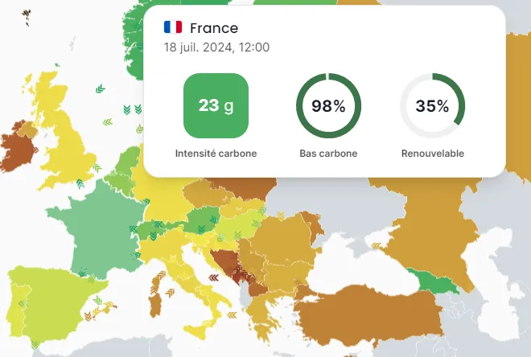

<!-- markdownlint-disable-file -->

Le Green Code aurait permis d'économiser des centaines de millions de tonnes de CO2 rien que ces 3 dernières années. Et si nous faisions un effort supplémentaire côté infrastructure ?

Auprès des particuliers, ce sont sûrement les applications mobiles qui sont le plus consommées. Toutefois, en entreprise, les centres de données avec des climatiseurs de la taille de Matignon sont encore la norme. Sans parler de l'IA qui vient tuer le match.

Heureusement, nous pouvons limiter la casse et revenir dans les bonnes grâces de Greta.

## Notions

Reprenons les basiques: comment notre application génère du CO2 ? Le stockage, la charge CPU, le refroidissement consomment de l'énergie. Pour produire cette énergie exprimée en kWh, nous brûlons des matières premières, nous extrayons de l'uranium, nous produisons des panneaux solaires, etc. Toutes ces solutions produisent plus ou moins de polluants comme: le CO2, des métaux lourds, des gaz acidifiants, etc. Et bien sûr, tout ça a aussi un coût financier variable : par exemple l'énergie dite verte est plus chère.

Il est important de souligner que la source d'énergie du centre de données est le facteur numéro 1 pour ajuster sa production de CO2.

En effet, un centre de données qui consomme 2 fois plus d'électricité qu'un autre peut produire moins de CO2. Comme nous allons le voir en fonction de l'origine électrique, la différence peut être de facteur 100 !

## La France reste un des meilleurs choix

Le site [electricitymaps](https://app.electricitymaps.com/) nous propose une carte monde des émissions de CO2. Il est facile de comparer la production de CO2 par pays tout en analysant l'origine de cette production (charbon, nucléaire, solaire, …).

Il y a d'énormes différences entre les pays. À l'heure où j'écris cet article, l'Inde produit 66 fois plus de gaz carboné que la Suède pour produire 1 kWh.

Intensité carbone de la France -

La France, grâce essentiellement au nucléaire et aux énergies renouvelables, est dans les meilleurs élèves de la planète. Bonne nouvelle pour les consommateurs de Cloud, nous avons un grand nombre de Cloud en France (OVH, Scaleway, Outscale, …) et les grands fournisseurs américains proposent une région (exécution des services et stockage) dans notre beau pays.

Malheureusement, il y a une contrepartie ! En effet, héberger ses données en France (23 g d'équivalent Co2 pour 1 kWh) coûte plus cher qu'en Irlande (525 g) ou en Allemagne (187 g) avec les fournisseurs américains.

Il est important de souligner que certains centres de données peuvent être alimentés par une production d'énergie indépendante du pays (autoproduction, contrat privé, …).

## Le GreenOps un adversaire du FinOps ?

Le cas précédent met en avant une dualité entre le CO2 et les impacts budgétaires. Heureusement, le Cloud n'est pas un univers cornélien ou nous devons choisir entre pollution et économie financière. Il faut être capable d'ajuster les curseurs entre les coûts et l'écologie.

### Pauvreté et sobriété numérique

Il n'est pas question de se priver d'utiliser les services Cloud pour réduire son CO2. Les compromis seront de mise mais permettront d'atteindre la sobriété et ne vous brideront aucunement. Parfois les planètes seront alignées : c'est le cas pour conjuguer souveraineté des données et diminution de l'impact carbone pour les entreprises françaises.

### Marketing

L'écologie est bankable, nous n'allons pas nous mentir, avant tout pour son attrait marketing. En effet, l'impact commercial d'acte Green est réel. Il doit être mis dans la balance afin d'ajuster le curseur GreenOps/FinOps.

### Réglementation

Pour le respect des lois à caractère RSE, une démarche GreenOps est un grand atout.

## En introduction de la partie 2

Il est important de pouvoir suivre ces deux métriques: coût et production de carbone. Ce qui ne peut pas être mesuré est difficilement améliorable. Le Cloud amène avec lui de belles pratiques et de belles améliorations notamment en terme de vision. Dans la seconde partie, nous parlerons d'observabilité avec un focus particulier sur l'impact carbone.

