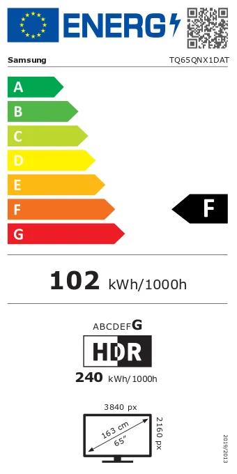
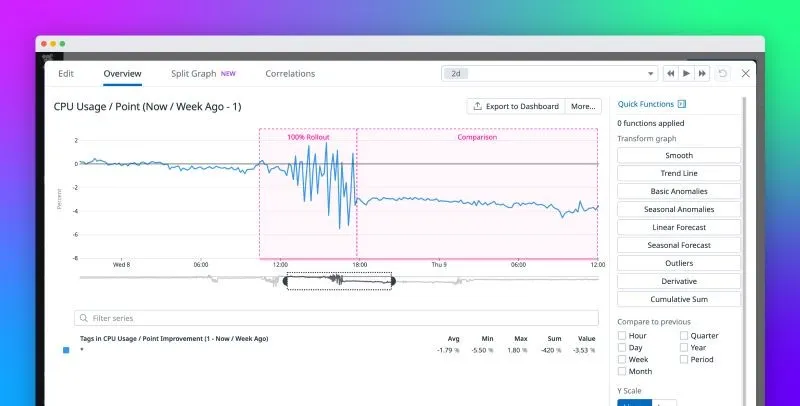

<!-- markdownlint-disable-file -->

Dans notre première partie de l'article, nous avons établi la relation entre CO2, énergie et finance. Aujourd'hui, je vous propose, dans une version simplifiée, de mesurer votre impact carbone dans le Cloud avec des services managés sans information sur le hardware. Nous resterons sur le [Scope 3 des émissions](https://globalclimateinitiatives.com/e-brochures-connaissances/scope/) afin d'être cohérent avec cette simplification.

> Le numérique émet près de 4 % des gaz à effet de serre à l'échelle mondiale

## Simuler la consommation de manière classique

Il est aisé de mesurer la consommation électrique de votre téléphone ou votre PC. Nous pouvons le faire via des applications ou simplement avec un compteur de consommation électrique branché entre la prise et votre chargeur. Ensuite, avec une simple opération mathématique, nous pouvons obtenir la production de CO2 en fonction de l'origine de production électrique.

Prenons en exemple une télévision qui consomme jusqu'à 240 kWh pour 1000 h. En multipliant par le coefficient moyen pour la production d'énergie Française (partons arbitrairement sur 29 g d'eCO2/kWh) nous obtenons environ 7 kg d'équivalent C02 pour 1000 h d'utilisation.

Pour un serveur dans un centre de données, nous prenons en compte l'Indicateur d'efficacité énergétique aussi appelé PUE. Cet indicateur prend en compte les équipements tiers comme la climatisation.

Imaginons que cette TV est branchée dans un centre de données avec un PUE de 1,2. Nous multiplions sa consommation par un facteur 20 % qui fait passer la consommation globale pour cette télévision à 8,4 kg d'équivalent CO2 sur 1000 h d'utilisation.

## Offuscation du Cloud

Les sujets Green ont le vent en poupe, mais nous manquons clairement de transparence sur les services du Cloud. Plus le service est managé moins nous en savons. Les acteurs du marché comme Microsoft ont fait un grand pas en avant. Cependant, dans l'ensemble, nous marchons à l'aveugle.

Sur certains services en IaaS (Infrastructure as a Service), des outils permettent de définir la partie matérielle et donc de définir, grâce aux données constructeurs, la consommation. Et parfois, le fournisseur Cloud nous communique le PUE.

Pour les autres services CaaS, FaaS, PaaS ou encore SaaS, cela est beaucoup plus compliqué.

## Pourquoi une méthode simplifiée

Une méthode simple permet de rester compréhensible et adoptable par tous, mais elle a aussi l'avantage d'éviter le [paradoxe des littoraux](https://fr.wikipedia.org/wiki/Paradoxe_du_littoral#:~:text=Le%20paradoxe%20du%20littoral%20est,a%20pas%20de%20longueur%20d%C3%A9finie.) : plus nous essayons d'être précis plus nous nous éloignons d'une vue d'ensemble cohérente.

Maintenant, prenons du recul et demandons-nous si avoir une vision extrêmement précise de sa production de gaz à effet de serre est nécessaire ? Dans la très grande majorité des cas, la réponse est non. Il est beaucoup plus intéressant d'avoir une notion d'échelle dans une fourchette réaliste et de pouvoir définir une tendance dans le temps. Une démarche GreenOps consiste à diminuer sa production de polluants, pas à en faire sa comptabilité.

> La [Green Software Foundation](https://greensoftware.foundation/)

## La méthode

Pour débuter avec une vision Green, inutile d'installer une application ou d'ajouter une librairie à votre code. Nous pouvons partir des simulateurs de coût comme le [AWS Pricing Calculator](https://calculator.aws/#/) ou directement d'une facture.

La constante veut que nous puissions toujours récupérer certaines métriques comme le nombre de VCPU, la taille de la RAM ou le stockage utilisés. Il est vrai que nous ne connaissons pas toujours le modèle de processeur, la marque du SSD ou la carte graphique. Toutefois, nous pouvons compléter ses informations avec le type d'architecture processeur. Par exemple, savoir que nous avons un processeur de type AWS Gravitons, nous permet de réduire la consommation de 60 % vis-à-vis d'un processeur générique.

### Cloud Carbon Footprint

Maintenant que nous avons une vision globale de notre utilisation du Cloud, comment passons-nous à la vision CO2 ? La méthodologie [Cloud Carbon Footprint](https://www.cloudcarbonfootprint.org/docs/methodology/) sera votre meilleur allié. Vous allez pouvoir récupérer le PUE moyen des Cloud Providers américains ainsi que les valeurs de consommation minimum et maximum sur l'ensemble du scope.

Par exemple voici les données pour AWS:

AWS

- Moyenne Minimum Watts (0% CPU ): 0.74
- Moyenne Maximum Watts (100% CPU Utilization): 3.5
- Moyenne d'utilisation CPU par centre de données: 50%
- Stockage HDD Watt Heure / Terabyte: 0.65
- Stockage SSD Storage Watt Heure / Terabyte: 1.2
- Réseau Kilowatt Heure/ Gigabyte: 0.001
- Mémoire Kilowatt Heure / Gigabyte: 0.000392
- Moyenne du PUE: 1.135
Je ne peux que vous conseiller de lire attentivement la page [méthodologie du CCF](https://www.cloudcarbonfootprint.org/docs/methodology). Je ne rentrerais pas plus en détail dans les formules que vous trouverez aisément sur le site de l'organisation Cloud Carbon Footprint. Cependant, j'aimerais vous proposer un conseil pour le suivi de cette consommation de manière industrialisée.

### Votre Dashboard Green

En utilisant des outils d'observabilité comme [DataDog](https://www.datadoghq.com/), vous êtes en capacité de faire vos propres Dashboards. En sachant, que si vous avez déjà vos utilisations de VCPU et autres métriques intégrées dans votre outil d'observabilité, vous êtes capables de faire la conversion dynamique en kWh et équivalent CO2. Cette solution permet d'avoir rapidement beaucoup d'indicateurs de suivi du CO2 dans la durée mais aussi en temps réel.

## Le mot de la fin

Vous pouvez désormais commencer votre suivi de CO2. Si cette approche est trop technique, il existe également des solutions clé en main sur le marché. Elles seront par contre souvent assez onéreuses.  Aussi au besoin les équipes HoppR sont disponibles pour apporter du conseil sur ces sujets
Dans la suite de cette série d'articles sur la Sustainability (Durabilité), nous aborderons les techniques d'architectures Green.

