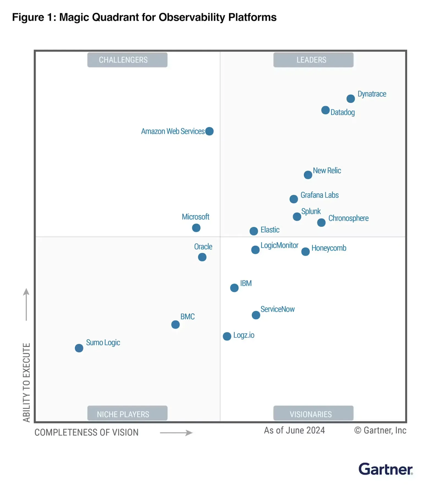
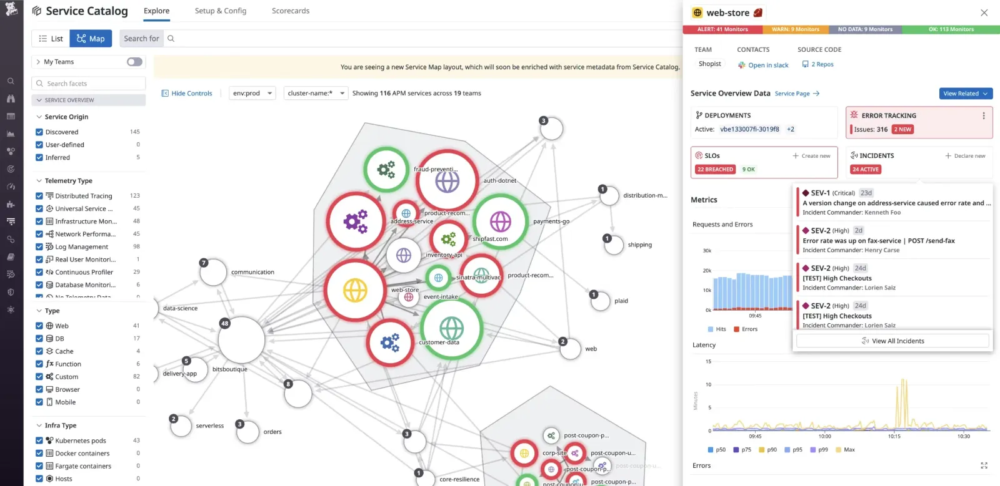

<!-- markdownlint-disable-file -->

Avec l'essor des technologies, notamment de l’IA, les grands groupes comme les start-up se tournent vers des plateformes modernes, parfois complexes (microservices, kubernetes, NoSQL, kafka, …), ainsi que vers des environnements Clouds tels que GCP, AWS ou Azure . Cette utilisation n’est pas toujours encapsulée dans un écosystème optimal dont voici les principaux organes:

- Le DevOps/SRE
- L’Agilité
- Les bonnes pratiques d’architecture
- Les bonnes pratiques de développement (Software Craftsmanship)
- L’Observabilité

Souvent traité dans un second temps, l’Observabilité est pourtant essentielle à la réussite et au suivi de votre projet. Comment pouvons-nous améliorer notre application si nous ne sommes pas capables de mesurer ? L’observation des applications dans leur ensemble permet de valider que vous vous dirigez dans la bonne direction (ou la mauvaise). 

Dans cet article, nous allons explorer comment l'Observabilité est incontournable pour maitriser votre transformation et comment Datadog a su proposer une des solutions d’Observabilité les plus avancées du marché.

## Comprendre l’Observabilité et ses Enjeux

L'Observabilité est un concept qui découle du monitoring (infrastructures, applications). Elle est d’ailleurs souvent confondue avec la supervision. Cependant, l’Observabilité est plus complexe et apporte un grand nombre de nouveaux concepts:

- Accessible à tous (métier et technique)
- Corrélation des données
- Propose une vue d’ensemble (expérience utilisateur, sécurité, application, Cloud, ...)
- Accepte plus de type de données comme le coûts d’utilisation des services Cloud
- Intègre une gestion des incidents
- Propose des services d’aide à la décision basé sur l‘IA
- L’approche proactive (détection avant l’incident)
- vision holistique de vos produits (applications)

En termes plus simples, c'est la capacité à comprendre ce qui se passe dans un système complexe en observant ses métriques, ses logs, ses traces et toutes autres données pertinentes. Dans le principe, plus vous ingérez de types de données, plus l’observation sera efficace. L’origine d’un événement (incident, changement de performance, volumétrie, …) est instantanément compréhensible et nous le voyons avec toutes ses adhérences. Par exemple, une perte de qualité sur l’application mobile peut-être identifiée par une trace (ligne de code), une métrique Cloud, à un journal et à un autre évènement tel qu’une mise en production. 

Cette évolution de la supervision, permet également des démarches FinOps et [GreenOps](https://blog.hoppr.tech/blogs/2024-09-26-low-carbon-dans-le-cloud-partie-1), très utiles avec les services Cloud.

En raison de la nature distribuée des architectures Cloud modernes, il devient essentiel d’avoir une visibilité complète et en temps réel sur les applications pour détecter les problèmes potentiels avant qu'ils n'affectent les utilisateurs.

## Pourquoi l'Observabilité est cruciale

Lors de l’adoption ou la migration vers le Cloud Public, plusieurs éléments doivent être surveillés de près :

1. **Performance des Applications :**  Plus votre application sera performante, plus vous serez en capacité d’optimiser votre utilisation du Cloud, donc votre facture. De plus, la latence, le temps de réponse des applications peuvent fluctuer au cours de la migration. Il est important d’avoir une vue très détaillée (à la ligne de code) des performances pendant la phase d’adoption ou de migration.
1. **Disponibilité des Services :** La transition vers le Cloud implique souvent le découpage des applications en microservices. Cette réorganisation entraîne une multiplication des points de défaillance potentiels. Une vue d’ensemble permet de suivre la santé de chaque service et d’éviter de se perdre dans des applications, notamment avec le FaaS (Function-as-a-Service).
1. **Coût :** Le Cloud Public offre une flexibilité exceptionnelle, mais peut aussi générer des coûts imprévus. L'Observabilité peut mettre en évidence les ressources sous-utilisées ou sur-provisionnées, aidant ainsi à optimiser les coûts.
1. **Sécurité :** Il est important de ne pas délaisser la sécurité qui doit faire partie intégrante de l’observation de vos applications.
1. **Ressenti utilisateur :** Une migration peut, même dans le cas de meilleures performances backend, avoir un impact significatif sur vos utilisateurs. S’il est positif, cette donnée justifiera votre décision de migrer. 

## Comment aborder l’Observabilité 

L’Observabilité ne doit pas être considérée comme solution à un problème technique. Son succès repose dans des fondations basées sur vos besoins métiers et son acceptation par tous.

A contrario de la supervision, qui n’est qu’un moyen technique de répondre à un besoin technique, il est essentiel de se poser les bonnes questions: ce dont vous avez réellement besoin doit être identifié. 

Prenons l’exemple d’une Fintech:  elle doit répondre à des critères stricts comme la qualité de son service, la sécurité des données ou encore répondre à une forte croissance. Dans ce contexte, il parait évident que ses critères ne sont pas réservés aux équipes de développement. Il est préférable que les équipes directions ou clientèles connaissent l’état de leur solution et qu’un incident soit détecté rapidement, voire avant qu’il ne se produise. Et dans le cas d’un dysfonctionnement, il est impératif d’identifier le plus rapidement possible l’origine du problème. C’est ce que doit permettre l’Observabilité.

Une solution trop technique et complexe, ne servira que les équipes techniques et ne permettra pas forcément de comprendre l’impact pour les clients ou sur le CA de l’entreprise. De plus, un outil qui ne rassemble pas et n’exploite pas l’ensemble des données utiles à cette tâche ne sera pas efficace. 

## Datadog, l’incontournable

Malgré un marché établi dans le domaine du monitoring et de la supervision, [Datadog](https://www.datadoghq.com/fr) a su se faire une place de leader avec l’émergence du Cloud Public. 

Ayant accompagné de nombreuses sociétés avec Datadog notamment un leader de l’immobilier, une filiale d’un des plus gros fournisseurs mondiaux de services de restauration ou encore une Fintech; je vous propose mes retours d’expériences.

## Démarrer de zéro

Partons sur cette Startup bancaire. Elle disposait malgré ses liens avec une des principales banques française d’une indépendance technologique. Plus exactement, nous avons développé de zéro une solution bancaire en nous appuyant uniquement de technologies Cloud Public et sur Datadog bien évidement. Nous avions pris en compte les critères Fintech, cités plus haut, mais nous avions un objectif plus urgent: le Time to Market. Avec une disponibilité de l’application en quelques mois et des responsabilité bancaires, la question de l’Observabilité a été intégrée dès l’origine. Datadog donnait une vision :

- des tests métiers (approche [DDD](https://blog.hoppr.tech/tags/ddd))
- la qualité de l’expérience utilisateur
- la surveillance de la sécurité de l’intégralité de l’application et de son développement 
- le taux de disponibilité, dont les SLA du Core Banking
- l’impact utilisateur des mises en production (jusqu’à 300/semaine dans les premiers mois)
- des performances
- des KPI métier, technique, FinOps, etc…
Cependant son implémentation était relativement simple car intégrée dès l’origine. Maintenant, évoquons le déploiement à l’échelle d’une entreprise de promotion immobilière cotée, avec des centaines de projets historiques comme novateurs. 

## Intégrer l’Observabilité à l’échelle

Dans cette situation, il ne faut pas que la solution soit portée par des objectifs purement techniques. Il y a également des enjeux d’échelle qui impliquent une organisation de l’Observabilité et des enjeux financiers et écologiques (CSRD).

Dans un premier temps, il faut prendre en compte l’ensemble des besoins de tous les acteurs : du DSI au développeur en passant par les responsables métiers. Pensez également à intégrer les responsables FinOps et GreenOps. Il est également indispensable d’avoir un inventaire des projets avec leurs priorités et criticités. Une étude permettra de choisir le meilleur outil mais aussi les étapes nécessaires à son adoption. Dans mon cas où la migration Cloud Public était finalisée, Datadog remporta haut la main la première place. 

La seconde étape passe par la définitions des rôles des différents utilisateurs et la segmentation des données. Heureusement, Datadog propose un bon nombre de solutions:

- Organisation sur plusieurs comptes
- Droits et RBAC
- Index par données
- Visibilité des Dashbords
- Filtres
- Etc…
Une fois la question de l’organisation traitée, nous pouvons réaliser un premier MVP (Produit minimum viable) d’un échantillon de projets représentatifs basé sur: leurs criticités, leurs aspects technologiques mais aussi leurs contextes fonctionnels.

Aujourd’hui, l’entreprise utilise Datadog sur l’ensemble de son spectre de projet (de l’agence immobilière à l’application de gestion des ventes) avec l’ensemble des équipes (technique ou non). Les rituels intègrent les rapports, l’infogérance est traitée via la solution, le pilotage FinOps du groupe est assuré par Datadog.

## Passer au niveau supérieur en alliant méthodologie et Observabilité

S’appuyer sur les piliers d’une approche moderne augmentera l’efficacité de l’Observabilité. Il est essentiel que tous les acteurs de vos projets interagissent avec votre outil d’Observabilité, en consomment et en intégrant leurs données. Ces outils sont un investissement financier qu’il est important de rentabiliser dans une démarche ouverte. 

## Software Craftsmanship : Pour une meilleure intégration de l’Observabilité

Le software craftsmanship est un mouvement qui prône l’excellence dans le développement logiciel, avec une attention particulière à la qualité du code, la testabilité et la maintenabilité.

Un code bien structuré, découplé et respectant les bonnes pratiques de software craftsmanship est plus facilement observable. Par exemple, les logs sont standardisés, les métriques sont instrumentées de manière cohérente et les erreurs sont gérées proprement.

## DevOps: Une Observabilité industrialisée 

L’approche DevOps améliore encore la perspective d’Observabilité. En effet, nous pouvons industrialiser un ensemble de nouveaux éléments:

- Déployer votre Observabilité en mode infrastructure as code (données, dashboard, alarme, …)
- Les tests dans vos pipelines de déploiements intégrés avec votre outil d’Observabilité.
- Automatiser des tests notamment dans vos déploiements sans indisponibilité (canary, blue and green, …)
- Visualiser l’impact financier ou green d’une nouvelle fonctionnalité
## Agilité: L’Observabilité mesure vos KPI

Afin de suivre l’avancée de votre projet et remonter des données pertinentes pendant vos rituels, un outil d’Observabilité sera un grand allié. C’est dans ces circonstances que l’on comprend l’intérêt de l’accessibilité lié à l’Observabilité, car ces données sont récupérables directement par le chef de projet, le scrum master, etc.

N’oubliez pas d’intégrer des KPI impacts environnementaux à vos projets (consommation carbone, valeur énergétique par utilisateur, …). Vous pouvez vous inspirez de notre article [Low Carbon dans le Cloud - Partie 2](https://blog.hoppr.tech/blogs/2024-09-26-low-carbon-dans-le-cloud-partie-2).

## Pour conclure

Que vous soyez DSI, CTO ou encore CPTO, vous avez une vision stratégique de l’Observabilité. C’est pour vous un élément concurrentiel, un gain de qualité de vos produits, un gain d’argent des fois conséquent. Cependant, l’appropriation d’une solution avec la bonne méthodologie par vos équipes n’est pas une chose simple. Vous faire accompagner dans cette démarche sera certainement un gain de temps et de réussite, mais soyez vigilant de choisir un partenaire qui sera capable d’aborder ce chantier à votre niveau.

Nous avons mis en avant Dadadog car, dans 9 fois sur 10, il ressort gagnant de nos études et benchmark, depuis déjà quelques années. Aujourd’hui convaincu par notre expérience dans l’accompagnement à l’Observabilité, HoppR a décidé de mettre en place un partenariat unique avec Datadog : HoppR et Datadog pour une Observabilité comme pilier stratégique.

