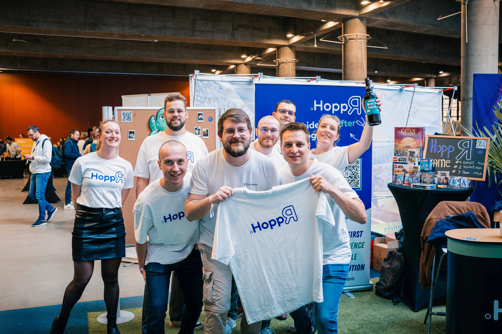
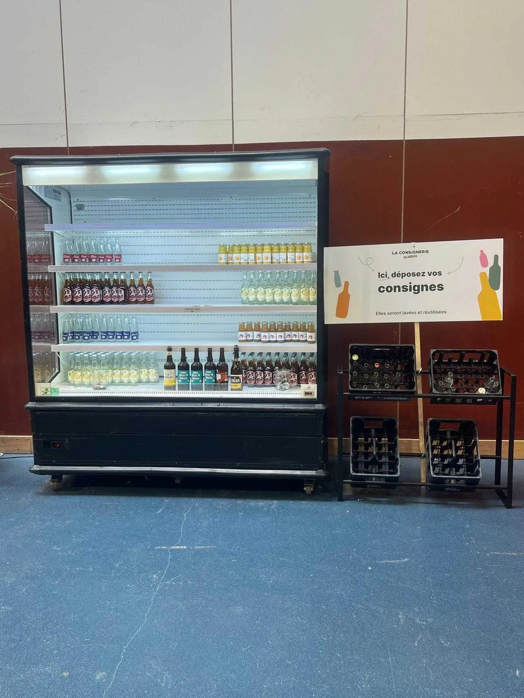
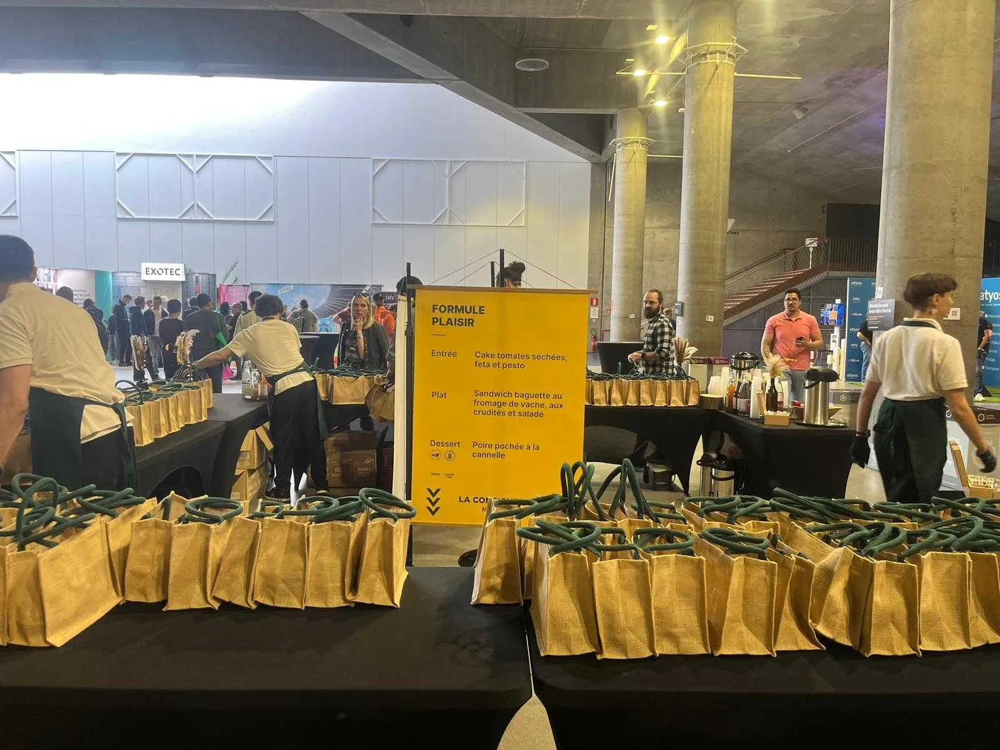
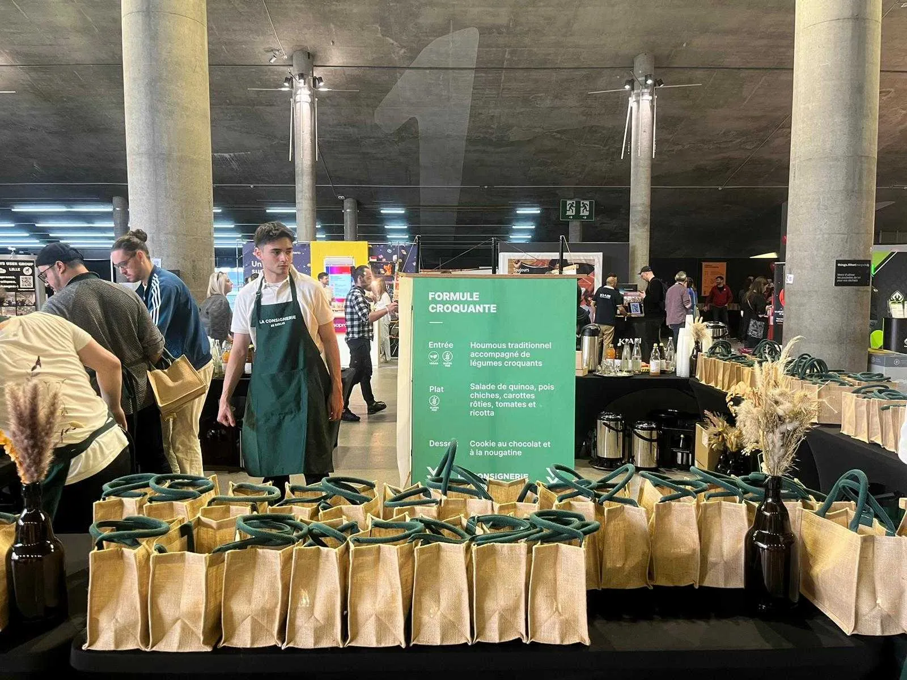

<!-- markdownlint-disable-file -->

# DevFest Lille, saison 7 !

Les 6 et 7 Juin dernier s'est déroulée la 7ᵉ édition du DevFest Lille au Grand Palais. Pour la première fois sur un format de 2 jours avec une soirée organisée à Grand Scène (on y reviendra plus tard). 
Une édition plus riche, plus dense avec 56 conférences et Talks, 1500 participants et une quarantaine de sponsors dont HoppR.

Toute l'équipe HoppR était présente à l'événement. Retour sur cette journée riche en découvertes techniques et humaines d'Emma, Elisa, Edouard, Théo, Nicolas G & Z, Anthony, Guillaume !

D’ailleurs, certains en ont profité pour compiler leur retour d’expérience et prendre des notes sur les talks qui les ont interpellés !
Alors si vous n’avez pas pu y participer ou tout voir, la suite devrait vous intéresser !

## Petit détour sur l'engagement du DevFest Lille

Depuis quelques années, l'équipe du DevFest a fait un gros effort pour réduire l'impact de la conférence, notamment sur les déchets. Avec pour mot d'ordre, supprimer, réutiliser ou recycler et plusieurs initiatives déjà en place :

- Fin des goodies (souvent inutiles) et thématique pour réutiliser les kakemonos et stand des années précédentes (organisation et sponsors).

- Partenariat avec la Consignerie pour proposer aux participants des boissons dans des bouteilles en verre et des gobelets consignés.

- Repas zéro déchet.

À noter aussi leur travail sur l'accessibilité avec le sous-titrage réalisé par le Messageur, pour que les conférences puissent être accessible à tous les publics en situation de handicap 👏

## Retour sur les conférences

### Survivre dans la JS-jungle des outils de tests  (Lise Quesnel) par  Théo Lanord

Je tiens à faire un retour sur la conférence de Lise QUESNEL pour la remercier de m'avoir aider à voir plus clair dans la JS-jungle des outils de tests !

**Avant tout, est-ce que tester, c'est douter ? Et oui, pourquoi tester ?**

Tester manuellement est une activité chronophage avec des résultats non répétables. La force des tests automatisés est leur rapidité et leur répétabilité.
Ces deux qualités diminuent les boucles de feedback que soit en local, en pipeline de CI/CD ou même en recette.

**En quoi réduire la boucle de feedback est intéressant ?**

Plus l'erreur est détectée tard dans la chaîne de valeur, plus elle sera coûteuse à réparer (Localisation, recontextualisation, etc).
Associé à de petites incrémentations, tester permet de délivrer de la valeur plus rapidement tout en augmentant la qualité.
Ce qui me tient à cœur, c'est d'augmenter la confiance entre les différentes parties prenantes (développeurs, PO, QA, etc) pour, à terme, diminuer la pression au quotidien.

**Choisir ses outils en fonction du contexte**

De nombreuses typologies d'outils existent (lanceurs, structurateurs, utilitaires, mocks, etc). Certains outils implémenteront tout ou partie de ces typologies.
Le choix des outils varie en fonction de votre besoin et contexte.
Dans de nombreux cas, ils vous donneront des modèles de test sur lesquels poser vos premiers tests. Il est important de votre côté d'avoir un nommage de test explicite qui pourra déboucher vers un langage commun compréhensible par les développeurs et le métier.

**Classifier les tests : Equilibre entre coût, rapidité et confiance**

Vous trouverez dans la JS-Jungle de nombreux noms de tests (unitaire, intégration, bout en bout, acceptance, composants, contracts, etc). Je ne peux que vous conseiller d'en discuter avec vos collègues pour vous approprier ces notions au sein de votre équipe.

**La question final sera donc lesquels utiliser et en quelle proportion ?**

Si j'ai touché votre curiosité, n'hésitez à regarder mon [retour plus complet sur cette même conférence](https://blog.hoppr.tech/retour_%22survivre_dans_la_JS-jungle_des_outils_de_tests%22_de_lise_quesnel_au_devfest_2024).
Encore un grand merci et fécilitations pour la qualité de rédaction (métaphores, images, etc) et de narration de sa conférence !

### De l'exclusion à l'inclusion : l'accessibilité numérique pour tous et toutes (Emmanuelle Aboaf) par Elisa Degobert

En France, 1 personne sur 6 est atteinte d’un handicap et il est la plupart du temps invisible. Pourtant, la majorité des sites web ne sont PAS accessibles.

Au-delà de l'enjeu moral de l'inclusion, ne pas rendre son site accessible, c'est réduire sa cible d'utilisateurs potentiels.

**L'accessibilité nous profite à tous**

On peut penser que les problèmes d'accessibilité ne nous touchent pas mais tout le monde bénéficie au quotidien d'inventions pensées pour des personnes atteintes de handicap: les SMS, la télécommande ou encore les livres audio en sont des exemples.

S'il s'agit d'une problématique permanente pour de nombreuses personnes, nous subissons tous à un moment de notre vie ce manque d’accessibilité, que ce soit de manière permanente, temporaire ou situationnelle.

En effet un rhume peut affecter notre capacité à parler, un bras cassé à utiliser nos mains (handicaps temporaires) ou des situations peuvent altérer nos capacités: lorsque nous sommes dans des endroits bruyants notre ouïe est impactée, lorsque l'on doit garder un bébé à bras tout en naviguant sur l'ordinateur notre motricité est impactée, etc.

**Les erreurs que l'on fait tous et toutes…**

La majorité des erreurs relèvent d'un usage imparfait du langage **HTML :**

- textes alternatifs manquants (`alt` dans les images et les boutons contenant qu'une image),

- étiquettes manquantes dans les formulaires (un label doit avoir l'attribut `for` défini avec le même nom que l'attribut `id` de l'input correspondant),

- liens vides (les urls ne suffisent pas toujours à savoir quel lien correspond à quoi, utilisez l'attribut `title`)

- langue manquante du site (l'attribut `lang` dans la balise html définit la langue du site).

Par exemple, en définissant la langue de votre site, les lecteurs d'écran vont savoir quel accent utiliser
(pour ne pas lire du texte français avec un accent anglais) et votre navigateur évitera de faire des traductions surprenantes
(comme traduire le prénom Jimmy par pied-de-biche !).

**Comment savoir si votre site est accessible ?**

👉 Vous pouvez retrouver plein de ressources sur le sujet de l'accessibilité sur le [projet a11y](https://www.a11yproject.com/)
et la liste des règles d'accessibilité sur [WCAG](https://wcag.com/), avec des exemples concrets.
[Lighthouse](https://developer.chrome.com/docs/lighthouse/overview) peut aussi vous aider à auditer l'accessibilité de votre site.

L'important est de sensibiliser à l'accessibilité autour de soi mais il est difficile de savoir si notre site est accessible.
avant de l'avoir confronté aux utilisateurs concernés.
Comme l'a conclu E. Aboaf, l'important est d'inclure des personnes handicapées dans les process : _**"Nothing with us without us"**_ !

Je vous encourage vivement à aller voir le replay de son talk 🎤 pour en savoir plus et d'explorer [son site](https://bento.me/eaboaf) pour consulter ses articles sur le sujet.

### Maîtrisez la Hype : Passion versus Raison (William Leemans) par Sébastien Jaupart

La passion nous pousse parfois à tester les nouveautés de notre secteur. Parfois un peu trop...

S'exercer sur de nouvelles technologies contribue grandement à l'apprentissage et développent notre capacité à nous adapter. Néanmoins, les contraintes temporelles et financières d'un projet peuvent rapidement nous rattraper. Adopter une technologie trop tôt (par "_effet de mode_") ou s'entêter sur des technologies inadaptées à nos besoins peut avoir des effets néfastes pour nos projets.

**William Leemans** nous alertent face au "_chant des sirènes de la Hype_" et nous proposent un ensemble de bonnes pratiques, astuces et concepts pour s'y prémunir et faire les bons choix.

La notion de _**spike**_ (que j'avoue avoir un peu oublié avec le temps) nous impose de timeboxer les essais d'une technologie pour, _in fine_, documenter et partager les découvertes et résultats obtenus et juger de la pertinence de son usage sur le projet.

Les choix éclairés d'une personne ou d'une équipe ne le sont pas toujours par d'autres. Généralement pris sur la base d'un contexte, ils peuvent être tracés par le biais d'un **ADR** (_Architecture Decision Record_), document retraçant un choix (architectural, de technologie, etc) incluant le contexte, les raisons de ce choix et ses potentielles alternatives. Ils encouragent la réflexion critique, améliorent la communication au sein des équipes et facilitent l'apprentissage continu. Très utile également pour onboarder de nouveaux collaborateurs sur un projet.

Quels que soient nos choix, les intérêts du projet doivent primer. Pour éviter de choisir un framework inadapté à nos contraintes, il est impératif d'analyser les besoins de nos projets. Pour cela, il est nécessaire de se documenter un maximum, s'imprégner de la philosophie de l'outil et appliquer directement les bonnes pratiques préconisées par la documentation officielle. La sobriété est de mise. Plus la stack est simple, moins il y aura de maintenance.

Bref, un équilibre à trouver entre innovation et stabilité.

Le [replay de la conférence](https://www.youtube.com/watch?v=TPhRprV2L24) est disponible sur Youtube.

## Rattrapage

Avec 3 salles et plus d'une cinquantaine de sujets, il est impossible de suivre tous les sujets et c'est parfois difficile de faire son choix.

No stress, l'équipe a tout prévu et des replays sont disponibles sur la [chaine Youtube du GDG France](https://www.youtube.com/watch?v=eDCmfZUmsUA&list=PLuZ_sYdawLiXf92Uq5iE5LlYKrOv1IUvx&pp=iAQB) 

Allez on se voit l’année prochaine 😄

