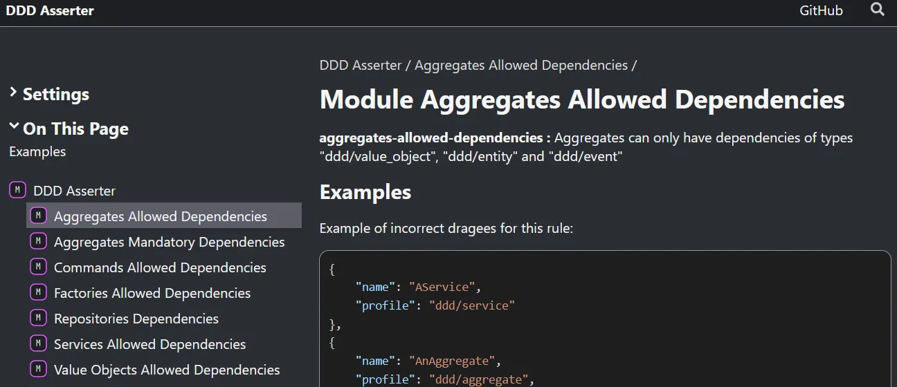
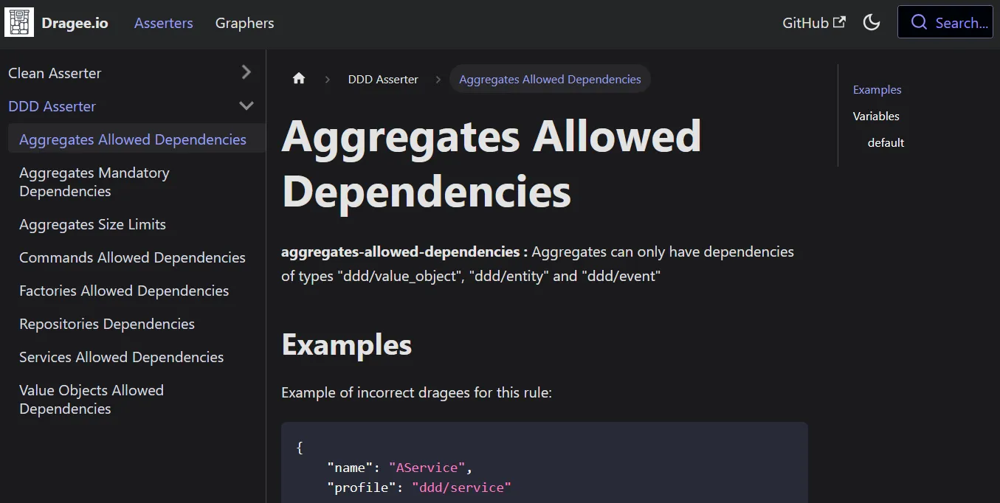
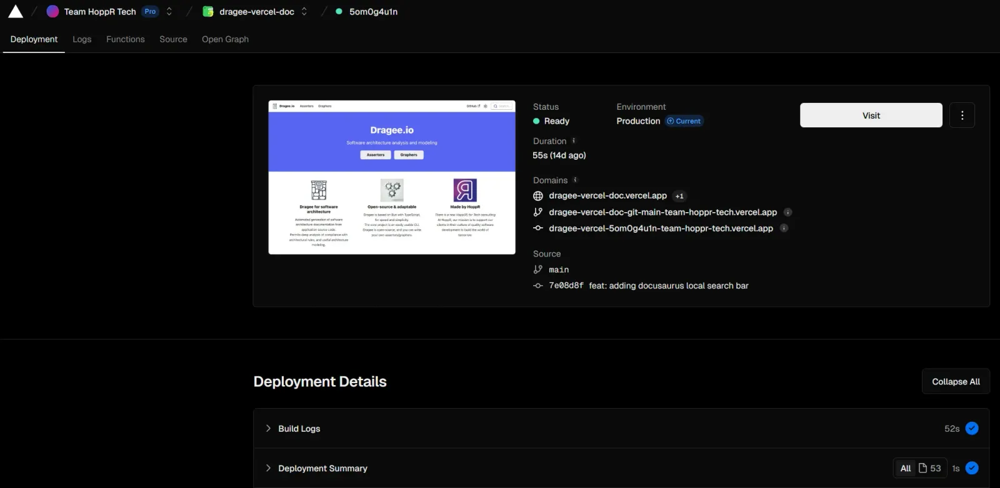

<!-- markdownlint-disable-file -->


Suite à l’article [Créer une CLI pour un projet modulaire avec Commander.js](https://blog.hoppr.tech/blogs/2024-11-14-crer-une-cli-pour-un-projet-modulaire-avec-commanderjs), nous avons maintenant une CLI efficace et fiable pour notre projet [Dragee.io](https://github.com/dragee-io). 

Nous pouvons grâce à elle écrire nos _asserters_ facilement, et les règles d’architecture qui y sont associées, ce qui nous permettra d’analyser le respect de ces règles par un projet à tester.

Cependant, à l’image de n’importe quel _linter_, il nous devient nécessaire d’avoir un descriptif de chaque règle et comment la respecter. De plus, nous souhaiterions avoir un catalogue référentiel des _asserters_ et règles qui existent, en plus d’une documentation générale sur le projet Dragee.

Nous avons besoin que ce catalogue soit :

- dynamique (1 commit ⇒ 1 déploiement)

- facile à paramétrer et personnaliser

- s’adapte facilement à des modifications sur n’importe quelle règle. Hors de question de venir modifier un site à la main à chaque nouvelle version de notre asserter DDD !

Creusons alors le sujet.

## Documentation TSDoc/TypeDoc

Quel est le meilleur endroit pour poser de la documentation sur une règle donnée ? Dans le code, en commentaire de la dite règle.

Nous allons nous appuyer sur le standard de documentation [TSDoc](https://tsdoc.org/) pour TypeScript. Voici un exemple, sur [une des règles de notre asserter DDD](https://github.com/dragee-io/ddd-asserter/blob/main/src/rules/aggregates-allowed-dependencies.rule.ts) :

```typescript
/**
 * **aggregates-allowed-dependencies :**
 * Aggregates can only have dependencies of types "ddd/value_object", "ddd/entity" and "ddd/event"
 *
 * ## Examples
 * Example of incorrect dragees for this rule:
 * ```json
 * {
 *     "name": "AService",
 *     "profile": "ddd/service"
 * },

...

 *
 * @module Aggregates Allowed Dependencies
 *
 */
```

Vous pouvez ici noter que nous sommes partis sur un commentaire écrit en [Markdown](https://www.markdownguide.org/getting-started/), souple, efficace, facilement lisible ici et nous permettant d’utiliser TypeDoc (et Docusaurus) ensuite. 

En local dans le projet de l’asserter, nous avons pu installer l’outil [TypeDoc](https://typedoc.org/) nous permettant de générer du HTML grâce à ces commentaires. Cela nous donne un premier résultat intéressant, mais encore peu souple et surtout uniquement dédié au projet en cours.




## Git submodules

Nous avons créé un nouveau projet, [https://github.com/dragee-io/dragee-vercel-doc](https://github.com/dragee-io/dragee-vercel-doc), qui sera celui contenant les outils nous permettant de générer le résultat de notre agrégation de documentation. L’objectif est de centraliser ce processus, en impactant le moins possible les projets à documenter.

Mais comment faire le lien entre le projet de génération de documentation et les projets à documenter ? Nous avons choisi d’utiliser les [sous-modules (submodules) Git](https://git-scm.com/book/fr/v2/Utilitaires-Git-Sous-modules).  

Les **git submodules** sont une fonctionnalité de Git permettant d'intégrer un dépôt Git distinct au sein d’un autre dépôt en tant que sous-dossier. 

```shell
# Installation d'un sous-module ddd-asserter dans un dossier du projet
git submodule add https://github.com/dragee-io/ddd-asserter projects/ddd-asserter

# Mise à jour des sous-modules du projet
git submodule update --recursive --remote
```

Cette approche est d’ailleurs employée sur l’exemple [https://github.com/typedoc2md/docusaurus-plugin-typedoc-example](https://github.com/typedoc2md/docusaurus-plugin-typedoc-example), pour Docusaurus et son plugin TypeDoc, que nous allons maintenant utiliser.

## Docusaurus

[Docusaurus](https://docusaurus.io/) est un framework open-source permettant de créer facilement des sites web statiques de documentation technique. Basé sur React, il permet de gérer du contenu en Markdown, d’intégrer des plugins et des options de personnalisation pour un site propre et optimisé.

Parmi les plugins à disposition, un nous intéresse particulièrement dans notre cas : [docusaurus-plugin-typedoc](https://typedoc-plugin-markdown.org/plugins/docusaurus). Comme son nom l’indique, ce plugin nous permet d’intégrer TypeDoc dans le cycle de Docusaurus. C’est lui qui portera ainsi la transformation TSDoc → Markdown. Avec la configuration souhaitée, la documentation s’intègrera ainsi automatiquement dans notre site Docusaurus.





D’autres plugins utiles existent pour améliorer l’expérience, comme par exemple une barre de recherche avec [https://github.com/cmfcmf/docusaurus-search-local](https://github.com/cmfcmf/docusaurus-search-local).

Il est également possible d’ajouter des ressources statiques (pour la première page par exemple), des liens (vers le [code source de Dragee](https://github.com/dragee-io), ou les liens [HoppR](https://www.linkedin.com/company/hopprtech)) et de personnaliser le thème du site.


Nous avons maintenant un site qui répond à nos attentes, avec une documentation centralisée dans notre projet [https://github.com/dragee-io/dragee-vercel-doc](https://github.com/dragee-io/dragee-vercel-doc). Il ne reste plus qu’à le déployer.

## Vercel

Pour présenter brièvement [Vercel](https://vercel.com/), c’est une plateforme optimisée pour déployer rapidement des applications web front-end. Elle offre un déploiement continu et des outils intégrés pour gérer des sites statiques ou dynamiques.

Vercel est un outil que nous connaissons bien chez HoppR, puisque c’est ce qui nous permet par exemple de déployer le blog que vous êtes en train de lire. Compatible avec Docusaurus, et permettant un déploiement couplé à Git, c’est l’outil idéal ici.

Reprenons notre projet de documentation  [https://github.com/dragee-io/dragee-vercel-doc](https://github.com/dragee-io/dragee-vercel-doc).

Après configuration de Vercel, celui-ci va écouter les modifications apportées à la branche _main_ du dépôt Git. A chaque nouveau commit sur cette branche, Vercel va automatiquement builder et redéployer la nouvelle version du site.





Et voilà le résultat : [https://dragee-vercel-doc.vercel.app/](https://dragee-vercel-doc.vercel.app/)

A noter que Vercel comprend toute une suite d’outils, permettant notamment l’analyse détaillée du trafic sur le site, une configuration simple, et même des environnements de preview déployés automatiquement pour tester chaque modification. 

## Conclusion

Maintenant le projet **Dragee.io** possède sa page, contenant une présentation succincte du projet, de la documentation et surtout un catalogue dynamique des projets _asserters/graphers_ utilisables.

L’utilisation couplée de TypeDoc, Docusaurus et Vercel nous permet d’avoir une documentation simple et dynamique. Saisir les informations afférentes à une règle d’utilisation créé la documentation en lien dans notre catalogue de règles en ligne. Pratique !

N’hésitez pas à consulter [les autres articles en lien avec Dragee.io](https://blog.hoppr.tech/tags/Dragee.io), pour découvrir d’autres solutions techniques à des problématiques posées lors de son développement, et voir avec nous ce beau projet grandir.

