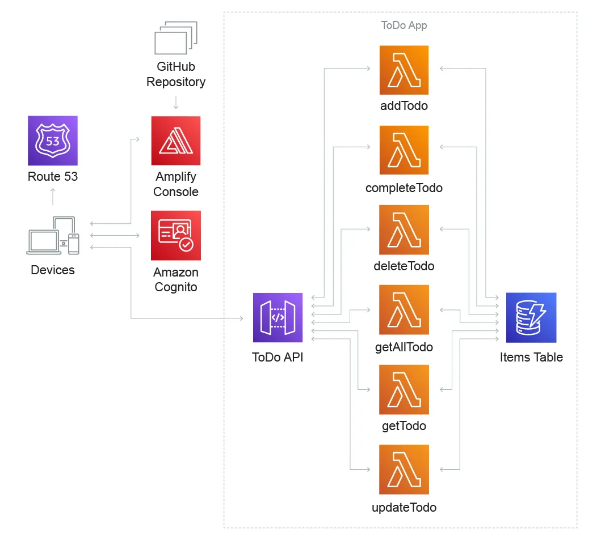

<!-- markdownlint-disable-file -->

La [première partie](https://blog.hoppr.tech/blogs/2024-09-26-low-carbon-dans-le-cloud-partie-1) abordait les concepts GreenOps et la [seconde partie](https://blog.hoppr.tech/blogs/2024-09-26-low-carbon-dans-le-cloud-partie-2) les méthodes pour mesurer votre production de gaz à effet de serre. Dans cet article nous allons aborder les architectures Cloud Green. Nous allons donc rentrer dans des méthodes d’amélioration concrète. Pour cela, il faut comprendre les facteurs clés à prendre en compte.

## Les 3 facteurs clés de l’architecture Cloud Green

L'architecture Cloud Green repose sur l'optimisation des ressources pour minimiser l'impact environnemental tout en maintenant des performances élevées. Il ne faut pas tomber dans la pauvreté numérique mais dans une certaine forme de sobriété saine. Parmi les piliers de cette approche, trois facteurs jouent un rôle essentiel : 

- La répartition géographique où sont hébergés vos services Cloud (ou le type de source d’énergie pour les sites véritablement autonomes)

- Le moment où une charge de travail est exécutée (par exemple je génère mon modèle IA à 11H)

- La répartition de la charge de travail dans le temps.

## **Spatial Shifting : Optimisation Géographique**

Le _Spatial Shifting_ consiste à exploiter les ressources cloud disponibles dans différentes régions géographiques pour minimiser l’impact environnemental. Bonne nouvelle, les principaux Cloud Providers proposent plusieurs régions (exemple: Paris, Dublin, Hong Kong, Stockholm, ...).

### **Comment ça fonctionne ?**

Les fournisseurs cloud opèrent dans des zones ayant des mix énergétiques différents. Comme vu dans l’article précédent, un centre de données en Norvège, alimenté principalement par des énergies renouvelables, a une empreinte carbone bien moindre qu’un centre situé dans une région dépendant du charbon. En redirigeant les charges de travail vers des régions avec une énergie plus verte, il est possible de réduire considérablement les émissions. 

### Mon retour d’expérience

Je considère qu’il s’agit du meilleur facteur d’optimisation possible si nous partons d’un pays qui ne propose ni énergie verte, ni nucléaire. Les gains de CO2 peuvent atteindre les 1 000%. Cependant, il faut prendre en compte des effets de bord importants :

- Une migration peut être complexe surtout si nous ne sommes pas sur de l’infrastructure as code

- Le prix des services cloud change en fonction de la région, la différence peut être de l’ordre de 20%

- Il faut prendre en compte les performances si nous nous éloignons des utilisateurs (par exemple : une application pour la Pologne avec des services hébergés en France).

## **Temporal Shifting : Exploitation des Fenêtres de Temps**

Le _Temporal Shifting_ consiste à planifier les charges de travail pour qu’elles s’exécutent aux moments où l’énergie renouvelable est la plus abondante.

### **Pourquoi est-ce efficace ?**

La disponibilité d’énergie renouvelable fluctue en fonction de l’heure et des conditions météorologiques. Par exemple, l’énergie solaire est abondante en journée, tandis que l’éolienne peut être plus efficace la nuit. En ajustant les horaires d’utilisation des services Cloud, nous pouvons optimiser la consommation énergétique et en corrélation la production de gaz à effet de serre.

### Mon retour d’expérience

Il s’agit d’un excellent moyen de gérer des tâches récurrentes comme les sauvegardes ou la mise à jour de son modèle IA. Malheureusement, cette méthode d’architecture Green n’est pas adaptée aux énergies non renouvelables ni à tous nos besoins.

## **Demand Shifting : Ajustement de la Demande**

Le _Demand Shifting_ vise à réduire ou à redistribuer la demande en fonction de la disponibilité des ressources et de l’impact énergétique. 

### **Comment ça fonctionne ?**

Nous savons pertinemment que nous ne pouvons pas mettre en pause une fission nucléaire et que nous ne pouvons pas stocker l’excédant d’énergie produit la nuit. Dans la philosophie du Demand Shifting, nous sommes assez proche des tarifs heures pleine heure creuse d’EDF. Voici, 2 situations plus parlantes:

- **Étalement de la charge** : Répartir les traitements sur plusieurs périodes pour éviter les pics de demande.

- **Gestion des utilisateurs** : Encourager les utilisateurs finaux à consommer des ressources à des moments spécifiques grâce à des incitations (comme des tarifs réduits).

### Mon retour d’expérience

C’est certainement la méthode la plus impactante pour les usagers et sa mise en œuvre demande de sortir de l’aspect purement technique. 

## **L’Impact Combiné des 3 Facteurs**

En combinant le _Spatial Shifting_, le _Temporal Shifting_ et le _Demand Shifting_, il est possible d’atteindre un niveau d’efficacité encore plus important en profitant de l’effet de synergie. En résumé, ces stratégies permettent :

- Une réduction significative de l’empreinte carbone et potentiellement des coûts.

- Une meilleure résilience de vos applications grâce à une répartition dynamique des charges d’utilisation des services Cloud.

- Une contribution active aux objectifs de durabilité de votre entreprise (RSE).

## Aller plus loin dans l’éco-Cloud-Native avec le Serverless

L’adoption du **Serverless,** comme principale architecture de vos projets, apparaît comme une solution intéressante. En effet, le modèle Serverless, en permettant de consommer des ressources uniquement lorsqu’elles sont nécessaires (à la seconde près), réduit le gaspillage énergétique et d’optimiser les coûts. 

De plus, les architectures Serverless sont compatibles avec le **Spatial Shifting**, le **Temporal Shifting** et le **Demand Shifting.**

### Mon retour d’expérience

Il est important de souligner que cette architecture est complexe à gérer à grande échelle. Un projet de 300 fonctions interdépendantes imposera beaucoup de contraintes. Il est possible d’introduire le Serverless dans vos projets en le mixant avec une architecture plus courante comme du Kubernetes. Le **Function as a Service** s’associe bien avec une approche Frontend ou des tâches récurrentes. Nous vous proposerons un article complet sur le Serverless prochainement sur notre blog.

## Conclusion

Vous avez maintenant quelques exemples de démarches green pour agir avec vos applications dans le Cloud. Il ne faudra pas oublier de mettre en place des KPI et une Observabilité Green pour aller au bout de votre projet. Pour cela, je vous conseille de lire la [seconde partie](https://blog.hoppr.tech/blogs/2024-09-26-low-carbon-dans-le-cloud-partie-2) de notre article.

Il existe bien sûr d’autres mécanismes permettant d’améliorer vos architectures Cloud que nous aborderons dans un autre volet. 

