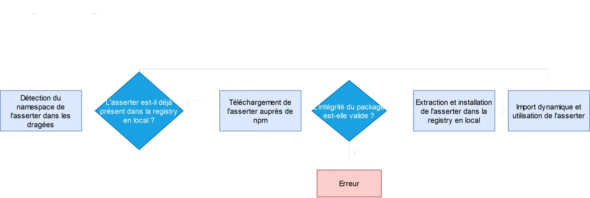

<!-- markdownlint-disable-file -->


Nouvelle étape pour notre projet [Dragee.io](https://github.com/dragee-io). Nous avons déjà vu [comment créer ](https://blog.hoppr.tech/blogs/2024-11-14-crer-une-cli-pour-un-projet-modulaire-avec-commanderjs)[la ](https://blog.hoppr.tech/blogs/2024-11-14-crer-une-cli-pour-un-projet-modulaire-avec-commanderjs)[CLI qui est au cœur du projet](https://blog.hoppr.tech/blogs/2024-11-14-crer-une-cli-pour-un-projet-modulaire-avec-commanderjs), et également comment [documenter de manière dynamique nos asserters](https://blog.hoppr.tech/blogs/2024-12-10-gnration-agrgation-et-dploiement-de-documentation-tsdoc-avec-docusaurus-et-vercel), porteurs des règles d’architecture.

C’est un excellent début, mais il manque quand même le point le plus important : maintenant, il s’agit de récupérer et d’installer ces _asserters_ en vue de leur utilisation.

En effet, **Dragee.io** a pour mission, entre autres, de nous permettre de vérifier le respect de règles d’architecture au sein de notre projet. Pour cela, des _asserters_ liés à la typologie d’architecture vont entrer en jeu. 

Ces _asserters_ ne sont pas directement importés dans la CLI de Dragee, ils sont téléchargés à la volée, au besoin. Et nous allons maintenant nous demander comment.

## Anatomie d’un asserter et extraction du namespace

Pour rappel, un **asserter** est un module comprenant des règles d’architecture. Il est basé sur un **namespace** correspondant à une typologie d’architecture (DDD, clean, etc.). A chaque _namespace_ correspond un _asserter_ différent.

Dans cet article, nous prendrons pour exemple notre tout premier asserter, [https://github.com/dragee-io/ddd-asserter](https://github.com/dragee-io/ddd-asserter), qui comme son nom l’indique comprend un set de règles concernant le [Domain-Driven Design](https://blog.hoppr.tech/tags/ddd).

A la construction d’un rapport d’architecture, notre CLI va détecter le _namespace_ des dragées, et va automatiquement télécharger l’asserter correspondant auprès de npm. Cet asserter va ensuite être installé en local, et leurs règles jouées sur les dragées à analyser.


> 📄 Les règles d’architecture de l’asserter DDD sont disponibles [sur le site de Dragee](https://dragee-vercel-doc.vercel.app/docs/asserters/ddd-asserter/).

> 📌 Nous avons également des _graphers_ (modélisateurs d’architecture) qui sont traités de la même manière, par exemple [https://github.com/dragee-io/ddd-grapher](https://github.com/dragee-io/ddd-grapher).

## Téléchargement de l’asserter

Le téléchargement d’un asserter va se faire via deux appels à l’API npm :

- Appel de récupération des [métadonnées sur le package npm](https://github.com/npm/registry/blob/main/docs/responses/package-metadata.md)

- Appel de téléchargement du package (_tarball_)

Pour effectuer ces appels, nous allons utiliser [Axios](https://axios-http.com/), un client HTTP travaillant avec des promesses, très simple à utiliser. Ainsi, cela donne, en simplifiant la construction de l’URL d’appel, pour l’_asserter_ [ddd-asserter](https://github.com/dragee-io/ddd-asserter) :

```typescript
import axios from 'axios';

// Appel 1 : Métadonnées packages
const projectArchiveUrl = 'https://registry.npmjs.org/@dragee-io/ddd-asserter/latest';
const downloadInfo = await axios.get(projectArchiveUrl, {
    headers: { Accept: 'application/json' }
});

// Appel 2 : Téléchargement package
const tarball = downloadInfo.data.dist.tarball;
const { data } = await axios.get(tarball, {
    responseType: 'arraybuffer'
});
```

Les deux appels effectués ici sont :

- GET [https://registry.npmjs.org/@dragee-io/ddd-asserter/latest](https://registry.npmjs.org/@dragee-io/ddd-asserter/latest)

- GET [https://registry.npmjs.org/@dragee-io/ddd-asserter/-/ddd-asserter-0.0.2-latest.tgz](https://registry.npmjs.org/@dragee-io/ddd-asserter/-/ddd-asserter-0.0.2-latest.tgz)


> 📄 Pour plus d’informations sur l’API registry de npm : [https://github.com/npm/registry/blob/main/docs/REGISTRY-API.md](https://github.com/npm/registry/blob/main/docs/REGISTRY-API.md)

## Vérification de l’intégrité du package

Nous avons réussi à télécharger nos _asserters_ distants. Mais rien ne nous dit qu’ils n’aient pas été altérés ou corrompus pendant le process. Il est donc temps d’ajouter une étape de sécurité, et de vérifier l’intégrité de nos packages.

Comme nous l’avons vu plus haut, le téléchargement auprès de npm se fait en deux appels : les métadonnées puis le package. La réponse au premier appel contient les informations nécessaires pour effectuer la vérification.

Plus en détail, [npm nous conseille](https://blog.npmjs.org/post/172999548390/new-pgp-machinery) d’utiliser un champ nommé _integrity_, basée sur la [spécification SRI](https://developer.mozilla.org/en-US/docs/Web/Security/Subresource_Integrity). Nous allons récupérer cette valeur, une chaîne de caractère encodé en base 64 avec un cryptage SHA512. Exemple avec un de nos asserters :

```shell
sha512-xao4irn1WY822p6XcOEUkWfK0U/ukIvvn/3lBLJ/A6+d9RpwemKwuxTz5e6QZ8eOvJm17lul08O4v0DY/mh+rw==
```

Recalculons ce hash. Nous pourrions par exemple utiliser cette commande :

```shell
cat [PACKAGE] | openssl dgst -sha512 -binary | openssl base64 -A 
```

Ou alors, avec l’outil [shasum](https://fr.linux-console.net/?p=15125) :

```shell
shasum -b -a 512 [PACKAGE] | awk '{ print $1 }' | xxd -r -p | base64
```

Et nous obtenons le même résultat, sous réserve que le package soit valide. Maintenant, en TypeScript dans notre projet [dragee-package-installer](https://github.com/dragee-io/dragee-package-installer/blob/main/src/services/project.service.ts), et grâce au module [crypto de Node](https://nodejs.org/api/crypto.html) :

```typescript
import { hash } from 'node:crypto';

const generateChecksumFile = (fileName: string, algorithm: string): string => {
    const fileData = readFileSync(fileName);
    return hash(algorithm, fileData, 'base64');
};

export const controlPackageIntegrity = (
    downloadDataIntegrity: string, filePath: string, projectName: string
) => {
    const [algorithm, integrity] = downloadDataIntegrity.split('-');
    const generatedChecksum = generateChecksumFile(filePath, algorithm);
    if (generatedChecksum !== integrity)
        throw Error(`Could not verify ${projectName} package integrity`);
};
```

Nous pouvons ainsi vérifier le checksum et l’intégrité du package téléchargé, avant de l’extraire et de l’installer.

> 📌 Bien entendu, si l’_asserter_ est déjà téléchargé et installé, la CLI le détecte et saute toutes ces étapes. Nous parlerons de la mise à jour des _asserters_ installés dans un autre article à paraître.

## Extraction et installation

Notre package étant maintenant téléchargé et sûr, nous allons pouvoir en extraire l’asserter et l’installer. Pour ce faire, nous allons passer par plusieurs étapes :

- Lecture du tarball en Buffer grâce à [Node:fs](https://nodejs.org/api/fs.html#fsreadfilesyncpath-options)

- Extraction du package avec  [https://github.com/isaacs/node-tar](https://github.com/isaacs/node-tar).

- Écriture des fichiers grâce à l’[API Bun](https://bun.sh/guides/write-file/basic) dans un dossier _registry_ en local

- Installation des dépendances de l’asserter avec [Bun install](https://bun.sh/docs/cli/install)

- Suppression du tarball via [Node:fs](https://nodejs.org/api/fs.html#fsunlinkpath-callback)

Il n’y a maintenant plus qu’à importer l’asserter installé. C’est ici que le travail de notre projet [https://github.com/dragee-io/dragee-package-installer](https://github.com/dragee-io/dragee-package-installer) se termine, en renvoyant l’asserter importé à la CLI.



## Utilisation des asserters/graphers

Les _asserters_ téléchargés et installés, ils sont donc importés dynamiquement dans notre CLI. Ces modules reposent tous sur la même structure, grâce au package [https://github.com/dragee-io/dragee-model](https://github.com/dragee-io/dragee-model). Celui-ci contient toutes les définitions de type des _asserters_, règles, dragées, etc.

Une fonction, elle aussi importée de ce package, va nous permettre de traiter les asserters de manière générique : la bien nommée [asserterHandler](https://github.com/dragee-io/dragee-model/blob/main/asserter/index.ts#L117).

C’est l’avantage de ce fonctionnement se basant sur des types et fonctions mises en commun par [https://github.com/dragee-io/dragee-model](https://github.com/dragee-io/dragee-model). La CLI peut ainsi utiliser n’importe quel asserter validé, demandé par les dragées et répondant aux pré-requis du type _Asserter_.

## Conclusion

Notre projet **Dragee.io** continue de grandir. Correctement documenté et construit, il est à présent parfaitement capable, grâce à sa CLI et son package idoine, de télécharger, installer et utiliser nos _asserters_.

Le process mis en place nous permet d’effectuer toutes ces actions, de manière souple et sécurisée. Et nul besoin de préciser quel _asserter_ utiliser, la CLI se charge de le détecter. Toutes ces actions sont effectuées de manière invisible pour les utilisateurs. Ainsi, cette analyse est extrêmement simple à mettre en place pour les dragées issues d’un projet.

N’hésitez pas à consulter [les autres articles en lien avec Dragee.io](https://blog.hoppr.tech/tags/Dragee.io), pour découvrir d’autres solutions techniques à des problématiques posées lors de son développement, et voir avec nous ce beau projet grandir.

