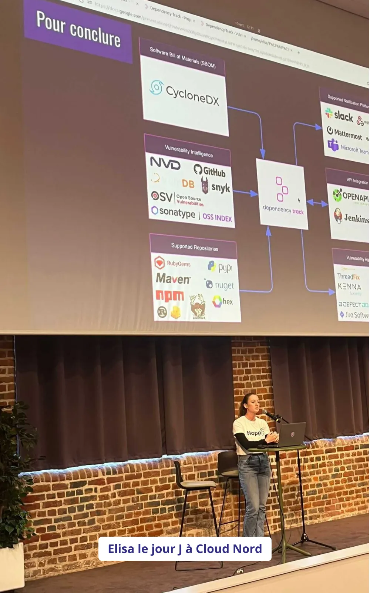

<!-- markdownlint-disable-file -->

Participer à une conférence en tant que speaker peut sembler intimidant, mais c’est aussi une expérience incroyablement enrichissante. C’est précisément pour aider celles et ceux qui souhaitent franchir ce cap et se lancer que le Ch’ti Tremplin a vu le jour : un programme qui accompagne six participants pendant plusieurs semaines pour les aider à affiner leur sujet, structurer leur talk, créer un support percutant et se préparer à parler devant un public.

A la précédente édition, 2 HoppRs ont participé au tremplin :  Elisa en tant que coachée pour son premier sujet "[À la découverte de Dependency Track](https://www.youtube.com/watch?v=8EN_hqU5zPU)" et Edouard en tant que coach. 
Petite interview pour vous partager leur expériences, les coulisses de cette expérience, les défis qu’ils ont relevés et les enseignements qu’ils en ont tirés 😄

## Retours de Elisa sur sa participation au Tremplin

### **Elisa : Qu'est-ce qui t’a donné envie de participer au Ch’ti Tremplin ? Pourquoi as-tu choisi de parler de "Dependency Track" ?**

Depuis que je participe à des conférences tech comme Cloud Nord ou le Devfest, j’ai toujours été admirative des speakers. Leur capacité à captiver une salle, à transmettre leur passion et à rendre des sujets complexes accessibles me fascinait. Mais honnêtement, je me disais que je ne serais jamais capable de faire la même chose. Monter sur scène et parler devant une audience me semblait hors de portée, presque inatteignable.

Quand on m’a présenté le Ch’ti Tremplin et qu’on m’a encouragée à tenter l’aventure, j’ai d’abord hésité. J’avais peur de ne pas être à la hauteur. Mais l’idée que ce concours offrait un cadre bienveillant et un accompagnement m’a rassurée. C’était une chance unique de sortir de ma zone de confort, tout en me sentant soutenue. Alors, je me suis dit : _"Pourquoi pas moi ? Si je ne tente pas maintenant, je ne le ferai jamais."_

Le choix de parler de Dependency-Track n’a pas été un hasard. J’ai eu la chance de travailler sur la mise en place de cet outil au sein de la forge de développement de Worldline, où il a révolutionné notre manière de gérer la sécurité. Grâce à Dependency-Track, nous avons pu analyser plus de 3 500 applications, détecter des vulnérabilités et prioriser efficacement leur résolution. Ce sujet me tenait particulièrement à cœur, car je sais à quel point la sécurité peut être perçue comme un casse-tête pour les développeurs. Avec cet outil, j’ai vu qu’il était possible de transformer une contrainte en une opportunité d’amélioration, sans friction excessive.

J’ai aussi choisi Dependency-Track pour une raison très pratique : je connaissais bien le sujet ! C’était un projet auquel j’avais directement contribué, ce qui me permettait d’en parler avec naturel, sans avoir à réciter un texte appris par cœur. Je savais que si j’avais le trac sur scène, je pourrais improviser plus facilement, en me basant sur mes propres expériences.

### **Elisa : Comment as-tu vécu les semaines de coaching ? Qu’est-ce qui a été le plus marquant ou le plus challengeant pour toi dans cette préparation ?**

J’ai découvert un monde que je ne connaissais pas : celui de la préparation d’un talk. On ne se rend pas compte du travail qu’il faut pour structurer un message, capter l’attention d’un public et transmettre des idées de manière claire et impactante.
Les semaines de coaching ont été une expérience à la fois enrichissante et exigeante, elles ont été rythmées par les répétitions en groupes restreints pour avoir des retours constructifs et enrichir ma présentation. 

En parallèle, mon coach m’a guidé avec des conseils précieux et des anecdotes issues de son expérience en tant que speaker. Toute cette organisation m’a beaucoup aidé à garder le cap et à prendre confiance en moi pour le jour J.

Le plus challengeant pour moi a été d’adopter un ton plus narratif dans ma présentation. La dernière chose que je souhaitais c’était de présenter mon sujet de manière trop scolaire et ennuyeuse. Parler en public, ce n’est pas juste transmettre des informations, c’est aussi raconter une histoire et donner des idées de réflexion pour que l’audience réagisse et en tire quelque chose. Mon coach m’a aidé à trouver un fil rouge auquel je pourrais aussi me rattacher pendant ma présentation.

### **Elisa : Qu’est-ce que cette expérience t’a apporté, que ce soit sur le plan personnel ou professionnel ? Y a-t-il quelque chose qui t’a surprise dans ton propre parcours ?**

Participer au Ch’ti Tremplin m’a fait grandir, tant sur le plan personnel que professionnel.

Sur le plan personnel, j’ai gagné en confiance en moi. Je me suis prouvée que je pouvais non seulement partager mes idées devant un public, mais aussi captiver et intéresser des gens avec un sujet qui me tient à cœur.

Sur le plan professionnel, cette expérience a renforcé ma capacité à vulgariser des sujets techniques. Cela m’a aussi ouvert de nouvelles perspectives : aujourd’hui, je me sens plus à l’aise pour participer à d’autres conférences. 

Enfin, cette aventure m’a permis de rencontrer des personnes incroyables, toutes animées par l’envie de partager leurs connaissances.

### **Elisa : Si tu devais donner un conseil à quelqu’un qui hésite à se lancer dans une aventure comme le Ch’ti Tremplin, que lui dirais-tu ?**

Si vous hésitez à participer à une aventure comme le Ch’ti Tremplin, je n’ai qu’un conseil : foncez ! Oui, c’est un défi. Oui, cela demande du travail. Mais les bénéfices que vous en tirerez en valent largement la peine.

Vous n’avez pas besoin d’être parfait⋅e ou "expert⋅e" pour vous lancer. Ce qui compte, c’est d’avoir envie de partager quelque chose qui vous tient à cœur. Et surtout, vous ne serez pas seul⋅e. Le cadre bienveillant et l’accompagnement proposé vous aideront à progresser à chaque étape. Le plus dur, c’est de faire le premier pas et d’oser.

## Retour d’Edouard sur son rôle de coach

### **Edouard : Qu’est-ce qui t’a motivé à devenir coach pour le Ch’ti Tremplin ? Et qu’as-tu pensé du sujet d’Elisa, "Dependency Track" ?**

J’aime beaucoup accompagner les gens dans la prise de parole car c’est un domaine que j’affectionne particulièrement. Le sujet d’Elisa était l’occasion de remettre en perspective le travail du développeur vis à vis de son outillage. C’est une passerelle parfaite entre le monde du développement et le monde du cloud & devops.

### **Edouard : Comment as-tu accompagné Elisa dans la structuration de son talk ? Quels ont été, selon toi, les plus grands progrès qu’elle a réalisés pendant ces semaines ?**

En réalité, Elisa n’a eu aucune difficulté à définir un plan. Ce qui lui manquait surtout, c’était l’_histoire_, ce fil conducteur qui permet à l’audience de comprendre le déroulé sans effort et de s’ancrer dans une situation qui peut lui arriver. 

L’effort était à mettre sur sa démo live, qui d’après moi était plus importante que ses slides.

### **Edouard : Qu’est-ce que cette expérience t’a apporté en tant que coach ? As-tu découvert ou renforcé certaines compétences ?**

Je dirais que cette expérience va dans la continuité de mon rôle de Head of Craft chez HoppR. J’ai pu transmettre mes connaissances et mes expériences en toute bienveillance et sans chercher à être le coach “héros” que l’on peut voir dans certains films.

### **Edouard : Quel conseil donnerais-tu à quelqu’un qui souhaiterait devenir coach pour une aventure comme le Ch’ti Tremplin ?**

Pourquoi la personne souhaite elle devenir speaker ? Qu’est-ce qui la satisferait dans l’idée de monter sur scène et de présenter son sujet ?

C’est pour moi des questions fondamentales que doit se poser un speaker, et donc son coach. Grâce à ça, le coach peut accompagner le coaché dans le format de la présentation ainsi que son contenu.

## **Alors, qu’attends-tu pour te lancer ?** 

Le Ch’ti Tremplin est une opportunité unique de te préparer à devenir speaker, dans un cadre bienveillant et avec l’accompagnement personnalisé d’un coach dédié. Que tu sois passionné⋅e par le développement logiciel, le DevOps ou le Cloud, ou que tu souhaites simplement partager une idée qui te tient à cœur, ce programme est fait pour toi.

En plus, lors de la soirée finale, le public choisira deux talks qui seront sélectionnés pour le programme de **DevLille** les 12 et 13 juin, et un talk qui rejoindra celui de **Cloud Nord** en octobre à Euratech. Une belle manière de débuter sur scène devant une audience tech !

Ne réfléchis pas trop longtemps : [Les candidatures sont ouvertes jusqu’au 15 février](https://forms.gle/pvgu9tSFGSkumY3B7), alors fonce ! 😉

