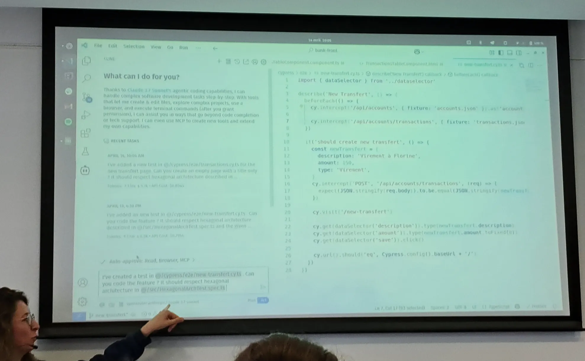
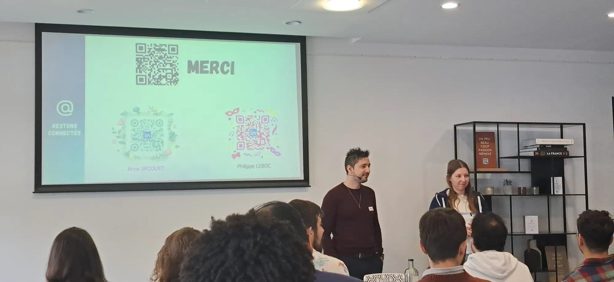

<!-- markdownlint-disable-file -->

Retour sur la conférence Lyon Craft 2025 qui s’est déroulée le lundi 14 Avril 2025. Au programme, comme l’indique la conférence elle-même : “**Des passionné·e·s, des ateliers, des présentations et… c’est déjà pas mal !”**

Une journée sur le thème du [Software Craftsmanship](https://manifesto.softwarecraftsmanship.org/) donc, dans l’optique d’apprendre ou de se perfectionner dans ces thématiques avec des experts locaux. Après une séquence d’introduction et de remerciement des sponsors (dont [HoppR](https://www.hoppr.tech/) qui était VIP), une vingtaine de sessions, couvrant talks et workshops (et même une table ronde) étaient proposées.

Je vous propose de revenir avec moi sur les sessions auxquelles j’ai assisté, en commençant dans cet article par celles du matin.

## IA Générative, TDD et Architecture Hexagonale : Une Synergie Révolutionnaire ?

_Par Florine CHEVRIER et Clément VIRIEUX_

[Lien vers la conférence](https://lyon-craft.fr/sessions/ia-generative-et-architecture-hexagonale-une-synergie-revolutionnaire.html)

Pour bien démarrer la journée, Florine et Clément nous proposent de réaliser un kata avec l’IA. Nous sommes donc directement plongés dans les sujets en vogue du moment.

L’idée ici : faire du TDD avec une IA en lui fournissant les éléments nécessaires pour développer une nouvelle fonctionnalité dans un projet front. Le contexte : nous avons une application bancaire très simple, et nous souhaitons mettre en place une fonctionnalité “nouveau virement” avec un bouton dédié.

Pour ce faire, trois outils seront utilisés ici :

- [Cline](https://github.com/cline/cline), un agent IA qui vient s’intégrer à Visual Studio Code

- [Claude 3.7 Sonnet ](https://www.anthropic.com/claude/sonnet), l’IA spécialisée dans le codage derrière Cline

- [Open Router](https://openrouter.ai/), pour pouvoir switcher d’IA et être à l’état de l’art ou contrôler les coûts

À présent, comment communiquer avec cette IA ? Pour développer, elle va se baser sur un prompt indiquant :

- Des contraintes d’architecture, sous forme de tests. Nous souhaitons ici obliger l’IA à suivre une [architecture hexagonale](https://fr.wikipedia.org/wiki/Architecture_hexagonale) déjà en place

- Une capture d’écran d’une maquette Figma faite par un UX/UI

- Des tests Cypress, pour définir les règles de gestion fonctionnelles, et qui seront à la base de notre TDD. À noter que ces tests auraient été rédigés également pour un développement par un humain

Cline va ainsi d’abord passer une première phase **PLAN**, pour indiquer ce qu’elle souhaite mettre en place, ainsi qu’une estimation des coûts de l’API. C’est une sorte de dry run si l’on veut. Ensuite, il sera temps de passer à la seconde phase **ACT**, où l’IA va réellement coder pour nous.

À noter que Cline peut apprendre de ses erreurs. De nouvelles règles sont ajoutées au fur et à mesure dans un fichier _.clinerules_, un fichier texte lisible également par l’humain. Ici, ce sont les développeurs qui demandent à Cline de les ajouter quand ils sont confrontés à une erreur de l’IA.

Revenons à notre démonstration. Nous sommes ici plus sûr du test-first que sur du TDD en réalité, mais l’IA traite le prompt. Surprise (effet démo), Cline oublie lors de la présentation d’ajouter le bouton alors qu’il a développé la fonctionnalité. Les tests Cypress ne passent pas. Au deuxième essai, plus de problème, l’IA se base sur ce qu’elle peut lire dans le terminal, et est satisfaite de son travail : les tests Cypress passent. Effectivement, le bouton et la fonctionnalité sont présents et correspondent à l’attendu.(

Maintenant, Florine et Clément demandent à l’IA de développer la suite de la fonctionnalité : le formulaire du virement. Même principe : tests Cypress correspondants + capture d’écran en maquette. Les fonctionnalités sont présentes et tout fonctionne, le respect de la maquette est par contre très approximative, une problématique a priori très présente avec ce genre d’outils.

C’est d’ailleurs un bon point de ce talk, nos deux speakers restent critiques par rapport aux outils d’IA qu’ils utilisent. La démonstration est bluffante de rapidité, l’API de l’IA n’a coûté que 1,5$ pour cette démo. Mais le code, bien que répondant aux critères évoqués, n’est pas à la qualité d’un bon développeur humain. D’ailleurs, au quotidien, l’équipe laissent à Cline les droits de lecture, mais l’écriture passe par une validation manuelle. Et il y a d’autres subtilités à connaître qui viennent avec l’expérience de l’outil (_clinerules_, mauvaise gestion des erreurs, erreurs de compréhension de la maquette, gestion de la _context window_, etc.).

## The choice must go on, mais le bon de préférence

_Par Céline LOUVET_

[Lien vers la conférence](https://lyon-craft.fr/sessions/the-choice-must-go-on.html)

Un sujet qui a été, est et sera toujours d’une importance capitale pour un projet, quelque soit le domaine : comment faire le bon (ou le moins pire) choix pour un projet ?

Tout d’abord, Céline nous confie la définition du projet réussi. Pour les décideurs, le respect du budget, du délai et la satisfaction utilisateur sont les principales métriques permettant de jauger la réussite du projet. À cela viennent s’ajouter, concernant les développeurs, leur bien-être et la maintenabilité du projet.

Viennent ensuite quelques chiffres issus du [CHAOS report](https://file.notion.so/f/f/5863e833-64f2-4f13-9f7a-2c92c72b5bbf/ce54b1c6-d205-4f58-b57c-a0c9c377767e/CHAOSReport2015_rev.pdf?table=block&id=1dcf4462-cd38-80cf-9017-e873e03fa39b&spaceId=5863e833-64f2-4f13-9f7a-2c92c72b5bbf&expirationTimestamp=1745280000000&signature=PgRSPuAWReZL_sg2opmSPe1NqAHZsjtjcJLHQEb-fs4&downloadName=CHAOSReport2015_rev.pdf) : 

- Le budget est respecté à 44%, le délai à 40%, le périmètre à 56%

- Les projets réussissent à 36%, sont en difficulté à 45% et échouent à 19%

10 facteurs de mise en difficulté sont ainsi identifiés, dont on ressortira par exemple les **besoins flous**, et le **choix de technologies non maîtrisées**.

Première piste pour expliquer ces problématiques, les besoins flous. Se basant sur une expérience personnelle, Céline nous évoque un cas courant : l’expression d'une solution à la place du besoin. Comment s’en sortir dans ce cas ? En utilisant par exemple la fameuse technique des [cinq pourquoi](https://fr.wikipedia.org/wiki/Cinq_pourquoi).

Ainsi, la demande “j’ai besoin d’un bouton pour télécharger un CSV” est devenue une page web dynamique avec des données financières et un envoi de mail avec cette même page en lien.

Également, attention à ne pas créer de faux besoins ([Problème XY](https://fr.wikipedia.org/wiki/Probl%C3%A8me_XY)), à identifier l’inconnu (ce qui manque de clarté) et à se concentrer sur le futur proche (plus on anticipe, plus c’est flou).

On se concentre ainsi sur la valeur à apporter, avec des critères d’acceptation par exemple, et on identifie ainsi les objectifs à atteindre tout en prenant compte des contraintes impossibles à ignorer (budget, temps, réglementation, etc.).

Il faut connaître l’existant (technologies, équipe, méthodes, dettes, etc.), et mettre par exemple en place un _tech radar_, comme celui de [Zalando par exemple](https://opensource.zalando.com/tech-radar/). De même, on pourra mettre en place des [golden paths](https://www.redhat.com/fr/topics/devops/golden-paths) pour répondre aux besoins les plus communs. Gardons en tête, comme Céline nous le répétera tout au long de son talk, qu’il n’y a pas de _silver bullet (”_[_No Silver Bullet_](https://fr.wikipedia.org/wiki/Pas_de_balle_en_argent)_”)_, c’est-à-dire pas de solution miracle.

Trois complexités sont ici représentées :

- Essentielle, ce qui a trait au problème à résoudre

- Obligatoire, liée à la technologie (et donc à un choix)

- Accidentelle, liée à de mauvaises décisions (et donc à un choix)

Nous avons la main sur les deux dernières, qu’il nous faudra viser à réduire. 

Un conseil : tous les choix devraient être tracés dans des _decisions records_ (comme les [ADR par exemple](https://adr.github.io/)) pour y expliquer les raisons du choix, et capitaliser sur ces décisions.

## [REX] Le craft en startup

_Par Anne JACQUET et Philippe LEBOC_

[Lien vers la conférence](https://lyon-craft.fr/sessions/rex-le-craft-en-startup.html)

Anne et Philippe travaillent actuellement dans la start-up [Auxo](https://www.auxodynamics.com/), fondée il y a quasiment deux ans (à peine moins âgée que [HoppR](https://www.hoppr.tech/)). Le produit proposé accompagne la transformation durable des entreprises, à partir de leurs données financières et opérationnelles. L’équipe technique se compose d’une dizaine de personnes développant le produit. Les technologies employées : Java / SpringBoot, Vue.js et AWS.

Nos deux speakers sont les deux développeurs backend de l’équipe. Ils commencent par nous faire un rappel de certains concepts :

- Monolithe / Monolithe distribué / Microservices / Nanoservices

- Synchrone / Asynchrone

La solution technique est ici partie sur des microservices asynchrones, qui échangent des messages via Kafka. Mais un des microservices a ensuite nécessité des appels synchrones, nous sommes donc ici sur un mix des deux. Les microservices partagent tous une “shared library” commune, contenant de la configuration, des briques techniques, des concepts métier partagés, etc.

Nous passons ensuite en revue de nombreux concepts mis en place sur leur produit, dont certains biens connus des crafteurs : 

- Architecture hexagonale

- Pyramide de tests : Unitaire > Intégration > Comportement ([Cucumber](https://cucumber.io/)) > End-to-end

- Respect des principes REST (PUT vs PATCH par ex.) et comment cela est mis en place (idempotence, pagination, etc.)

- [OpenAPI](https://www.openapis.org/), contrats entre front et back

- Assertions dans le domaine, exceptions dans le domaine traduites ensuite et renvoyant un statut HTTP adéquat

- Annotations Java pour valider request body, query parameters et path parameters

- [Optimistic lock](https://en.wikipedia.org/wiki/Optimistic_concurrency_control) pour des questions de performance

Au final, Anne et Philippe font ici un tour complet de tout ce qui a été mis en place pour assurer la qualité du produit et de son implémentation technique. On voit ici que tout ce qui a été mis en place l’a été pour une bonne raison. Ces conseils ne sont d’ailleurs pas spécifiques à un contexte de startup.

## Fin de cette matinée

Après cette belle matinée et tous ces concepts craft abordés, la faim se fait sentir, et il est temps pour tout le monde de profiter d’un déjeuner bien mérité.

Je vous propose de continuer ce retour de conférence dans un second article à paraître, où nous parlerons front, regard scientifique et… Smalltalk !

