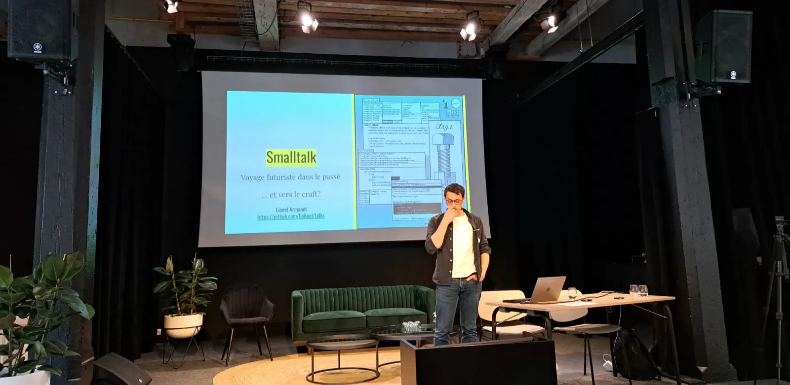
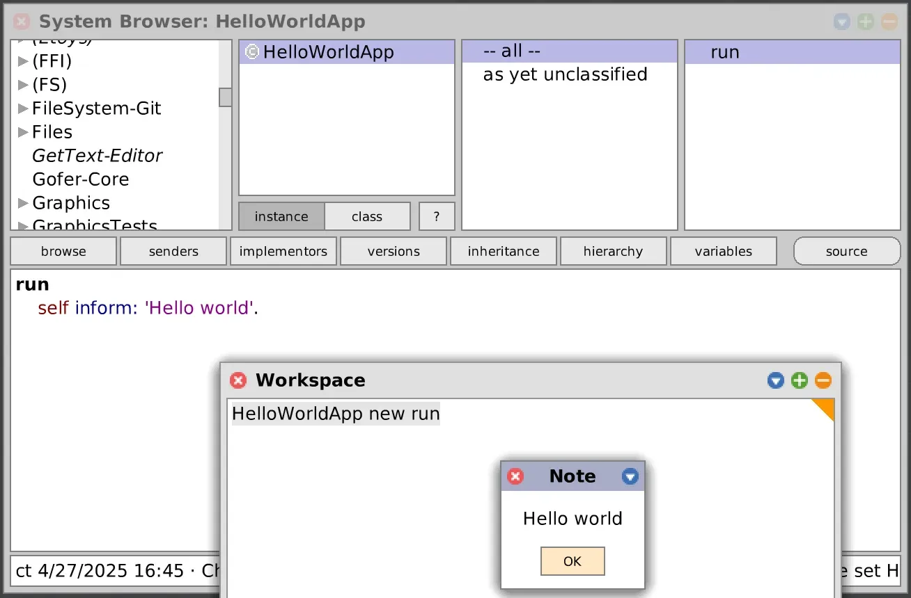
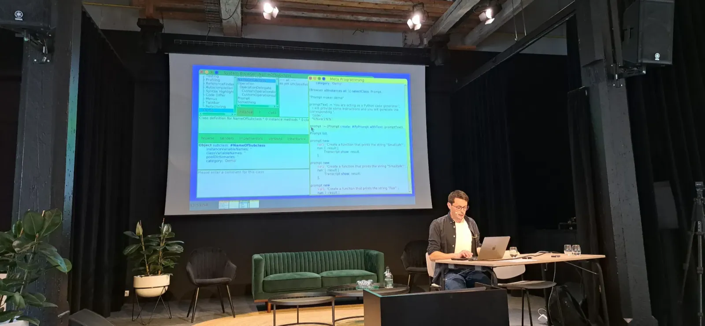
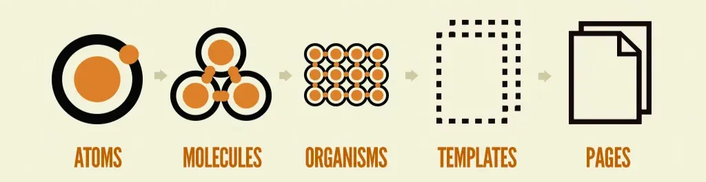
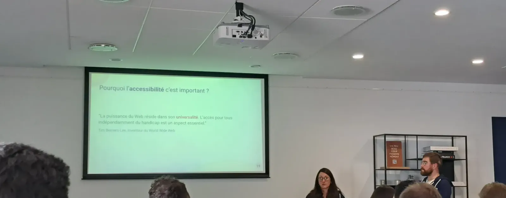
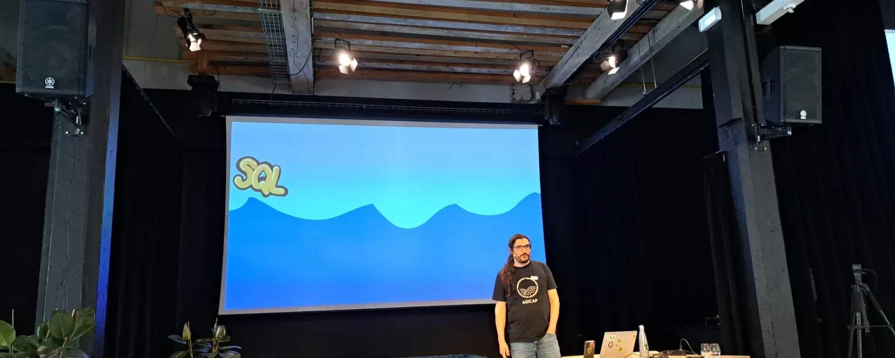
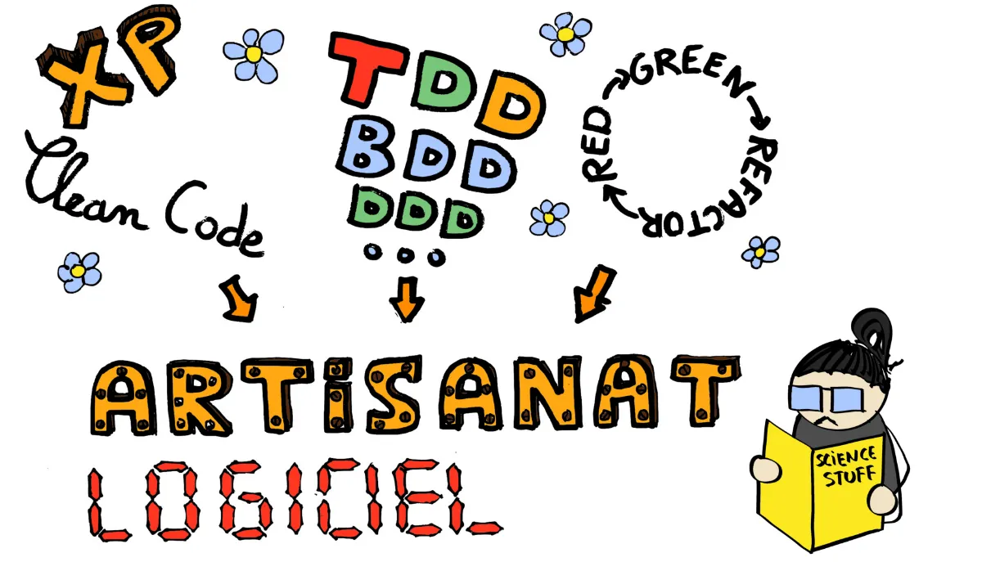

<!-- markdownlint-disable-file -->

Cet article est la suite de [mon retour sur Lyon Craft](https://blog.hoppr.tech/blogs/2025-04-24-lyon-craft-2025-12). Dans cette première partie, nous avions couvert les talks auxquels j’ai eu la chance d’assister dans la matinée. Place maintenant à un après-midi de Craft !

## Smalltalk, voyage futuriste dans le passé !

_Par Lionel ARMANET_

[Lien vers la conférence](https://lyon-craft.fr/sessions/smalltalk-voyage-futuriste-dans-le-passe.html)

Tout commence par une discussion entre Lionel et un de ses collègues. Celui-ci vient pour son premier jour avec un livre, [Coder Proprement](https://www.babelio.com/livres/Martin-Coder-proprement/125763) de Robert C. Martin. Lionel parcourt ce livre, un classique du Craft, revient vers son collègue et lui dit "_ton bouquin, c'est mon cours de Smalltalk de l'école_".

S’en suit une plongée dans les années 70, au Xerox PARC _(Palo Alto Research Center)_. Les créateurs de l’ordinateur [Xerox Alto](https://fr.wikipedia.org/wiki/Xerox_Alto), un des premiers ordinateurs présentant une interface graphique, inventent le langage [Smalltalk](https://fr.wikipedia.org/wiki/Smalltalk).

Ce langage est le premier à utiliser les concepts clés de la [POO](https://fr.wikipedia.org/wiki/Programmation_orient%C3%A9e_objet). L’idée sous-jacente est une métaphore du monde qui nous entoure, des objets et de leurs interactions. Les concepts objet ici :

- Encapsulation

- Envoyer un message

- Recevoir un message

Le Smalltalk est compilé en _bytecode_ et interprété par une machine virtuelle, pour plus de portabilité. Jusque là, les amateurs de Java ne sont pas surpris. Et pour cause, Java s’inspire de Smalltalk !

Il est à noter que Smalltalk avait pour but de pouvoir être simple à apprendre (par des enfants par exemple), et à se rapprocher au plus du langage anglais naturel. En Smalltalk, on écrit plus qu’on ne code, et on finit nos instructions par un point.

Pour finir l’histoire, la Xerox Alto est un échec commercial. Steve Jobs ayant visité le Xerox PARC, reprendra l’interface graphique pour créer l’Apple Lisa puis les Macintosh, et l’Objective-C comme successeur au Smalltalk.

Place maintenant à une démonstration de Smalltalk en live avec Lionel. Il utilise ici [CUIS](https://fr.wikipedia.org/wiki/Cuis_Smalltalk), et nous parle également de [Pharo](https://fr.wikipedia.org/wiki/Pharo). En effet, une communauté Smalltalk existe toujours pour garder le langage vivant.

En Smalltalk, tout est objet, et tout peut se réécrire. La [métaprogrammation](https://fr.wikipedia.org/wiki/M%C3%A9taprogrammation) y est monnaie courante, et l’IDE lui-même (écrit en Smalltalk également) peut-être modifié. Ici, pas de [sucre syntaxique](https://fr.wikipedia.org/wiki/Sucre_syntaxique), pas d’[instruction conditionnelle](https://fr.wikipedia.org/wiki/Instruction_conditionnelle_(programmation)), mais du typage dynamique, des [BlockClosures](https://www.gnu.org/software/smalltalk/manual-base/html_node/BlockClosure.html) (équivalent de lambdas en Java par exemple) qui sont eux-mêmes des objets manipulables.

Lionel nous fait naviguer sur des concepts simples, comme les objets [Boolean](https://www.gnu.org/software/smalltalk/manual-base/html_node/Boolean.html) et [MessageNotUnderstood](https://www.gnu.org/software/smalltalk/manual-base/html_node/MessageNotUnderstood.html) (erreur de fonction introuvable). Etant des objets comme les autres, tous deux pouvant être également réécrits  !

La notion de test n’est pas présente à cette époque, mais il est quand même possible d’y faire une sorte de TDD. Smalltalk s’écrit en [top-down](https://fr.wikipedia.org/wiki/Approches_ascendante_et_descendante) et avec une approche très itérative en _baby steps_ et _red/green/refactor_.

Il nous est montré ici à quel point Smalltalk se veut _simple & fluent_, se rapprochant vraiment de notions telles que le _clean code_. D’ailleurs, le livre [Design Patterns](https://fr.wikipedia.org/wiki/Design_Patterns) de 1994 donne des exemples en Smalltalk.

En conclusion, nous pouvons effectivement faire un parallèle entre les années 70 et maintenant. Beaucoup de concepts qui nous semblent novateurs de nos jours sont en fait tirés ou inspirés d’une époque très lointaine de la programmation. Lionel nous indique trois points qui en découlent :

- Changer l’anormal (remettre en question les choix, les paradigmes et langages utilisés)

- Apprendre de tous (attention à une potentiel hiérarchie entre les développeurs)

- Apprendre du passé (se baser sur toutes les connaissances du passé)

_Pour plus d’informations, voici un podcast où_ [_Lionel parle de Craft et de Smalltalk avec Sylvain/PunkinDev_](https://podcast.ausha.co/punkindev/s05e10-aux-origines-du-craft-et-de-tdd-smalltalk-avec-lionel-armanet)_._

## Du Style au sein du Craft

_Par Aurélie BRACCO et Arnaud FREISMUTH_

[Lien vers la conférence](https://lyon-craft.fr/sessions/du-style-au-sein-du-craft.html)

Aurélie et Arnaud, tous deux développeurs front, sont venus nous parler de concepts craft… graphiques !

Tout d’abord, nous assistons à une présentation de plusieurs concepts bien connus des devs front, comme par exemple le [Design System](https://fr.wikipedia.org/wiki/Syst%C3%A8me_de_design), comprenant les blocs de construction et normes à adopter pour un projet / une organisation. Les avantages : cohérence de produit et de marque, collaboration simplifiée, temps de conception diminué, et même une amélioration de l’accessibilité, dont on parlera juste après.

Ce Design System est composé d’un _styleguide_, un document qui définit des règles et bonnes pratiques. Il permet une communication visuelle cohérente à l’entreprise/au projet, et comprend également une charte éditoriale, permettant de savoir à quel public on s’adresse et comment.

Aurélie et Arnaud nous montrent un exemple sur [Figma](https://www.figma.com/), où sont également définis les couleurs primaires/secondaires et leurs teintes, la typographie, les [radius](https://www.w3schools.com/css/css3_borders.asp), les [shadows](https://www.w3schools.com/css/css3_shadows.asp), etc. qui seront utilisés sur le projet.

Parlons maintenant [Atomic Design](https://bradfrost.com/blog/post/atomic-web-design/), ce concept structure les interfaces en composants réutilisables, des plus simples (atomes) aux plus complexes (pages), pour une conception modulaire et cohérente.

Dans cette optique, nous pouvons également ajouter la notion de _quarks_, encore plus petits que l’atome et inutilisables seuls (par exemple une couleur). L’ensemble de ces éléments est trouvable sur la _pattern library_ qu’Aurélie et Arnaud nous présentent alors.

Pour la suite de la démonstration, les deux développeurs nous embarquent sur la création d’un composant accordéon, que nous allons ajouter à leur _component library_ (regroupant et standardisant les différents composants graphiques utilisables sur le projet).

> 💡 Si vous ne savez pas ce qu’est un accordéon, ou que vous voulez jeter un œil au _Système de Design_ de l’Etat, vous pouvez aller voir [l’accordéon des sites gouvernementaux ici](https://www.systeme-de-design.gouv.fr/composants-et-modeles/composants/accordeon/).

Nous assistons donc à une démonstration sur [Tikui](https://tikui.org/) (projet Open Source). Cette solution s’appuie sur [Pug](https://pugjs.org/api/getting-started.html), qui permet du templating minimaliste traduisible en HTML. L’accordéon est créé, puis ensuite un groupe d’accordéons.

Dans une appli Vue, on récupère ensuite tout simplement la _pattern library_ provenant de Tikui, et l’organisme “groupe d’accordéons” précédemment créé. Et nous voici avec notre composant injecté sur notre application.

S’en suit un focus sur l’[accessibilité numérique](https://accessibilite.numerique.gouv.fr/obligations/notions-accessibilite-numerique/), un élément ô combien important. Situation de handicap, connexion lente, matériel ancien ou défectueux, environnement défavorable, les problématiques potentielles d’utilisation d’un produit numérique ne manquent pas. C’est au développeur front qu’incombe la responsabilité de ne pas créer l’inaccessibilité du web.

Quelques pistes pour améliorer l’accessibilité numérique de votre produit :

- conformité aux normes HTML/W3C,  utilisation correcte des balises sémantiques et des attributs aria

- tester la navigation clavier

- tests avec lecteur d'écran

- responsivité et zoom du texte jusque 200%

- tests sur différents navigateurs

Aurélie et Arnaud font ici un test avec un lecteur d’écran. Celui-ci démontre que notre accordéon n’est pas encore accessible : le lecteur d’écran ne sait pas si celui-ci est ouvert ou fermé, ce qui n’est pas pratique. Les deux développeurs ajoutent donc l’attribut [aria-expanded](https://developer.mozilla.org/en-US/docs/Web/Accessibility/ARIA/Reference/Attributes/aria-expanded) pour déterminer le statut de l’accordéon, et le tour est joué !

La conclusion donnée ici est un lien avec le Craft, et notamment avec le [TDD](https://fr.wikipedia.org/wiki/Test_driven_development) : le cycle _red >_ _green >_ _refactor_ est ici remplacé par un cycle structure (HTML) > style (CSS) > refacto (qualité, accessibilité).

## [Conférence dessinée] Regard scientifique sur l'artisanat logiciel

_Par Victor LAMBRET (_[_boringdev.eu_](https://vlambret.github.io/)_)_

[Lien vers la conférence](https://lyon-craft.fr/sessions/regard-scientifique-sur-l-artisanat-logiciel.html)

En avant pour une conférence dessinée, Victor nous illustrant ses propos avec des dessins faits maison. Nous allons ici bien sûr parler de Craftsmanship, ou en français d’_artisanat logiciel_.

Cet artisanat logiciel, ces concepts, méthodes et outils pour mieux faire, est-ce que cela compte réellement ? Est-ce simplement une accumulation d’effets de mode ? Ne pas faire de Craft conduit-il forcément à l’échec, est-ce si manichéen ? Pour s’en assurer, rien de mieux que de se référer aux études scientifiques.

Par exemple, Robert C. Martin, dans son livre [Coder Proprement](https://www.babelio.com/livres/Martin-Coder-proprement/125763) (déjà cité plus haut dans cet article, décidément) nous indique que la taille des fonctions est une donnée importante pour jauger la qualité d’un code. En effet, on peut trouver cette citation dans son ouvrage :

> The first rule of functions is that they should be small. The second rule of functions is that they should be smaller than that.

Écrire de plus petites fonctions permettrait de simplifier la programmation. Mais est-ce aussi évident ? Dans un exemple sur du Fortran datant de 83, plus le module était grand, plus le nombre de bugs par ligne était petit, rentrant en contradiction avec Robert C. Martin.

Pour du plus récent et complet, une étude de 2016 compare deux équipes (que je nommerai ici A et B pour que ce soit plus simple). L’équipe A part avec une base de code, une équipe B avec une version “améliorée” respectant le _Clean Code._ Le résultat ? En moyenne, A arrive plus facilement à ajouter une fonctionnalité sur son code, B à refactorer, et des bugs furent trouvés beaucoup plus rapidement par l’équipe A. Conclusion : a priori, pas de bénéfice de _Clean Code_ sur la compréhension d’un code par des développeurs.

C’est au tour du TDD de passer à la loupe de Lionel. Une première [méta-analyse](https://fr.wikipedia.org/wiki/M%C3%A9ta-analyse) nous indique une tendance : le TDD serait positif pour éviter/corriger les bugs, mais en contre-partie la productivité serait impactée négativement. Mais il est compliqué de statuer de manière très claire avec les études industrielles.

IBM et Microsoft ont mené des études comparatives, sur des projets en parallèle. Une équipe utilisait le TDD, systématiquement, l’autre était un groupe contrôle. Là aussi, le temps passé était plus important du côté de l’équipe en TDD (+20% en moyenne), mais le nombre de bugs bien inférieur (de -40% à -90%).

Mais ces études ne portent pas de conclusion clair sur l’efficacité de la pratique du TDD. En effet, ces bugs auraient pu être trouvés par l’équipe de QA, et la notion de TDD dépend parfois d’une équipe, d’un projet, d’une étude à l’autre. De plus, l’échantillon est trop faible : par exemple seuls 0,8% des repos Java hébergés sur GitHub feraient du TDD.

Enfin, Lionel nous évoque une comparaison réalisée entre TDD et ITL (_Iterative Test Last_, que l’on pourrait également qualifier de _reverse TDD_), dans différents contextes, qu’ils soient universitaires ou professionnels, sur des katas bien connus. Les conclusions :

- pas de grandes différences sur étudiants vs professionnels

- pas de grandes différences entre les différents langages de projets

- la qualité est légèrement meilleure pour l’ITL, mais pas de manière significative.

On peut en conclure que les deux sont globalement équivalents, et que la qualité vient surtout des concepts de feedback régulier, de refactoring continu, et bien sûr des tests à l’origine de ces deux méthodologies.

En conclusion du talk, Lionel nous conseille de ne pas hésiter à attaquer nos croyances. Tout dépend du contexte et des conditions des projets sur lesquels nous intervenons.

## Conclusion

Après toutes ces conférences, j’ai eu la chance d’assister à une très intéressante [table ronde sur le sujet de l’image du Craft](https://lyon-craft.fr/sessions/podcast.html) (à retrouver également en [podcast chez PunkinDev](https://podcast.ausha.co/punkindev/s05e14-liveatlyoncraft-table-ronde-sur-l-image-du-craft)), un sujet dont nous pourrons discuter à l’avenir dans un autre article.

En somme, le bilan de la journée est très positif, et j’en tire beaucoup d’informations et de réflexions sur le sujet du Software Craftsmanship. Je participerai avec plaisir à l’éventuelle prochaine édition.

Les conférences ont été enregistrées et sont retrouvables sur le [YouTube de Software Crafters Lyon](https://www.youtube.com/@softwarecrafterslyon9383), où vous pourrez également visionner tous les talks dont je n’ai pas pu parler sur ce blog.

Merci de votre lecture et à très bientôt sur ce blog pour reparler de Craft et de plein d’autres belles choses ! 

