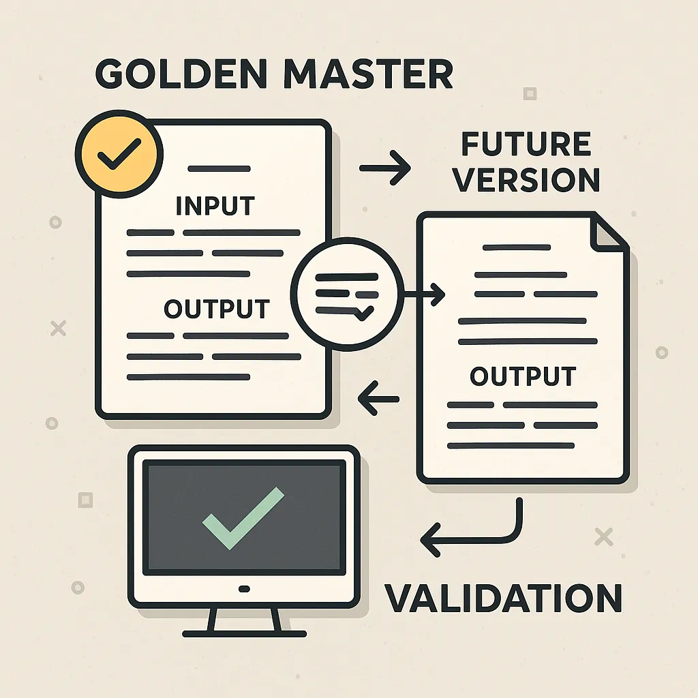

<!-- markdownlint-disable-file -->

# Refactorer sans casser : le Golden Master
appliqué à un outil FinOPS

Refondre un outil critique sans casser l’existant ? Pas simple.
La mission était claire : continuer à faire évoluer la solution FinOPS de notre client tout en garantissant que chaque chiffre affiché reste juste. Parce qu’ici, une erreur, ça ne se compte pas en lignes de code… mais en euros.

Pour sécuriser le projet, Théo Lanord, consultant et développeur Full Stack chez HoppR, a choisi une arme simple et efficace : le Golden Master. Une pratique Craft qui n’est pas systématiquement utilisée, mais qui peut sauver un projet. On lui a demandé : pourquoi cette méthode, et qu’est-ce que ça change concrètement ?

## Théo, c’était quoi le contexte quand tu es arrivé sur le projet ?

**Théo :**
_« J’ai rejoint l’équipe tech d’un acteur majeur de la distribution présent dans plusieurs pays, qui développe et maintient des outils internes pour les entreprises du groupe. Leur mission est de fournir des services fiables et industrialisés à toutes les équipes de développement du groupe, pour qu’elles puissent livrer rapidement et en toute sécurité._

_Pour ça, on s’appuie sur un écosystème_ allant de _GitHub pour le versioning, GitHub Actions pour automatiser les déploiements, SonarQube pour analyser la qualité du code, Ghas pour la sécurité, JFrog pour gérer les images, Jira pour le suivi et enfin Confluence pour la doc. Bref, un environnement complet mais complexe, où tout doit s’enchaîner sans faille._

_Dans ce contexte, l’outil FinOPS est un produit clé. Il analyse la consommation des ressources Cloud et la traduit en euros permettant aux différentes entités du groupe de savoir combien elles dépensent et sur quoi. L’enjeu est fort_ puisque chaque entité _a ses propres projets, ses propres besoins, et doit pouvoir maîtriser ses coûts._

_Avant, il y avait un budget global pour tout le monde. Aujourd’hui, on est dans une logique de refacturation interne par Business Unit. Ça change tout : chaque équipe doit rendre des comptes et optimiser sa consommation. Et cet outil est le cœur de ce pilotage. »_

## Où se situait le challenge principal ?

**Théo :**
_« Le problème, c’est que l’entreprise utilisait déjà un outil FinOPS au quotidien. Mais on devait le faire évoluer sans compromettre son fonctionnement actuel. Or, il y avait peu de tests automatisés pour garantir que les comportements en place resteraient corrects._

_Quand tu touches à un code hérité sans filet de sécurité, chaque modification est un pari risqué. Tu peux introduire des régressions invisibles… qui auront un impact direct sur la facturation et les arbitrages budgétaires. Et là, l’erreur ne se compte pas en millisecondes de temps de calcul mais en milliers d’euros. »_

## Pourquoi avoir choisi le Golden Master ?

_« Parce qu’on avait besoin de figer le comportement actuel avant d’aller plus loin. Le Golden Master, c’est une pratique simple mais redoutablement efficace :_

- _On capture l’existant en enregistrant les entrées et sorties du système._

- _On crée une “photo” de référence qui servira de point de comparaison._

- _À chaque évolution, on compare les résultats à cette référence pour détecter toute régression.
En clair, c’est comme mettre un miroir en face du logiciel : tant que l’image reste identique, tu sais que tu n’as rien cassé. Ça nous a permis de refactorer, modulariser et optimiser le code en toute sérénité, sans réécrire tout le produit. »_

👉 **Pour résumer**, on peut définir le Golden Master comme une méthode de validation utilisée principalement dans les tests de non-régression. Elle consiste à conserver une version de référence du comportement attendu d’un système – souvent sous forme de données d’entrée et de sortie – afin de pouvoir comparer automatiquement les résultats des versions futures et garantir qu'aucune modification n’altère le fonctionnement prévu.

## La méthode du Golden Master est parfois critiquée. Était-elle la meilleure solution dans ce contexte ?

_« Si tu pars from scratch, tu peux faire autrement. Mais dans une situation comme celle-ci, un outil critique, déjà en production, avec des impacts financiers, c’est une assurance vie. Le Golden Master, c’est comme mettre un filet sous un funambule : tu avances serein, tu sais que même si tu tombes, tu ne te blesseras pas._ 

_A noter que ça ne remplace pas les tests unitaires ni le TDD. Ça vient en complément, comme un filet de sécurité quand tu n’as pas d’historique fiable. Et ça s’inscrit parfaitement dans une logique Craft : on ne fait pas de la qualité “pour faire joli”, on le fait pour apporter de la confiance et réduire le risque métier. »_

**👉 Le Golden Master en 3 points clés :**

- **Objectif :** prévenir les régressions dans un code hérité.

- **Quand l’utiliser :** reprise de legacy sans confiance dans les tests actuels.

- **Limite :** il ne valide pas la justesse métier, mais garantit la stabilité des comportements existants.

## Et concrètement, quel a été l’impact pour le client ?

_« On a pu faire évoluer le produit plus efficacement, avec moins de stress, parce qu’on savait qu’on ne casserait rien d’essentiel. L’équipe a gagné en sérénité, le client en fiabilité. Et au-delà de la technique, ça a changé notre posture en tant que consultant et celle de notre client en tant qu’utilisateur: on peut refactorer en toute confiance, innover sans risquer de mettre en péril la facturation. »_

## Si tu devais résumer, pourquoi le Craft est indispensable dans ce genre de projet ?

**Théo :**
_« Parce que ça crée de la confiance. Pour les devs, qui savent qu’ils peuvent intervenir sans crainte. Pour le client, qui sait que son outil critique ne tombera pas à cause d’une évolution mal contrôlée. Et cette confiance, ça se traduit par plus de qualité, plus de sérénité et plus de vitesse. »_

Chez HoppR, on croit que la qualité n’est jamais un luxe, mais une assurance. Le Golden Master est une des pratiques que nous utilisons, mais pas la seule : TDD, pair programming, revue de code… autant de leviers pour livrer des solutions robustes.

Merci de votre lecture ! 