<!-- markdownlint-disable-file -->

Cursor séduit par son interface familière, sa compatibilité avec les extensions existantes, et son intégration poussée avec des modèles comme _GPT-4_ et _Claude_. Mais derrière cette puissance se cache une infrastructure propriétaire, où la confidentialité et le contrôle des données peuvent soulever des questions.

Depuis 5 mois, j’utilise, une alternative Open Source, Void. Il m’accompagne dans mes développements notamment dans la reprise de base de code (Suppression de code mort, Abstraction de conditions complexes, Extraction de méthode, etc) et l’ajout de fonctionnalités en Java, Python, Go. A travers ce guide, je souhaite vous partager mon retour d’expérience et vous faire découvrir Void, de ses fonctionnalités essentielles à quelques cas d’usage.

## Pourquoi l’open-source ? 

Quand on parle de développement et d’IA, la principale problématique est la confidentialité d’envoi de code propriétaire à des services tiers. Par exemple, avec Cursor, vous devez envoyer vos données privées via le backend de Cursor à chaque utilisation. Cela entraîne des problèmes évidents de confidentialité. C'est également coûteux pour les développeur·euse·s, et cela signifie qu'une seule personne a le contrôle total d'un puissant modèle d'IA.

Vous l’aurez compris Void, répond à cette problématique. Il propose de nombreuses fonctionnalités dont nous avons maintenant l’habitude : 

- **Auto-complétion :** Appliquer les suggestions proposées par l’IA en appuyant sur Tab.

- **Éditeur de lignes :** Sélectionner des lignes dont nous voulons modifier le contenu en ouvrant une fenêtre dialogue (Ctrl-K) et demandez les modifications.

- **Éditeur de fichiers :** Nous pouvons aussi inclure des fichiers, voir toute notre base de code, via la fenêtre de dialogue globale (Ctrl-L).

- **“Any LLM, Anywhere”:** Connexion à nos modèles préférés en local ou via le Cloud.

## Qu’est ce que c’est Void ? 

Si vous êtes un habitué de VS Code, vous serez à votre aise avec [Void](https://voideditor.com/). Void est basé sur [VSCodium](https://vscodium.com/), un fork de VS Code. Il met l’accent sur la confidentialité, la personnalisation et l’implication de communauté sans sacrifier les fonctionnalités IA sur les quelles les développeur·euse·s peuvent d’appuyer : 

- **Fondamentaux de VS Codium/Code :** Transférer tous nos thèmes, raccourcis clavier et paramètres en un clic.

- **Fonctionnalités communautaires :** Plugins VS Codium/Code ou même des fonctionnalités d'IA créées par la communauté.

- **Axé sur la confidentialité :** Héberger les modèles localement ou se connecter directement aux fournisseurs sans intermédiaire.

- **Open-source :** Consulter, modifier, contribuer au code source.

## Comment installer Void ?

Void est en version bêta ouverte, les installateurs (Windows, Mac & Linux) sont directement disponibles sur leur site : [https://voideditor.com/](https://voideditor.com/). Si il y a le moindre soucis, la communauté officielle de Void sur [Discord](https://discord.com/invite/RSNjgaugJs) est très active.

### Connexions à un LLM

L'un des principaux avantages de Void repose sur sa flexibilité de connexion à différents LLM. Lors de l’installation, Void propose une connexion a [Gemini via API Key](https://aistudio.google.com/apikey).

A défaut d’être Open Source, cette connexion a un provider externe permet d’avoir accès un LLM puissant à moindre coût en contrôlant nos tokens, voir même gratuit, dans le cas des modèles _gemini-2.0-flash_ et _gemini-2.0-flash-lite._

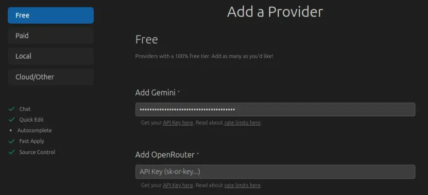

Nous verrons qu’il est aussi possible d’héberger nos propres modèles localement. Si vous partez sur le solution [Ollama](https://ollama.com/), Void est déjà pré-configuré en ce sens.

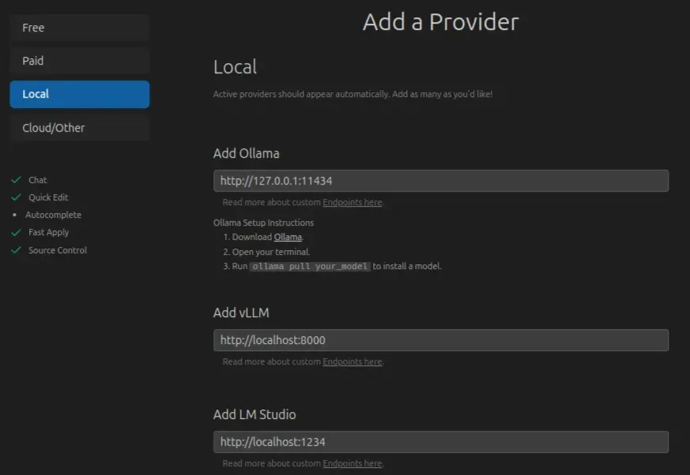

Dans les deux cas, en cliquant sur les liens dans la configuration, Void nous accompagne pour mettre en place notre token Gemini ou installer Ollama.

Si vous avez configuré votre token Gemini, dans les paramètres des modèles Void (Engrenage en haut à droit), vous devriez trouvez les modèles Gemini actifs.

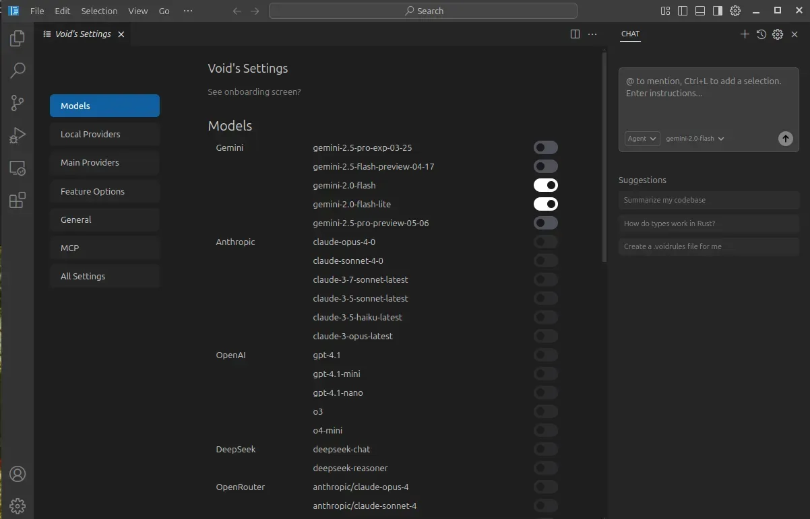

Wouah ! Le nombre de connecteurs disponibles ! 

A vous de jouer avec vos clés des différents providers de LLM ! Ici, nous nous allons passer plus de temps sur comment faire tourner un modèle en local car c’est l’une des façon les plus rapides pour avoir de l’auto-complétion et non seulement une fenêtre de dialogue. 

En effet, comme vous pouvez le voir dans l’onglet “_Feature Options_” des paramètres, les modèles Gemini ne sont pas compatibles avec l’auto-complétion (FIM models).

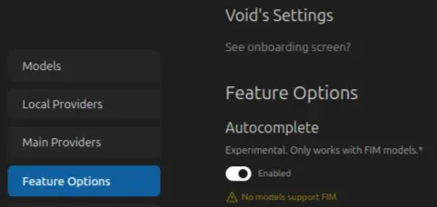

### Utilisation d’un LLM local

Pour utiliser un LLM en local, nous pouvons utiliser Ollama. Vous trouverez les différents installateurs (Windows, Mac & Linux) sur leur site : [https://ollama.com/download](https://ollama.com/download)

Il est nécessaire de faire un choix dans le LLM à utiliser, et parmis les LLMs dédiés à l’écriture de code voici les références dans leur domaine car développés par des grandes entreprises ou des laboratoires : 

| Nom du modèle | FIM Support | Fonctionnalités liés au code | Poids |
| --- | --- | --- | --- |
| CodeLlama  34B | ✅ | Advanced code generation, refactoring, multi-file context | ~19GB |
| Deepseek-Coder  33B | ✅ | Complex logic generation, Java debugging, test creation | ~17GB |
| Qwen2.5-Coder  32B | ✅ | Multi-language support, strong architectural reasoning | ~16GB |
| CodeLlama  13B | ✅ | Lightweight, good for method-level FIM and snippets | ~7GB |

Un challenger intéressant, Open-Source et particulièrement transparent dans ces résultats d’évaluation est [CodeStral](https://ollama.com/library/codestral) (~13GB). En auto-complétion, voici les scores disponibles :

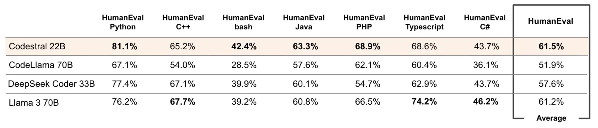

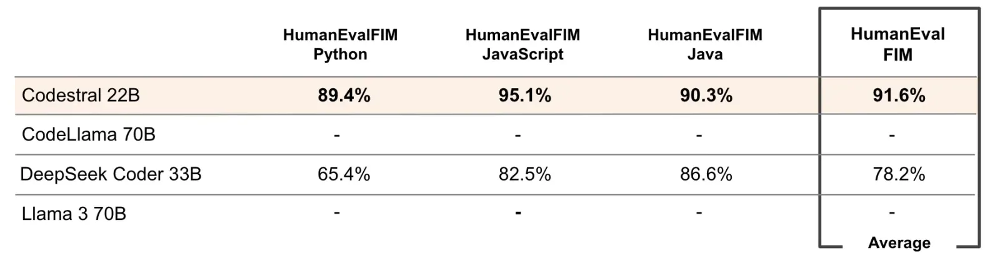

**Mais** tous ces LLMs demandent des ressources sur votre machine, notamment de la RAM. Aujourd’hui, au vu du coût en énergie et en achat de la machine, pour ces grands LLMs de référence, il reste plus intéressant de passer par des providers et de payer les tokens utilisés. 

Il est toujours possible d’héberger des modèles plus petits sur nos machines. L’un des plus petit est [qwen2.5-coder:0.5b](https://ollama.com/library/qwen2.5-coder), un modèle de 398MB. Pour un compromis entre pertinence et ressources, j’utilise [qwen2.5-coder:3b](https://ollama.com/library/qwen2.5-coder) (~1,9GB).

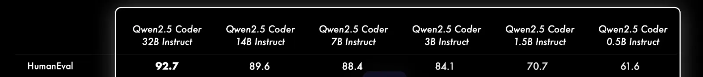

Dans tous les cas, pour lancer votre modèle, il nous suffit de 2 commandes : `ollama pull nom_du_modèle` et `ollama run nom_du_modèle` . Cette opération est unique, il n’est pas nécessaire de le faire à chaque redémarrage de notre machine.

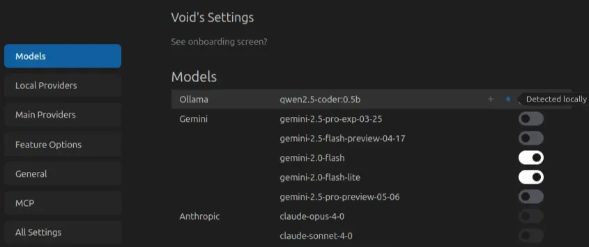

Voilà ! Aucune action supplémentaire n'est requise. Void détecte automatiquement les modèles exécutés localement. Il ne nous reste plus qu’à les activer.

> 💡 Si vous souhaitez modifier le point de terminaison de vos modèles hébergés localement, vous pouvez le faire.

Avant de nous lancer dans l’utilisation des fonctionnalités de Void, n’oubliez pas d’activer l’option d’auto-complétion dans les paramètres “_Features Options_”.

## Utilisation des fonctionnalités de Void

J’ai demandé à notre LLM de créer un projet Java avec un simple Controller retournant “Hello, World!”. Les exemples seront basés dessus :

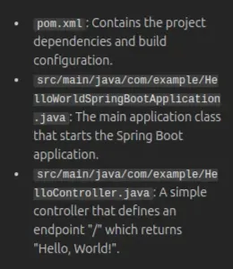

### Auto-complétion de code

L’auto-complétion de Void comprend le fichier actuel et le code source. À mesure que nous saisissons du code, nous pouvons accepter les suggestions du LLM en appuyant sur Tab.

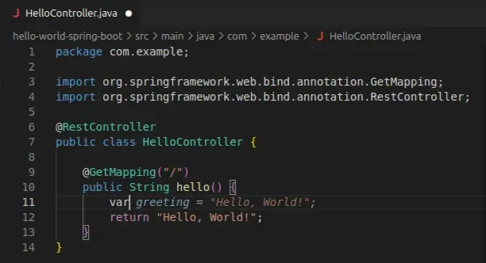

> 💡 L’auto-complétion peut aussi proposer plusieurs lignes à intégrer au code.

### Éditeur de lignes (Ctrl-K)

Nous avons maintenant besoin de refactoriser notre code. Sélectionnons les lignes à modifier, appuyons sur Ctrl+K. Une fenêtre de chat apparaît ! 

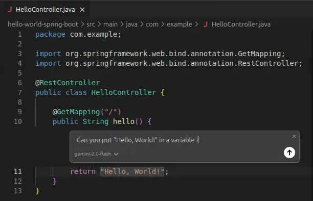

Les modifications nous sons proposées et nous pouvons les accepter ou non (Dans leur intégralité ou ligne par ligne).

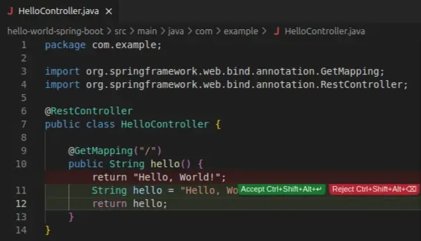

Nous pouvons aussi lui poser des questions plus complexes (Fonctions, documentation, refactorisation). La limite est notre budget de tokens ou notre machine !

### Éditeur de fichiers (Ctrl-L)

Nous pouvons aussi avoir des questions plus large sur notre code qui inclut soit des fichiers spécifiques, soit l’entièreté de notre base de code. Pour cela, nous pouvons utiliser le chat global de Void.

Choisissons notre LLM et posons notre question pour améliorer notre code : _“Can you suggest me improvements for my code ?”_ 

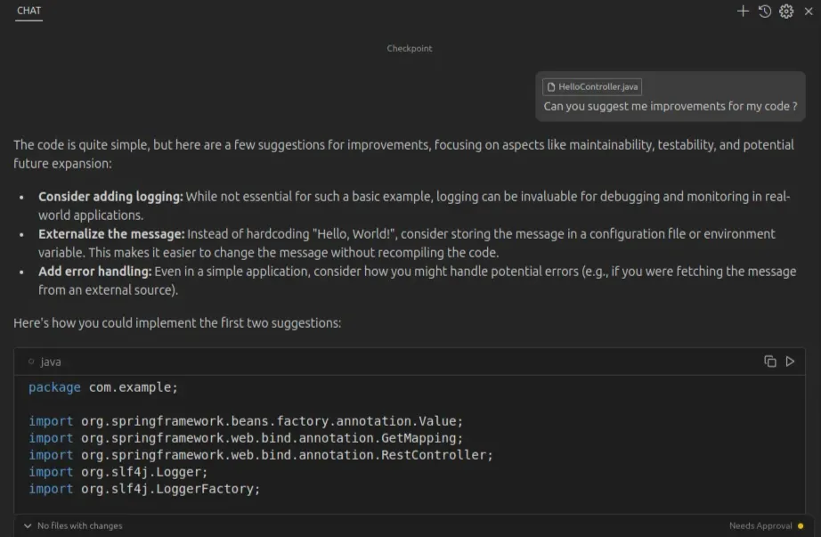

Il identifie clairement notre mauvaise gestion des erreurs, de logs et suggère des modifications !

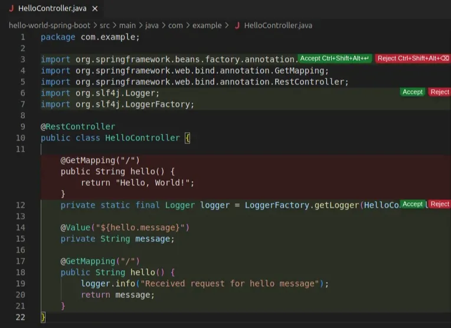

Comme précédemment, nous pouvons accepter les modifications dans leur intégralité ou ligne par ligne.

## Mon utilisation en tant que développeur

J’utilise Void depuis maintenant cinq mois principalement dans le cadre de refactoring de mon code. Mes tests restent mes garde-fous et sont conçus et maintenus pour garantir la robustesse de mes développements. 

Pour les tâches plus lourdes comme l’édition de lignes ou de fichiers via interface Chat, je m’appuie sur les modèles Gemini, qui me permettent d’accéder à une puissance de calcul que ma machine ne pourrait pas supporter seule. 

Pour l’auto-complétion, je privilégie les modèles [**Qwen2.5-Coder**](https://ollama.com/library/qwen2.5-coder), qui offrent un compromis entre légèreté et fonctionnalités. Si je disposais de plus de RAM, je basculerais probablement vers [CodeStral](https://ollama.com/library/codestral) qui semble être une alternative prometteuse.

## Pour les curieux !

L’architecture de Void est modulaire et intègre de manière expérimentale de nombreuses fonctionnalités : 

- Indexation de fichiers : capacités de recherche et de navigation améliorées

- Génération de Docstring : assistance automatisée à la documentation

- Intégrations de composants externes : [Greptile](https://www.greptile.com/) (Revue de code), [Ollama](https://ollama.com/) (Hébergement local) et [DocSearch](https://docsearch.algolia.com/) (Recherche de documentation)

N’hésitez pas à faire un tour sur le [Discord officiel](https://discord.com/invite/RSNjgaugJs) et sur le répertoire [Github](https://github.com/voideditor/void) ! 

## Conclusion 

> 1️⃣ Void répond à la problématique de confidentialité en nous permettant d’héberger nos modèles sur nos machines et, en garantissant que notre code ne quitte jamais notre environnement ! 

> 2️⃣ Void reste ouvert et nous propose des connecteurs aux providers de LLMs et donc une accès à des LLMs puissant !

> 3️⃣ Void est transparent dans les modifications que font les LLMs à notre code. A nous de valider ou non les suggestions ! 

Mais… les avantages vont au-delà de la simple confidentialité et des économies de coûts. En tant que projet open source, Void invite la communauté à contribuer pour repousser les limites du développement assisté par l’IA. 

La transparence du projet offre également de précieuses opportunités d’apprentissage aux développeur·euse·s intéressés par l’interaction entre les outils de développement traditionnels et l’IA.

Que vous soyez soucieux de la confidentialité, que vous cherchiez à réduire vos coûts ou que vous préférez simplement les outils open source, Void offre une alternative performante qui mérite d’être explorée. N’hésitez pas à prendre le meilleur des deux mondes ! 

_Merci de votre lecture !_ 

