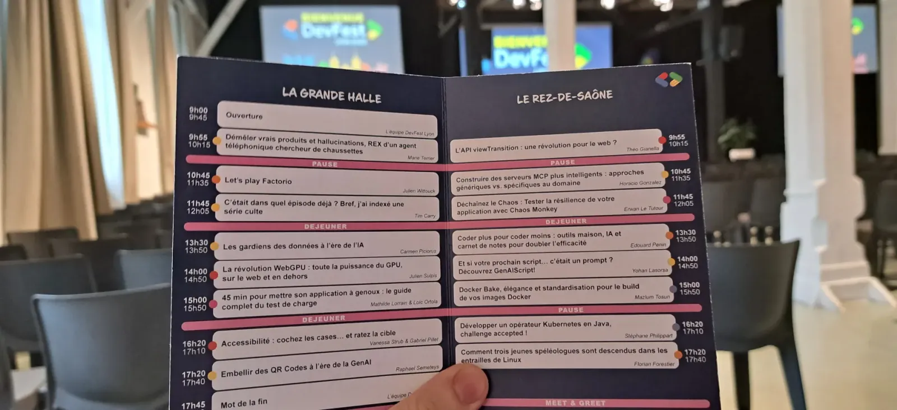
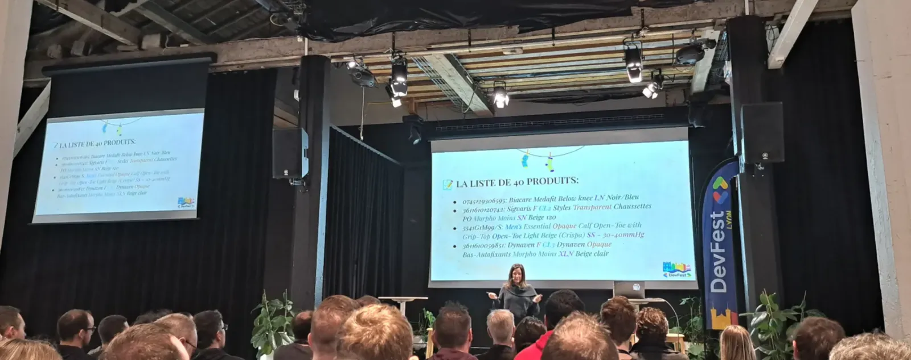
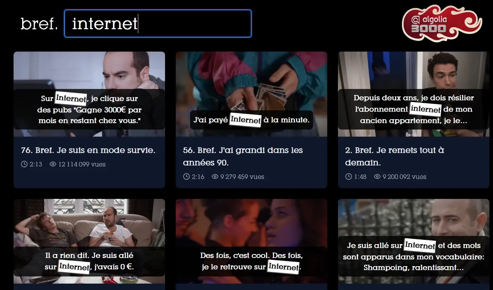

<!-- markdownlint-disable-file -->

Une question que l’on me pose beaucoup en ce début de semaine. En effet, vendredi 28 novembre 2025, nous avons eu la chance, avec plusieurs collègues de HoppR, de faire partie des 250 participants de la première édition du [DevFest Lyon](https://devfest.gdglyon.com/).

En effet, notre participation s’inscrit dans le cadre de la veille tech proposée, organisée et prise en charge par HoppR. C’est d’ailleurs comme cela que j’avais pu participer au Lyon Craft plus tôt cette année (et écrire deux articles sur ce blog, à retrouver [ici](https://blog.hoppr.tech/blogs/2025-04-24-lyon-craft-2025-12) et [ici](https://blog.hoppr.tech/blogs/2025-05-07-lyon-craft-2025-22)).

Avant de rentrer dans le vif du sujet, nous sommes tous unanimes chez HoppR pour saluer l’organisation au poil de l’évènement. Nous avons toutes et tous été très bien accueillis, et nous avons passé un moment de qualité avec nombre d’acteurs importants de la scène tech lyonnaise.

Nous voici donc arrivés à cette journée de conférences, réparties sur deux tracks, et donc des choix difficiles à faire tant les talks étaient prometteurs. 

Beaucoup de thématiques étaient proposées : Data & IA, Frontend, Backend, Software Architecture, Cloud, Infra et DevOps, il y en avait pour tous les goûts. On notera cependant une forte présence de la première thématique : la datascience et les LLM ont la côte !

Je vous propose ici de vous (re)plonger dans celles auxquelles j’ai pu assister en cette froide matinée lyonnaise.

## Keynote : Datascience for performance

_Par Joseph MESTRALLET - Data & AI - 30 minutes_

Après la traditionnelle ouverture par le staff devant une salle pleine, avec remerciement des sponsors et rappels de l’organisation, Joseph prend la parole pour une keynote surprise.

Son CV est impressionnant : il accompagne certains des plus grands champions, comme [Quentin Fillon Maillet](https://www.equipedefrance.com/athlete/quentin-fillon-maillet) (5 médailles de biathlon aux JO de Pékin 2022, dont 2 en or) ou [Ruth Croft](https://fr.wikipedia.org/wiki/Ruth_Croft) (vainqueure de l’Ultra-Trail du Mont-Blanc 2025). Et comment fait-il pour aider ces grands champions ? Par la data, par la science, par la datascience !

Joseph nous fait un petit historique des liens entre sport de haut niveau et science, de l’amélioration des photos finish à l’exploit du [marathon en moins de 2h de Kipchoge](https://fr.wikipedia.org/wiki/Ineos_1:59_Challenge). La densification des performances au plus haut niveau a nécessité une nouvelle approche basée sur la science et la data, pour gagner encore les quelques secondes, les quelques centimètres qui font la différence entre un champion olympique et les finalistes qui resteront inconnus du grand public.

Mais revenons au travail de Joseph, qui nous parle de quatre niveaux de datas, toujours plus précis:

- Les données issues de la littérature

- Les données personnalisées, via des applications de suivi comme Strava par exemple

- Le [fine tuning](https://fr.wikipedia.org/wiki/R%C3%A9glage_fin)

- Le compute, pour trouver les meilleures conditions pour une course via un _digital twin_

Cette notion de _digital twin_ revient souvent : il s’agit d’un avatar numérique de l’athlète, que l’on fait participer virtuellement des centaines de fois à la prochaine course, avec des paramètres différents, pour trouver la meilleure stratégie à adopter.

Joseph nous parle également de son quotidien aux côtés des athlètes. Ceux-ci doivent être très impliqués au quotidien pour obtenir de la data de la meilleure qualité possible. A l’inverse, une grande confiance avec lui doit être construite, il s’est donc lui aussi mis à la course à pied de manière intensive pour gagner de la connaissance du terrain et de la légitimité.

Le speaker, visiblement passionné, égraine les anecdotes de ses championnes et champions, et montre à quel point ce travail de performance demande une communication et une proximité forte entre le scientifique et les sportifs.

## Démêler vrais produits et hallucinations, REX d’un agent téléphonique chercheur de chaussettes

_Par Marie TERRIER - Data & AI - 50 minutes_

Marie est CTO d’une [start-up](https://www.yelda.ai/) proposant un SaaS d’agent vocaux. Cette société a proposé des solutions avant l’avènement des LLMs, et a suivi celui-ci pour présenter des solutions plus performantes. Ainsi, nous faisons un tour de l’historique :

- 2017 : Le Machine Learning existe déjà depuis longtemps, mais les LLMs n’en sont qu’à leurs balbutiements. L’agent vocal est alors basé sur du [_natural language processing_](https://fr.wikipedia.org/wiki/Traitement_automatique_des_langues)[ (NLP)](https://fr.wikipedia.org/wiki/Traitement_automatique_des_langues)_._ On essaie de déterminer l’intention du client au bout du fil, et de proposer une réponse pré-généré en fonction. Et si on y parvient pas, alors on demande à l’utilisateur de répéter. Un bon début, mais ce n’est pas très pratique.

- 2022 : Les LLMs sont utilisés pour ces cas de questions inattendues, et permettent donc de combler le besoin. La fin de l’histoire ?

- Fin 2023 : Une nouvelle commande arrive, avec pour problématique la suivante : l’IA peut elle aider les pharmaciens à commander des produits par téléphone ?

A priori, rien de bien sorcier maintenant que nous avons des outils adaptés et efficaces. Mais finalement, c’est la douche froide. Une liste de 40 produits seront proposés, et ceux-ci posent de nombreux problèmes : nous avons ici affaire avec du franglais, sans aucun standard, avec des notions complexes et difficilement transcriptibles comme le [mmHg](https://fr.wikipedia.org/wiki/Millim%C3%A8tre_de_mercure) par exemple. 

Difficile ainsi de trouver la bonne paire de chaussettes ou de bas de contention à commander…

De plus, les pharmaciens ne connaissent pas le nom complet de chaque produit, il est donc nécessaire de poser des questions pour être sûrs de comprendre, tout en étant rapide étant donné que nous sommes au téléphone. Le service existant alors est inadapté, tout est trop long, et le LLM pose trop de questions pour arriver au produit désiré.

La solution passe par des sous-agents, qui permettent d’avoir plus de pertinence dans les questions posées tout en étant plus rapide. C’est donc parfait ! Enfin jusqu’à ce que le catalogue passe de 40 à 20000 références dont certaines en allemand…

Nous sommes en 2023, et les LLMs disposent encore de limites, comme de petites [fenêtres de contexte](https://fr.wikipedia.org/wiki/Fen%C3%AAtre_de_contexte) (8000 tokens puis le modèle “oublie”), une latence trop importante (difficile d’attendre 30s au téléphone) et des [hallucinations](https://fr.wikipedia.org/wiki/Hallucination_(intelligence_artificielle)) fréquentes.

Plusieurs essais sont donc effectués :

- [RAG](https://fr.wikipedia.org/wiki/G%C3%A9n%C3%A9ration_%C3%A0_enrichissement_contextuel) et prompt dynamique, un bon début mais toujours trop lent et ne gère que 80 produits max lors des tests

- Une [base de données vectorielle](https://fr.wikipedia.org/wiki/Base_de_donn%C3%A9es_vectorielle), mais beaucoup de produits ont des noms trop proches sémantiquement, et chaque requête donne trop de retours

- [Algolia](https://www.algolia.com/fr), un moteur de recherche boosté à l’IA, qui donne de bons résultats

La solution se construit alors avec plusieurs briques comme ceci :

- LLM extracteur, qui fournit un nom de produit partiel

- Algolia, permettant d’effectuer la recherche

- LLM conversationnel

- LLM évaluateur

Ainsi, Marie et son équipe ont pu proposer à leur client un outil répondant pleinement au besoin : celui de permettre à des pharmaciens de commander des produits… dont les fameuses chaussettes du titre !

## Let’s play Factorio

_Par Julien WITTOUCK - Software Architecture - 50 minutes_

Julien est un grand fan du jeu [Factorio](https://factorio.com/). Ce jeu bac-à-sable consiste à construire et gérer une usine permettant d’exploiter des ressources afin de s’échapper de la planète. Tout le plaisir du jeu et d’agrandir et d’optimiser chaque extraction et production.

Le jeu permet, à l’instar de Minecraft, une grande liberté dans sa construction, y compris en utilisant de la logique permettant même de coder dans Factorio.

Julien se propose ici de nous illustrer de nombreux concepts que l’on peut trouver dans nos projets professionnels.

Voici les concepts abordés :

- Développement (Plat de spaghettis, Architecture en couches, Micro-services..)

- Urbanisation (ESB, Scaling Vertical/Horizontal)

- Sécurité (Métriques & monitoring, DDoS, Firewalls…)

L’exécution est impressionnante, et tous les concepts sont expliqués de manière visuelle et claire. Parfait pour présenter notre travail de tous les jours à des personnes non-tech ! Et il aura fallu plus de 100h pour préparer ce talk original.

Si vous souhaitez vous aussi voir ce qu’a construit Julien, un replay de son [talk est disponible sur YouTube](https://www.youtube.com/watch?v=I07DxOLw10E).

## C'était dans quel épisode déjà ? Bref, j'ai indexé une série culte

_Par Tim Carry - Data & AI - 20 minutes_

Tim travaille chez Algolia (oui encore eux). Tim est développeur. Mais surtout, Tim est un très grand fan de la série [Bref](https://www.imdb.com/fr/title/tt2044128/) (note personnelle : il a bien raison !).

Il s’est lancé sur un projet personnel qui lui tenait à cœur : un site qui permettrait de trouver l’épisode et l’extrait d’une réplique culte que l’on recherche. Ce sera la genèse de [brefsearch.com](https://www.brefsearch.com/).

Les fonctionnalités du site : recherche par ligne de dialogue / pensée, gère les fautes de frappe, aperçu animé de l’extrait au survol, recherche rapide et qui mène directement au moment trouvé.

Mais comment cela marche-t-il ?

Tout d’abord, il faut une extraction via [Yt-dlp](https://github.com/yt-dlp/yt-dlp), un outil en lignes de commande qui permet à Tim de récupérer toutes les vidéos de la [playlist Bref sur YouTube](https://www.youtube.com/playlist?list=PLlFikkv2B2ffwYiFQJmcao3RKtw1DFMz5). Il obtient également beaucoup de metadatas très utiles, et également les sous-titres automatiques.

Un problème se pose cependant, dans Bref, ça parle vite. Les sous-titres automatiques sont de qualité médiocre. Pour récupérer du texte exploitable, une extraction audio est alors faite par Yt-dlp puis passés dans [HappyScribe](https://www.happyscribe.com/fr), un outil de _speech-to-text_ IA. C’est bien mieux, et la retouche des dialogues est facilement réalisable (et cela donne une raison de plus de revoir la série !)

Et pour la suite :

- [ffmpeg](https://www.ffmpeg.org/) permet de construire les frames des lignes de texte trouvées et les aperçus animés

- Algolia permet la recherche

- Le frontend est hébergé sur Netlify en utilisant le CDN [Cloudinary](https://cloudinary.com/), avec quelques astuces données par Tim (notamment l’utilisation de LQIP (_Low Quality Image Placeholder_).

Le résultat ? 

Un site efficace, qui fait très bien ce qu’il a à faire, et qui impressionne les créateurs de la série eux-mêmes. Je ne sais pas vous, mais moi cela m’a donné envie de revoir Bref… J’en ai mangé tout le week-end suivant !

## Speechless & fin de la matinée

Après ces présentations toutes plus intéressantes les unes que les autres, il est maintenant temps de récupérer des forces et de débriefer autour d’un grand buffet. Mais l’heure n’est pas qu’à la pause : un speechless live est organisé.

Le principe ? Plusieurs speakeuses et speakers passent devant le public dans un exercice d’improvisation :

- Un thème tiré au sort

- Un sujet choisi par le public

- Des slides imposées, qui n’ont aucun sens

C’était en tout cas un plaisir de voir Carmen Piciorus passer un entretien d’embauche pour devenir gardienne de nains de jardin, et Tim Carry nous pitcher son nouveau film “La revanche des cacahuètes”. Un moment amusant qui clôture une matinée aux petits oignons au DevFest Lyon !

Il est temps ensuite d’attaquer un après-midi qui s’avèrera tout aussi riche en enseignements et en échanges de qualité. Vous voulez en savoir plus ?

Guettez ce blog, j’ai entendu dire qu’un second article était en préparation…

