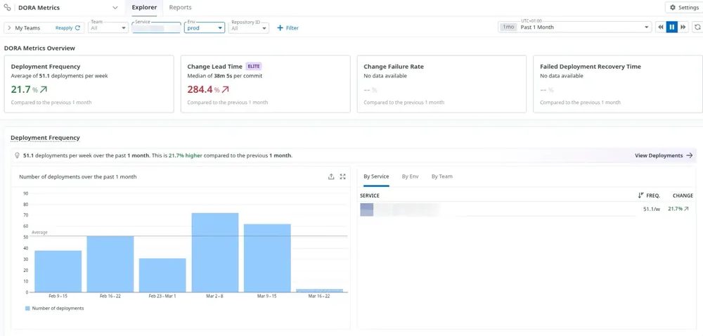
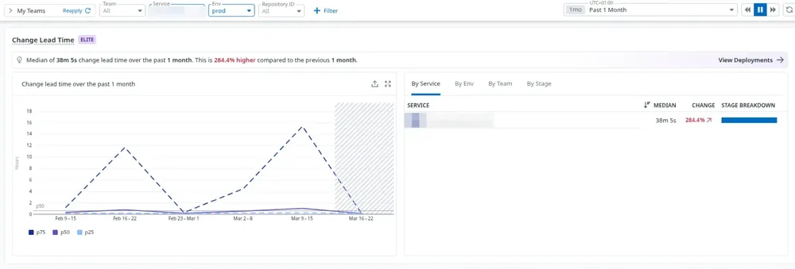

<!-- markdownlint-disable-file -->


On ne va pas se mentir : dans les grands groupes, mesurer la performance DevOps ressemble souvent à un parcours du combattant entre Jira, GitHub et des fichiers Excel. 

Pourtant, ce [REX inspirant](https://blog.hoppr.tech/blogs/2025-05-19-bref-jai-mis-en-place-les-dora-metrics-dans-un-grand-groupe-rex) le prouve : même à grande échelle, on peut remplacer la saisie manuelle par une culture de la donnée 100% automatisée. La clé du succès n'est pas dans la complexité, mais dans l'**automatisation**.

Voici comment tracker les deux piliers de la vélocité de livraison applicative avec Datadog.

## 1. Deployment Frequency : Le pouvoir du tag `version`

La plupart des équipes essaient de compter les déploiements à la main. Avec Datadog, c'est terminé. Si vous êtes sur Kubernetes, il suffit d'adopter le [**Unified Service Tagging**](https://docs.datadoghq.com/getting_started/tagging/unified_service_tagging/?tab=kubernetes).

En ajoutant simplement le label `tags.datadoghq.com/version` à vos manifests, Datadog détecte chaque changement comme un événement de déploiement natif.


**Exemple de manifest "Datadog Ready" :**

```yaml
apiVersion: apps/v1
kind: Deployment
metadata:
  name: my-banger-service
spec:
  replicas: 3
  selector:
    matchLabels:
      app: my-banger-service
  template:
    metadata:
      labels:
        # Les 3 tags magiques du Unified Service Tagging
        tags.datadoghq.com/env: "prod"
        tags.datadoghq.com/service: "my-banger-service"
        tags.datadoghq.com/version: "1.2.4" # C'est ICI que le calcul DORA commence
    spec:
      containers:
      - name: my-app
        image: my-registry/my-app:1.2.4
        env:
          # On injecte ces variables pour que l'APM et les Logs héritent aussi des tags
          - name: DD_ENV
            valueFrom:
              fieldRef:
                fieldPath: metadata.labels['tags.datadoghq.com/env']
          - name: DD_SERVICE
            valueFrom:
              fieldRef:
                fieldPath: metadata.labels['tags.datadoghq.com/service']
          - name: DD_VERSION
            valueFrom:
              fieldRef:
                fieldPath: metadata.labels['tags.datadoghq.com/version']
```

> **Note :** On utilise ici un contexte K8s, mais cette logique s'adapte partout. Sur une **VM**, il suffit de passer ces tags via les variables d'environnement (`DD_VERSION`) ou la configuration de l'Agent Datadog.

## 2. Change Lead Time : La CI/CD comme source de vérité

Le _Lead Time for Changes_ (le temps écoulé entre le commit et la mise en production) est souvent le premier vrai défi technique, car il demande de lier la CI/CD au monitoring de prod.

La solution ? **Datadog CI Visibility**. Au lieu de faire des calculs manuels approximatifs, on injecte un binaire Datadog directement dans votre pipeline (GitHub Actions, GitLab CI, Jenkins) :

```yaml
stages:
  - build
  - test
  - publish  # C'est ici qu'on lie le code à Datadog

datadog-metadata:
  stage: publish
  image: 
    name: datadog/ci:v5.9.1
    entrypoint: [""]
  variables:
    DATADOG_SITE: "datadoghq.eu"
    # DATADOG_API_KEY doit être définie dans vos variables CI/CD GitLab
  script:
    - datadog-ci git-metadata upload
  rules:
    - if: $CI_COMMIT_BRANCH == $CI_DEFAULT_BRANCH # On track seulement la branche principale
```

## Pourquoi c'est l'approche gagnante ?

- **Lien Automatique** : En lançant cette commande, Datadog associe les hashes des commits au build en cours.

- **Zéro Impact Runtime** : Contrairement à d'autres outils qui ralentissent l'application, ici tout se passe dans la forge logicielle.

- **Réconciliation magique** : Dès qu’un pod Kubernetes (avec son tag `version`) pop sur l'infra, Datadog fait le calcul : `Heure du déploiement - Heure du commit = Lead Time`.

## Et sinon ça ressemble à quoi après ce setup?

Voici deux captures d’écran permettant de voir les metriques “Deployment Frequency” et “Change Lead Time” sur un service en production:






## Conclusion : La donnée plutôt que l'opinion

Si vous utilisez déjà Datadog, 90% du travail est fait. En ajoutant un label et une ligne de CI, vous passez du ressenti à une culture de la donnée automatisée. Bien sûr, des alternatives Open Source comme [**Apache DevLake**](https://devlake.apache.org/docs/DORA/) existent, mais l'unification native dans votre monitoring reste un atout majeur.

Cependant, la vélocité n'est que la moitié du chemin. Pour piloter sereinement, il nous reste à automatiser les deux piliers de la **stabilité** :

- **Change Failure Rate (CFR)** : Le ratio de déploiements qui partent en fumée.

- **Mean Time to Recovery (MTTR)** : Votre réactivité face aux incidents.

On s'occupe de la stabilité dans un prochain article. Vous pouvez suivre HoppR sur [LinkedIn](https://www.linkedin.com/company/hopprtech/) pour ne pas le rater !