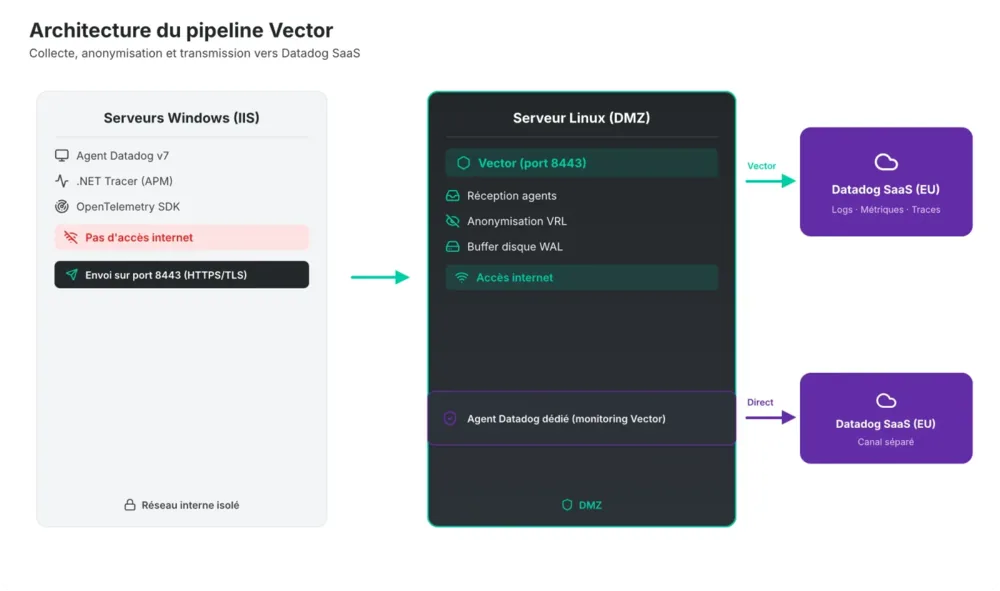
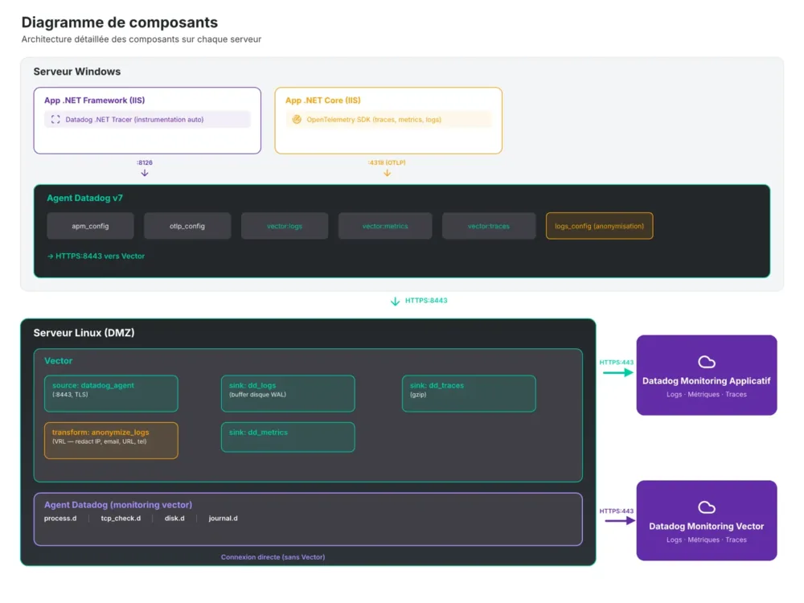
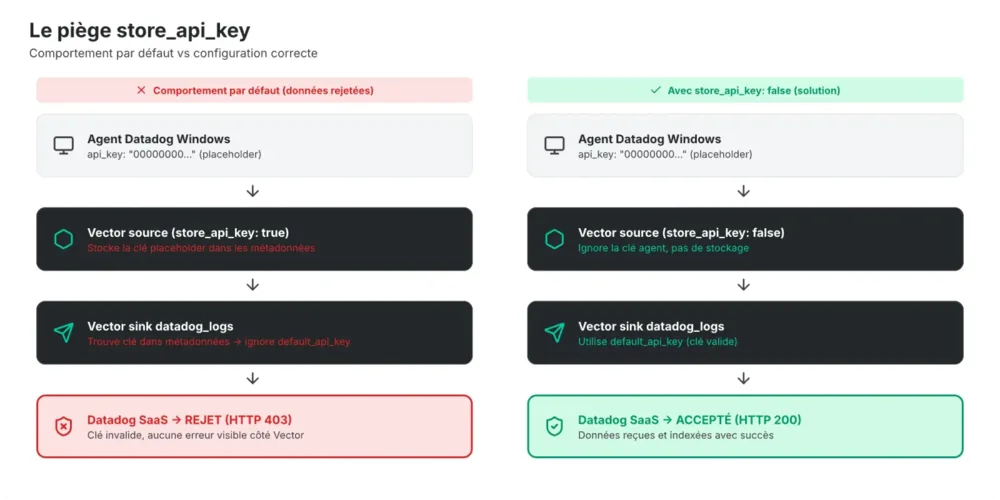
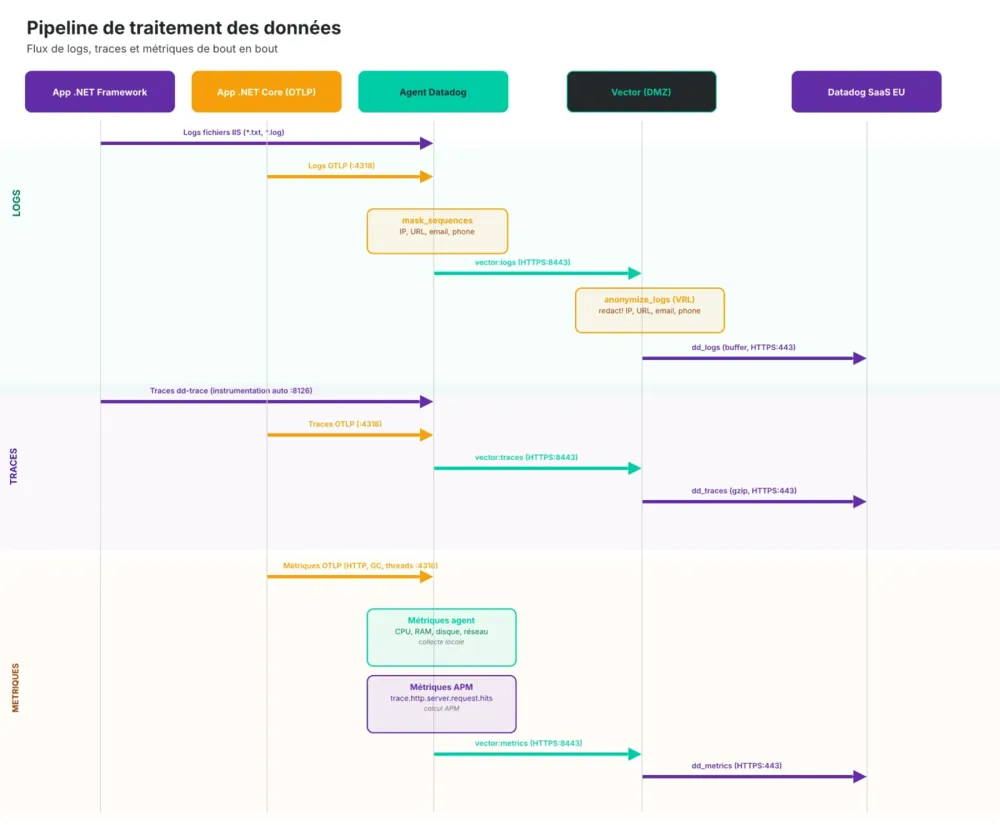

<!-- markdownlint-disable-file -->


_Comment faire fonctionner_ [_Datadog_](https://www.datadoghq.com/) _sur des serveurs Windows isolés, sans internet et avec une anonymisation stricte des données ? Retour d'expérience sur la mise en place de_ [_Vector_](https://vector.dev/) _pour connecter un cluster hors-ligne à Datadog._

---

## Le contexte : des serveurs aveugles

Dans les environnements réglementés, la sécurité réseau n'est pas négociable. Mais ça ne devrait pas condamner une équipe à piloter ses applications à l'aveugle.

Un client du secteur de l'assurance a contacté [HoppR](http://hoppr.tech/) pour mettre en place du monitoring sur son parc applicatif. Le setup : une dizaine de serveurs Windows sous IIS hébergeant des applications .NET, répartis entre une DMZ et un réseau interne, générant plusieurs Go de logs par jour. Jusque-là, rien d'exotique.

La contrainte principale : **aucun de ces serveurs n'a accès à internet.** Politique de sécurité réseau stricte, pas de dérogation possible. Tolérance zéro pour la perte de données. Et le client veut Datadog, pas un ELK maison, pas un Prometheus à manager.

Le cahier des charges :

- Centraliser les logs applicatifs IIS dans Datadog

- Collecter les métriques de performance (HTTP, runtime .NET, SQL)

- Activer le tracing distribué (APM) sur les applications cibles

- Anonymiser les données sensibles **avant** qu'elles quittent le réseau

- Garantir zéro perte de données en cas de coupure réseau

L'objectif : un pipeline de bout en bout, opérationnel et validé par le client.

---

## Pourquoi Vector et pas un proxy HTTP

Lorsque des serveurs sans internet doivent envoyer des données vers un SaaS, le réflexe habituel est de penser à un proxy. Un Squid, un HAProxy, un nginx en reverse proxy.

**Mais** ça ne suffit pas ici. On ne veut pas juste relayer du trafic HTTPS. On veut :

- **Transformer** les données en transit (anonymisation)

- **Bufferiser sur disque** en cas de coupure réseau vers Datadog

- **Séparer les flux** (logs, métriques, traces) vers les bons endpoints

- Avoir un pipeline observable et debuggable

Vector coche toutes ces cases. 

C'est un binaire unique écrit en [Rust](https://rust-lang.org/fr/), [haute performance](https://github.com/vectordotdev/vector) ([~25 MiB/s par vCPU](https://vector.dev/docs/setup/going-to-prod/sizing/) pour des logs structurés — soit [3x à 18x le débit de Fluentd et 2x à 25x celui de Logstash](https://github.com/vectordotdev/vector#performance) selon les scénarios), avec un support natif du protocole Datadog Agent en source **et** en sink. Concrètement, l'agent Datadog sur les serveurs Windows pense parler à Datadog, il parle à Vector et Vector se charge du reste. 

Le coût en ressources ? Négligeable.

Contrairement à un proxy maison qu'il faudrait maintenir, Vector traite notre volume de logs avec une empreinte CPU/RAM minimale.

Le bonus : Vector supporte VRL ([Vector Remap Language](https://vector.dev/docs/reference/vrl/)), un langage de transformation dédié. Exactement ce qu'il faut pour l'anonymisation.



---

## L'architecture implémentée

Un serveur Linux Debian en DMZ fait office de passerelle unique. Il porte Vector qui écoute en TLS sur le port 8443, et un agent Datadog dédié qui surveille Vector lui-même avec une connexion directe vers Datadog (sans passer par Vector — on y reviendra).

Les serveurs Windows envoient **tout** vers Vector : logs, métriques, traces APM, données OTLP. L'agent Datadog Windows est configuré avec un bloc `vector:` natif qui redirige, de manière transparente, tous les flux.



---

## Piège n°1 : `store_api_key` — un comportement par défaut trompeur

Ce problème de configuration est le plus subtil qu'on ait rencontré. Tout semblait fonctionner correctement : les agents envoyaient des données et `vector top` affichait les flux. Mais côté Datadog, aucune donnée ne remontait, sans message d'erreur explicite.

### La raison ?

L'agent Datadog sur les serveurs Windows a besoin d'une `api_key` dans sa config, même s'il n'envoie rien directement à Datadog. 
Le placeholder mis en place était `00000000000000000000000000000000`. L'idée ? Permettre à Vector d'utiliser sa propre clé API valide via `default_api_key` dans ses sinks.

Sauf que Vector, par défaut, a `store_api_key: true` sur sa source `datadog_agent`. 

Ce paramètre fait que Vector **stocke la clé API transmise par l'agent dans les métadonnées de chaque événement**. Et au moment de l'envoi vers Datadog, si une clé est présente dans les métadonnées, elle **prend le dessus** sur `default_api_key`.

Résultat : Vector envoie les logs avec la clé `00000000...` — qui se fait rejeter par Datadog. Tout cela sans alerte ou notification pour comprendre ce rejet.



### La solution

Un seul paramètre à changer :

```yaml
sources:
  datadog_agents:
    type: datadog_agent
    address: "0.0.0.0:8443"
    store_api_key: false  # ← C'est ça qui manquait
```

Avec `store_api_key: false`, Vector ignore la clé transmise par les agents et utilise systématiquement la `default_api_key` configurée dans chaque sink.

Ce comportement est difficile à diagnostiquer car il ne génère aucune erreur explicite côté Vector. Les données transitent normalement dans le pipeline mais sont rejetées silencieusement par Datadog. C'est en analysant les codes retour HTTP 403 dans les logs `journalctl` qu'on a identifié la cause. Le correctif tient en un seul paramètre.

---

## Piège n°2 : TLS et certificats internes

Les communications agent → Vector passent en TLS sur le port 8443. Le client utilise une PKI interne avec un certificat wildcard.

Côté Vector (Linux), la config TLS est straightforward :

```yaml
sources:
  datadog_agents:
    type: datadog_agent
    address: "0.0.0.0:8443"
    tls:
      enabled: true
      crt_file: "/vector/certs/server.crt"
      key_file: "/vector/certs/server.key"
```

Côté Windows, c'est là que ça se complique. L'agent Datadog utilise le magasin de certificats Windows, pas un fichier PEM. Si le certificat CA interne n'est pas dans le store `Trusted Root Certification Authorities` de la machine, l'agent refuse la connexion TLS sans message d'erreur très explicite.

```powershell
Import-Certificate -FilePath "C:\\certs\\ca-interne.crt" -CertStoreLocation Cert:\\LocalMachine\\Root
```

Pensez aussi à vérifier la connectivité avec `Test-NetConnection` avant de chercher un bug applicatif :

```powershell
Test-NetConnection -ComputerName vector.internal.company.local -Port 8443
```

---

## La double anonymisation : ceinture et bretelles

Le client avait une exigence forte : aucune [donnée à caractère personnel (DCP)](https://www.cnil.fr/fr/definition/donnee-personnelle) ne doit quitter le réseau interne. On a donc mis en place une anonymisation à deux niveaux.



### Niveau 1 : Agent Datadog (serveurs Windows)

L'agent Datadog supporte nativement des `processing_rules` de type `mask_sequences` dans la section `logs_config`. On masque à la source :

```yaml
logs_config:
  processing_rules:
    - type: mask_sequences
      name: mask_ip_addresses
      pattern: '(?:(?:25[0-5]|2[0-4][0-9]|[01]?[0-9][0-9]?)\\.){3}(?:25[0-5]|2[0-4][0-9]|[01]?[0-9][0-9]?)'
      replace_placeholder: "[HIDE_IP]"

    - type: mask_sequences
      name: mask_emails
      pattern: '[a-zA-Z0-9_.+-]+@[a-zA-Z0-9-]+\\.[a-zA-Z0-9-.]+'
      replace_placeholder: "[HIDE_EMAIL]"

    - type: mask_sequences
      name: mask_phone_numbers
      pattern: '(?:\\+33|0)[1-9]\\d{8}'
      replace_placeholder: "[HIDE_PHONE_NUMBER]"
```

### Niveau 2 : Vector (serveur relai)

Même si l'agent fait le boulot, on applique une seconde passe dans Vector via un transform VRL. Le principe : même si un agent est mal configuré ou qu'un nouveau serveur est ajouté sans les processing rules, les données sont quand même anonymisées avant de sortir vers Datadog.

```yaml
transforms:
  anonymize_logs:
    type: remap
    inputs:
      - "datadog_agents.logs"
    source: |
      .message = to_string(.message) ?? ""

      .message = redact!(.message,
        [r'(?:(?:25[0-5]|2[0-4][0-9]|[01]?[0-9][0-9]?)\\.){3}(?:25[0-5]|2[0-4][0-9]|[01]?[0-9][0-9]?)'],
        {"type": "text", "replacement": "[HIDE_IP]"}
      )

      .message = redact!(.message,
        [r'https?://[\\w\\-]+(\\.[\\w\\-]+)+([\\w\\-.,@?^=%&:/~+#]*[\\w\\-@?^=%&/~+#])?'],
        {"type": "text", "replacement": "[HIDE_URL]"}
      )

      .message = redact!(.message,
        [r'[a-zA-Z0-9_.+-]+@[a-zA-Z0-9-]+\\.[a-zA-Z0-9-.]+'],
        {"type": "text", "replacement": "[HIDE_EMAIL]"}
      )

      .message = redact!(.message,
        [r'(?:\\+33|0)[1-9]\\d{8}'],
        {"type": "text", "replacement": "[HIDE_PHONE_NUMBER]"}
      )
```

VRL a l'avantage d'être compilé et très performant. Sur notre volume de logs, l'impact sur le throughput de Vector était négligeable.

La logique est simple : le niveau 1 est la ligne de défense principale, le niveau 2 est le filet de sécurité. Si un admin ajoute un serveur sans configurer les processing rules de l'agent, les PII sont quand même masquées par Vector.

---

## Résilience : le buffer disque write-ahead log

Que se passe-t-il si la connexion entre Vector et Datadog tombe ? Par défaut, Vector buffer en mémoire. Un crash ou un redémarrage pendant une coupure réseau, et ce sont des heures de logs d'audit qui disparaissent.

On a activé le buffer disque, qui fonctionne comme un write-ahead log :

```yaml
sinks:
  dd_logs:
    type: datadog_logs
    inputs:
      - anonymize_logs
    default_api_key: "${DD_API_KEY}"
    site: "datadoghq.eu"
    buffer:
      type: disk
      max_size: 85899345920  # ~80 Go
      when_full: block
```

Le fonctionnement :

- Chaque événement est **écrit sur disque** avant d'être envoyé

- En cas de coupure, les événements s'accumulent dans `/vector/buffer/`

- Quand la connexion revient, Vector vide automatiquement le buffer

- En cas de crash, les données sont récupérées au redémarrage

Les fichiers buffer sont des segments de 128 Mo en append-only. Le paramètre `when_full: block` signifie que si le buffer de 80 Go est plein, Vector bloque l'ingestion plutôt que de perdre des données. C'est un choix assumé : on préfère que les agents soient temporairement bloqués plutôt que de perdre des logs.

### Un point d'attention sur le monitoring du buffer

Le buffer disque crée des fichiers `buffer-data-X.dat` qui ne font que grossir — c'est normal, c'est le comportement d'un write-ahead log. Un fichier de quelques Mo qui grossit lentement, c'est le fonctionnement nominal. Si vous voyez plusieurs fichiers apparaître et la taille exploser, c'est que la connexion vers Datadog est dégradée.

```bash
# Surveiller en temps réel
watch -n 5 'ls -lah /vector/buffer/dd_logs/'
```

---

## L'angle mort : qui surveille le surveillant ?

Un problème classique avec un relai centralisé : si Vector tombe, toutes les métriques et logs de Vector... ne sont plus transmis. On perd la visibilité exactement quand on en a le plus besoin.

La solution : un **agent Datadog dédié** installé directement sur le serveur Vector, qui se connecte à Datadog **sans passer par Vector**. Cet agent surveille :

- **Le processus Vector** (`process.d`) : est-ce que le binaire tourne ?

- **Le port 8443** (`tcp_check.d`) : est-ce que Vector écoute ?

- **L'espace disque** (`disk.d`) : le buffer risque-t-il de saturer ?

- **Les logs systemd** (`journal.d`) : y a-t-il des erreurs ?

Ça crée un canal de monitoring indépendant. Si Vector crash, on le sait immédiatement via l'agent dédié.

Les alertes à poser dans Datadog pour avoir l'esprit tranquille :

- **Process down** : le processus Vector n'est pas détecté depuis 2 minutes

- **Port 8443 injoignable** : les agents ne peuvent plus envoyer leurs données

- **Disque buffer > 90%** : risque de perte si le buffer sature

- **Absence de logs applicatifs** : aucun log reçu depuis 15 minutes (coupure complète)

---

## La gestion des secrets

Un point qu'on sous-estime souvent : comment gérer la clé API Datadog sans la mettre en dur dans les fichiers de config.

Côté Vector, la clé est injectée via une variable d'environnement `DD_API_KEY` dans le fichier `EnvironmentFile` du service systemd. Le fichier est lisible uniquement par l'utilisateur système `vector`.

```yaml
# vector.yaml — la clé n'est jamais en dur
sinks:
  dd_logs:
    default_api_key: "${DD_API_KEY}"
```

```bash
# vector.default (EnvironmentFile systemd, chmod 600)
DD_API_KEY=votre-clé-api
```

Côté agents Windows, la clé est un placeholder `00000000...` puisque les agents ne contactent jamais Datadog directement. L'avantage : même si quelqu'un lit la config d'un serveur Windows, il n'a pas la vraie clé API.

Le certificat TLS privé est aussi protégé en `chmod 600`, accessible uniquement par l'utilisateur `vector`.

---

## Ce que j'aurais fait différemment

Quelques leçons tirées de cette intervention :

**Préparer la checklist en amont.** On a perdu du temps sur des prérequis manquants : ouvertures de flux réseau pas encore faites, certificats pas générés, serveur Linux pas encore provisionné. Une checklist détaillée envoyée au client 2 semaines avant aurait évité ça.

**Tester** **`store_api_key`** **dès le début.** Ce paramètre est le piège classique de la source `datadog_agent` dans Vector. Si je refais ce setup, c'est le premier truc que je vérifie.

**Automatiser le déploiement des agents Windows.** On a configuré chaque serveur à la main. Avec Ansible, on aurait pu déployer la config Datadog Agent + certificat CA sur tous les serveurs en une commande.

**Documenter le** **`vector tap`****.** C'est la commande la plus utile pour débugger. `vector tap --inputs-of dd_logs` montre en temps réel les événements qui arrivent dans un sink. Ça m'a sauvé plusieurs fois.

---

## Les commandes de survie

Pour ceux qui souhaitent se lancer avec un setup similaire, voici les commandes utilisées dans notre cas d'étude :

```bash
# Santé de Vector
curl <http://127.0.0.1:8686/health>

# Vue temps réel du pipeline (events in/out par composant)
vector top

# Observer les événements en transit avant un sink
vector tap --inputs-of dd_logs

# Vérifier les métriques d'envoi
curl -s <http://127.0.0.1:8686/api/v1/metrics> | grep component_sent_events_total

# Taille du buffer
curl -s <http://127.0.0.1:8686/api/v1/metrics> | grep buffer_byte_size

# Valider la config avant de redémarrer
vector validate --config-dir /path/to/config/
```

---

## En résumé

Mettre Datadog sur des serveurs on-premise sans internet, c'est faisable. 
[Vector](https://vector.dev/) est l'outil qui manquait pour combler le gap entre un réseau isolé et un SaaS de monitoring. Il permet de construire un pipeline complet (logs, métriques, traces APM) avec de l'anonymisation, du buffering résilient et un monitoring du monitoring.

Les vrais pièges ne sont pas dans la complexité de l'architecture (qui est assez simple au final), mais dans les détails de configuration. `store_api_key: false`, les certificats dans le bon magasin Windows, le buffer disque activé — ce sont ces petits paramètres qui font la différence.

**Si vous travaillez dans le secteur bancaire, l'assurance ou la défense, les environnements air-gapped sont votre quotidien.** 
Ce retour d'expérience démontre qu'il existe des solutions pour adopter une observabilité moderne cloud-native, même liée à des contraintes fortes de sécurité. Chez [HoppR](https://hoppr.tech/), nous pouvons aisément nous rendre disponibles pour partager ce retour d'expérience et accompagner vos équipes sur des use cases similaires.

---

_Stack utilisée : Vector 0.54, Datadog Agent v7.35+, Datadog .NET Tracer, OpenTelemetry SDK .NET, Debian 11, Windows Server._