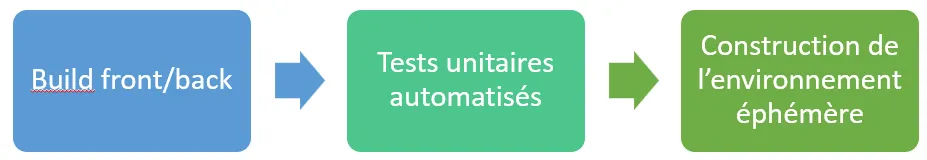
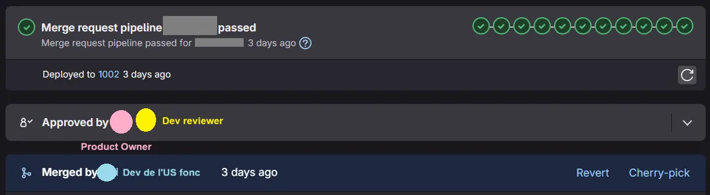

<!-- markdownlint-disable-file -->

Tout au long de ma carrière de développeur web, une question s’est toujours posée : comment tester une nouvelle fonctionnalité développée ? Une anomalie corrigée ?

Certes les tests automatisés répondent en partie à la problématique, par exemple grâce au [TDD](https://hoppr-tech.notion.site/Formation-TDD-HoppR-19ff4462cd388034b74eecb49e31630d), mais **quid de la validation humaine**, par un _product owner_, un testeur, voire un utilisateur final ?

Beaucoup de projets utilisent des environnements de recette. Mais ceux-ci finissent rapidement avec des données bancales/obsolètes, des configurations bricolées, et où plusieurs fonctionnalités mergées récemment s’entremêlent. Et qui n’a jamais entendu une phrase du type “_N’utilisez pas la recette, je fais des tests dessus_”, bloquant ainsi l’ensemble de l’équipe et réduisant la productivité de celle-ci.

De plus, si le développement mergé ne répond pas au besoin, cela entraîne deux choses : soit un commit “parasite” a été introduit sur la branche `main` testée, soit l’évitement de ce problème nécessite un travail sur plusieurs branches Git parallèles et autant de complexité ajoutée.

Dès lors, comment tester manuellement une fonctionnalité de manière isolée ? Sur un environnement propre ? Ou des tests end-to-end peuvent être joués sans difficultés pour chaque _merge request_ ? Sur une MR qui sera validée avant de partir sur une branche `main` ?

## Qu’est-ce qu’un environnement éphémère ?

Comme son nom l’indique, **un environnement éphémère est une instance qui a une durée de vie limitée**, par exemple à la MR à laquelle il est rattaché. Il est construit dans une configuration au plus proche de celle de production, avec des données de test préchargées si nécessaire, pour faciliter les tests automatisés (end-to-end par exemple) et manuels.

Une fois que l’on sait créer un environnement éphémère facilement, plusieurs cas d’usage se présentent :

- Celui que j’ai le plus utilisé, une _merge request_ = un environnement éphémère. Ainsi, n’importe qui dans l’équipe peut visualiser et valider les modifications avant _merge_ de la branche

- Création d’un environnement dédié propre pour des démonstrations, qu’elles soient internes ou aux utilisateurs

- Un environnement créé pour des tests end-to-end, détruit ensuite

## Retour d’expérience

Je vais vous faire mon retour d’expérience de l’utilisation de ces environnements éphémères, lors de mon projet actuel chez mon client. Ces environnements sont systématiquement utilisés, pour chaque MR **sans exception**.

### La mise en place

Sur le projet, nous utilisons les outils suivants : [AWS](https://aws.amazon.com/fr/), [Terraform](https://developer.hashicorp.com/terraform) et [Gitlab](https://about.gitlab.com/). Cela nous permet de facilement automatiser la construction des environnements avec l’**infrastructure-as-code** (IaC).

Pour avoir un environnement disponible à la création de la _merge request_, nous utilisons une [variable prédéfinie de GitLab](https://docs.gitlab.com/ci/variables/predefined_variables/) nommée `CI_MERGE_REQUEST_IID` , un identifiant de la MR spécifique au projet. Cela nous permet d’intégrer la construction de l’environnement à la pipeline de CI/CD.

Bien entendu, hors de question d’installer un environnement inutilement pour un développement qui ne passe pas les tests unitaires. La pipeline ressemble donc  grossièrement à ceci :

A noter que l’environnement éphémère créé à la volée possède ses propres ressources AWS, (dans notre cas, des buckets S3, des queues SQS, etc.). Un jeu de données spécifique à ces environnements est mis en place via un script [liquibase](https://www.liquibase.com/how-liquibase-works) pour un référentiel de données nécessaire aux tests. Ainsi naît un environnement avec une URL du type 

`https://env-${CI_MERGE_REQUEST_IID}.client.fr`

Bien évidemment, il faut faire attention à ne pas oublier de détruire automatiquement l’environnement à la fermeture de la MR, qu’elle soit mergée ou non (avec l’aide de [webhooks Gitlab](https://docs.gitlab.com/user/project/integrations/webhook_events/#merge-request-events)). On pourra également donner une durée de vie maximum à l’environnement. Cela nécessite également une bonne observabilité pour ne pas garder d’environnements “fantômes” coûteux.

### La mise en situation

Maintenant que nous avons des environnements éphémères pour chaque _merge request,_  comment allons-nous les utiliser ?

Notre principale idée ici est d’intégrer les _product owners_ dans la construction de chaque feature. Ainsi, là où la majorité des projets ne demande qu’une validation technique par un pair technique, nous demandons également une validation fonctionnelle par un PO ou un UX, suivant le sujet.

### Les avantages

- Chaque MR dispose d’un environnement dédié, évitant les interférences entre les fonctionnalités en développement

- Terraform garantit que chaque environnement est identique (mêmes configurations, versions, dépendances), et permet de provisionner/détruire l’infrastructure à la demande.

- D’ailleurs, cela permet la génération de multiples environnements avec la même config, plus besoin de maintenir chaque environnement de recette/formation/démo séparément

- Facilite le développement, l’intégration et le déploiement continu

- Permet une amélioration de vos [DORA Metrics](https://blog.hoppr.tech/blogs/2024-10-31-dora-metrics-valuer-la-performance-de-livraison-logicielle#quest-ce-que-les-m%C3%A9triques-dora)

### Les inconvénients

- La mise en place du fonctionnement est complexe, et nécessite un investissement initial important en début de projet. De plus, cela nécessite une bonne maîtrise des outils utilisés

- La construction automatique d’un environnement complet peut prendre du temps, et rallonger la pipeline

- Avoir un métier (PO/UX) pleinement impliqué et disponible pour faire des revues fonctionnelles.

Pour ce dernier point, c’est le cas sur ce produit, donc pas d’inquiétude là-dessus. Il faut de toute façon toujours impliquer le métier dans le développement et inversement, c’est la clé de la réussite de tous vos projets, et c’est cela que l’on pousse systématiquement chez [HoppR](https://www.hoppr.tech/).

## Conclusion

Toute l’équipe est ravie de ce système de double validation technique/métier sur chaque _merge request_ fonctionnelle. Les _product owners_ et les développeurs travaillent en symbiose sur le produit, ce qui est nécessaire dans une équipe pluri-disciplinaire soudée.

L’investissement initial à la mise en place des environnements éphémères est largement rentabilisé, fluidifiant le processus de développement. Ce système est d’ailleurs petit à petit propagé à d’autres produits chez le même client, suite à nos retours d’expérience positifs.

Alors, qu’attendez-vous pour employer les environnements éphémères, et mieux impliquer le métier dans vos développements ?