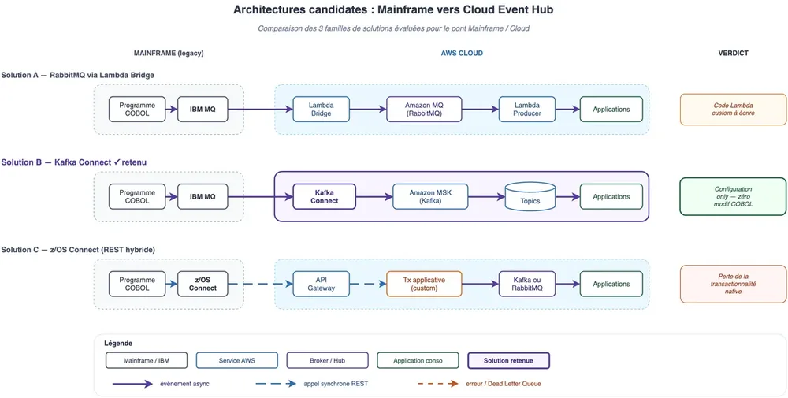
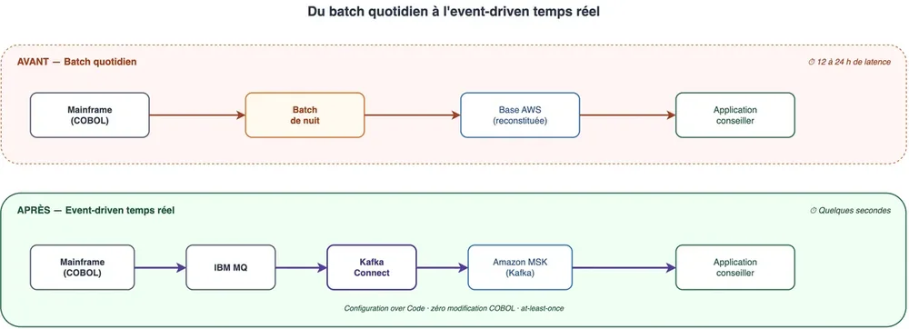
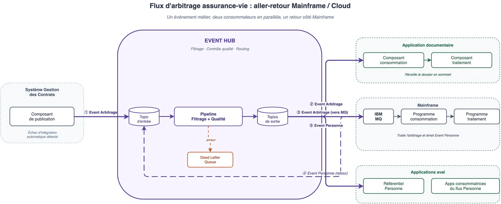
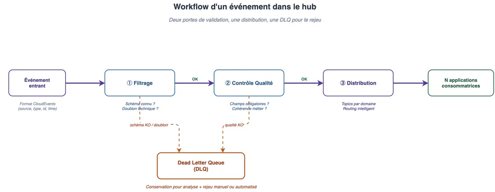

<!-- markdownlint-disable-file -->


Comment réconcilier 80 à 90 % des données métier coincées dans un Mainframe IBM avec des applications cloud-native qui exigent l'instantané ? Retour d'expérience sur la construction d'un pont event-driven entre le Mainframe et AWS sans toucher à une seule ligne de COBOL.

## 1. L’expérience utilisateur d’abord : le conseiller "aveugle"

Imaginez un conseiller en banque privée, censé offrir un service d'excellence à des clients exigeants. Pourtant, chaque matin, il commence sa journée avec un handicap majeur : il est "aveugle" sur les dernières 24 heures.

Si son client a effectué un virement important, soldé une assurance-vie ou reçu des fonds hier après-midi, le conseiller ne le voit pas. 
Pourquoi ? 
Parce que le système d'information repose sur des **batchs de nuit**. Les données sont traitées en masse, une fois par jour. Pire, si le batch "plante" la nuit (ce qui arrive), le retard s'accumule, et l'aveuglement dure 48 heures.

Prenons un exemple concret. Un client demande un arbitrage sur son assurance-vie via le portail web. L'opération est traitée par le système de gestion des contrats, mais l'intégration automatique échoue (dans notre contexte, 5 à 20% des cas selon les opérations). Résultat : le dossier reste "en sommeil" dans l'application documentaire, invisible pour le gestionnaire. Le client attend, relance, s'impatiente. Le problème n'est pas un bug, c'est un **défaut d'architecture**.

C'est le choc des cultures. D'un côté, un **Mainframe IBM** (le "Vieux Monde"), robuste, sécurisé, mais rigide et rythmé par ses batchs quotidiens. Dans notre contexte, il concentre **80 à 90% des données métier** de l'entreprise, un poids incontournable. De l'autre, des applications modernes sur **AWS** (le "Nouveau Monde"), conçues pour l'instantanéité et l'expérience utilisateur fluide.

Notre mission ? Réconcilier ces deux mondes.

## 2. Le défi technique : faire parler un dinosaure

Le problème fondamental est architectural : **le COBOL n'est pas conçu pour l'événementiel**.

Les programmes Legacy sont procéduraux. Ils traitent des fichiers, pas des flux. Leur demander d'émettre un événement HTTP ou d'appeler une API à chaque transaction est risqué (latence, couplage fort) et complexe (réécriture de code critique vieux de 30 ans).

Nous avons évalué plusieurs architectures candidates, regroupées en **trois grandes familles**, récapitulées dans le schéma plus bas :

### Solution A : RabbitMQ via Lambda Bridge

[RabbitMQ](https://www.rabbitmq.com/) (via [Amazon MQ](https://aws.amazon.com/amazon-mq/)) offre un routage intelligent natif et, depuis la v3.9, un [mode ](https://www.rabbitmq.com/streams.html)[**Stream**](https://www.rabbitmq.com/streams.html) combinant messaging classique et event-streaming. L'option la plus économique serait une connexion AMQP directe depuis le COBOL, mais elle exigeait de réécrire les programmes Mainframe. Les variantes plus sûres reposent sur un **bridge Lambda** entre IBM MQ et Amazon MQ, au prix de code custom à écrire et maintenir.

### Solution B : Kafka Connect, la gagnante

[Kafka Connect](https://kafka.apache.org/documentation/#connect) (associé à [Amazon MSK](https://aws.amazon.com/msk/)) consomme directement IBM MQ via un [connecteur officiel IBM Event Streams](https://github.com/ibm-messaging/kafka-connect-mq-source). Le Mainframe continue de déposer ses messages dans ses files MQ comme il l'a toujours fait ; le connecteur les réplique en topics Kafka et inversement. Aucune ligne de code custom : tout se pilote par configuration. C'est l'approche **"Configuration over Code"** qui a tranché.

### Solution C : z/OS Connect (REST hybride)

Utiliser [**z/OS Connect**](https://www.ibm.com/products/zos-connect) pour exposer des API REST depuis le Mainframe vers le broker AWS. Avantage : supprime la dépendance à [IBM MQ](https://www.ibm.com/products/mq). Inconvénient majeur : on perd la **transactionnalité native**, il faut recréer la gestion de transactions côté applicatif.





Elle a gagné sur un critère décisif : **zéro modification du code COBOL**.

| Critère | RabbitMQ | Kafka (MSK) | ActiveMQ |
| --- | --- | --- | --- |
| Débit | 20-50K msg/s | 50-100K msg/s par partition (millions sur un cluster) | 10-20K msg/s |
| Replay natif | Via extension Stream | Excellent (log persistant) | Limité |
| Scalabilité | Bonne | Excellente | Bonne |
| Routage intelligent | Oui (exchanges) | Non (côté client) | Oui |
| Intégration MQ native | Code custom nécessaire | Kafka Connect (config only) | Code custom nécessaire |
| Service managé AWS | Amazon MQ | Amazon MSK | Amazon MQ |


L'argument décisif n'était pas seulement la performance, mais **la simplicité d'intégration**. Avec Kafka Connect et les connecteurs IBM Event Streams, nous pouvions adopter une approche **"Configuration over Code"** : le Mainframe continue de déposer ses messages dans IBM MQ comme il l'a toujours fait, et le connecteur se charge du reste.

## 3. La solution : Kafka Connect comme pont bidirectionnel

### Avant / après : vue d'ensemble





Le contraste est radical : le batch de nuit, linéaire et bloquant, cède la place à un pipeline d'événements continu où chaque mouvement remonte en quelques secondes.

La solution retenue est d'utiliser **Kafka Connect** pour faire le pont entre le monde IBM MQ (la messagerie native du Mainframe) et [Amazon MSK](https://aws.amazon.com/msk/) (Managed Streaming pour [Apache Kafka](https://kafka.apache.org/)) et ce pont fonctionne **dans les deux sens**.

### Sens Mainframe → AWS (source)

Le Mainframe dépose un événement dans une file MQ. Le connecteur l'ingère et le transforme en topic Kafka.

```plain text
# CONFIGURATION 1 : Ingestion (MQ -> Kafka)
connector.class=com.ibm.eventstreams.connect.mqsource.MQSourceConnector
mq.queue=MQ_KAFKA
topic=msk-serverless-tutorial
mq.record.builder=com.ibm.eventstreams.connect.mqsource.builders.DefaultRecordBuilder
```

### Sens AWS → Mainframe (sink)

Les applications modernes sur AWS peuvent aussi renvoyer de l'information (ex: validation d'opération) au Mainframe. Kafka Connect lit le topic et écrit dans la file MQ.

```plain text
# CONFIGURATION 2 : Restitution (Kafka -> MQ)
connector.class=com.ibm.eventstreams.connect.mqsink.MQSinkConnector
mq.queue=KAFKA_MQ
topic=msk-serverless-tutorial
mq.connection.mode=client
```

L'avantage de cette solution, c'est qu'il n'y a **aucune ligne de code à écrire pour l'ingestion**. Tout se passe par configuration.

### Un exemple concret : le flux d'arbitrage





Pour illustrer ce bidirectionnel, prenons notre cas d'arbitrage assurance-vie :

- Le système de gestion des contrats détecte un échec d'intégration → il publie un **événement "Arbitrage"** dans le Hub

- Le pipeline (filtrage + contrôle qualité) valide l'événement et le route vers les topics de sortie

- Deux consommateurs reçoivent l'événement en parallèle :

- Kafka Connect (côté Source) reprend cet événement, le republie dans le Hub, qui le distribue aux **applications aval** (Référentiel Personne et apps consommatrices)

Un seul événement métier, deux consommateurs, un aller-retour complet entre les deux mondes.

## 4. Standards et interopérabilité

Pour que ce pont fonctionne à l'échelle (des dizaines de flux, pas un seul POC), il faut **standardiser le contrat d'interface** entre producteurs et consommateurs.

### CloudEvents : un format universel

Nous avons adopté [**CloudEvents**](https://cloudevents.io/) ([spécification CNCF](https://github.com/cloudevents/spec)) comme format d'événement. Chaque message transitant par le hub porte des métadonnées standardisées : `source`, `type` et `id` (identifiant unique) sont **requis** par la spec, tandis que `time` (timestamp) et `dataschema` sont recommandés. Cela garantit la **traçabilité de bout en bout** et l'interopérabilité, quel que soit le transport (HTTP, AMQP, Kafka).

### AsyncAPI : documenter l'architecture événementielle

Comme [**OpenAPI**](https://www.openapis.org/) documente les API REST, [**AsyncAPI**](https://www.asyncapi.com/) décrit nos canaux événementiels en YAML : quels événements, quels formats, quels serveurs, quels protocoles. Un **SDK est généré** à partir de ces spécifications et distribué aux équipes productrices et consommatrices, garantissant un contrat d'interface cohérent sans effort manuel.

### Deux types d'événements

Nous avons distingué deux catégories fondamentales :

- **Événement Métier** (notification) : "un arbitrage a échoué", il signale qu'un fait s'est produit, sans embarquer toutes les données.

- **Événement Data** (propagation d'état) : réplication complète d'un jeu de données depuis le système maître vers N systèmes esclaves.

Cette distinction évite de surcharger le bus avec des payloads inutiles tout en garantissant la fraîcheur des données là où c'est nécessaire.

## 5. Le pipeline de traitement





Les événements ne transitent pas "bruts" dans le hub. Un pipeline en trois étapes assure la qualité et l'aiguillage des données :

- **Filtrage** ([AWS Lambda](https://aws.amazon.com/lambda/)) : vérifie que l'événement est attendu, correspond à un schéma connu, et n'est pas un doublon technique.

- **Contrôle Qualité** (AWS Lambda) : valide le contenu métier, champs obligatoires, cohérence des données, conformité au schéma CloudEvents.

- **Distribution** : routing intelligent vers les topics de sortie par domaine, consommés par N applications.

Si un événement échoue à l'une des deux étapes de validation, il est redirigé vers une [**Dead Letter Queue (DLQ)**](https://docs.aws.amazon.com/AWSSimpleQueueService/latest/SQSDeveloperGuide/sqs-dead-letter-queues.html). Rien n'est perdu : l'événement est conservé pour analyse et rejeu éventuel, mais il ne "pollue" pas les consommateurs en aval.

## 6. Sécurité et fiabilité : zero message loss

Dans la banque, perdre un message signifie potentiellement perdre de l'argent ou une instruction client. C'est inacceptable.

Kafka Connect offre ici une garantie technique majeure : le [**"at-least-once delivery"**](https://kafka.apache.org/documentation/#semantics).

Comment cela fonctionne-t-il concrètement ?

- **Transactions et Offsets** : Le connecteur ne valide la lecture ("commit via offset") qu'une fois le message bien arrivé à destination.

- **Résilience Réseau** : Si le lien entre AWS et le Mainframe coupe :

- **Garantie de bout en bout** : De la file MQ source jusqu'au topic Kafka répliqué sur 3 Availability Zones (AZ), la donnée est toujours persistée avant d'être acquittée.

Nous passons d'un couplage temporel fort (le batch de nuit) à un couplage lâche mais ultra-robuste.

## 7. Retours d'expérience : difficultés et prérequis

La mise en place de ce pont n'a pas été sans embûches. Voici les principaux enseignements.

### Intégration réseau et infrastructure

- **Proxy d'entreprise** : L'environnement AWS tourne derrière un proxy corporate. Chaque composant (EC2, connecteurs) doit être configuré avec les bonnes exclusions (métadonnées AWS, endpoints MSK). Un oubli = un connecteur muet sans message d'erreur explicite.

- **Résolution DNS** : Les endpoints MSK Serverless nécessitent parfois une résolution DNS manuelle (fichier hosts) dans les sous-réseaux privés, car les VPC endpoints ne sont pas toujours immédiatement résolus.

- **Accès restreint** : Pas de SSH en environnement de pré-production, tout passe par [AWS SSM (Systems Manager)](https://aws.amazon.com/systems-manager/). Le debug d'un connecteur Kafka en panne devient un exercice de patience.

- **Port spécifique** : [MSK Serverless](https://aws.amazon.com/msk/features/msk-serverless/) utilise le port **9098** pour l'[authentification IAM](https://docs.aws.amazon.com/msk/latest/developerguide/iam-access-control.html) (différent du 9094 TLS classique). Une source de confusion récurrente.

### Compatibilité et formats

- **EBCDIC et formats fixes** : Les messages MQ du Mainframe sont souvent dans des formats historiques (COPYBOOK). Il faut prévoir une transformation ([Single Message Transform](https://docs.confluent.io/platform/current/connect/transforms/overview.html) dans Kafka Connect) pour produire du JSON exploitable.

- **Rétrocompatibilité applicative** : Certaines applications consommatrices tournent sur des frameworks anciens. Les librairies IAM et CloudEvents n'étant pas disponibles sur toutes les versions, des compromis de version ont été nécessaires.

### Gestion des doublons

Le "at-least-once" implique des doublons possibles. Chaque consommateur doit être **idempotent**, typiquement via une clé de déduplication sur l'identifiant métier (numéro de contrat + identifiant d'opération).

### Gouvernance et observabilité

- **Dictionnaire d'événements** : Sans catalogue formalisé des événements (qui produit quoi, quel schéma, quelle fréquence), le hub devient rapidement une boîte noire. Nous avons mis en place une gouvernance dédiée avec un RACI clair.

- **Monitoring unifié** : Le Mainframe et AWS ont des outils très différents. Les métriques JMX des connecteurs sont remontées dans [CloudWatch](https://aws.amazon.com/cloudwatch/) pour unifier la supervision. Le hub doit pouvoir émettre à tout moment une synthèse d'activité (qui a publié, qui a consommé).

- **FinOps** : Le coût se joue à deux endroits. Côté AWS, **MSK Serverless** (facturation à l'usage, pas de cluster à dimensionner en amont) limite l'investissement initial et s'adapte aux montées en charge réelles. Côté Mainframe, le licensing **IBM MQ** pèse lourd, mais Kafka Connect, qui consomme MQ de manière native, permet de le maintenir comme couche transitoire. Les équipes Mainframe planifient ainsi son décommissionnement à leur rythme, sans bloquer le déploiement du hub côté AWS.

### Conduite du changement

Les équipes Mainframe ne connaissent pas Kafka, et les équipes Cloud ne connaissent pas MQ. Un effort de **montée en compétence croisée** est indispensable, c'est peut-être le prérequis le plus sous-estimé.

## 8. Conclusion

Le résultat ? Le conseiller bancaire voit désormais les mouvements de son client quelques secondes après qu'ils aient eu lieu, et non le lendemain.

Nous avons "réveillé le dinosaure" sans le brusquer. Moderniser le Legacy ne signifie pas nécessairement tout réécrire ("Big Bang"). Parfois, il suffit de construire les bons ponts pour exposer la valeur existante aux nouveaux usages.

Les clés de cette réussite :

- **Configuration over Code** : Kafka Connect évite de toucher au COBOL

- **Standards ouverts** : CloudEvents + AsyncAPI comme contrat d'interface universel

- **Pipeline de qualité** : Filtrage et validation avant distribution, avec DLQ pour le rejeu

- **Gouvernance dès le jour 1** : Dictionnaire d'événements, monitoring unifié, FinOps

Le Mainframe n'est pas mort. Il a juste besoin qu'on lui construise les bonnes passerelles.