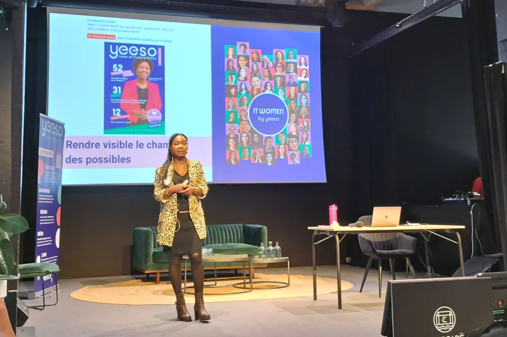
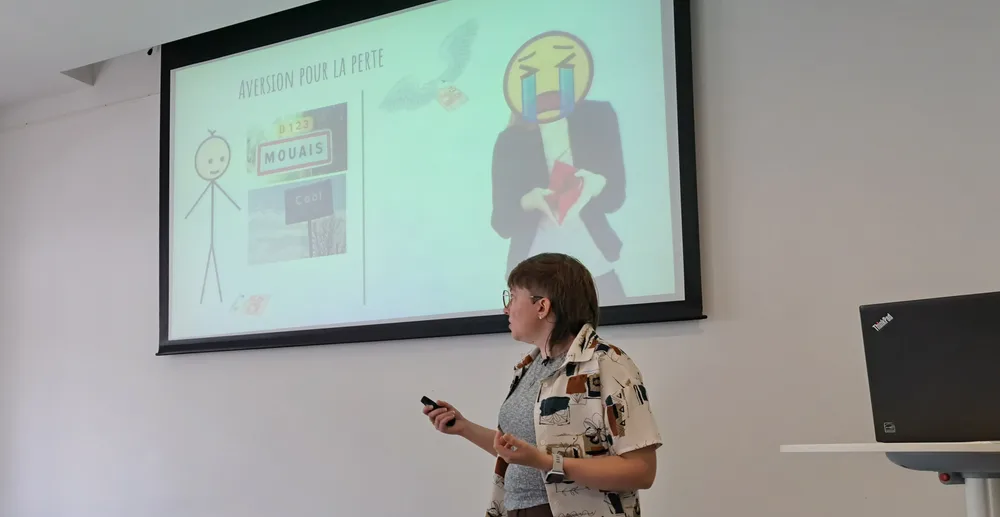
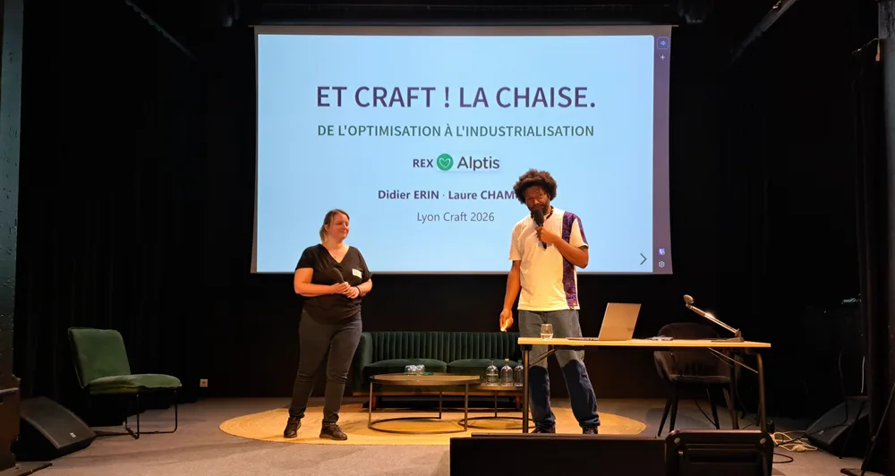

<!-- markdownlint-disable-file -->

Le printemps est là ! Les jours se rallongent, le temps se radoucit, les fleurs éclosent… et [Lyon Craft ](https://lyon-craft.fr/)revient, dans sa quatrième édition !

Ce 12 mai 2026, s’est donc déroulée une nouvelle journée organisée par les [Software Crafters Lyon](https://www.linkedin.com/company/software-crafters-lyon/). Journée à laquelle la team [HoppR](https://www.hoppr.tech/) était bien naturellement présente et [sponsor VIP](https://www.linkedin.com/posts/colin-damon_hoppr-certified-b-corp-renouvelle-son-soutien-activity-7450143430317551617-6YzT?utm_source=share&utm_medium=member_desktop&rcm=ACoAAAZmGCoB5r4NH8aG9GFIaRVyNOqCxN7v6iU), comme l’année dernière. J’avais déjà d’ailleurs fait un reporting à l’époque, à retrouver [ici](https://blog.hoppr.tech/blogs/2025-04-24-lyon-craft-2025-12) et [là](https://blog.hoppr.tech/blogs/2025-05-07-lyon-craft-2025-22).

Après un petit déjeuner pris dans la bonne humeur, nous avons assisté à l’habituelle séquence d’introduction et de remerciement des sponsors. Ce fut également l’occasion de présenter l’association [Yeeso](https://yeeso.fr/), dont HoppR est très proche. Nous avons ensuite eu le droit à un [programme dense en qualité](https://lyon-craft.fr/#programme), entre talks et ateliers. 

Je vous invite maintenant à découvrir avec moi ceux que j’ai choisis de suivre. Cet article sera en deux parties : une pour la matinée, l’autre pour l’après-midi.

## De villageoise à l’IT Woman … Quelles actions pour faire de mon rêve TECH une réalité ?

_Par Houleymatou Baldé - 45 minutes -_ [_Abstract_](https://lyon-craft.fr/sessions/de-villageoise-a-it-woman.html) _-_ [_Captation_](https://www.youtube.com/watch?v=Z6OWanI403c)

Je viens d’évoquer l’association Yeeso, et cela tombe bien puisque c’est sa co-fondatrice et présidente Houleymatou qui s’avance en première sur la grande scène pour ce premier talk, une keynote sur son passé personnel et ce qui l’a poussée à lancer cette belle association.

Houleymatou, née dans un petit village sans électricité de Guinée, est alors promise à la vie de femme classique dans les environs : orpheline, excisée, elle sera mariée à l’adolescence… Mais cette petite fille sait faire trois choses en particulier, qui lui serviront toute sa vie : **ne rien lâcher, ne jamais rater une opportunité, et s’entourer des bonnes personnes.**

> Je veux avoir une voix qui compte !

Déscolarisée par faute de moyens et de papiers, elle suit des cours à l’école depuis la fenêtre. Elle arrivera 5ème de sa promotion sans être techniquement scolarisée, ce qui poussera le village à se cotiser pour lui permettre de continuer son cursus. Puis viennent les allers-retours jusqu’au collège à pieds sans bonnes chaussures, sans manger à sa faim. Mais rien ne l’arrête.

Que fera-t-elle de sa vie ? Le déclic viendra en regardant la série 24h Chrono, et notamment celle qui deviendra alors son rôle modèle, [Chloé O’Brian](https://fr.wikipedia.org/wiki/Chloe_O%27Brian), la spécialiste en informatique de la série. Une femme qui se bat, qui sait argumenter mais aussi se remettre en question, et qui est reconnue pour son expertise.

> Je veux être experte informatique, comme Chloé !

Après un bac scientifique et un concours remporté, direction la France et Lyon. Première surprise : elle y retrouve le patriarcat et les injustices qui sont donc partout. Le pays change, ces vieilles règles restent les mêmes. Mais peu importe pour Houleymatou : elle est prête et sûre d’elle. Elle comprend que ce n’est pas sur cela qu’elle doit mettre son énergie, mais sur ce qui lui importe, dans sa carrière comme dans son entourage.

> Tu es raciste ? Sexiste ? **Je** décide du temps à t'accorder, je ne vais pas changer, c'est ma fierté d'être qui je suis. Si ça te dérange passe ton chemin, reste derrière, je vais prendre la place et exister !

Rejoignant le monde de la tech, elle se rend compte que celui-ci est majoritairement masculin, en particulier sur les postes purement techniques. Il existe donc selon elle un vrai problème sociétal, et souhaite donc que l’on investisse dans l'éducation, que l’on dénonce le sexisme, et que les femmes et hommes apprennent enfin à travailler ensemble. Les personnes injustes sont moins nombreuses mais plus bruyantes, il faut donc être plus bruyants qu’eux pour faire disparaître les inégalités. Elle conclue ainsi en proposant trois actions par catégorie :

| Femmes | Hommes alliés | Entreprises |
| --- | --- | --- |
| Femmes | Hommes alliés | Entreprises |
| Prendre sa place, mettre l'énergie sur son projet | Écouter, autoriser à demander de l'aide | Ne pas faire que de la com’ sur ses femmes, mais se donner des objectifs et les mesurer  |
| Apprendre à s'entourer | Faire de la place autour de vous, faire monter tout le monde en compétence, partager | Travailler avec les hommes et femmes de l'entreprise, trouver un entre deux. Ne pas chercher à recruter des femmes à tout prix, mais plutôt leur donner un environnement où elles seront à l’aise |
| Chercher votre rôle modèle, puis en devenir un, inspirer les autres | La mixité touche tout le monde, s'engager pour être plus nombreux  | Soutenir les associations |

## Git reset --hard

_Par Adeline Morel - 45 minutes -_ [_Abstract_](https://lyon-craft.fr/sessions/git-reset-hard.html) _-_ [_Captation_](https://www.youtube.com/watch?v=7CDoPXIaMms)

Adeline souhaite nous parler d’une commande que la grande majorité des développeur·euses connaissent : [git reset](https://git-scm.com/docs/git-reset). Elle nous en présente les trois modes :

- `git reset --soft` : les changements restent _changed_

- `git reset --mixed` : les changements redeviennent _unstaged_

- `git reset --hard` : tout ce qui n’est pas commité est **perdu**

Mais la partie technique n’est pas ici ce qui nous intéresse le plus. On parle ici de retour en arrière, de suppression de ce que l’on vient de réaliser. L’utilisation de ces commandes provoquent à Adeline ce que l’on appelle des [biais cognitifs](https://fr.wikipedia.org/wiki/Biais_cognitif).

Elle en vise ici plusieurs en particulier :

- **Le biais des coûts irrécupérables** (escalade d'engagement), lié à l’aversion pour la perte. Il est difficile pour nous de “gâcher” ce que l’on vient de construire et l’on s’entête alors à continuer

- **Le biais de confirmation**. Ici, elle vise sa manière de faire du TDD : sa manière d’écrire ses tests est parfois brouillée par des idées d’implémentation qu’elle a déjà

- **Le biais d'ancrage**. Nous savons difficilement nous débarrasser d’une première impression, et nous avons tendance à nous y fier excessivement

Pour maîtriser ces biais, Adeline nous donne plusieurs solutions :

- **Sécuriser l'exploration** pour mieux décider, en sécurité avec la codebase, l'équipe, les tests, les feedbacks, pour prendre du recul. Les feature flags en sont aussi une composante, et il faut se rappeler que les tests sont une documentation vivante utile pour comprendre le code

- **Isoler et découper** pour aménager de la place pour la [métacognition](https://fr.wikipedia.org/wiki/M%C3%A9tacognition) (faciliter la relecture, gérer les interruptions efficacement, [isoler le domaine avec l'architecture hexagonale](/1acf4462cd38809f802ecb90c6901fba)...) et éviter ainsi davantage de charge mentale

Bien entendu, quand une difficulté est découverte, des méthodologies sont testées, comme par exemple :

- **La méthode Mikado**. Dans le jeu éponyme, il faut réussir à retirer un bâton sans faire bouger les autres. Côté code, il faut réussir à isoler et modifier de manière itérative sans faire s’effondrer le projet (et intégrer ainsi des régressions). Il est donc nécessaire d’y aller petit à petit, en _baby steps_, et de revenir en arrière si besoin.

- **Le TCR** (pour `test && commit || revert`**)** de [Kent Beck](https://medium.com/@kentbeck_7670/test-commit-revert-870bbd756864). L’idée semble presque contradictoire avec celle du TDD (inventé par… Kent Beck). Là aussi, on avance par petits pas, et quand un test est rouge… on revient en arrière !

Et Bien entendu, le _software craftsmanship_ et les coding dojos/katas apportent déjà beaucoup de bonnes pratiques permettant de limiter les biais cognitifs.

> Et si abandonner n'était pas un échec, mais une stratégie gagnante ?

Il nous faut dompter nos biais et rester maîtres·ses du jeu. Finalement, `git reset --hard` n’est pas une défaite, c’est un pas en arrière pour prendre du recul sur la problématique à laquelle on tente de répondre.

## Et Craft, la chaise !

_Par Didier Erin et Laure Champel - 45 minutes -_ [_Abstract_](https://lyon-craft.fr/sessions/et-craft-la-chaise.html) _-_ [_Captation_](https://www.youtube.com/watch?v=XR7ZVn7fSt8)

C’est un duo qui monte cette fois sur la scène principale du Lyon Craft 2026. Didier et Laure veulent nous parler de Liza, une bricoleuse qui construit des chaises. Seulement, elle est obligée de tester systématiquement chacune d’entre elles avant de les mettre en vente, ce qui lui prend beaucoup de temps (et quelques chutes !)

Nous avons bien entendu ici affaire à une analogie avec le SI et les livraisons en production de nouveaux produits. Ce REX montre les étapes de la mise en place de l’optimisation et de l’industrialisation chez Alptis.

L’exemple donné est celui d’une migration Java 11 => 21 qui s’est passée dans la douleur. Les tests, non pertinents, n'ont pas permis de détecter les régressions. Ont lieu alors de trop nombreux allers-retours entre l’équipe de développement et celle de recette.

De plus, la norme sur la création de nouveaux produits et de 6 mois de développement par une équipe de 4/5 personnes, pour une livraison en production à la fin du projet. Ça fonctionne à peu près, mais il est dommage de repartir de 0 à chaque fois, et donc de créer seulement 2 produits par an.

> Et si le problème n'était pas la vitesse, mais la façon de fabriquer la chaise ?

Didier arrive alors avec l’occasion de tester une nouvelle manière de faire, respectant les méthodologies du software craftsmanship, sur un nouveau produit et avec une nouvelle équipe.

Le chemin est semé d’embûches : l’équipe ne connaît ni le métier, ni l’environnement de l’entreprise, et à part Didier ni le TDD. Viennent donc la mise en place de _mob programming_ pour apprendre ensemble et effectuer cette triple montée en compétences. La livraison continue, des US plus itératives, et un périmètre allégé (pour la sortie d’un [MVP](https://fr.wikipedia.org/wiki/Produit_minimum_viable)) sont d’autres nouvelles manières de faire mises en place.

Pour reprendre l’analogie avec l’atelier de Liza, elle s’est entourée d’un expert artisan, qui lui permet de mieux structurer sa manière de faire, et d’éviter cette fameuse vérification finale autrefois nécessaire.

Dû à beaucoup de difficultés rencontrées (changements dans l’équipe, synchro difficile avec des équipes externes, etc.), le travail de Didier se complique. Le produit arrivera finalement avec un mois de retard et sur un périmètre réduit. Le résultat est donc contrasté sur ce produit, mais le code livré est maintenant bien plus sûr et maîtrisé, ce qui est donc positif pour les futurs produits à suivre.

Le prochain arrive d’ailleurs, et doit être livré rapidement. Le métier est cette fois réticent à rogner sur les fonctionnalités. Mais comme pour l’atelier de Liza, si toutes les chaises ont les mêmes pieds, ça ira plus vite !

En reprenant le produit précédent, sain, sûr, et assez proche de celui à construire, on gagne du temps. Cette fois-ci, le développement se fait en deux mois seulement, et c’est la recette qui devient le goulot d’étranglement. D’ailleurs, les rares retours concernent souvent les deux produits, et sont corrigés en simultanés. Un mois de plus pour implémenter des règles spécifiques et des fonctionnalités de confort (là aussi reportées sur le produit précédent !), et ce nouveau produit sort en 3 mois seulement !

Ne reste plus qu’à industrialiser pour capitaliser sur cette réussite. Un projet template, géré par une équipe socle, est ainsi créé, pour servir de base de travail pour tous les futurs produits.

La diffusion des principes craft continue en parallèle, avec des animations d’ateliers avec d’autres équipes. Cela a également un impact sur les profils non-tech, qui voient que “Craft” n’est pas juste un _buzzword_.

Et maintenant, Liza ne teste plus ses chaises, elle est devenue une artisane de grande qualité, et elle passe plus de temps à savoir ce que le client veut pour toujours plus le satisfaire.

## Fin de cette matinée

En voilà une belle matinée pleine de talks inspirants ! Après le déjeuner, nous attaquons une nouvelle salve de talks.

Je vous propose donc de continuer ce retour de conférence dans un second article à paraître, où nous parlerons de communautés, de parcours de carrière, d’IA… et de vente de surgelés !
