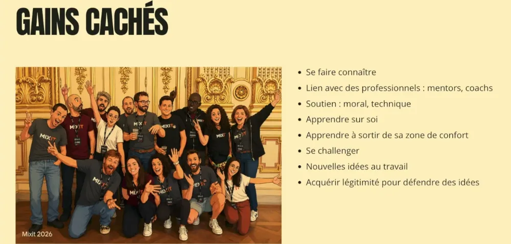
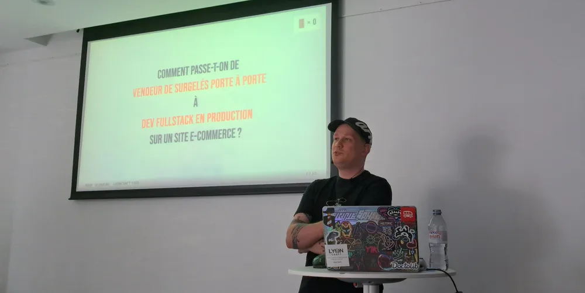
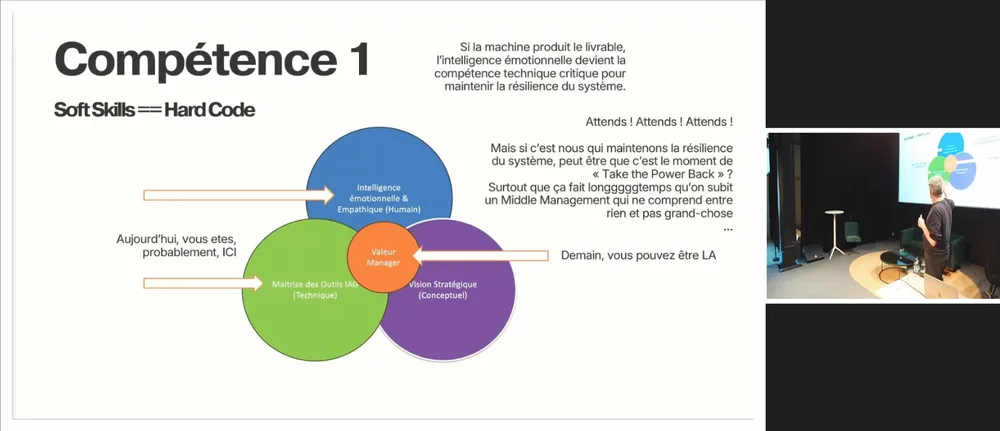

<!-- markdownlint-disable-file -->

Cet article est la suite de [mon retour sur Lyon Craft](https://blog.hoppr.tech/blogs/2026-05-18-lyon-craft-2026-12). Dans la première partie, nous avions couvert les talks auxquels j’ai eu la chance d’assister dans la matinée. Place maintenant à ceux de l’après-midi !

## Community-Driven Developer : bilan d’un engagement (actifs, passifs, coûts cachés)

_Par Johana Lavigne - 20 minutes -_ [_Abstract_](https://lyon-craft.fr/sessions/community-driven-developer-bilan-d-un-engagement.html) _-_ [_Captation_](https://www.youtube.com/watch?v=umLrzwbxzLE)

Premier talk pour Johana, ancienne fiscaliste reconvertie dans le développement informatique, due à une volonté d’apprendre de nouvelles choses. 

Il devient alors nécessaire pour Johana de faire du réseau dans ce nouveau milieu, ce qui dans un premier temps n’est pas quelque chose qui la met à l’aise. Cependant, elle découvre les conférences tech, et cela devient directement une passion !

Elle entend alors parler de [Duchess France](https://www.duchess-france.fr/). Cette association a pour mission de valoriser et promouvoir les développeuses et les femmes avec des profils techniques. Johana rejoint leur Slack en non-mixité, et reçoit de nombreux conseils. Elle rejoint officiellement l’association en décembre 2023, l’année de sa reconversion, inspirée par sa marraine Duchess.

D’ailleurs, une Duchess réalise une présentation à [LyonJS](https://www.lyonjs.org/). Johana y voit une opportunité d’agir et de participer à l’organisation de l’évènement. Et ce qui devait être un onboarding pour la journée se transformera en une inscription à l’association. Cela fait deux !

Parallèlement à tout cela, elle obtient un emploi dans une startup pour travailler sur un projet legacy. Elle pose beaucoup de questions, et on finit par lui proposer de faire des katas, pour progresser. Elle est également mentorée pendant plusieurs mois.

D’ailleurs, elle obtient un entretien pour une entreprise qui l’intéresse beaucoup, mais lui demande un test technique très complet et craft. Elle sollicite des mentors, et l’un d’entre eux l’aide à effectuer un refactoring de sa solution pour la perfectionner. Celui-ci se trouvera être un membre des [Software Crafters Lyon](https://fr.linkedin.com/company/software-crafters-lyon). Johana finit donc par intégrer cette troisième association, et devient organisatrice en Janvier 2026.

Avec la possibilité de comparer trois associations qui lui plaisent, et des fonctionnements différents, elle prend le recul de faire un bilan.

Parmi les coûts cachés de ces participations aux différentes communautés, elle cite la charge de travail parfois importante suivant l’association, et l’émotion que cela induit. On s’engage réellement, et des frictions avec d’autres membres peuvent également arriver.

Mais cela n’est rien face à ce que ça lui apporte : se faire connaître, avoir du soutien, se challenger, sortir de sa zone de confort, et augmenter sa légitimité. Cela vous intéresse aussi ? Elle vous donne trois clés pour faire de même : rechercher, participer et échanger.

## Développeur par obstination, ou comment les galères forment mieux que les filières

_Par Rémy Cassagne - 45 minutes -_ [_Abstract_](https://lyon-craft.fr/sessions/developpeur-par-obstination.html) _-_ [_Captation_](https://www.youtube.com/watch?v=ByUHoqpBp6Q)

Rémy est lui aussi nouveau speaker, et lui aussi passé par une reconversion. Il souhaite nous parler de son aventure pour devenir développeur.

> Comment passe-t-on de **vendeur de surgelés porte à porte** à **dev fullstack en production** sur un site e-commerce ?

Rémy souhaite nous présenter son parcours du combattant pour devenir développeur, et nous montrer que toutes les portes fermées auxquels il a fait face lui ont permis d’accomplir son rêve.

Sans bac ni autre diplôme, Rémy est d’abord recruté en tant que vendeur de surgelés en porte à porte. Sa tournée se réalisait sur une liste de clients définis, mais des “trous” se créaient quand ceux-ci ne commandaient plus. Il lui a donc fallu faire de la prospection, du porte à porte, en faisant face aux difficultés (circulation, quartiers difficiles, etc.)

Suite à de nombreux refus (et littéralement des portes fermées), il est obligé de trouver des moyens de réussir, et il les acquiert finalement :

- Définir les besoins avant d’agir

- Poser les bonnes questions rapidement

- Ne pas avoir peur de l’inconnu

Cette liste semble étrangement familière avec ce qui peut être vécu par les développeur·euses en mission. Sans le savoir, Rémy est déjà sur la pente de son apprentissage du métier…

Au bout de deux ans et demi, il rentre dans une routine, qu’il a envie de casser. Il ne sait cependant pas quoi faire. Il entend par hasard parler de l’[école 42](https://42.fr/), gratuite et sans pré-requis de diplôme, ce qui lui correspond parfaitement. Et là, c’est le coup de foudre avec la tech, le déclic qui lui fait dire “Je veux être développeur”. Mais il est au final refusé.

Après ce premier échec, Rémy retourne dans la vente tout en se formant en parallèle seul au C pour tenter sa chance de nouveau. Bien plus à l’aise à ce second essai, il est confiant quant au résultat. Mais c’est la douche froide : il est refusé une seconde fois. Vient un moment d’introspection, mais aucun doute, il sait ce qu’il veut faire.

> Le blocage ne m'arrête pas. Il me redirige.

Il passe alors par une autre école. Cependant ce ne sera pas non plus par là que son aventure s’écrit. Mais cette nouvelle expérience lui donne de nouvelles bases, et surtout le pousse à aller sur LinkedIn et à des meetups, ce qui lui servira plus tard.

Après 6 mois d’autoformation en parallèle d’un travail alimentaire, il connaît maintenant React, et se construit un portfolio avec des projets personnels le soir. Il lit également beaucoup, notamment le [fameux Clean Code](https://www.amazon.fr/Clean-Code-Handbook-Software-Craftsmanship/dp/0132350882).

Il s’inscrit alors à un bootcamp. Lors d’un tour de table, pour savoir pourquoi chaque personne s’est inscrite, il lâchera une phrase marquante : "**Je suis ici pour enfin réussir quelque chose de ma vie**”. Le poids des échecs se fait ici sentir, mais il ne lâche rien. Il apprend alors le Ruby, le travail en groupe, et obtient enfin son premier diplôme !

Vient alors un premier stage dans une startup. Seul et en autonomie, il travaille l’UX/UI d’un projet avec réussite. Il sort ensuite un projet perso qu’il publie sur les stores, [KicksFolio](https://play.google.com/store/apps/details?id=app.kicksfolio&pcampaignid=web_share), qui lui apprend le coût d'aller jusqu'à la fin d’un projet.

Arrive ensuite une période creuse de plusieurs mois sans mission, de centaines de candidatures envoyées pour quelques entretiens qui n’aboutissent pas. Mais comment présenter et surtout vendre un parcours aussi atypique ?

> Ce que le craft fait en dehors des lignes de code : il **créé des cercles** où les gens se retrouvent.

Rémy lance alors une bouteille à la mer sur LinkedIn, pour simuler des entretiens et obtenir des retours francs. Il devient plus percutant et pertinent, mais ça n’est pas encore suffisant pour décrocher un poste. Il se remet en question : faut-il qu’il change d’idée de carrière ? Qu’ils s’expatrie pour trouver sa place ?

Et c’est au moment où il songe à abandonner que deux offres arrivent en même temps. Grâce à tous ses apprentissages, aux portes fermées qu’il a trouvées sur son chemin, Rémy devient ainsi officiellement développeur. Ainsi s’achève ce talk inspirant et très touchant sur un parcours hors du commun.

## La fin du Middle Management ou l’aube de l’Ingénieur Augmenté ?

_Par Raphaël Despinasse - 45 minutes -_ [_Abstract_](https://lyon-craft.fr/sessions/la-fin-du-middle-management-ou-l-aube-de-l-ingenieur-augmente.html) _-_ [_Captation_](https://www.youtube.com/watch?v=1t3PsomPAQQ)

Qui sera la cible principale de l’impact de la révolution IA dans nos entreprises ? Selon Raphaël, la perspective la plus probable est la fin du [middle management](https://en.wikipedia.org/wiki/Middle_management). 

Conformément au [paradoxe de Jevons](https://fr.wikipedia.org/wiki/Paradoxe_de_Jevons) présenté par Raphaël, l’IA qui était censée nous faire travailler moins fait l’exact inverse au sein de nos équipes. Après tout, pour l’entreprise, on peut maintenant coder vite, donc le code ne coûte plus rien, donc ne vaut plus rien, et on peut ainsi faire n’importe quoi… Ce qui peut saturer, griller des équipes entières au niveau opérationnel.

Il est donc temps que les développeur·euses reprennent le pouvoir.

> L'IA exécute. Les développeurs dirigent.

Cela veut dire pour les techs d’obtenir de nouvelles compétences et un nouveau positionnement :

- Avec cette strate de management qui disparaît, c’est l’occasion de se débarrasser de personnes ne voulant faire que du reporting, qui ne comprennent pas ce qui est fait, et de monter d’un cran sur la vision stratégique

- Devenir un pare-feu éthique et d’évaluation, garant de ce qui est produit par l'IA et de la morale

- Avoir un rôle de “_player coach_” : se recentrer sur la haute valeur, le pilotage de compétences, les formations, le mentoring, etc. Et pas que sur la technique (sujets de qualité, sécurité, gouvernance des données, etc.)

- Devenir un orchestrateur transverse

- Redéfinir son rôle, et se rapprocher du métier. Finalement, ne serait-ce pas le rôle de product owner qui risque de disparaître, plutôt que celui de développeur·euse ?

## Conclusion

Après cette journée très enrichissante et de nombreux échanges, le bilan est clairement positif ! Et c’est donc l’occasion de remercier l’organisation des [Software Crafters Lyon](https://fr.linkedin.com/company/software-crafters-lyon) et l’ensemble des bénévoles et speaker·euses. Les sponsors (dont [HoppR](https://www.hoppr.tech/)) ont également permis à cette nouvelle édition d’avoir lieu.

En comparaison avec le [Lyon Craft de l’année dernière](https://blog.hoppr.tech/blogs/2025-04-24-lyon-craft-2025-12), j’ai assisté à des talks moins techniques, mais avec des leçons de vie inspirantes, de la détermination et beaucoup de matière de réflexion. Au final, une conférence avec une composante humaine de plus en plus essentielle dans nos métiers.

Pour information, les talks ont été enregistrés et sont retrouvables sur le [YouTube de Software Crafters Lyon](https://www.youtube.com/@softwarecrafterslyon9383), où vous pourrez visionner tous ceux dont je n’ai pas pu parler dans mes articles.

Merci de votre lecture et à très bientôt sur ce blog pour reparler de Craft et de plein d’autres belles choses !