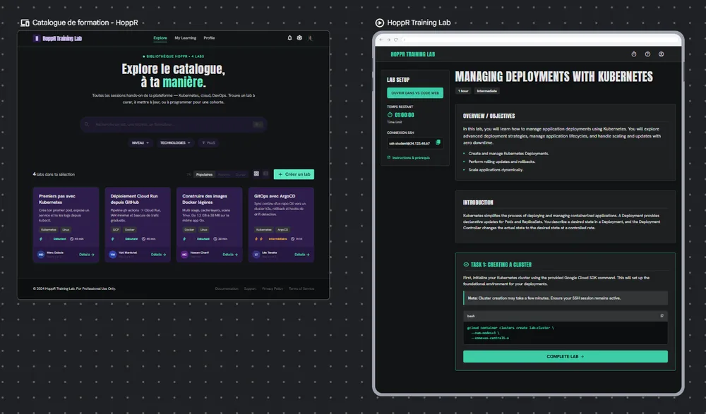
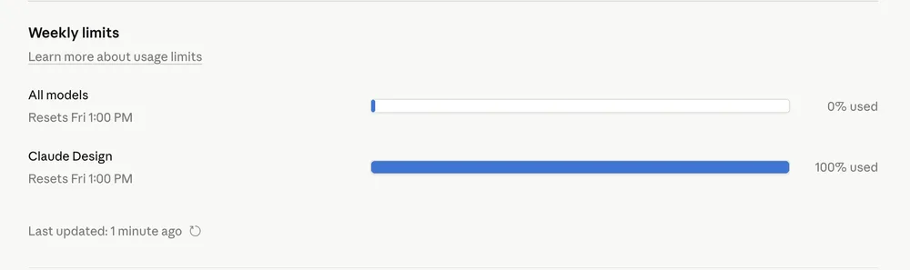
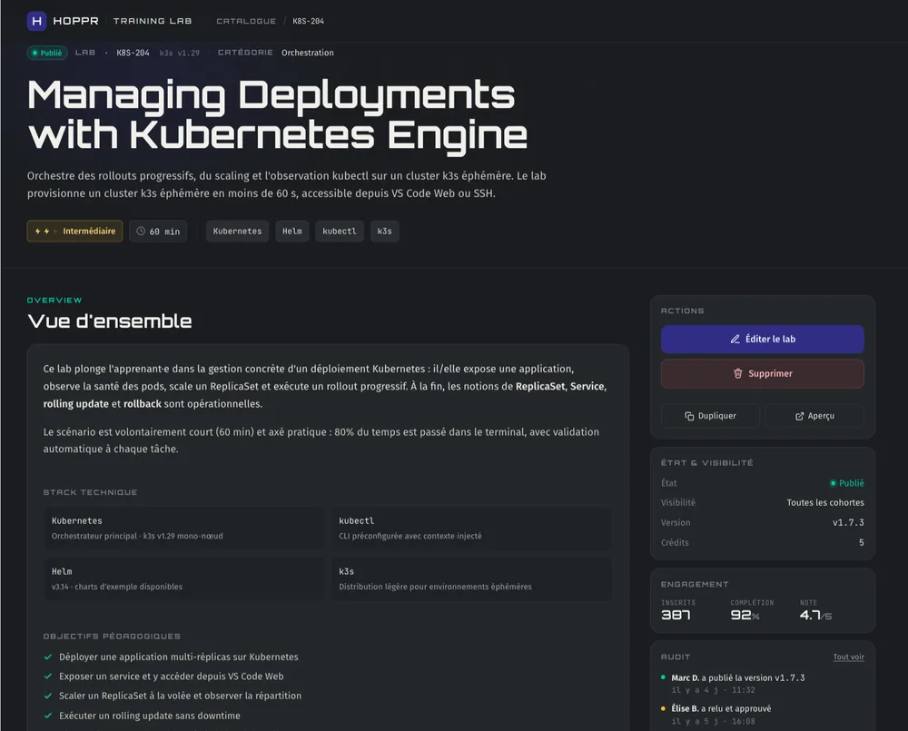

<!-- markdownlint-disable-file -->

_Retour d'expérience : 2 jours de Maker Days pour designer une plateforme de formation, sans designer._

---

Chez HoppR, nous organisons régulièrement des **Maker Days** : quelques jours pendant lesquels on met de côté le quotidien pour faire avancer un projet qui nous intéresse. Cette fois, le projet était une plateforme de formation internes comme [FSTC](https://blog.hoppr.tech/blogs/2025-07-16-from-scratch-to-craft-lhistoire-dun-programme-de-formation-pas-comme-les-autres) et aussi pour proposer à nos clients. Et plus précisément, l'interface côté **curateur / formateur** : les écrans qui permettent à un formateur de remplir le détail d'une formation, gérer son catalogue, etc.

Nous étions trois sur cette partie front. Trois développeurs. **Aucun designer**.

Externaliser le design d'un projet interne ? Trop cher, trop lent pour un POC. Le faire nous-mêmes à la main ? On l'a tous fait, on connaît le résultat : du Bootstrap mal aligné, ou du Material UI générique qui ne ressemble en rien à HoppR.

Alors on a tenté autre chose : on a confié le design à une IA. Voici ce qu'on en retire.

## L'objectif : un design qui ressemble à HoppR

Avant même de toucher un outil, on a passé du temps à cadrer le besoin métier. Qui utilise ces écrans ? Que vient-il y chercher ? Quelles informations sont essentielles, lesquelles sont du bruit ?

Une fois le périmètre fonctionnel défini, nous sommes tombés d'accord sur un point important : la plateforme de formation devait avoir **la même identité visuelle que le site et le blog HoppR**. Pas un produit qui ressemble à un truc générique de plus, mais bien un produit HoppR.

C'est là qu'on a commencé à comparer les outils.

## Premier essai : Google Stitch

[Google Stitch](https://korben.info/google-stitch-ai-design-ui.html) était séduisant sur le papier : **gratuit**, capable de générer plusieurs écrans rapidement. On a tenté.

Le résultat : des écrans isolés plutôt jolis, mais **aucune consistance entre eux**. Pire, à chaque itération sur une page, des éléments non concernés bougeaient. On demandait d'ajouter une section en bas de page, et la nav bar changeait. On précisait dans le prompt _"garde le reste de l'UI inchangé"_, sans effet.

Pour un prototype où plusieurs écrans doivent former un tout cohérent, c'était bloquant. On a vite tourné la page.

## Le pivot : Claude Design

En parallèle, @Nathan DELENCLOS  avait commencé à explorer [**Claude Design**](https://www.anthropic.com/news/claude-design-anthropic-labs) (la fonctionnalité de prototypage d'Anthropic, en Research Preview au moment où on écrit ces lignes).

Premier réflexe — celui qu'on a tous, je pense — on lui demande directement :

> Crée-moi une plateforme de formation, dans le style du site et du blog HoppR, inspirée de Google Skills Boost pour l'interface.

Résultat : une page **décente**, mais qui n'avait pas vraiment le style HoppR. Un peu trop générique, des couleurs approximatives, une typo qui ne correspondait pas.

On a alors compris ce qui manquait : Claude Design n'avait **aucune référence concrète** au design HoppR. Il faisait au mieux avec sa connaissance générale de "ce à quoi ressemble un site tech français" — c'est-à-dire pas grand-chose.

## La vraie méthode : commencer par le design system

On a tout repris. Cette fois, on a utilisé **Claude (la version chat classique)** pour extraire méthodiquement du site et du blog HoppR :

- la palette de couleurs (codes hexadécimaux précis)

- les polices utilisées (Fira Sans, JetBrains Mono, Orbitron)

- les composants récurrents (cartes, badges, boutons)

- le ton, les principes visuels

Toutes ces informations ont été agrégées dans un **prompt structuré**, qu'on a ensuite envoyé à Claude Design avec une consigne simple : **génère d'abord le design system, pas la page**.

Et là, le rendu était vraiment bon. Le design system généré reprenait l'identité HoppR de façon convaincante : style CSS, typographie, palette, composants de base. **Un vrai socle réutilisable.**

> 💡 Note importante : ça prend du temps. Comptez **10 à 15 minutes** pour qu'une page complète soit générée. C'est loin de l’effet "instantané" qu'on imagine parfois avec ces outils.

## De la page de catalogue à la page de détail

Avec le design system en place, on a enchaîné sur la **page de catalogue des formations**. Cette fois, le style HoppR était bien présent. Victoire ?

Presque. On s'est retrouvés avec pas mal d'éléments **non demandés** : boutons de lancement, système de crédits, navbar latérale… qui venaient en réalité de l'exemple Google Skills Boost qu'on avait donné en référence. Leçon retenue : **fournir des exemples est utile, mais c'est à double tranchant**. Claude Design recopie aussi les fonctionnalités, pas juste l'esthétique.

Et voici la première vraie limite ergonomique qu'on a heurtée : **impossible de supprimer un élément directement** dans l'interface. Pour modifier du texte ou retoucher du CSS léger, on peut éditer en place. Mais pour enlever toute une section, il faut **reprompter et regénérer**. Ce qui consomme du quota, ce qui prend du temps, et ce qui peut introduire d'autres modifications non désirées.

Pour la troisième page, le **détail d'une formation.** On a aussi cogné un autre mur : le **quota de Claude Design**.

## Le mur du quota

C'est probablement l'élément le plus important à anticiper si vous voulez utiliser Claude Design sur un vrai projet.

- Le quota Claude Design est **séparé du quota Claude classique** (pas de mutualisation).

- Il se **renouvelle de façon hebdomadaire**.

- Il **brûle très vite**, surtout en mode "high fidelity" qui est celui qui produit les rendus les plus exploitables.

- Même l'**export d'une page en HTML standalone** consomme des tokens, et prend du temps.

Concrètement, on a épuisé le quota d'un compte avant la fin du deuxième jour. Pour continuer, nous avons :

- Exporté le design system en HTML standalone.

- Exporté la page catalogue.

- Repris la session sur le compte d'un collègue, en **fournissant ces exports comme contexte initial**.

Avec ce contexte fourni d'entrée de jeu, on a eu un **prototype très correct dès la première génération** sur la page de détail. Et pour les ajustements (suppression des sections non désirées, etc.), on est passés directement dans le code HTML exporté, plutôt que de redemander à Claude Design.

## Ce qu'on a aimé

- **La qualité du prototype**, vraiment au-dessus de nos attentes pour un projet sans designer.

- **La cohérence entre les pages**, qui était le gros point faible de Google Stitch.

- La possibilité de **transformer un projet en template** réutilisable.

- Les **multiples formats d'export** : ZIP, PDF, PPTX, Canva, HTML standalone.

- La capacité à **déléguer ensuite l'implémentation** à Claude Code ou un autre agent, à condition de bien cadrer la stack technique et les principes d'architecture en amont.

## Ce qu'on a moins aimé

- **Le quota qui brûle vite**, et sa nature hebdomadaire qui peut bloquer un sprint.

- Les **10 à 15 minutes** par génération de page : utile à intégrer dans son planning.

- **Pas d'historique de versions** : si une régénération abîme votre prototype, c'est terminé.

- **Impossible de renommer** les pages dans l'interface, ce qui peut prêter à confusion sur un projet à plusieurs.

- **Impossible de supprimer un élément** sans passer par un reprompt.

- Claude Design est **disponible uniquement en web**, donc à jongler avec Claude Code (côté desktop / terminal) pour la suite.

- Les **exemples fournis contaminent** le résultat : Claude Design recopie aussi les features de l'exemple, pas juste le style.

- **L'accessibilité, angle mort du prototype.** Claude Design ne pense pas les contrastes, la structure sémantique, ni les parcours clavier. Pour un POC interne, c'est acceptable. Pour un produit qu'on livre à des clients, c'est un chantier à anticiper.

## Notre recette, si c'était à refaire

Avec le recul, voici l'ordre dans lequel on s'y prendrait :

- **Commencer par le design system**, et le sécuriser avant tout le reste.

- **L'exporter en HTML standalone** dès qu'il est satisfaisant.

- Selon le quota restant, **prioriser les pages les plus structurantes** (celles qui définissent les patterns réutilisés ailleurs).

- **Exporter à chaque milestone** atteint : c'est votre seul historique.

- Pour toute **modification mineure** (texte, couleur, suppression d'un élément), travailler directement sur l'export, dans Figma ou dans la phase de dev. Ne pas consommer du quota Claude Design pour ça.

- Une fois le quota épuisé, **déléguer le reste de l'implémentation à Claude Code** (ou autre agent IA), avec le design system et les pages clés comme contexte.

> 💡 Et tout du long : **s'assister d'autres IA (Claude, ChatGPT, Gemini) pour préparer les prompts**. Plus le prompt d'entrée est riche et précis, moins on consomme de quota en allers-retours.

## Alors, Claude est-il vraiment notre UX Designer ?

Soyons honnêtes : **non**.

Un designer UX, ce n'est pas qu'une personne qui produit de jolis écrans. C'est quelqu'un qui mène des entretiens utilisateurs, qui challenge le besoin métier, qui pense les parcours, qui itère sur les micro-interactions, qui défend l'accessibilité, qui construit une vision produit sur la durée. **Tout ça, Claude Design ne le fait pas.** Il prend un brief, et il rend un rendu visuel cohérent.

Mais sur un projet **interne**, **à petit périmètre**, **sans budget designer**, où l'enjeu est de **prototyper vite quelque chose de présentable pour itérer dessus** : oui, Claude Design tient ses promesses. Il nous a permis, à trois devs en deux jours, de produire des écrans qui ressemblent à du HoppR. Pas à un projet bricolé.

Pour le vrai produit qu'on vendra à nos clients, quand on passera à l'étape d'après, nous travaillerons évidemment avec un designer. Ce qu'on aura gagné, c'est d'arriver à cette conversation avec **un prototype concret en main**, plutôt qu'avec un Figma vide et de bonnes intentions.

Et ça, ce n'est pas rien.

---

## **À retenir**

- **Le design system d'abord.** C'est lui qui garantit la cohérence entre toutes vos pages.

- **Préparez vos prompts avec une autre IA.** Plus le brief est riche, moins vous brûlez de quota.

- **Exportez tôt, exportez souvent.** Il n'y a pas d'historique, vos exports sont votre seul filet.

- **Anticipez le quota.** Hebdomadaire, séparé, et plus court que vous ne le pensez.

- **Claude Design est un excellent prototypeur, pas un designer.** Pour un POC interne, parfait. Pour un produit client final, c'est une étape, pas la destination.

- **L’IA ne respecte pas la** [**RGAA**](https://accessibilite.numerique.gouv.fr/), votre produit en production doit le faire.

