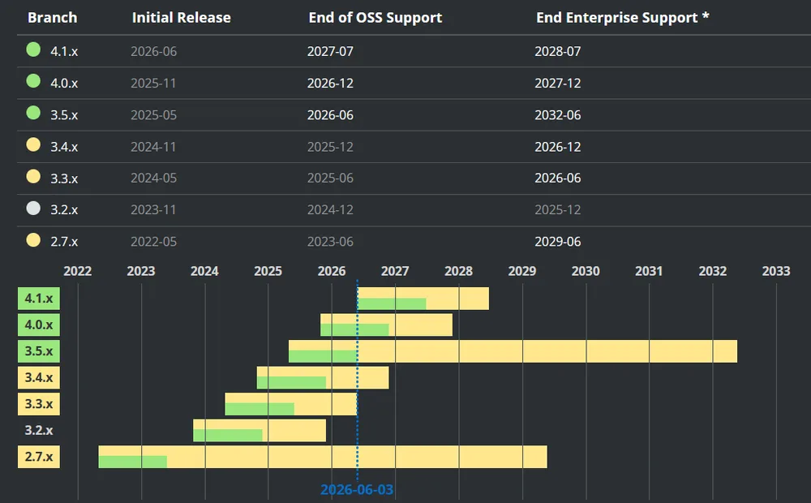

<!-- markdownlint-disable-file -->


Dans le cadre d’un projet que j’ai accompagné en tant que lead developer, j’ai eu l’occasion d’effectuer une migration de Spring Boot 3.5 vers Spring Boot 4.

Je vous partage aujourd’hui mon retour d’expérience avec cet article. L’article que j’aurais aimé trouver pour me faciliter ce chantier. J’espère qu’il pourra vous aider vous aussi à l’entreprendre.

## Avant de commencer, qu’est-ce que Spring Boot ?

Petit rappel rapide : [Spring Boot](https://spring.io/projects/spring-boot) est un framework open source basé sur Java, conçu en 2014 pour simplifier au maximum le développement d’applications. Il fait partie de l’écosystème [Spring](https://spring.io/), que l’on retrouve dans de nombreuses applications d’entreprise.

Spring Boot permet de développer rapidement des applications web, des APIs REST ou des microservices rapidement. L’idée est d’abstraire au maximum la complexité technique pour se concentrer sur la logique métier. Il comprend de nombreuses dépendances utiles et un serveur intégré.

On peut ainsi voir Spring Boot comme un kit clé en main pour lancer un projet Java.

## Qu’y a-t-il de nouveau ?

Après plusieurs années sur une version 3 qui finira par évoluer jusqu’au 3.5, une [release 4.0.0 apparaît fin Novembre](https://github.com/spring-projects/spring-boot/releases/tag/v4.0.0). En voici la [release note complète](https://github.com/spring-projects/spring-boot/wiki/Spring-Boot-4.0-Release-Notes).

Spring Boot 4 porte une [montée de version de nombreuses dépendances](https://www.lepoint.fr/economie/lia-bientot-a-lorigine-dune-vague-de-burn-out-sans-precedent-VHYWG57EQZEBVNVTMHUCAUZBCI/). Bien entendu, cela comprend les différentes dépendances Spring (Spring Framework 7, Spring Batch 6, Spring Security 7, etc.) mais aussi de dépendances tierces. On peut citer notamment :

- Jackson 3

- Jakarta Persistence (JPA) 3.2

- Hibernate 7

- Liquibase 5

- JUnit 6

- Tomcat 11

Il y en a de nombreuses autres listées, mais celles-ci sont probablement les plus connues et utilisées, notamment dans le projet dont je vous parle plus loin dans cet article.

### Pourquoi faire la bascule ?

Après tout, ça fonctionne ! Pourquoi avons-nous fait cette upgrade ?

Voici quelques raisons qui devraient vous y faire réfléchir si vous n’êtes pas encore convaincu·e :

- **Compatibilité avec Java 21+** : Support natif des dernières fonctionnalités de Java, comme les [Virtual Threads](https://docs.oracle.com/en/java/javase/21/core/virtual-threads.html) pour une meilleure gestion de la concurrence.

- **Jakarta EE 11** : Alignement complet avec les dernières spécifications Jakarta (bye bye `javax.*`).

- **Améliorations des performances** : Optimisations du démarrage et de la mémoire, notamment grâce à [GraalVM](https://www.graalvm.org/).

- **Plus de sécurité** : Mise à jour des dépendances (Spring Security 7, OAuth2.1, etc.) et correction de vulnérabilités connues.

- **Versionning d’API** : Le versionning d’API dans les Controllers est [maintenant natif et facilité](https://spring.io/blog/2025/09/16/api-versioning-in-spring).

- **Et surtout, le support à long terme (LTS)** : La version 4 bénéficiera d’un support étendu. A partir du 30 juin 2026 (à la fin de ce mois-ci donc), [la version Open Source de Spring Boot 3.5 ne recevra plus de correctifs de bugs ni de sécurité](https://spring.io/projects/spring-boot#support).



Pour plus de détails et d’autres arguments, n’hésitez pas à aller consulter les [Release Highlights de Spring Boot 4.0](https://spring.io/projects/release-highlights).

N’hésitez donc plus à vous aussi préparer cette bascule, pour éviter d’accumuler ce chantier en dette technique et de réduire ainsi l’entropie logicielle de vos projets.

> 💡 A l’heure où cet article est écrit, la version 4.1 de Spring Boot est en préparation. Une [Release Candidate](https://github.com/spring-projects/spring-boot/wiki/Spring-Boot-4.1.0-RC1-Release-Notes) existe déjà.

### Pré-requis et conseils

Pour [Spring Boot 3.5](https://docs.spring.io/spring-boot/3.5/system-requirements.html) comme pour [Spring Boot 4.0](https://docs.spring.io/spring-boot/system-requirements.html), la version de Java minimum est 17, pas de problème de ce côté là. Mais si voulez vraiment profiter des optimisations de Spring Boot 4, il est vivement conseillé d’être en Java 21 ou plus (pour profiter par exemple des [Virtual Threads](https://docs.oracle.com/en/java/javase/21/core/virtual-threads.html)). 

Avant d’effectuer cette bascule, il est nécessaire de partir de bases saines. Montez déjà votre projet à la dernière version de Spring Boot 3.5.X disponible. Prenez également le temps de vérifier qu’aucune méthode dépréciée de cette version ne soit utilisée (elle sera probablement supprimée en Spring Boot 4).

Bien entendu, une bonne couverture de tests est également nécessaire. Nous avions notamment des tests end-to-end qui nous ont permis de détecter des anomalies au plus tôt lors de la création de la [merge request sur un environnement éphémère](https://blog.hoppr.tech/blogs/2026-04-14-rex-environnements-phmres).

## Retour d’expérience de la montée de version

Le produit client dont je souhaite vous parler ici a démarré en Avril 2025 en Spring Boot 3.4, et était déjà depuis passé en 3.5.

A l’heure de la montée de version vers Spring Boot 4, nous respections tous les pré-requis cités ci-desssus. Et hors de question d’avoir une version qui n’est plus supportée en production en juin 2026. Nous avons donc mis en place le chantier de migration.

L’idée était de faire du _all-in-one_. Comme vu précédemment, des dépendances tierces (Jackson, Hibernate, etc.) ont été upgradées dans la version 4. L’idée est également de nous adapter à ces nouvelles versions.

### Manque de maturité de Spring Boot 4 & difficultés

Un premier test rapide avait été réalisé tôt après la release de Spring Boot 4. Cependant, ce fût un échec : le manque de documentation claire et de retours d’expérience nous a desservi. Par exemple, certains _breaking changes_ étaient mal documentés.

Spring Boot 4 n’était pas encore assez mature, et de nombreuses corrections et modifications de documentation ont été réalisées depuis ([exemple pour la v4.0.1](https://github.com/spring-projects/spring-boot/releases/tag/v4.0.1)). Nous avons rapidement reporté le chantier à une date ultérieure.

D’autre part, étant donné que la migration se faisait sur plusieurs dépendances à la fois, il était parfois difficile de trouver une documentation centralisée de tous les changements à effectuer. C’est aussi ce que veut combler cet article, en donnant une liste de liens utiles et de pièges à éviter. Voici donc un retour d’expérience de la seconde tentative qui a cette fois été menée au bout.

### Modifications apportées

Outre quelques modifications de signatures de méthodes (ex: le constructeur de `ContentCachingRequestWrapper` qui prend un deuxième paramètre), voici les principales modifications apportées dans notre projet :

Pom.xml

Notre projet utilise Maven et son fameux [POM](https://maven.apache.org/pom.html#what-is-the-pom). Les dépendances pour Spring Boot 4 changent pour adopter une [forme plus modulaire](https://spring.io/blog/2025/10/28/modularizing-spring-boot), avec des modules plus petits et ciblés. Par exemple, chaque technologie, embarquée a désormais :

- Un module principal : `spring-boot-graphql`

- Un starter : `spring-boot-starter-graphql`

- Un module de test : `spring-boot-graphql-test`

- Un starter de test :  `spring-boot-starter-graphql-test`

D’autre part, nous avions des dépendances en direct à certaines technologies ([Liquibase](https://www.liquibase.com/) dans notre cas) qui ont maintenant un starter dédié (ici `spring-boot-starter-liquibase` )

Jackson 3

Vous pourrez bien entendu retrouver des éléments de réflexion sur la documentation [OpenRewrite de migration de Jackson 2 à 3](https://docs.openrewrite.org/recipes/java/jackson/upgradejackson_2_3). Pour vous citer les principales modifications apportées dans notre cas :

- Le package `com.fasterxml.jackson`  est remplacé par `tools.jackson` .

- Les exceptions [JacksonException](https://javadoc.io/doc/tools.jackson.core/jackson-core/3.0.0/tools.jackson.core/tools/jackson/core/JacksonException.html) n’étendent plus l’exception `IOException`, mais deviennent des `RuntimeException` . Plus besoin de `try/catch` à chaque sérialisation/désérialisation

- L’ancien `ObjectMapper` devient un `JsonMapper` immutable plus simple à configurer.

- Plus besoin de bricoler avec des `JavaTimeModule` et `Jdk8Module` directement inclus.

A noter, nous avons rencontré une erreur lors de cette montée de version :

```shell
Caused by: tools.jackson.databind.exc.MismatchedInputException: Cannot map `null` into type `boolean` (set `DeserializationFeature.FAIL_ON_NULL_FOR_PRIMITIVES` to 'false' to allow)
```

Après investigation, il s’avère que la configuration par défaut de Jackson a également changé. Ici, c’est `DeserializationFeature.FAIL_ON_NULL_FOR_PRIMITIVES` qui a été passé à `false` par défaut.

Ici deux solutions :

- Le forcer de nouveau à `true`

- Se mettre en conformité et ne plus avoir de booléens dans nos [DTO](https://fr.wikipedia.org/wiki/Objet_de_transfert_de_donn%C3%A9es) (ce que nous avons fait)

Pour éviter d’autres déconvenues, n’hésitez pas à consulter le [détail de la release Jackson 3](https://github.com/FasterXML/jackson/wiki/Jackson-Release-3.0#major-changesfeatures-in-30). Vérifiez bien ces changements de configuration par défaut.

> ⚠️ Attention au module _jackson-annotations_ qui reste en 2.X et n’a pas de version 3, [comme indiqué sur le repo](https://github.com/fasterxml/jackson-annotations). Vous pourrez donc continuer à avoir le package `com.fasterxml.jackson.annotation` en import.

Hibernate 7

Côté Hibernate, pas de problème majeur à signaler. Nous n’avons eu qu’un changement en particulier à faire, dans nos entités ayant une propriété sous forme d’Enum :

```java
@Column(name = "feature", columnDefinition = "feature_enum", nullable = false, unique = true)
@Enumerated(EnumType.STRING)
-    @JdbcType(value = PostgreSQLEnumJdbcType.class)
+    @JdbcTypeCode(SqlTypes.NAMED_ENUM)     
private Feature feature;
```

## Conclusion

Nous avions un terrain très propice pour cette montée de version : stratégie de tests automatisées efficace, environnement éphémère sur lequel tester la non-régression, mises à jours de Spring Boot 3.5 pour partir de moins loin, code propre… Là aussi la qualité logicielle a son importance !

En effet, une entropie logicielle trop importante aurait bien compliqué les choses. Le fait que tout soit sous contrôle à chaque instant avant un chantier de ce type est un pré-requis nécessaire. Et c’est exactement ce que nous promouvons chez [HoppR](https://www.hoppr.tech/).

Finalement, la principale difficulté que nous avons rencontrée est l’éparpillement de documentation, pas toujours très claire. J’espère que cet article répondra à ce manque.

### Autres liens utiles

[https://github.com/FasterXML/jackson/blob/main/jackson3/MIGRATING_TO_JACKSON_3.md](https://github.com/FasterXML/jackson/blob/main/jackson3/MIGRATING_TO_JACKSON_3.md)

[https://spring.io/blog/2025/10/07/introducing-jackson-3-support-in-spring](https://spring.io/blog/2025/10/07/introducing-jackson-3-support-in-spring)

[https://docs.openrewrite.org/recipes/java/jackson/updateserializationinclusionconfiguration](https://docs.openrewrite.org/recipes/java/jackson/updateserializationinclusionconfiguration)

[https://docs.openrewrite.org/recipes/java/jackson/removebuiltinmoduleregistrations](https://docs.openrewrite.org/recipes/java/jackson/removebuiltinmoduleregistrations)

[https://github.com/awspring/spring-cloud-aws/releases/tag/v4.0.0](https://github.com/awspring/spring-cloud-aws/releases/tag/v4.0.0)

[https://github.com/spring-projects/spring-boot/wiki/Spring-Boot-4.0-Migration-Guide](https://github.com/spring-projects/spring-boot/wiki/Spring-Boot-4.0-Migration-Guide)

[https://beaufume.fr/articles/spring-boot-4/](https://beaufume.fr/articles/spring-boot-4/)

[https://docs.hibernate.org/orm/7.0/migration-guide/](https://docs.hibernate.org/orm/7.0/migration-guide/)

[https://docs.hibernate.org/orm/7.0/userguide/html_single/](https://docs.hibernate.org/orm/7.0/userguide/html_single/)

[https://docs.openrewrite.org/recipes/java/jackson/upgradejackson_2_3](https://docs.openrewrite.org/recipes/java/jackson/upgradejackson_2_3)