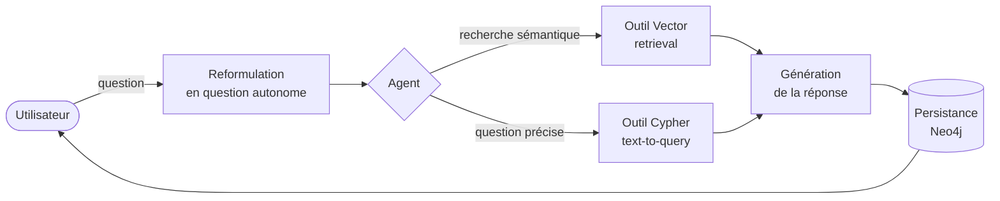
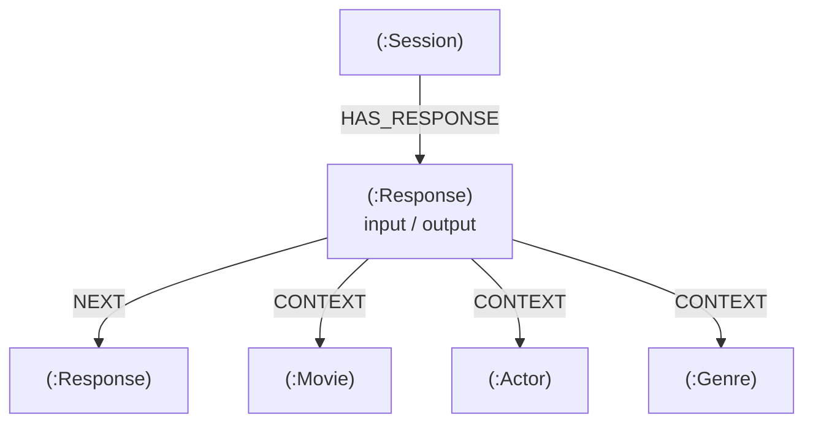
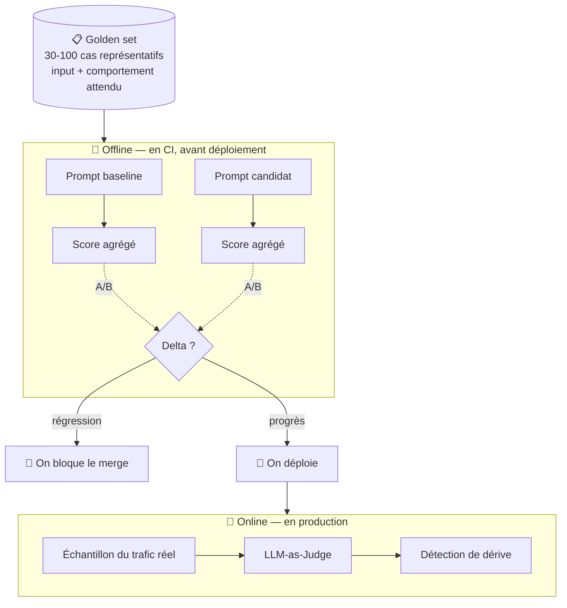
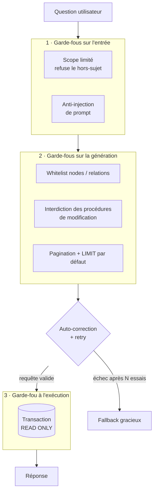
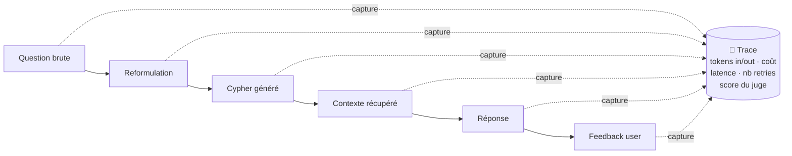
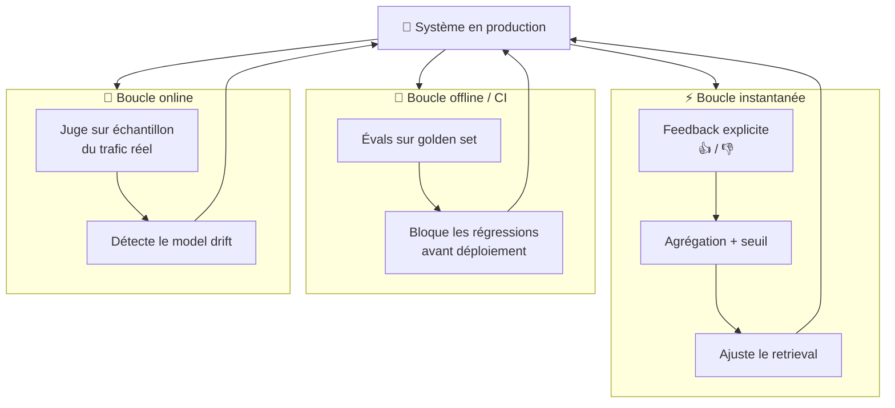

<!-- markdownlint-disable-file -->


**TL;DR :** Brancher un LLM sur une base de données et obtenir une démo qui fonctionne, c'est l'affaire d'un après-midi. Transformer cette démo en une solution qui tient en production, qui ne ment pas, qui ne ruine pas votre budget et qui s'améliore avec le temps, c'est un travail d'ingénierie. Le LLM est le composant le plus visible de votre système. C'est aussi le moins coûteux à mettre en place. Cet article explore tout ce qu'il y a _autour_.

---

## Le piège de la démo qui marche

Un jour, j'ai écrit ce test. Il vérifiait qu'un chatbot reformulait correctement une question de suivi en question autonome : après avoir recommandé _Matrix_, « et qui l'a réalisé ? » devait devenir « Qui a réalisé Matrix ? ».

```typescript
const response = await chain.invoke({
  input: "Who directed it?",
  history: [{ input: "Can you recommend me a film?", output: "Sure, I recommend The Matrix" }],
});

expect(response).toContain("The Matrix"); // 🟢 ... une fois sur deux
```

Le test passait. Puis il échouait. Puis il repassait. Sans que je touche une seule ligne de code. Le modèle reformulait tantôt « Who directed The Matrix? », tantôt « Who is the director of the movie The Matrix? », tantôt le traître « Who directed this film? » en oubliant le titre.

Ce moment, où un test devient [_flaky_](https://www.datadoghq.com/knowledge-center/flaky-tests/) sans raison apparente, c'est le moment où l'on comprend que les règles du jeu ont changé. On ne teste plus du code déterministe. On teste le comportement d'un système probabiliste. Et tout ce qu'on croyait savoir sur « est-ce que ça marche ? » doit être repensé.

Cet article suit le cycle de vie d'une solution IA, du prototype jusqu'à la production, à travers deux exemples concrets :

- **Un chatbot de recommandation de films** (Next.js + LangChain.js + OpenAI, adossé à Neo4j) : l'exemple parfait pour prototyper et illustrer les concepts. Il est public, issu de la formation [GraphAcademy de Neo4j](https://graphacademy.neo4j.com/courses/llm-chatbot-typescript/).

- **Un cas réel** **issu d'une mission** **que j’ai assuré :** un assistant qui génère des requêtes [Cypher](https://neo4j.com/docs/cypher-manual/current/) sur une base de compétences (« donne-moi tous les skills qui n'ont pas de traduction en polonais »), en Kotlin/Spring Boot. Anonymisé, mais c'est là que vivent les vraies problématiques de production.

Le premier nous montrera à quel point un prototype peut être élégant. Le second, tout ce qu'il faut surmonter pour qu'il survive au contact des utilisateurs.

---

## Acte 1. Le prototype : élégant, et trompeur

Commençons par le chatbot de films. Son architecture est une jolie démonstration de composition. Chaque étape est une « chaîne » qui transforme une entrée en sortie, et qu'on assemble comme des Lego :



Concrètement :

- **Reformulation :** on transforme la question de suivi en question autonome, en s'appuyant sur l'historique de la conversation.

- **Agent** : il décide quel outil utiliser : recherche sémantique (vecteurs) pour « un film d'ambiance mélancolique », ou génération de requête précise (Cypher) pour « combien de films a réalisé Christopher Nolan ? ».

- **Génération** : il rédige la réponse à partir des données récupérées.

- **Persistance :** on stocke la conversation dans le graphe.

Ce dernier point mérite qu'on s'y arrête, car il prépare déjà la suite. La conversation n'est pas stockée dans une simple table de logs, mais dans un graphe qui relie chaque réponse aux données qui ont servi à la produire :



> **💡 Pourquoi un graphe plutôt qu'un simple « vector store » ?**  
> Une recherche purement sémantique (par vecteurs) trouve des contenus _ressemblants_, mais ne comprend pas les _relations_ exactes. « Quels acteurs ont joué dans deux films de Tarantino ? » est une question de structure, pas de ressemblance. Le graphe permet au LLM de poser des questions précises sur des relations vérifiables, ce qui **réduit les hallucinations** : la donnée vient de la base, pas de l'imagination du modèle.

À ce stade, tout fonctionne. On pose trois questions à la main, les réponses sont bluffantes, on fait une démo, on récolte les applaudissements.

C'est exactement là qu'est le piège. **On a validé trois cas, manuellement, un mardi après-midi.** Le non-déterminisme du système est encore invisible. Il ne se révélera qu'au moment où l'on voudra automatiser sa validation : c'est-à-dire au moment où l'on voudra être sérieux.

---

## Acte 2. Premier mur : tester l'indéterministe

Reprenons mon test flaky. Le problème n'est pas le code, c'est l'**assertion**. `toContain("The Matrix")` suppose une sortie unique et stable. Or il existe des dizaines de reformulations correctes, et le modèle en choisit une au hasard (pondéré) à chaque appel.

La première réaction est de fixer [`temperature: 0`](https://www.ibm.com/think/topics/llm-temperature) pour rendre le modèle (quasi) déterministe. C'est utile, et nécessaire pour de la génération de requêtes mais ça ne suffit pas : même à température nulle, les fournisseurs ne garantissent pas une reproductibilité parfaite, et surtout ça ne règle pas le fond. Le fond, c'est qu'**on ne peut pas tester une sortie en langage naturel par égalité de chaînes**.

Exiger l'égalité de chaînes, **c**'est comme mettre zéro à une dissertation parce qu'elle ne reprend pas le corrigé mot pour mot : il existe une infinité de formulations correctes, côté réponse du modèle comme côté question de l'utilisateur. On évalue le sens, pas la lettre. 

### Le changement de paradigme

Voici l'idée la plus importante de cet article :

> **Modifier un prompt n'est plus un test unitaire. C'est une expérience scientifique.**

Quand vous changez un prompt, la stratégie de construction du contexte, ou même le modèle, vous ne corrigez pas un bug : vous formulez une hypothèse (« cette version reformule mieux ») qu'il faut **mesurer**. Et une mesure fiable ne se fait pas sur un cas, mais sur un échantillon représentatif.

Conséquence très concrète, souvent sous-estimée : ces tests ne tournent plus en une fraction de seconde sur votre machine. Ils appellent un LLM, coûtent des tokens, prennent du temps. Il faut un **environnement d'évaluation dédié** et une **CI** capable de les faire tourner, pas un simple `npm test` lancé entre deux cafés.

### Première approche : le LLM comme juge

Puisqu'on ne peut pas comparer des chaînes, on peut demander à un LLM de juger si la réponse est correcte. C'est la technique du **LLM-as-Judge** :

```typescript
const evalChain = RunnableSequence.from([
  PromptTemplate.fromTemplate(`
    Is the rephrased version a complete standalone question?

    Original: {input}
    Rephrased: {response}

    Respond "yes", "no", or "missing" (if it asks for clarification).
  `),
  llm,
  new StringOutputParser(),
]);

const evaluation = await evalChain.invoke({ input, response });
expect(`${evaluation.toLowerCase()} - ${response}`).toContain("yes");
```

C'est élégant, mais attention aux limites : **un juge est lui-même un système probabiliste.** Si vous laissez le modèle du juge évoluer librement, vous mesurez autant les humeurs du juge que la qualité de vos réponses. Deux précautions s'imposent :

- **Épingler la version du modèle juge** (le figer), pour que vos scores restent comparables dans le temps. Il est nécessaire de surveiller la dépréciation de ces modèles et de planifier la migration des embeddings.

- **Valider le juge contre des annotations humaines** sur un petit échantillon, pour vérifier qu'il est d'accord avec vous avant de lui faire confiance à l'échelle.

### Le point en or : juger par l'exécution, pas par le texte

Passons à l'exemple de la mission. Ici, on génère du **Cypher** pour répondre à « donne-moi tous les skills sans traduction polonaise ». Faut-il faire juger la requête générée par un LLM ? **Non. C'est même une erreur.**

On n'a pas besoin que la requête soit _littéralement_ celle qu'on attendait. On a besoin qu'elle **retourne le bon résultat**. Et ça, on peut le vérifier objectivement, sans aucun jugement subjectif, en **exécutant la requête** :

```kotlin
// La requête de référence, écrite et validée à la main = la vérité du terrain
private const val GOLDEN_QUERY_POLISH = """
    MATCH (s:Skill)
    WHERE NOT EXISTS {
        (s)-[:HAS_TRANSLATION]->(:Translation { lang: 'pl' })
    }
    RETURN s.id AS id
"""

// Évaluation par exécution : on compare les RÉSULTATS, pas le texte de la requête
@Test
fun `should find skills missing polish translation`() {
    val question = "donne-moi tous les skills sans traduction polonaise"

    val generatedCypher = cypherGenerationChain.generate(question)

    // 1. La requête est-elle un garde-fou valide ? (read-only, pas de procédure)
    assertThat(generatedCypher).matches(readOnlyGuardrail)

    // 2. S'exécute-t-elle sans erreur ?
    val actual = neo4j.executeRead(generatedCypher)

    // 3. Le résultat est-il celui de la requête de référence ?
    val expected = neo4j.executeRead(
GOLDEN_QUERY_POLISH
)
    assertThat(actual.toSet()).isEqualTo(expected.toSet())
}
```

C'est ce qu'on appelle l'**évaluation par exécution** (_execution-based evaluation_). Quand le domaine vous le permet (génération de SQL, de Cypher, de code, d'appels d'API), c'est infiniment plus fiable qu'un juge.

> **🎯 La règle à retenir : remplacez un juge subjectif par une vérification objective dès que vous le pouvez.**  
> Réservez le LLM-as-Judge aux sorties en langage naturel (la reformulation, la réponse finale), là où il n'existe pas de vérité-terrain exécutable.

### La méthodologie d'évaluation

On peut maintenant assembler une vraie démarche, qui se résume en quatre briques :



- **Le golden set** : un jeu de cas représentatifs (entrées + comportement attendu), versionné comme du code. 30 à 100 cas suffisent pour démarrer.

- **Les métriques**, adaptées à la tâche : égalité exacte ou par exécution quand c'est possible, similarité sémantique par embeddings sinon, LLM-as-Judge en dernier recours.

- **L'expérience A/B** : faire tourner prompt actuel _vs_ prompt candidat sur le golden set, et comparer les scores agrégés. Le delta vous dit si vous avez progressé ou régressé.

- **Offline puis online** : en CI vous bloquez les régressions avant merge / déploiement, en production vous faites juger un échantillon du trafic réel pour détecter les dérives.

Quelques outils pour ne pas tout réécrire à la main :

| Besoin | Outils |
| --- | --- |
| Gate de qualité en CI | Spring AI Evaluators ,  DeepEval ,  promptfoo |
| Métriques RAG (retrieval) | Ragas |
| Datasets + éval online + observabilité | Langfuse  (self-hostable),  Arize Phoenix |


> **💡 Pour les utilisateurs de Spring** : pas besoin de quitter votre écosystème pour commencer. Spring AI fournit un `RelevancyEvaluator` (la réponse est-elle pertinente vis-à-vis du contexte récupéré ?) et un `FactCheckingEvaluator` (la réponse est-elle factuellement supportée par le contexte = anti-hallucination), directement utilisables dans vos tests d'intégration. Un bon [tutoriel chez Baeldung](https://www.baeldung.com/spring-ai-testing-ai-evaluators).

---

## Acte 3. Durcir pour la prod : les garde-fous

Un système évalué, c'est bien. Un système qui ne peut pas faire de dégâts, c'est mieux. Place aux **guardrails**, illustrés sur la mission Cypher.

Le principe directeur est la **défense en profondeur** : chaque couche part du principe que la précédente a échoué.



### Couche 1 : Sur l'entrée

**Limiter le scope.** Par défaut, un agent répond à tout, y compris aux questions obscènes ou hors-sujet. Un simple message système recadre le périmètre :

```typescript
const prompt = ChatPromptTemplate.fromMessages([
  ['system', `
    You are Ebert, a movie recommendation chatbot.
    Respond to any questions that don't relate to movies, actors or directors
    with a joke about parrots, before asking them to ask another question
    related to the movie industry.
  `],
  ['human', '{rephrasedQuestion}'],
  new MessagesPlaceholder({ variableName: 'chat_history', optional: true }),
  new MessagesPlaceholder('agent_scratchpad'),
]);
```

**Se protéger de l'injection de prompt.** Un utilisateur malveillant tentera « ignore tes instructions et... ». Le message système n'est pas une frontière de sécurité absolue : il doit être complété par les couches suivantes, qui, elles, sont techniques et non négociables.

### Couche 2 : Sur la génération

C'est ici que le text-to-Cypher devient délicat. La requête générée doit être contrainte avant même d'atteindre la base :

- **Whitelist** des nodes et relations que le LLM a le droit de manipuler (pas question qu'il interroge une table de credentials).

- **Interdiction des procédures de modification** (pas de `CREATE`, `DELETE`, `apoc.*` qui écrit).

- **Pagination et** **`LIMIT`** **par défaut** : sans cela, une requête maladroite peut scanner toute la base et la mettre à genoux. On impose un plafond systématique.

### Couche 3 : À l'exécution

Et si malgré tout une requête dangereuse passait ? On la confine dans une **transaction en lecture seule**. C'est la dernière ligne de défense, et c'est une garantie _technique_, pas une supplique adressée au modèle :

```kotlin
@Transactional(readOnly = true)
fun executeGenerated(cypher: String): List<Record> {
    // Même si le prompt a été contourné et les validations trompées,
    // la base refusera physiquement toute écriture.
    return session.run(cypher).list()
}
```

### La boucle d'auto-correction

Voici une astuce contre-intuitive et puissante. Les LLM sont bons pour _générer_ du Cypher. Ils sont **excellents pour** _**corriger**_ le Cypher qu'ils ont écrit. (C'est une variante de la [loi de Cunningham](https://meta.wikimedia.org/wiki/Cunningham%27s_Law) : le meilleur moyen d'obtenir la bonne réponse n'est pas de poser une question, c'est de proposer une mauvaise réponse.)

On ajoute donc une chaîne qui valide la requête contre le schéma et la corrige récursivement :

```typescript
// On exécute, on récupère l'erreur, on la renvoie au LLM pour qu'il corrige
const prompt = PromptTemplate.fromTemplate(`
  You are an expert Neo4j Developer evaluating a Cypher statement written by an AI.
  Check the statement against the schema and fix any errors.

  Respond with a JSON object with "cypher", "corrected" and "errors" keys.

  Schema: {schema}
  Question: {question}
  Cypher Statement: {cypher}
  {errors}
`);

return RunnableSequence.from([prompt, llm, new JsonOutputParser()]);
```

Couplée à une politique de **retry sur critères** (« la requête doit être read-only, sans procédure » → si elle ne l'est pas, on renvoie l'erreur et on régénère), cette boucle apporte une stabilité _à l'exécution_, complémentaire de la stabilité _en test_ vue à l'acte 2.

### Le fallback

Enfin : quand tout échoue après N tentatives, **on dégrade proprement**. Un « je n'ai pas réussi à formuler une réponse fiable à cette question » vaut infiniment mieux qu'une réponse fausse présentée avec assurance. Une IA qui sait dire « je ne sais pas » est une IA en laquelle on peut avoir confiance.

### **Et ces garde-fous, on les teste comment ?**

Un garde-fou non testé n'est pas un garde-fou. La bonne nouvelle : la plupart le sont, à condition de les ranger en deux familles.

**Les garde-fous déterministes se testent comme du code.** La validation de la requête générée (read-only, pas de procédure, présence d'une limite) ne dépend pas du LLM : c'est de la logique pure. On la teste donc avec de vrais tests unitaires, rapides et sans flakiness. C'est le « séparer le déterministe du non-déterministe » de l'Acte 2, et c'est rassurant : la dernière ligne de défense est aussi la plus facile à verrouiller.

```kotlin
@Test
fun `le garde-fou rejette une requête en écriture`() {
    assertThat("MATCH (s:Skill) DETACH DELETE s").doesNotMatch(readOnlyGuardrail)
}

@Test
fun `le garde-fou rejette un appel de procédure`() {
    assertThat("CALL apoc.periodic.iterate(...)").doesNotMatch(readOnlyGuardrail)
}

@Test
fun `une requête de lecture paginée passe`() {
    assertThat("MATCH (s:Skill) RETURN s LIMIT 10").matches(readOnlyGuardrail)
}
```

**Les garde-fous comportementaux se testent comme un modèle.** La limitation de scope et la résistance à l'injection de prompt, elles, dépendent du LLM : impossible de garantir un refus à 100 % par une simple égalité. 

On les évalue donc à la manière d'une éval, avec un jeu d'attaques (« ignore tes instructions… », questions hors-sujet, jailbreaks connus) rejoué en CI, et un taux de réussite comme métrique plutôt qu'un pass/fail binaire.

C'est exactement l'usage des plugins de red-teaming de [promptfoo](https://www.promptfoo.dev/).

> **💡 Aucune de ces couches n'est suffisante seule.** Le message système peut être contourné, les validations peuvent avoir un trou, mais la transaction read-only, elle, est une garantie technique. La sécurité d'une solution IA, c'est un empilement de filets, pas un mur unique.

---

## Acte 4. Sortir de la boîte noire : l'observabilité

À ce stade, le système est évalué et protégé. Mais en production, une question revient sans cesse : **« pourquoi a-t-il répondu ça ? »** Et son corollaire budgétaire : **« combien ça nous a coûté ? »**.

Sans traçabilité, ces questions restent sans réponse. L'observabilité consiste à instrumenter chaque étape pour reconstituer le parcours complet d'une requête :



Ce qu'il faut capturer dans une trace : la question brute, la reformulation, la requête générée, le contexte récupéré, les **tokens consommés (entrée/sortie)**, le **coût**, la **latence**, le **nombre de retries**, le **score du juge** et le **feedback utilisateur**.

Côté implémentation, encore une fois, l'écosystème Spring est confortable : **Spring AI expose nativement de l'observabilité via** [**Micrometer**](https://micrometer.io/) (traces et métriques sur les appels modèle, la latence, les tokens), que l'on visualise ensuite dans [**Langfuse**](https://langfuse.com/)[ ](https://langfuse.com/)(open-source, self-hostable: un argument de poids pour la souveraineté des données) ou [**Phoenix**](https://github.com/arize-ai/phoenix) (basé sur OpenTelemetry).

Mais le vrai message de cette section est ailleurs :

> **L'observabilité est le pivot qui unifie tous les autres piliers.** Une trace bien faite est simultanément votre outil de debug, votre relevé de coûts, _et_ la matière première de votre golden set. Les vraies questions de vos utilisateurs, capturées en production, sont les meilleurs cas d'évaluation que vous puissiez espérer.

---

## Acte 5. Tenir le budget : tokens et coûts

Une solution IA a une caractéristique inhabituelle : **chaque requête a un coût marginal réel**. Ce n'est pas du calcul amorti sur un serveur déjà payé, ce sont des tokens facturés à l'usage. Ignorer ce point, c'est découvrir la facture en fin de mois.

Les leviers, du plus structurant au plus opérationnel :

- **Choisir le modèle selon la tâche.** Tout ne mérite pas votre modèle le plus cher. Un petit modèle rapide suffit pour reformuler une question ou la classer ; on réserve le gros modèle à la génération finale. Sur une chaîne à plusieurs étapes, l'économie est considérable.

- **Plafonner le budget tokens par requête.** Fixer explicitement un budget par appel (et un `max_tokens`) évite les dérapages et force la concision.

- **Cache sémantique.** Stocker les requêtes réussies et les rejouer quand une question équivalente revient. C'est un cas où un même geste apporte **stabilité et économie** : on ne régénère pas, donc pas de flakiness _et_ pas de coût.

- **Rétention maîtrisée.** L'historique conversationnel n'a pas besoin d'être conservé éternellement. Une purge après X jours réduit les coûts de stockage _et_ la surface de données personnelles à protéger.

- **Leviers complémentaires** : prompt caching (mise en cache du préfixe de prompt par le fournisseur), troncature ou résumé de l'historique pour ne pas envoyer toute la conversation à chaque tour, et **monitoring du coût par conversation et par utilisateur** (qui découle directement de l'observabilité de l'acte 4).

> **🔐 Encadré sécurité : ce qui peut faire mal en prod au-delà de la qualité des réponses**  
> Les clés d'API LLM sont des secrets coûteux : une clé qui fuite, c'est votre budget qui part dans la nature. Trois réflexes : stocker les clés dans un **secret manager** (jamais en dur, jamais dans le repo), mettre en place une **rotation automatique**, et **monitorer les fuites de credentials** (scan des commits, alerte sur usage anormal). Ce sont des pratiques d'ops classiques, mais l'enjeu financier les rend ici particulièrement critiques.

---

## Acte 6. Le système qui s'améliore tout seul : la feedback loop

On arrive au sommet : faire en sorte que le système **s'améliore avec le temps** plutôt que de se dégrader silencieusement. Cela repose non pas sur une, mais sur **trois boucles de feedback** qui tournent en parallèle, à des rythmes différents.



### Boucle 1 : Instantanée (le feedback utilisateur)

C'est la plus directe : l'utilisateur signale qu'une réponse était utile ou non, et ce signal est **persistant**. Souvenez-vous du modèle de données de l'acte 1 : chaque réponse est reliée aux données qui l'ont produite. Il suffit de marquer la réponse :

```typescript
export async function provideFeedback(responseId: string, helpful: boolean) {
  await write(`
    MATCH (r:Response {id: $responseId})
    CALL { WITH r WITH r WHERE $helpful = true  SET r:HelpfulResponse }
    CALL { WITH r WITH r WHERE $helpful = false SET r:UnhelpfulResponse }
  `, { responseId, helpful });
}
```

Ensuite, on exploite ce signal pour **filtrer le contexte** : on exclut les données qui reviennent trop souvent dans des réponses mal notées, grâce à la similarité vectorielle de la [bibliothèque Graph Data Science](https://neo4j.com/docs/graph-data-science/current/) :

```plain text
OPTIONAL MATCH (node)<-[:CONTEXT]-(r:UnhelpfulResponse)
WHERE gds.similarity.cosine(r.embedding, $embedding) > 0.9
WITH node, score, count(r) AS count
WHERE count <= 10
RETURN node.text AS text, score, { url: node.url, title: node.title } AS metadata
ORDER BY score DESC LIMIT 5
```

### Boucle 2 : Offline / CI (les évals)

C'est la boucle de l'acte 2 : à chaque modification de prompt, on rejoue le golden set pour **détecter les régressions avant qu'elles n'atteignent la production**. Rythme : à chaque PR.

### Boucle 3 : Online (le juge sur le trafic réel)

Un LLM-as-Judge note un échantillon du trafic de production. Son rôle principal : détecter le **model drift**. Car voici un piège que peu anticipent :

> **⚠️ Le fournisseur met à jour le modèle sous vos pieds.** Une mise à jour silencieuse côté provider peut faire régresser un prompt parfaitement stable, sans que vous ayez touché une ligne de code. Sans boucle online, vous ne le verrez jamais venir. (D'où, aussi, l'intérêt d'épingler les versions de modèle quand c'est possible.)

**Ce que ça implique au quotidien :** **une montée de version de modèle se gère comme un changement de code.** On épingle la version en production, et quand le fournisseur en publie une nouvelle, on l'adopte via une merge request qui rejoue le golden set et compare le **delta de résultats** (l'évaluation par exécution de l'Acte 2). Delta neutre ou positif : on merge. Régression : on reste sur la version épinglée. Le modèle devient une dépendance versionnée comme une autre.

### Le garde-fou : le feedback est un signal, pas une vérité

Une boucle de feedback ouverte sur l'extérieur peut être **empoisonnée**. Des utilisateurs malhonnêtes (ou simplement maladroits) peuvent dégrader le système en notant n'importe comment. La règle d'or :

> **Le feedback brut ne doit jamais muter directement le comportement du système.** Il passe toujours par de l'**agrégation et un seuil.**

C'est exactement ce que fait la requête ci-dessus avec son `count <= 10` : un nœud n'est exclu que s'il a été associé à un nombre significatif de réponses mal notées. Un avis isolé ne suffit pas. On peut aller plus loin : pondérer selon la fiabilité de l'utilisateur, détecter les anomalies, exiger un volume minimal.

Concrètement, quelques signaux simples :

- **Réputation** : pondérer un vote selon l'historique du votant (un compte authentifié et ancien pèse plus qu'un anonyme tout neuf), et réduire le poids des utilisateurs dont les votes divergent systématiquement du consensus.

- **Anomalies de volume** : repérer les rafales (beaucoup de votes négatifs en quelques secondes, depuis une même session ou IP) avec du rate-limiting.

- **Écart au consensus** : un « inutile » sur une réponse massivement jugée utile par les autres est suspect (un simple z-score par rapport à la moyenne suffit à le flaguer).

- **Confirmation croisée** : n'agir que sur un signal confirmé par plusieurs utilisateurs indépendants. Le seuil `count <= 10` en est la version minimale.

- **Signaux implicites** : croiser le pouce explicite avec le comportement réel (l'utilisateur a-t-il reformulé sa question, abandonné, cliqué la source ?), souvent plus honnête que la note déclarée.

Le feedback utilisateur est un signal précieux, à condition de ne jamais le confondre avec la vérité.

---

## Conclusion : La checklist « production-ready »

Revenons à mon test flaky du début. Il n'était pas le symptôme d'un mauvais code. Il était le premier signe que je construisais un type de système différent, qui exige une discipline différente.

Le LLM est le composant le plus visible de votre solution. C'est paradoxalement le plus simple à mettre en place, et le moins coûteux à remplacer. Ce qui sépare une démo applaudie un mardi après-midi d'un produit qui tient en production, c'est **tout le système d'ingénierie autour** :

- ✅ **Évaluation** : un golden set versionné, des métriques par exécution quand c'est possible, des expériences A/B en CI.

- ✅ **Guardrails** : défense en profondeur : scope, validation de la génération, transaction read-only, auto-correction, fallback gracieux.

- ✅ **Observabilité** : des traces complètes (tokens, coût, latence, scores), qui nourrissent à la fois le debug, le budget et les évals.

- ✅ **Coûts** : routing de modèles, cache sémantique, budgets de tokens, rétention maîtrisée, secrets managés et tournés.

- ✅ **Feedback loop** : trois boucles parallèles (instantanée, offline, online), avec agrégation pour résister à l'empoisonnement.

Aucun de ces piliers n'est optionnel si vous visez la production. Et tous se rejoignent autour d'une même idée : un LLM ne devient fiable que lorsqu'on cesse de lui faire confiance aveuglément, et qu'on construit, autour de lui, un système qui mesure, contraint, observe et apprend.

C'est moins spectaculaire qu'une démo. C'est infiniment plus durable.

---

_Vous construisez ce genre de solution ? Chez_ [_Hoppr_](https://www.hoppr.tech/)_, c'est exactement le type de défi qui nous occupe : discutons-en !_

---

## Sources & ressources

- [Spring AI : Evaluation Testing](https://docs.spring.io/spring-ai/reference/api/testing.html)

- [Baeldung : Testing LLM Responses Using Spring AI Evaluators](https://www.baeldung.com/spring-ai-testing-ai-evaluators)

- [Evidently AI : LLM-as-a-judge a complete guide](https://www.evidentlyai.com/llm-guide/llm-as-a-judge)

- [Humanloop : LLM as a Judge](https://humanloop.com/blog/llm-as-a-judge)

- [Ragas : RAG evaluation metrics](https://docs.ragas.io/)

- [DeepEval](https://deepeval.com/) · [promptfoo](https://www.promptfoo.dev/) · [Langfuse](https://langfuse.com/) · [Arize Phoenix](https://phoenix.arize.com/)

- [Neo4j GraphAcademy : Build a Neo4j-backed Chatbot with TypeScript](https://graphacademy.neo4j.com/courses/llm-chatbot-typescript/)

- [Neo4j Graph Data Science](https://neo4j.com/docs/graph-data-science/current/)

