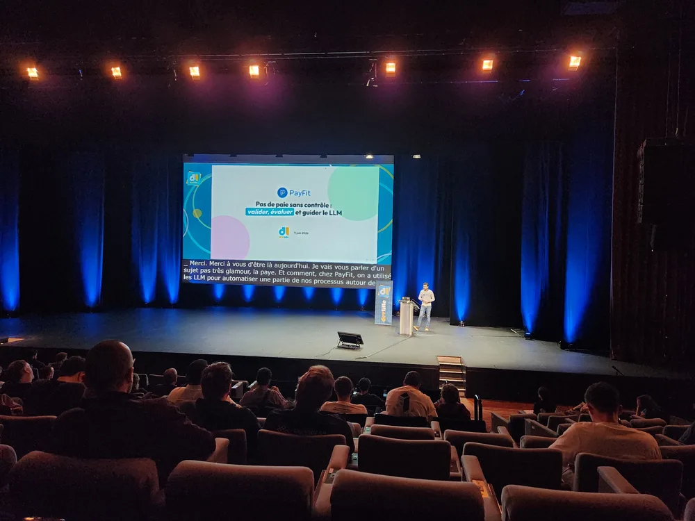
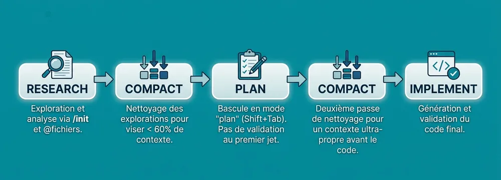

<!-- markdownlint-disable-file -->

L'été pointe le bout de son nez, les terrasses se remplissent, les journées s'étirent jusque tard dans la soirée, et le [DevLille](https://devlille.fr/) fait son retour pour une nouvelle édition.

Les 11 et 12 juin 2026, le Lille Grand Palais a accueilli ce rendez-vous incontournable de l'écosystème tech régional, anciennement connu sous le nom de DevFest Lille. **La team HoppR y était bien évidemment présente, cette année en tant que sponsor bronze.**

Au-delà d'un programme particulièrement dense, avec des talks et des ateliers répartis sur quatre tracks en parallèle, ce fut aussi l'occasion de retrouver un événement dont les valeurs résonnent pleinement avec les nôtres, entre accessibilité, écoresponsabilité et transmission auprès des plus jeunes.

Nous vous proposons maintenant de découvrir avec nous les conférences que nous avons choisi de suivre. Ce retour s'étalera sur plusieurs articles : cette première partie se concentre sur les talks consacrés à l'intelligence artificielle. N'hésitez pas à consulter les autres volets de la série !

## Qui a marqué le plus de buts ? Construire un agent IA qui interroge des données en langage naturel

_Mazlum Tosun - 45 min -_ [_Abstract_](https://devlille.fr/talk-page-581615de-5b82-4127-8c6b-e814f9fbc0fd/) _- Captation_ 

Le titre donne le ton : une démo concrète où un agent répond à des questions sur des données de foot en langage naturel. Sans agent, interroger une base demande de maîtriser le schéma, les relations et les types de données, puis de traduire des règles métier en SQL fiable. L'idée de déléguer cette traduction à un LLM est donc particulièrement séduisante.

L'architecture présentée est fortement ancrée dans l'écosystème Google Cloud : [ADK](https://adk.dev/) (Agent Development Kit) pour l'orchestration, des serveurs MCP natifs GCP pour l'accès aux données, Vertex AI pour les modèles, FastAPI et Next.js côté applicatif. ADK gère les sessions, le contexte, les outils et le déploiement vers Agent Engine (successeur de Vertex AI côté agents). Pour tester en local sans consommer de tokens, on branche un modèle plus petit (Gemini 2.0 Flash ou Gemma). Les system instructions sont modulaires, avec un fichier Markdown par responsabilité et des règles métier maintenues hors du code, puis validées en CI via des _golden datasets_.

Une attention particulière est portée à la validation avant exécution, à la fois côté technique (validation syntaxique SQL, dry run BigQuery pour estimer le coût, respect des droits IAM) et côté métier (traduction du SQL en langage naturel, détection d'ambiguïtés, validation humaine). 

Le flow se déroule ainsi : 

C'est une démo convaincante de ce qu'on peut monter rapidement sur GCP et BigQuery, et la stack MCP + ADK + Agent Engine se révèle cohérente et bien intégrée. La démonstration reste toutefois, dans les grandes lignes, un POC : les questions de sécurité en profondeur, d'observabilité fine, de gestion des coûts et de tests robustes sur un système non-déterministe n'y sont qu'effleurées. Ce sont précisément ces sujets qui font le fossé entre une démo qui impressionne et un système qu'on met en production, un fossé que nous avons d'ailleurs creusé de notre [côté](https://blog.hoppr.tech/blogs/2026-06-09-du-prototype-a-la-prod-ce-quon-ne-te-dit-pas-sur-la-construction-dune-solution-ia-solide).

## Pas de paie sans contrôle : valider, évaluer et guider le LLM

_Par Thomas Villaren - 45 min -_ [_Abstract_](https://devlille.fr/talk-page-89bbedf1-f20a-4f10-a1cd-4e95812ee3bd/) _-_ [_Captation_ ](https://youtu.be/oTZ9ZHWz464?si=siLbUdv6jUC16nqD)

Là où le talk précédent montre ce qu'on _peut_ faire, celui-ci montre comment le faire _sérieusement_.

PayFit gère des milliers de conventions collectives, chacune avec des dizaines de paramètres, des formats hétérogènes et sans standard possible. Intégrer manuellement ces textes de loi dans leur [DSL interne Jetlang](https://backstage.payfit.com/the-right-tool-for-the-job-how-creating-our-own-programming-language-brought-us-closer-to-success/) représente un travail colossal. Les LLMs sont une piste évidente, mais la vraie difficulté n'est pas de générer : c'est de garantir que ce qui est généré est juste.

Leur approche s'est construite en trois étapes :

**Guider** avec le _structured output_ : un schéma JSON respecté en sortie, avec une boucle de feedback pour que le modèle s'auto-corrige via des validations syntaxiques puis sémantiques (du plus rapide au plus coûteux, selon le principe _fail fast_).

**Valider** à chaque étape de la génération de Jetlang, en passant par un parser, une analyse sémantique statique et une validation métier. Rien n'est exécuté sans franchir cette chaîne.

**Évaluer** de façon déterministe : plutôt que le pattern LLM-as-a-judge, l'équipe s'appuie sur un **scorer**, une mesure calculable de l'output. Cela permet de comparer modèles et fournisseurs (qualité, temps de réponse, coût) et de détecter les régressions à chaque changement de prompt ou de modèle.

Pour l'observabilité, ils utilisent **Langfuse**, surnommé « le Datadog du LLM » : traces, visualisation du temps passé par étape, identification des échecs récurrents, et _prompt management_ qui pourrait à terme permettre au métier d'ajuster les prompts directement.

Le choix d'architecture est délibéré : pas d'agent autonome, mais une approche KISS reposant sur un objectif défini, un périmètre borné, un prompt figé et un contexte maîtrisé. C'est une base solide à poser avant d'envisager tout workflow agentique, et l'exact opposé du vibe coding lorsqu'il s'applique à des systèmes critiques.

## Le vibe coding est mort, vive le spec coding

_Par Aurélien Allienne - 45 min -_ [_Abstract_](https://devlille.fr/talk-page-1a1bde86-57b0-47f2-b028-ff92daa40d08/) _-_ [_Captation_ ](https://youtu.be/0Gsh8ym50Uw?si=54nfjZL0w-O6iKPe)

Tout commence avec un tweet publié le 2 février 2025 : [Andrej Karpathy](https://fr.wikipedia.org/wiki/Andrej_Karpathy), cofondateur d'OpenAI et ancien directeur de l'IA chez Tesla, y décrit son dimanche. Il code un projet perso avec Cursor et Claude, délègue tout à l'IA, accepte les diffs sans les lire et fait confiance au modèle. Il précise lui-même qu'il s'agit là « _d'une solution pas trop mal pour du code jetable_ ». Ce tweet, vu des dizaines de millions de fois, a donné naissance au **vibe coding**.

Le constat d'Aurélien est sans détour : en production, cela ne fonctionne pas. Il a livré plusieurs projets réels avec Claude Code comme pair-programmer principal, sur une même stack (React, TypeScript, Go, Cloud Run) et un même agent, mais dans deux contextes différents. Les résultats observés lorsqu'on se contente de « vibe » sont éloquents : hallucinations architecturales, refactors fantômes, dérive de contexte dès qu'un fichier dépasse 300 lignes. L'agent ne comprend pas votre projet, il se contente de prédire la suite la plus probable.

Sa réponse tient en deux mots : le **spec coding**, dont l'idée centrale est de formaliser les spécifications _avant_ de laisser l'IA générer la moindre ligne de code :

- Un **Prompt Requirements Document (PRD)** qui pose les contours avant la première ligne de code

- Un **DESIGN.md** qui encode le _design system_ (couleurs, typographie, composants) pour que l'agent ne réinvente pas l'identité visuelle à chaque prompt

- Un **CLAUDE.md** qui sert de mémoire persistante au projet

- Des **slash commands** qui industrialisent les tâches répétitives (`/implement`, `/build`, `/ship`)

- Un **justfile** qui automatise le build, les tests et le déploiement

La démo montrait ce workflow en action avec Claude Code : un système de commandes guidant l'agent étape par étape, avec des vérifications de statut à chaque transition. Un vrai « harnais de sécurité », selon ses mots.

Ses trois paris pour la suite : le vibe coding va devenir péjoratif (comme le « cowboy coding »), les specs vont devenir le nouveau code source des organisations, et garder l'humain dans la boucle reste le point le plus important, car les IA qui travaillent entre elles sans supervision humaine ont « très peu d'intérêt ».

## ClaudeCode.proTips(20, minutes=20).run()

_Par Erwan Gereec - 30 min -_ [_Abstract_](https://devlille.fr/talk-page-06d7b678-2b3b-4c66-9a9a-6f39d220c1dc/) _-_ [_Captation_ ](https://youtu.be/AmR-x-BB0Lg?si=CgVINmAnVR4hXgaf)

Ce quickie de 20 minutes (+ 10 minutes de questions) par Erwan Gereec a proposé une collection dense de conseils pratiques pour Claude Code. 

Quelques points marquants :

**Initialisation et contexte** : `/init` analyse la codebase et génère automatiquement un `CLAUDE.md`, point de départ idéal pour le context engineering. Démarrer depuis la racine du projet permet à Claude de lire les dépendances et les fichiers de config (Docker Compose, tsconfig…) pour cadrer son exécution. Utiliser `@` pour référencer des fichiers précis évite de consommer des tokens inutilement. La commande `/context` affiche une visualisation rapide de ce qui occupe la fenêtre de contexte.

**Gestion de la compaction** : `/compact keep the developed API and remove explorations` cible la compaction de manière précise plutôt qu'une compression aveugle. À surveiller : compacter à 60 % du contexte, ne jamais dépasser 80 %. Si l'auto-compaction se déclenche, la session est considérée comme compromise.

**Nommage des sessions** : faire un `/rename` dès le début permet de retrouver une session plus tard via `/resume`. Si Claude nomme automatiquement, le résultat est souvent approximatif.

**Modes et commandes** : `/focus` supprime les messages intermédiaires (« je suis en train de réfléchir… »), utile quand on a plusieurs sessions parallèles. `Shift + Tab` bascule entre le mode plan (Claude ne modifie rien, il décrit ce qu'il va faire) et le mode accept. Ne jamais valider le plan au premier jet. `/fork` duplique la session courante pour tester une autre approche, tandis que `/rewind` permet de revenir en arrière. Enfin, `/insights` génère un rapport HTML analysant vos habitudes d'usage avec des tips personnalisés, une commande méconnue mais utile.

**Fichiers de contexte** : maintenir au moins deux fichiers, un `AGENTS.md` (source de vérité cross-outils : règles d'architecture, conventions, workflows) et un `CLAUDE.md` (adaptateur spécifique à Claude Code). Les garder sous 200 lignes chacun. Placer des fichiers de contexte scoped dans les répertoires pertinents (`/frontend`, `/backend`). Le workflow de session idéal suit l'enchaînement research → compact → plan → compact → implement.

**Prompting** : les équipes Anthropic partagent six principes, à savoir être explicite sur le résultat attendu, fournir le contexte et le pourquoi, découper en étapes, inclure des exemples, formuler en positif et définir un critère de validation. Appliquer trois de ces six principes suffit déjà à nettement améliorer les résultats.

**Choix du modèle** : ne pas systématiquement utiliser le modèle le plus puissant (et le plus cher). Haiku pour les tâches simples, Sonnet pour le quotidien, Opus pour les tâches vraiment complexes. La commande `/effort` permet de contrôler finement la profondeur de raisonnement.

**Screenshots** : un screenshot vaut 1000 explications. Drag & drop direct dans Claude Code, ou `Cmd + Shift + Ctrl + 4` sur Mac pour capturer une zone et la coller directement.

Sa phrase de clôture résume bien l'esprit du talk : « _L'IA est un amplificateur de l'état actuel. Si la documentation et les specs étaient déjà propres, l'output de l'IA sera propre._ » La maturité opérationnelle compte donc plus que le choix du modèle.

## REX : Notre IA et nous contre le legacy

_Par Jordan Nourry & Benjamin Lacroix - 45 min -_ [_Abstract_](https://devlille.fr/talk-page-f487bce5-0a67-4ee0-af0b-a524661625fa/) _-_ [_Captation_  ](https://youtu.be/AQcWBt9F8Nc?si=BUv43-I-TTw3OSXZ)

Jordan Nourry et Benjamin Lacroix ont proposé un REX pragmatique, avec deux rôles clairement distribués : Benjamin en « enthousiaste » (celui qui croit tout ce qu'il lit et pense que l'IA va faire le travail toute seule) et Jordan en « prudent » (le software engineer qui garde ses pratiques).

Le patient du jour : **OpenWhyd**, une application open source de lecture musicale multi-plateformes, vieille d'une dizaine d'années, au JavaScript daté mais au code actif et maintenable.

**L'approche enthousiaste** : Benjamin demande simplement à un agent de « refaire l'application en React, state of the art ». Après plusieurs itérations, l'agent s'attribue lui-même une note de 72/100, puis 85/100, puis 100/100, alors même que la barre de cookies est positionnée au mauvais endroit, simplement parce que le test censé vérifier sa position était lui aussi mal écrit. L'agent tourne en boucle, s'auto-évalue et répond « oui, tu as raison, je recommence » sans jamais vraiment progresser : amusant à regarder, mais peu satisfaisant en pratique.

**L'approche prudente** : Jordan détaille sa méthodologie, qui repose d'abord sur la montée en compétence fonctionnelle (DDD stratégique, bounded contexts, glossaire métier), puis sur une analyse technique rigoureuse avant de laisser l'IA générer quoi que ce soit. L'IA est utilisée massivement pour explorer la base de code, identifier les points d'attention, générer des tests et ajouter des garde-fous. Mais le software engineer reste responsable et doit rester capable d'évaluer ce qui est produit.

La leçon centrale tient en une phrase : l'IA ne prend pas en charge la complexité à votre place. Pour évaluer ce qu'elle génère, il faut encore la comprendre. Les pratiques du craft (découper le travail, avoir une stratégie de test, construire un filet de sécurité) restent aussi indispensables qu'avant. « Tu t'es un peu oublié en tant que software engineer », lance Jordan à Benjamin, et c'est là tout le message de la conférence.

## Conclusion

Qu'il s'agisse d'interroger des données de foot en langage naturel, de traduire des milliers de conventions collectives ou de moderniser une application vieille de dix ans, le constat se répète d'un talk à l'autre : l'IA générative tient ses promesses, à condition de l'encadrer.

Ce qui sépare la démo qui impressionne du système qu'on met réellement en production, c'est un fossé fait de validation systématique, d'évaluation déterministe, de spécifications claires et d'un humain qui garde la main. Loin de rendre le [craft](https://blog.hoppr.tech/tags/craft) obsolète, l'IA en fait la condition de son efficacité, un sujet que nous continuons d'explorer sur nos propres missions.

Mais le DevLille 2026, ce n'est pas que l'IA. Plateforme, cloud, accessibilité, écoconception, retours d'expérience produit : nos collaborateurs ont suivi bien d'autres conférences, que nous vous partagerons dans les prochains volets de cette série.

Pour ne rien manquer de la suite :

- La partie deux de notre Rex arrive très bientôt avec cette fois-ci un focus sur la notion de souveraineté et d’éco conception….

- Suivez [HoppR sur LinkedIn](https://www.linkedin.com/company/hopprtech/?viewAsMember=true) pour être notifié·e de la publication des prochains articles.

À très vite pour la partie 2 !

