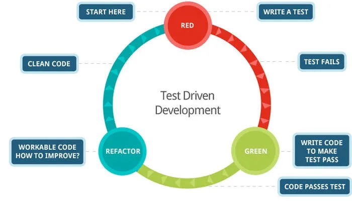

<!-- markdownlint-disable-file -->


**TDD ou Test-Driven Development…** Ce terme revient souvent dans les discussions entre développeurs, dans les offres d’emploi, ou même lors des revues de code. _"On devrait adopter le TDD sur ce projet !"_, _"Le TDD, c’est la base !", “On ne prend que les devs qui font du TDD !"_

Mais au fond, **c’est quoi le TDD ?** Et est-ce juste une mode ? Une méthode réservée aux puristes du code ? Ou bien une compétence indispensable pour coder mieux et plus vite ? J’ai en effet eu l’occasion de faire passer de nombreux entretiens techniques, où la notion de TDD variait d’un·e candidat·e à l’autre, d’où la présence de cet article aujourd’hui.

## Le TDD, c’est quoi au juste ? 

J’ai déjà entendu “_c’est faire des tests_”, ou “_c’est pour résoudre des_ [_katas_](https://fr.wikipedia.org/wiki/Kata_(programmation))”. Alors en fait c’est un peu plus que ça quand même. Surtout, tu vas fâcher son créateur [Kent Beck](https://fr.wikipedia.org/wiki/Kent_Beck), qui dit plutôt :

> TDD is not a testing technique. TDD is an analysis technique, a design technique, and actually a technique for structuring all activities of development.

En français, la traduction TDD pourrait être “**développement piloté par les tests**”. C’est avant tout une méthode de conception. Pour faire du TDD, tu vas découper vos problématiques à la maille la plus fine possible, et écrire les tests **avant** d’écrire le code qui partira en production. Après tout, dans le monde réel, tu définies bien le résultat à obtenir avant de te lancer dans la solution ?

Il repose sur trois lois importantes :

- Écris un test qui échoue avant d’écrire le code de production correspondant

- Écris une seule assertion à la fois, qui fait échouer le test ou qui échoue à la compilation

- Écris le minimum de code de production pour que l'assertion du test actuellement en échec soit satisfaite

De cela, on peut tirer un cycle de trois étapes :

- **🔴 RED** : J’écris un test qui **échoue**, car la fonctionnalité n’existe pas encore (_"Je veux que_ _`add(2, 3)`_ _retourne_ _`5`_ _, mais pour l’instant, ça ne compile même pas."_)

- **🟢 GREEN** : J’écris le **code minimal** pour faire passer le test (_"OK, je retourne_ _`5`_ _en dur. C’est dégueu, mais ça passe."_)

- **🔵 REFACTOR** : J’améliore le code **sans casser les tests** (_"Maintenant, je généralise pour que_ _`add(a, b)`_ _fonctionne pour tous les nombres."_)



### OK mais c’est quoi l’intérêt ?

On peut citer plusieurs arguments :

- **On réfléchit au comportement avant de coder** : Moins de surprises, et donc moins de bugs

- **On dégrossit les problématiques complexes** : Le découpage en baby steps, le fait de partir de l’étape la plus petite pour itérer ensuite permet de ne pas être débordé. Après tout, pour gravir l’Everest, il faut marcher un pas après l’autre !

- **On code seulement ce qui est nécessaire** : Pas d’_over-engineering_. On ne part pas dans tous les sens, on ne part pas trop loin pour devoir revenir en arrière ensuite

- **Filet de sécurité** : Si un test échoue après une modification, on sait tout de suite et exactement où est le problème

- **Code plus propre** : Le _refactoring_ est intégré dans le processus

### Mais c’est juste faire des tests avant de coder du coup ?

Alors non, ça c’est du **Test-First**. Tu peux en faire aussi, ce n’est juste pas la même chose. C’est d’ailleurs une des erreurs très courantes que je vois en entretien. Si tu dois retenir un point de différence, c’est le fait de progresser en **baby steps**.

Tu dois découper une problématique en étapes les plus petites possibles. Tu veux faire du TDD pour une méthode `divide` qui divise un nombre par un autre ? Commence déjà par tester que `divide(1, 1)` renvoie bien 1, avant de rentrer vraiment dans les règles de calcul et de penser par exemple au cas de la division par 0. Et progresse à partir de là. Tes cycles Red → Green → Refactor ne devraient durer que quelques minutes au maximum.

Voici un tableau qui pourrait récapituler les différences entre TDD et Test-First :

| Critère | TDD | Test-First |
| --- | --- | --- |
| Granularité | Tests écrits  un par un ,  baby steps | Tests écrits  en bloc  avant le code |
| Cycle | 🔴  →  🟢  →  🔵  ( itératif ) | Écrire tous les tests, puis coder |
| Objectif | Guider la conception  (le design émerge des tests) | Valider une conception  déjà définie |
| Développement | On développe lors de phase rouge | On développe  après  avoir défini tous les tests |
| Flexibilité | Le code s’adapte aux tests | Le code doit coller à une spécification préétablie |


Ainsi, le TDD pourrait se résumer à “_Je ne sais pas encore comment coder ça, mais mes tests vont me guider pas à pas”._

### D’accord pour la théorie, mais en pratique tu fais comment ?

Alors comme ça [tu n'as pas les bases](https://youtu.be/2bjk26RwjyU?si=sO2FNrBeh8xEeoif) ? On va partir sur un des exemples les plus courants.

C’est parti, faisons un peu de Java, je sais que tout le monde adore ça ! Un kata très connu est celui du [FizzBuzz](https://fr.wikipedia.org/wiki/Fizz_buzz). La règle est d’écrire une méthode qui prend un nombre en paramètre et qui : 

- Retourne `Fizz` si le nombre est divisible par 3

- Retourne `Buzz` si divisible par 5

- Retourne `FizzBuzz` si divisible par 3 et par 5 (donc par 15)

- Retourne le nombre sinon

Premier baby step ? Commencer par le premier nombre : 1 doit renvoyer 1.

Jusque là tout va bien. Deuxième baby step ? Et bien on passe à 2 : le code va devoir renvoyer autre chose que du “dur”. Troisième baby step ? 3 doit renvoyer `Fizz`.  Je vais t’épargner le code de chaque itération, mais on pourrait résumer les différentes étapes comme suit :

|  | Action | Code | Statut tests | Comment. |
| --- | --- | --- | --- | --- |
| 1 | 🔴 Test pour  1 | assertEquals("1", fizzBuzz(1)) | 🔴 | Nombres |
| 2 | 🟢 Gère  1  en dur | return "1" | 🟢 |  |
| 3 | 🔴 Test pour  2 | assertEquals("2", fizzBuzz(2)) | 🔴 |  |
| 4 | 🟢 Gère  2  en dur | if (n == 2) return "2"; | 🟢 |  |
| 5 | 🔴 Test pour  4 | assertEquals("4", fizzBuzz(4)) | 🔴 |  |
| 4 | 🟢 Gère  4  en dur | if (n == 4) return "4"; | 🟢 |  |
| 5 | 🔵 Généralisation  valueOf | String.valueOf(n) | 🟢 |  |
| 6 | 🔴 Test pour  3  (Fizz) | assertEquals("Fizz", fizzBuzz(3)) | 🔴 | Fizz |
| 7 | 🟢 Gère  3  en dur | if (n == 3) return "Fizz" | 🟢 |  |
| 8 | 🔴 Test pour  6  (Fizz) | assertEquals("Fizz", fizzBuzz(6)) | 🔴 |  |
| 9 | 🟢 Gère  6  en dur | if (n == 6) return "Fizz" | 🟢 |  |
| 10 | 🔴 Test pour  9  (Fizz) | assertEquals("Fizz", fizzBuzz(9)) | 🔴 |  |
| 11 | 🟢 Gère  9  en dur | if (n == 9) return "Fizz" | 🟢 |  |
| 12 | 🔵 Généralisation modulo | if (n % 3 == 0) return "Fizz"; | 🟢 |  |
| 13 | 🔴 Test pour  5  (Buzz) | assertEquals("Buzz", fizzBuzz(5)) | 🔴 | Buzz |
| 14 | 🟢 Gère  5  en dur | if (n == 5) return "Buzz" | 🟢 |  |
| 15 | 🔴 Test pour  10  (Buzz) | assertEquals("Buzz", fizzBuzz(10)) | 🔴 |  |
| 16 | 🟢 Gère  10  en dur | if (n == 10) return "Buzz" | 🟢 |  |
| 17 | 🔴 Test pour  20  (Buzz) | assertEquals("Buzz", fizzBuzz(20)) | 🔴 |  |
| 18 | 🟢 Gère  20  en dur | if (n == 20) return "Buzz" | 🟢 |  |
| 19 | 🔵 Généralisation modulo | if (n % 5 == 0) return "Buzz"; | 🟢 |  |
| 20 | 🔴 Test pour  15  (FizzBuzz) | assertEquals("FizzBuzz", fizzBuzz(15) | 🔴 | FizzBuzz |
| 21 | 🟢 Gère  15  en dur | if (n == 15) return "FizzBuzz" | 🟢 |  |
| 22 | 🔴 Test pour  30  (FizzBuzz) | assertEquals("FizzBuzz", fizzBuzz(30) | 🔴 |  |
| 23 | 🟢 Gère  30  en dur | if (n == 30) return "FizzBuzz" | 🟢 |  |
| 24 | 🔴 Test pour  45  (FizzBuzz) | assertEquals("FizzBuzz", fizzBuzz(45) | 🔴 |  |
| 25 | 🟢 Gère  45  en dur | if (n == 45) return "FizzBuzz" | 🟢 |  |
| 26 | 🔵 Généralisation modulo | if (n % 15 == 0) return "FizzBuzz"; | 🟢 |  |


> 💡 Ici, tu noteras que l’on fait 3 tests pour chaque étape avant le refacto, pour respecter une triangulation et être sûr de la généralisation pour chaque étape. C’est une manière de faire très scolaire, en pratique tu peux sauter quelques étapes sur un sujet aussi simple

Et voici donc le résultat de l’implémentation finale que je te propose, et qui répond à la problématique :

```java
public class FizzBuzz {
    public static String fizzBuzz(int n) {
        if (n % 15 == 0) return "FizzBuzz";
        if (n % 3 == 0) return "Fizz";
        if (n % 5 == 0) return "Buzz";
        return String.valueOf(n);
    }
}
```

Et bien entendu, il n’y a pas forcément qu’une façon de faire, je te propose la mienne. N’hésite pas à refaire l’exercice avec une autre implémentation/d’autres étapes. De plus, on ne manquera pas de compléter avec d’autres tests pertinents si nécessaire. Mais en résumé on retient bien ici que :

- **On avance par baby steps** : Un seul nouveau comportement à la fois

- **On ne généralise pas trop tôt** : On attend d’avoir plusieurs exemples avant de refactorer. Cela nous permet d’éviter d’aller trop loin trop tôt dans l’abstraction et de devoir retourner en arrière si cela bloque une implémentation

- **Le code émerge des tests** : Pas de design "parfait" dès le début

- **On refactore ensuite** : On améliore uniquement quand les tests sont verts

Oui mais là c’est du Java ! Moi je code surtout en Python/Go/JavaScript/etc.

Alors déjà le [Java c’est cool](https://blog.hoppr.tech/tags/java), et c’est moi qui écris l’article donc c’est moi qui décide. Mais tu peux faire du TDD avec plein d’autres langages et mêmes [paradigmes](https://fr.wikipedia.org/wiki/Paradigme_(programmation)) que l’orienté objet. Le principe du TDD est **agnostique au paradigme/langage employé**.

Tu peux même en faire en [Cobol](https://fr.wikipedia.org/wiki/Cobol) si ça t’amuse (et [oui ça existe](https://www.youtube.com/watch?v=0pFGnDogfqA)) ! Ce sera l’occasion de rendre hommage à [Grace Hopper](https://fr.wikipedia.org/wiki/Grace_Hopper) dont [HoppR](https://www.hoppr.tech/) tire le nom.

### Le TDD ça sert qu’à faire des Katas en fait ?

Alors si c’était le cas, on en ferait tout simplement pas. Comme je le précise plus loin dans l’article, seuls les outils utiles sur des projets en production restent dans les discussions des développeur·euses.

A titre personnel, je ne l’utilise pas dans tous les cas, mais cela m’arrive assez fréquemment. Je considère que c’est particulièrement adapté quand j’ai une problématique dont le résultat voulu est parfaitement clair, moins quand je suis en “exploratoire”.

Mais de manière générale, j’aime le fait d’avoir un feedback très rapide sur ce que je suis en train de produire, et les baby steps me permettent de décortiquer une problématique complexe en briques bien plus simples. Ça se retrouve dans les [principes de l’agilité d’ailleurs](https://manifesteagile.fr/)…

### OK mais pourquoi changer ma manière de faire et faire du TDD ?

Alors oui, je le conçois, le TDD peut paraître un peu rebutant de prime abord. En effet, c’est assez peu naturel au démarrage, et les vieilles habitudes (comme ne pas procéder en baby steps par exemple) reviennent souvent au galop. Mais passé ce cap, on peut constater :

- Une couverture de code forcément élevée sans y avoir accordé d'importance

- Des tests simples qui documentent des cas métiers réels

- Moins de régressions et meilleur feedback : on casse les tests directement si un de nos baby steps est raté

### Mais concrètement, c’est sûr, ça donne moins de bugs ? J’irai plus vite ?


Soyons honnêtes : si la réponse était un oui franc et sans contestation, tout le monde ferait déjà du TDD à 100%. A l’inverse, si c’était inutile, cela aurait probablement déjà disparu des radars et cet article n’existerait pas. C’est plus nuancé que ça.

J’avais déjà écrit sur le sujet lors d’une conférence de Victor Lambret (alias [BoringDev](https://vlambret.github.io/)), dans l’article que [tu peux retrouver ici](https://blog.hoppr.tech/blogs/2025-05-07-lyon-craft-2025-22#conf%C3%A9rence-dessin%C3%A9e-regard-scientifique-sur-lartisanat-logiciel). 

> Une première [méta-analyse](https://fr.wikipedia.org/wiki/M%C3%A9ta-analyse) nous indique une tendance : le TDD serait positif pour éviter/corriger les bugs, mais en contre-partie la productivité serait impactée négativement. Mais il est compliqué de statuer de manière très claire avec les études industrielles.

Microsoft a mené une étude (il y a bien longtemps) qui semble étayer cette analyse. Mais là aussi, trop de facteurs autres que le TDD peuvent être mis dans la balance. Et puis gardons quelque chose en tête : on peut faire du mauvais TDD si on n’en maîtrise pas les concepts, ce qui fausse forcément notre ressenti sur le sujet.

Chez HoppR, [nous sommes convaincus qu’il s’agit d’un outil utile](https://www.linkedin.com/posts/hopprtech_le-tdd-tu-ma%C3%AEtrises-activity-7416495651041226752-aoMj?utm_source=share&utm_medium=member_desktop&rcm=ACoAAAZmGCoB5r4NH8aG9GFIaRVyNOqCxN7v6iU), et nous l’employons souvent, que ce soit chez nos clients ou sur nos propres projets. Nous ne pouvons que te conseiller d’au moins essayer ! C’est toujours un bon réflexe pour un·e dévelopeur·euse d’avoir de nouveaux outils dans sa boîte, et de voir de nouvelles manières de faire. En tout cas, n’hésite pas à venir nous en parler en conférence ou sur LinkedIn pour avoir nos ressentis sur le sujet !

### D’accord, d’accord, je vais essayer le TDD, mais par où je commence ?

En premier lieu, n’hésite pas à te tourner vers tes collègues. Le TDD est maintenant répandu, et de nombreuses communautés Craft savent enseigner ce sujet. De plus, de nombreux Katas se prêtant particulièrement bien au TDD existent comme [ceux-ci](https://github.com/gabbloquet/entrainement-au-tdd).

Mais tu peux en trouver bien plus. Voire même te créer les tiens, d'autant plus qu’avec l'IA, il est très facile d'en avoir sur mesure afin de pratiquer. Et ce quelque soit le langage sur lequel tu veux t’entraîner.

Et bien entendu, HoppR [te propose plusieurs formations approfondies sur le TDD](https://www.hoppr.tech/formations-hoppr), pour en faire sur du code legacy ou du frontend par exemple, avec beaucoup d’ateliers pratiques (rien ne vaut la pratique !)

## Conclusion

Non, le TDD n’est pas “une mode”, ni “un gadget”. C’est un nouvel outil à ta disposition pour repenser ta manière de concevoir et de développer. A toi de tester et de voir la différence avant/après pour être convaincu·e !

### Ressources complémentaires

- [Test-Driven Development by Example (Kent Beck)](https://www.fnac.com/livre-numerique/a19431560/Kent-Beck-Test-Driven-Development)

- [Formation HoppR : TDD](/p/19ff4462cd388034b74eecb49e31630d)

- [Formation HoppR : TDD Frontend](/p/1adf4462cd38804686bfcddaaa2e8e5b)

- Pour aller plus loin encore : [Le vert ne suffit pas : 3 façons de douter de son code](https://blog.hoppr.tech/blogs/2026-06-23-le-vert-ne-suffit-pas-3-facons-de-douter-de-son-code)
