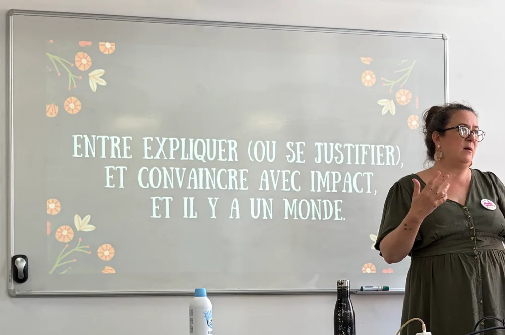
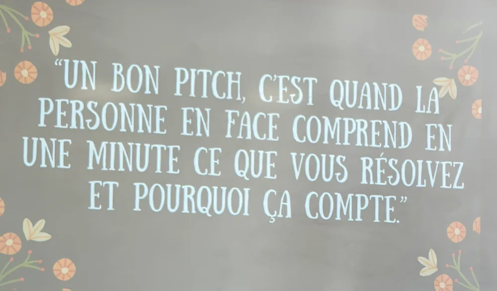

<!-- markdownlint-disable-file -->

# Retour sur l'atelier animé par Rachel Dubois lors d'Agi'Lille

Mercredi 24 et jeudi 25 juin 2026, sous la canicule, j'étais à la dernière édition d'[Agi'Lille](https://nord-agile.org/agilille/). Je souhaite faire un retour d'expérience sur cet atelier que j'ai beaucoup aimé.

En binôme, nous avons écrit notre pitch avec chaque structure puis les avons présenté en 2 min max avant de faire des feedback croisés en 5 min avec cette grille : L’accroche me donne t’elle envie d’écouter ? Ai-je compris le problème et la solution ? Est-ce crédible (preuve, posture, ton) ? Est-ce que la vision m’inspire ? Le _call-to-action_ est-il clair ?

J'ai adoré faire cet atelier et voir Jacqueline (une ancienne collègue) tenter de convaincre fictivement [Edouard, notre Head of Craft chez HoppR](https://www.linkedin.com/in/edouard-cattez-865794133/), de rejoindre l'organisation du meetup Software Craft Lille. 

En quelques minutes, elle est passée d'un argumentaire un peu flou à un pitch structuré et ça a été la meilleure illustration en direct de ce que Rachel venait de nous expliquer : entre se justifier et convaincre, il y a un monde.

Lorsqu'on présente une idée, un projet ou un produit, notre premier réflexe est souvent d'expliquer. On détaille le contexte, les fonctionnalités, les contraintes, les raisons qui nous ont conduits à cette solution. Pourtant, **expliquer n'est pas vendre**.

C'est l'un des messages forts de l'atelier animé par Rachel à Agi'Lille : entre se justifier et convaincre avec impact, il existe un véritable fossé.

**Un bon pitch n'est pas une présentation. C'est un outil d'influence qui vise à provoquer une décision.**

## Avant de pitcher : clarifier son objectif

Avant même de construire son argumentaire, Rachel propose un exercice simple mais redoutablement efficace. 

Posez-vous quatre questions :

- Quel est le sujet ?

- Qui devez-vous convaincre ?

- Quelle décision attendez-vous ?

- Quelles sont les trois objections principales à anticiper ?

L'objectif n'est pas de préparer une réponse parfaite à tout, mais de clarifier le terrain de jeu. Un pitch efficace commence toujours par une compréhension précise de son audience et de l'action attendue.

## Trois frameworks pour structurer son pitch

Voici trois structures narratives complémentaires. Chacune répond à un objectif différent. Nous verrons ensuite comment choisir la bonne selon son audience.

### Le Golden Circle : partir du "Pourquoi"

Popularisé par [Simon Sinek](https://fr.wikipedia.org/wiki/Simon_Sinek), le Golden Circle reste l'un des cadres les plus puissants pour construire un discours convaincant. Il s'articule en trois cercles :

- **Le Why (le sens)** - Pourquoi faites-vous cela ? 
C'est le cœur du récit, la raison d'être de votre démarche, ce qui crée l'émotion et donne envie d'écouter.

- **Le How (la méthode)** - Comment vous y prenez-vous ? 
C'est votre approche, votre différenciation, ce qui vous distingue des alternatives existantes.

- **Le What (la preuve)** - Qu'est-ce que vous faites concrètement ? 
Le produit, le service, la solution, les éléments tangibles qui démontrent que votre promesse est crédible.

Si vous aussi vous souhaitez vous entrainer, écrivez votre pitch en reprenant la structure : 

- **Le Why (en 1 phrase)** - “Nous croyons que… “

- **Le How (la méthode)** - “Nous y arriverons en…”

- **Le What** - des exemples concrets (features, livrables, jalons)

- La preuve - un insight ou une métrique que vous avez déjà et qui est crédible

- La demande explicite - “J’ai besoin de votre décision sur…”

L'erreur la plus fréquente consiste à commencer directement par le "What". Or, les personnes adhèrent rarement à une fonctionnalité. Elles adhèrent d'abord à un problème résolu, une vision ou un bénéfice.

Posez-vous la question si votre “Why” est orienté utilisateur, si le “How” est formulé en principes (pas en features) et si les “What” sont concrets et limités à 3.

**Ce format est le plus adapté** pour une vision, une roadmap, un All Hands… tout ce qui vise à fédérer autour d'une ambition commune plutôt qu'à obtenir une décision immédiate.

### Le Hero's Journey : quand le storytelling devient un levier de conviction

L'idée est simple : votre audience est le héros de l'histoire. Pas votre produit.
L’erreur d’égo est de penser que le produit (ou la marque) est le héros qui sauve le monde..

- **La situation initiale** - Décrivez le quotidien de votre audience. Que vit-elle aujourd'hui ? Quelles difficultés rencontre-t-elle ? L'objectif est de créer l'identification.

- **L'incident déclencheur -** Pourquoi la situation actuelle ne peut-elle plus durer ? Quel changement, quel risque ou quelle opportunité rend l'action nécessaire maintenant ? C'est ici que naît le sentiment d'urgence légitime.

- **La quête** - Présentez votre initiative comme une capacité, et non comme une fonctionnalité. Au lieu de dire _"Nous avons développé un nouvel outil RH"_, préférez _"Nous permettons aux managers d'identifier plus rapidement les signaux de démotivation."_ On parle du résultat avant de parler de l'outil.

- **La résolution** - Expliquez le parcours d'adoption. Rachel recommande de présenter trois étapes maximum : la mise en route, l'appropriation, la montée en puissance, sans oublier les éventuelles frictions rencontrées en chemin. Cette transparence renforce la crédibilité.

- **Le résultat** - Terminez avec une mesure concrète et une preuve : une métrique, un retour d'expérience, un test réalisé, un enseignement terrain. Un bon pitch se termine rarement par une opinion. Il se termine par un élément vérifiable.

Comme l'a résumé Rachel : _« On ne code pas une fonctionnalité, on aide Julie à résoudre son problème. »_

**Ce format est le plus adapté** pour une équipe Produit ou Delivery car il permet de créer de l'empathie avec l'utilisateur final et de reconnecter l'équipe à la valeur créée derrière chaque développement.

### Le framework ABT : And / But / Therefore

Développé et popularisé par [Randy Olson](https://en.wikipedia.org/wiki/Randy_Olson), scientifique devenu réalisateur, ce modèle s'inspire des grandes structures narratives utilisées depuis l'Antiquité. 

L'idée est que toute histoire convaincante repose sur une situation, une tension et une résolution.

- **AND - poser le contexte.** Établir un terrain d'entente avec un ou deux faits maximum, sans encore créer de tension.
_Exemple : "Nos équipes recrutent de plus en plus de profils pénuriques et le marché devient de plus en plus concurrentiel."_

- **BUT - introduire le problème.** C'est ici que l'attention se crée par une contradiction, un obstacle qui empêche d'atteindre l'objectif.
_Exemple : "...mais notre processus de recrutement reste trop long."_

- **THEREFORE - proposer une solution et appeler à l'action clairement** 
_Exemple : "Donc, nous proposons de mettre en place un suivi automatisé des candidatures afin de réduire les délais de traitement de 30 %."_

Le pitch se termine naturellement sur une solution et une action attendue.

**Ce format est le plus adapté** pour un comité de direction ou un comité de décision. Les dirigeants recherchent avant tout de la clarté et de l'efficacité, et le "Therefore" conduit naturellement vers la décision attendue.

## Choisir le bon framework selon son audience

L'une des erreurs fréquentes est de vouloir utiliser la même structure pour tout le monde. Pourtant, convaincre un comité de direction, une équipe produit ou l'ensemble d'une entreprise ne se fait pas de la même façon. 
Voici la grille de lecture partagée par Rachel :

| Audience | Framework | Objectif |
| --- | --- | --- |
| Vision, roadmap, All Hands | Golden Circle | Why (croyance) → How (principes) → What (initiatives). Donner du sens avant de parler d'exécution.  |
| Équipe Produit / Delivery | Hero's Journey | Créer de l'empathie avec l'utilisateur final plutôt que présenter une fonctionnalité brute. |
| Comité de direction / comité de décision | ABT  | Contexte → Risque business → Solution → Preuve → Demande de décision. Faciliter une prise de décision rapide et éclairée. |

## Influencer sans manipuler

L'un des passages marquants de l'atelier concernait l'éthique de l'influence. 
Comme le rappelait une des diapositives :

> **Influence durable = sens + preuve + transparence sur les limites.**

Trois garde-fous ont été proposés :

- Dire ce que l'on sait et ce que l'on ne sait pas.

- Montrer le coût de l'inaction sans exagération.

- Séparer l'émotion qui capte l'attention des preuves qui soutiennent la décision.

À l'inverse, certains signaux doivent alerter : l'urgence artificielle, les chiffres invérifiables, les promesses de type "solution miracle".

Les bons réflexes sont de terminer par “voici comment on le prouve”, tester le pitchs avec ses collègues et encore et toujours demander du feedback.

## Et si vous n'avez pas encore les preuves ?

Une remarque très pertinente a clôturé cette séquence de l'atelier. Dans certains projets, notamment lorsqu'ils démarrent, il est impossible de présenter immédiatement des résultats ou des métriques solides.

Dans ce cas, Rachel recommande de ne pas masquer cette réalité. 
À la place, présentez votre **plan de preuve** : le test que vous allez réaliser, les indicateurs que vous allez suivre ou encore les jalons qui permettront de valider ou d'invalider vos hypothèses.

Autrement dit, si vous n'avez pas encore la preuve, montrez comment vous allez la construire. Cette transparence renforce souvent davantage la crédibilité qu'une promesse difficile à démontrer.

## Les principaux enseignements de l'atelier

Un pitch performant ne consiste pas à transmettre le maximum d'informations.
Il consiste à guider une personne vers une décision. 

Pour convaincre durablement :

- Commencez toujours par clarifier la décision attendue.

- Adaptez votre structure à votre audience.

- Utilisez le Golden Circle pour donner du sens, le Hero's Journey pour créer de l'empathie et l'ABT pour accélérer la prise de décision.

- Appuyez-vous sur des preuves ou, à défaut, sur un plan de preuve crédible.

- Influencez avec transparence plutôt qu'avec des artifices de persuasion.

Car un bon pitch n'est pas une démonstration d'éloquence. C'est la capacité à faire comprendre un enjeu, créer l'adhésion et faciliter une décision.

Et vous, quel framework utilisez-vous le plus au quotidien : **Golden Circle, Hero's Journey ou ABT** ? Ou en connaissez-vous d'autres qui ont fait leurs preuves ?

