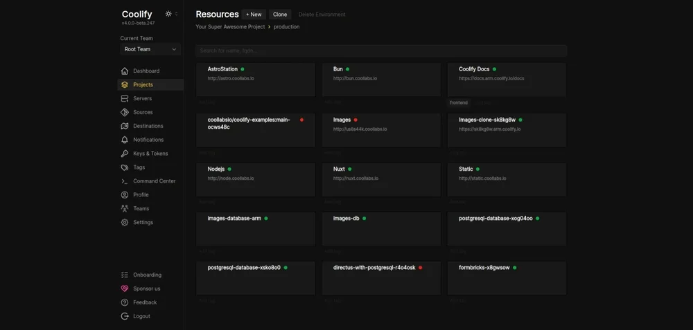

<!-- markdownlint-disable-file -->

On vous retrouve pour la partie 2 de nos retours du Devlille, cette fois ci orientés autour des notions de souveraineté et d’éco conception 

Si vous avez manqué la partie 1, c’est [par ici](https://blog.hoppr.tech/blogs/2026-06-29-quand-lia-rencontre-la-prod-retour-sur-les-talks-ia-du-devlille-2026-pt-1) 

Souveraineté numérique et éco-conception sont souvent traitées séparément. Pourtant, les conférences que nous avons suivies racontent au fond la même histoire : derrière chaque dépendance à un géant du cloud, chaque service externe et chaque ligne de code inefficiente se cache une décision d'architecture qui nous engage.

Voici les cinq talks qui, de la gestion des clés cryptographiques à la mesure de l'impact carbone de nos applications, montrent qu'il reste possible de garder la main.

## Garder les clés de ses données : le chiffrement au service de la souveraineté

_Par Aeddis Desauw - 45 min -_ [_Abstract_](https://devlille.fr/talk-page-78632611-c284-4ddd-96db-6d27c2edd97e/) _-_ [_Captation_ ](https://youtu.be/d7LPm-KmjMg?si=t1wyoCMnTvA--S9v)

Un **HSM** (_Hardware Security Module_) est un rack physique inviolable dont le rôle est de garder des clés cryptographiques hors de portée. Cas d'usage : chiffrement au repos, signature, authentification, sécurisation d'infrastructures distribuées. La question qui suit naturellement : où stocker la clé du HSM lui-même ?

OVH proposait deux offres aux extrêmes : le HSM dédié (contrôle total mais complexe, vendor lock-in) et le KMS (simple, bien intégré aux produits existants, mais hardware partagé et isolation purement logicielle). L'équipe a jugé qu'il manquait quelque chose entre les deux.

**Leur réponse : un HSM cloud souverain** où OVH fournit un driver standardisé qui abstrait les communications avec le hardware sous-jacent, de façon transparente pour le client. Facturation à l'usage, performances garanties, fully managed, sans perdre le contrôle des clés. Les limites assumées tiennent au hardware mutualisé et à une confiance nécessaire envers OVH, documentée par des certifications externes et une promesse d'open source à venir.

Côté hardware, deux fournisseurs ont été évalués : Thales (20 ans d'expérience, robuste mais sans API REST) et Provenrun (startup française plus récente, aux features modernes). Construire leur propre HSM a été envisagé puis écarté : les volumes étaient trop faibles (4 à 5 HSM par datacenter) pour justifier la complexité d'une solution custom, bien supérieure à celle d'un serveur classique.

**La solution finale : rester sur les deux fournisseurs en parallèle** plutôt que de fusionner les approches. OVH propose donc un HSM Cloud qui abstrait les communications avec le hardware sous-jacent, tout en maintenant le contrôle des clés : mais sans créer leur propre hardware cryptographique.

Ce talk est une bonne introduction au sujet pour des personnes qui ne pratiquant pas la sécurité cryptographique au quotidien, restait très centré sur les solutions OVH et moins sur une comparaison large des architectures et alternatives disponibles : ce qui est compréhensible pour une présentation commerciale, mais limite la vision d'ensemble.

## Reprenez le contrôle de votre plateforme data face aux géants américains

_Par Jonathan Fritsch & Nathan Leclercq - 45 min -_ [_Abstract_](https://devlille.fr/talk-page-3f663aa0-62cf-4ce4-af18-e0a70afe5da7/) _-_ [_Captation_ ](https://youtu.be/l6QpK01l4Fw?si=3wafHuXYEFGgmTOQ)

Le talk s’est ouvert avec une histoire de brasserie. Pour réduire ses coûts, un brasseur artisanal migre toute sa production vers les États-Unis, séduit par un service moins cher et plus rapide. Un an plus tard, les prix augmentent, et il ne peut rien y faire puisque tout est inscrit dans le contrat. En partageant sa recette, il a aussi perdu le contrôle de son activité.

L'analogie tient parfaitement pour le cloud. Chez Google, Microsoft ou AWS, les conditions d'utilisation permettent la réutilisation des données transmises. Et avoir ses serveurs en France ne suffit pas davantage, puisqu'une entreprise américaine opérant sur le sol français peut légalement accéder aux données de ses clients au titre du CLOUD Act.

Le REX présenté concerne une société spécialisée dans les services téléphoniques. Elle utilisait un outil de reporting externe et fermé pour analyser les appels de ses clients, jusqu'à ce que l'éditeur l'arrête. La contrainte devenait alors claire : reconstruire l'équivalent en interne, avec un budget fixe, une équipe locale et ses données bien à elle.

L'architecture mise en place repose sur une collecte des données vers un Data Lake (serveurs propres et Garage, un outil de stockage objet français), une transformation avec DuckDB pour les petits volumes et Spark pour les gros, une orchestration via Airflow sur Kubernetes K3s, puis un Data Warehouse en PostgreSQL. Chaque composant a été choisi pour être facilement remplaçable, sans risquer de faire tomber tout l'édifice.

**Résultat :** 4,5 mois de développement, 43 millions de lignes traitées, 2 ans d'historique reconstruit, et zéro euro dépensé en services externes. L'alternative Azure aurait coûté environ 6 000 € pour le même résultat, avec la dépendance en prime.

Le message de fin était simple : **le cloud privé n'est pas une utopie, mais il n'est pas non plus la solution universelle**. La souveraineté est avant tout une décision d'architecture, et la vraie question à se poser est de savoir si l'on est prêt à payer un peu plus pour garder le contrôle de ses données.

## Héberge tout toi-même pour moins de 10 €/mois avec Coolify

_Par Florian Lemaire - 45 min -_ [_Abstract_](https://devlille.fr/talk-page-7f293b32-de28-4881-94ac-183b3a41d91d/) _-_ [_Captation_](https://youtu.be/En58xb0dRxM?si=1PDKE48omYVw9oaM)

Florian a ouvert cette conférence avec une question simple : **qui a encore un side project qui prend la poussière, faute d'endroit où le déployer ?**

Son problème de départ est concret : il voulait déployer plusieurs projets perso sans y mettre le budget d'un compte cloud professionnel. Son premier réflexe a été de regarder du côté de GCP, mais le tarif d'environ 210 $/mois pour une configuration raisonnable s'est révélé rédhibitoire.

C'est en cherchant une autre voie qu'il a découvert **Coolify**, une solution open source auto-hébergeable qui se présente comme une alternative à Heroku, Netlify ou Vercel. L'installation tient en une seule commande à lancer dans un terminal : en deux à cinq minutes, vous disposez d'un dashboard accessible depuis un navigateur. La configuration minimale reste modeste, avec 2 cœurs CPU, 2 Go de RAM et 30 Go de disque, de quoi tourner sur un vieux PC, un Raspberry Pi ou un simple VPS.

Coolify propose un dashboard intuitif qui centralise la gestion de tous les déploiements et services :

En pratique, Florian fait tourner son setup sur un VPS Hetzner à 5 €/mois. Le dashboard gère tout : déploiement depuis GitHub ou GitLab, reverse proxy avec renouvellement automatique des certificats SSL, bases de données managées, backups planifiés avec rétention configurable, monitoring CPU/RAM/logs par container, et même des cron jobs. On recense déjà plus de 468 000 instances dans le monde, pour un projet actif depuis 2021 et porté par une importante communauté Discord.

La cerise sur le gâteau, démontrée en live : Coolify expose désormais une API et un serveur MCP, permettant de déclencher des redéploiements directement depuis un outil IA. Le tout pour le prix d'un café par mois, sans avoir besoin d'être ops, juste un peu curieux.

Bien que Coolify simplifie grandement le déploiement et la gestion d'applications, il est crucial de rappeler que l'hébergement reste une responsabilité. Mettre en place Coolify ne dispense pas de s'occuper du monitoring, de la gestion de l'infrastructure sous-jacente, du réseau, ou des sauvegardes. C'est un excellent outil open source qui permet d'héberger des projets sans devoir "mettre les mains dans le cambouis" de la configuration manuelle, mais cela demande toujours une certaine vigilance opérationnelle. Pour les équipes cherchant un équilibre entre simplification et contrôle, Coolify représente une bonne alternative aux solutions propriétaires.

## EcoScore A ou E ? Où se situe vraiment votre API ?

_Par Emmanuel Peru - 30 min -_ [_Abstract_](https://devlille.fr/talk-page-dd6a5188-62cd-4cd3-aa20-26d9a48f2319/) _-_ [_Captation_](https://youtu.be/XDaJhPRvz6U?si=JNK0OqYpxUTdE06F)

Emmanuel a abordé l'éco-conception logicielle avec une approche outillée et très concrète.

Son argument de fond : **le problème environnemental du numérique n'est pas l'utilisation, c'est la fabrication du matériel**. Or ce qui accélère le renouvellement du matériel, c'est l'inefficience croissante du logiciel. Si la [loi de Moore](https://fr.wikipedia.org/wiki/Loi_de_Moore) nous a donné des processeurs exponentiellement plus puissants, la [loi de Wirth](https://fr.wikipedia.org/wiki/Loi_de_Wirth) rappelle que le logiciel grossit au même rythme. En 20 ans, la suite Office a besoin de 160 fois plus de mémoire, avec beaucoup moins de nouvelles fonctionnalités utiles en proportion. L'empreinte du développeur est donc directe : des applications plus efficientes prolongent la vie du matériel.

Pour mesurer et améliorer l'efficience de nos APIs, il présente deux référentiels complémentaires :

[**API Green Score**](https://github.com/API-Green-Score/APIGreenScore) (du collectif API Thinking) : une auto-évaluation sur 23 critères concrets : cache, pagination, format d'échange, cycle de vie de l'API, architecture, infrastructure. Le résultat est un score de A à E, comparable à l'étiquette énergie d'un appareil électroménager.

![Ce tableau est un extrait d’une grille d’auto-évaluation “API Green Score”. Les lignes sont regroupées par section (Architecture, Design, Usage, Logs). Chaque ligne correspond à une règle (identifiant + description) et indique son poids, le nombre de points associés, puis le résultat de l’évaluation (VRAI/FAUX) avec un score calculé. La dernière colonne contient des commentaires contextuels (par ex. “polling des consommateurs toutes les 5 min”, “GET /products non paginé”, “rétention des logs 2 ans par défaut”).](./assets/img5.webp)

[**EROOM**](https://boavizta.org/eroom) (de l'association Boavizta) : un framework plus large qui évalue la maturité globale d'un service numérique, du produit à l'architecture en passant par l'infrastructure et le stockage. Un diagnostic rapide en 16 questions, puis un approfondissement par domaine.

La bonne nouvelle : il a développé [**The GreenScope**](https://www.greenscope.io/), un outil open source unifiant ces deux référentiels dans une interface accessible (application desktop en Tauri/Rust, très légère, car l'ironie serait de créer une usine à gaz pour mesurer l'impact de ses APIs). L'outil est disponible en web et desktop, co-conçu de façon éco-responsable, sans framework front lourd ni dépendances externes.

Un sujet difficile à vendre en entreprise (« le green, ça réduit les coûts » passe mieux que « faisons moins d'impact »), mais des cas concrets chez Axa et Decathlon commencent à montrer que la démarche est possible à l'échelle.

## DevGreenOps : Passer du sprint à l'endurance énergétique avec Decathlon x Greenspector

_Par Nathalie Otte, Olivier Philippot & Ludovic Roland_ _- 45 min -_ [_Abstract_](https://devlille.fr/talk-page-ec5eb4bd-81f7-41c2-9cde-66b1584dd5ff/) _-_ [_Captation_](https://youtu.be/Sp77hYnCcMg?si=RwJT8rR_QRl2ZQtZ)

Chez Decathlon, mesurer ne suffit pas : la démarche verte ne commence pas par des intentions, mais par de l'outillage.

Le contexte : l'application shopping Decathlon, native Android, 3 millions d'utilisateurs par mois, déjà intensément monitorée (KPIs, crashs, perf, A/B tests). L'outil retenu est **Greenspector**, une SaaS qui mesure la consommation énergétique et la décharge batterie sur Android.

La méthodologie est structurée en quatre temps : définir les CUJ (Critical User Journeys : lancement cold start, login, recherche, panier), écrire un script DSL Greenspector simulant des interactions humaines, le valider localement puis dans le cloud, et l'industrialiser dans un workflow GitHub Actions déclenché à chaque release (Greenspector récupère l'APK directement depuis le Play Store).

Les résultats ont débouché sur des actions concrètes : _event batching_ sur le SDK analytics maison, suppression d'un SDK natif redondant, et plusieurs investigations en cours sur des étapes précises du parcours.

Les difficultés sont honnêtement documentées : pas de mocks (données live), et des traductions OTA comme des A/B tests qui font évoluer l'UI et cassent régulièrement le script. En contrepartie inattendue, l'outil remonte aussi des problèmes d'accessibilité et des bugs fonctionnels.

La suite consiste à viser la certification Greenspector Bronze (50 % de score) et à étendre la démarche à iOS. Le cadre d'adoption utilisé est CALMS (Culture, Automation, Lean, Mesure, Sharing), avec l'audit comme premier vecteur d'acculturation.

## Conclusion

D'un talk à l'autre, le même constat s'impose : **la souveraineté et la sobriété ne sont pas des contraintes subies, mais des choix d'ingénierie assumés**. Garder ses clés, héberger ses propres services, mesurer l'empreinte de ses APIs ou reconstruire une plateforme data en interne demandent un investissement réel, en temps comme en compétences. En contrepartie, ces démarches redonnent aux équipes la maîtrise de ce qui compte vraiment : leurs données, leurs coûts et leur impact. **Autant de valeurs qui résonnent directement avec notre engagement de société certifiée B Corp**.

**Pour aller plus loin :**

- Vous avez manqué le premier volet ? Retrouvez notre [**REX DevLille 2026 sur l'intelligence artificielle**](https://blog.hoppr.tech/blogs/2026-06-29-quand-lia-rencontre-la-prod-retour-sur-les-talks-ia-du-devlille-2026-pt-1)

- La dernière partie de nos retours du Devlille arrive vite et elle est consacrée au craft, à l’archi et au front end, on compte sur vous pour la lire

- Suivez [HoppR sur LinkedIn](https://www.linkedin.com/company/hopprtech/?viewAsMember=true) pour ne rien manquer de nos prochains contenus.

À très vite pour la suite de nos retours !

