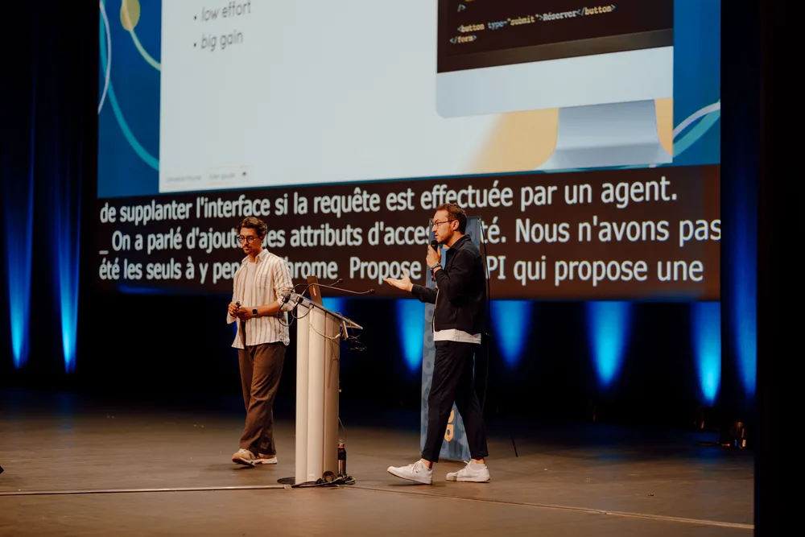
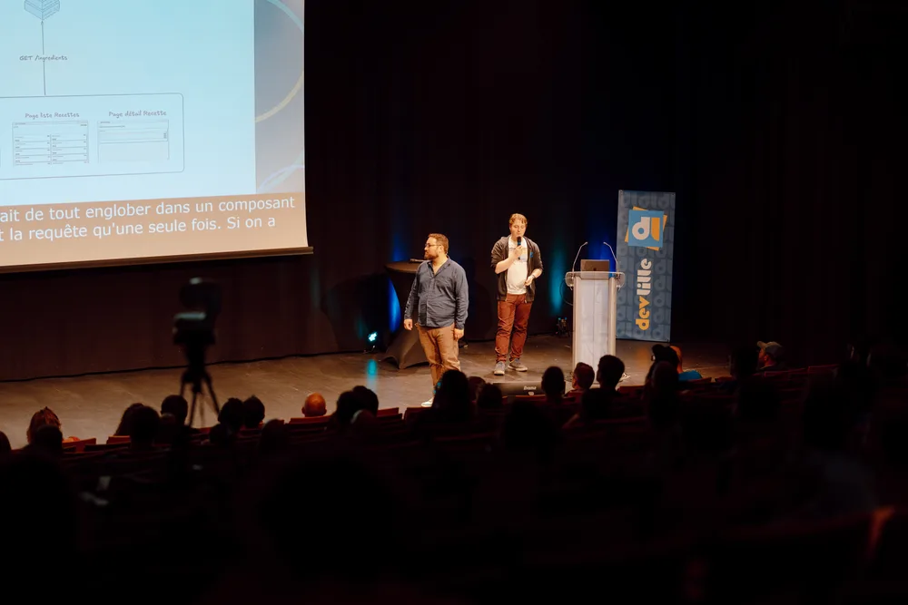
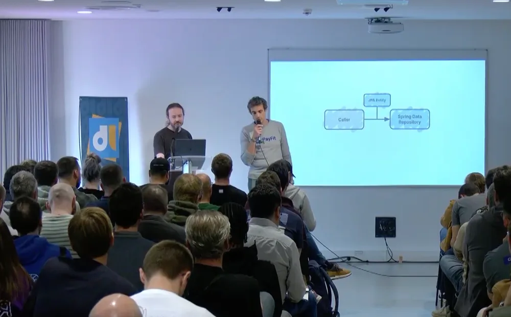
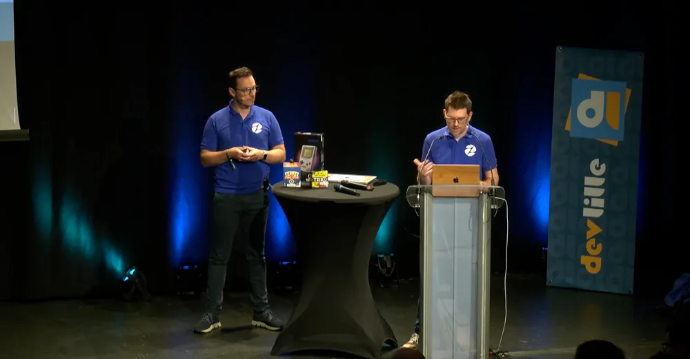
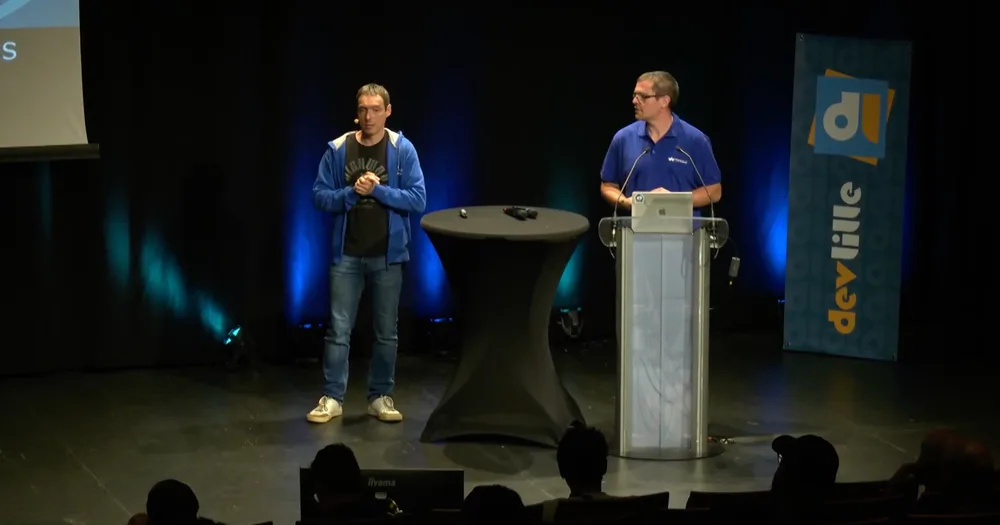
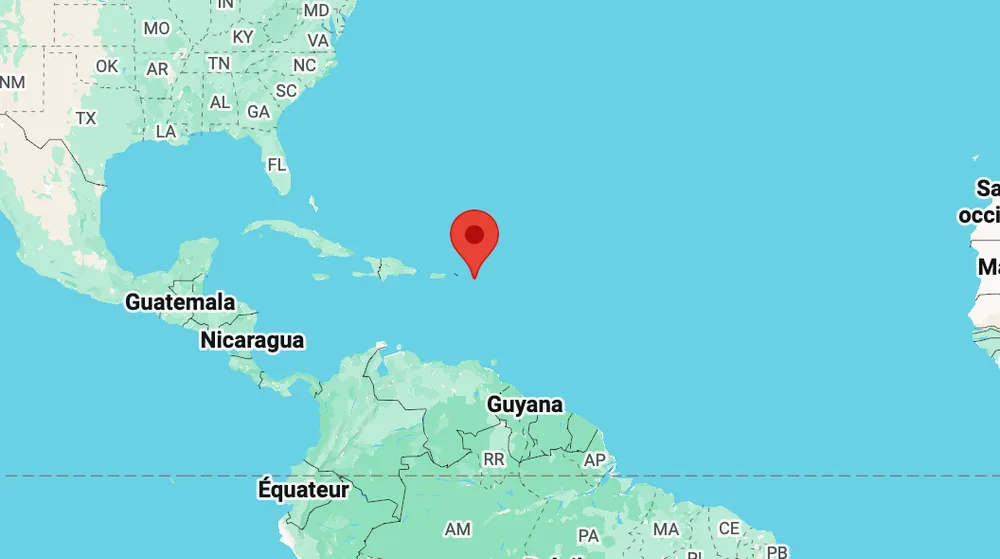

<!-- markdownlint-disable-file -->


Dernière partie de nos retours du Devlille 2026 et cette fois-ci elle est consacrée au craft, à l’archi et au front end !  Vous pouvez retrouver la partie 1 [ici ](https://blog.hoppr.tech/blogs/2026-06-29-quand-lia-rencontre-la-prod-retour-sur-les-talks-ia-du-devlille-2026-pt-1)et la partie 2 [là](https://blog.hoppr.tech/blogs/2026-07-08-souverainete-eco-conception-notre-rex-devlille-2026-pt-2). 

On espère que vous apprécierez 

## Concevons-nous toujours des applications pour les humains ? 

_Par Johnathan Meunier & Julien Gaudet - 45 min -_ [_Abstract_](https://devlille.fr/talk-page-85a34da9-8712-4c21-a242-c28af9345c46/) _-_ [_Captation_](https://youtu.be/eiWp1WDnSto?si=wkdlydBAU4voocTT)



Johnathan Meunier, staff engineer UI, et Julien Gaudet, front-end & Scrum Master ont ouvert la seconde journée avec une conférence à la fois philosophique et très ancrée dans le concret.

La question de fond : si les agents autonomes sont capables d'interagir avec nos interfaces à notre place, pour qui conçoit-on encore ces interfaces ? L'émergence du protocole MCP change les règles, des agents peuvent maintenant naviguer, interpréter et agir sur le web de façon indépendante.

Premier constat actionnable : une interface bien pensée pour l'accessibilité (sémantique HTML, ARIA labels) est aussi une interface que les agents peuvent utiliser facilement. Penser "agent first" devient le nouveau "responsive first", et les recherches web agentiques vont probablement privilégier les sites facilement consultables par des agents.

Un exemple frappant sur les limites actuelles : réserver des places de cinéma sur un plan de salle. Ce qui est trivial pour un humain (lire l'espace, comprendre ce qui est "une bonne place" selon le contexte, être en groupe, vouloir l'expérience immersive, vouloir être tranquille) est extraordinairement difficile pour un agent. Le paradoxe de Moravec en action : ce qui est simple pour l'homme est souvent le plus dur à automatiser.

Ils introduisent la notion de point de non-retour, doux (la dépendance émotionnelle et relationnelle à un outil) et dur (la singularité technologique, longtemps estimée à 2035-2045 et aujourd'hui ramenée à 2030 par certains experts). Des gouvernements au Pérou, en Bolivie et en Arménie ont déjà expérimenté des "ministres IA", le point doux n'est pas si théorique.

Leur conclusion : notre rôle de développeur évolue, de l'écriture de TypeScript et React vers la conception d'interfaces pour agents et l'écriture de prompts. Mais la responsabilité reste entière, c'est nous qui décidons ce qu'on délègue, et qui répondons de ce qui est produit.


## Ils sont fous chez TanStack, ils ont mis une DB dans le front !

_Par Lucas Audart & Delphin Aubin - 45 min -_ [_Abstract_](https://devlille.fr/talk-page-b7e84700-cea4-423e-a9ed-a2a01e690e4c/) _-_ [_Captation_](https://youtu.be/Nos2DfIFoY8?si=SGQV0UNMdL7HAU8d)



Lucas Audart et Delphin Aubin ont présenté TanStack DB avec une analogie d'Astérix et Obélix bien filée : Panoramix doit gérer son stock d'ingrédients, décider quoi stocker à l'avance et quoi aller chercher à la demande, exactement le problème de la gestion de cache et de state côté client.

Le duo a d'abord retracé l'évolution de la gestion de données en front :

- Le pattern de base : fetch + useState + loading + error = code verbeux et répétitif

- Redux et les stores Flux : puissants mais complexes, beaucoup de couplage entre composants

- TanStack Query : suppression du store, cache intelligent, synchronisation automatique

- Et maintenant TanStack DB : une couche de base de données côté client

TanStack DB est en beta depuis juillet 2025, co-développé avec l'équipe d'ElectricSQL mais conçu pour fonctionner avec n'importe quel backend (REST, GraphQL, ou d'autres sync engines). Le concept : au lieu de renvoyer une réponse à une requête ponctuelle, le serveur maintient une connexion ouverte et pousse les diffs (différences) en temps réel via un [sync-engine](https://tanstack.com/db/latest/docs/overview#2-sync-engine). Le client dispose alors d'une "base de données locale" réactive, avec une syntaxe de requête proche de SQL (collections, filtres, jointures, pagination) qui s'exécute côté client sur les données déjà chargées.

```typescript
import { createCollection, liveQueryCollectionOptions, eq } from '@tanstack/db'

const activeUsers = createCollection(liveQueryCollectionOptions({
  query: (q) =>
    q
      .from({ user: usersCollection })
      .where(({ user }) => eq(user.active, true))
      .select(({ user }) => ({
        id: user.id,
        name: user.name,
        email: user.email,
      }))
}))
```

Les avantages concrets : réactivité fine (seuls les composants concernés re-render), pagination et filtrage côté client sans aller-retour réseau, mutations simplifiées (plus d'invalidation de cache manuelle). La contrepartie assumée : le serveur renvoie toute la donnée au départ, ce qui peut être lourd selon les volumes, filtres et pagination côté serveur disparaissent au profit d'une gestion côté client.

La démo, une application de gestion de recettes et d'ingrédients pour le village gaulois, illustrait bien les cas d'usage. Une technologie encore jeune mais dont l'approche tranche vraiment avec les patterns habituels.


## Le pattern Repository, Chat Potté du DDD

_Par Sylvain Decout & Édouard Sihae - 45 min -_ [_Abstract_](https://devlille.fr/talk-page-f5533112-ecaf-4871-a3b6-b437383db70d/) _-_ [_Captation_](https://youtu.be/aCA9ouraKwY?si=bB5rZTUVaDAauHNb)



Le pattern Repository est l'un de ces concepts DDD qui flottent dans toutes les discussions d'architecture sans jamais être vraiment définis. Ce talk s'attaque à la démystification, exemples de code à l'appui.

La définition de travail : un Repository donne l'illusion d'une collection en mémoire. On passe l'entité en paramètre (ce n'est pas au Repository de deviner les éléments du domaine) et on n'abstrait pas à l'excès : _never go full generic_.

La distinction critique à garder en tête : Repository au sens DDD n'est pas Spring Data Repository. Les deux portent le même nom, mais l'un modélise le domaine, l'autre est un outil technique de persistence. Les confondre, c'est mélanger les couches.

L'intérêt des agrégats : centraliser les règles métier plutôt que de les disperser dans l'application. Sans agrégat, les invariants du modèle s'éparpillent. Avec, la cohérence est garantie, au prix d'un découpage à réfléchir. Si un même besoin s'exprime dans deux contextes différents, deux agrégats distincts sont souvent préférables. Pas de vérité absolue : c'est un curseur entre petits et gros agrégats à ajuster selon les trade-offs.

Sur le testing : préférer un **fake** à un **mock** pour les repositories (tests moins verbeux, comportements cohérents, suite fiable). Exception : pour du _fire and forget_, le pattern Repository est probablement superflu.


## Le CDC pour ne pas DCD

_Par Quentin Burg & Ludovic Dussart - 45 min -_ [_Abstract_](https://devlille.fr/talk-page-e1429ab5-5f7d-4be9-a90e-4b4c3aa81153/) _-_ [_Captation_](https://youtu.be/So5kdY1A_HI?si=7T6ZKP8Wpw-nTQWw)



Le contexte de départ était le suivant. Une application de référencement produit héritée consommait un SaaS éditeur qui poussait ses données dans des topics Kafka. Cela représentait 10 millions de messages par semaine, 17 microservices déployés, 28 tables en base et du code Java sans tests. Un problème chronique s'ajoutait à cette architecture, puisque la qualité de la donnée était mauvaise et les interruptions de production fréquentes. La solution de l'époque consistait à arrêter la production plusieurs heures chaque semaine pour resynchroniser intégralement les données depuis l'éditeur, et cette opération se répétait toutes les semaines.

Leur titre jouait sur les acronymes, avec le CDC ([Change Data Capture](https://cloud.google.com/discover/what-is-change-data-capture?hl=fr)) pour ne pas DCD (décéder). L'image collait bien à la situation qu'ils avaient vécue.

La solution adoptée reposait sur [**Debezium**](https://debezium.io/) via [Kafka Connect](https://docs.confluent.io/platform/current/connect/index.html). Le principe du CDC consiste à lire directement les journaux de transaction de la base de données, le write-ahead log, pour capturer tous les changements au fil de l'eau, qu'il s'agisse d'insertions, de mises à jour ou de suppressions, puis à les diffuser dans des topics Kafka. Cette approche supprime le besoin de requêter l'éditeur en batch, élimine les désynchronisations et met fin aux arrêts de production.

Ils ont présenté une astuce de configuration intéressante. Plutôt que de créer un topic Kafka par table, ce qui aurait généré 28 topics à maintenir dans plusieurs environnements, ils utilisent le transformateur Kafka Connect `reroute` pour tout déverser dans un seul topic `change-data-capture-topic`. Le nom de la table sert alors de clé du message afin de permettre le routing côté consommateurs.

La démo en live s'appuyait sur un mini réseau social Pokémon pour illustrer le problème de concurrence entre services et la solution CDC. Ce choix rendait concret un sujet qui aurait pu rester très abstrait.


## Moderniser sans tout reconstruire : la stratégie du Micro-Frontend 

_Par Laurine Le Net - 45 min -_ [_Abstract_](https://devlille.fr/talk-page-6c9c2209-0b8c-428a-b184-5ac0176503a6/) _-_ [_Captation_](https://youtu.be/B8gyMt23gX0?si=mn4R6He287dBtBOg) 

Laurine Le Net, développeuse full stack, a raconté l'histoire, très reconnaissable, d'une application Angular surnommée "Mamie JS". Cette application était un mélange d'AngularJS de 2011 et d'Angular 15, coincée par des milliers de dépendances incompatibles qui empêchaient toute migration. Chaque tentative de modernisation se heurtait à des problèmes en cascade, au point qu'il fallait renoncer aux Signals et jongler avec ui-router.

Son objectif était de faire cohabiter le legacy et du code Angular 21 moderne sans tout reconstruire, et sans que l'utilisateur s'en aperçoive. L'illusion devait être parfaite.

La solution reposait sur les **micro-frontends** avec **Native Federation**. Le principe général est simple. Une application **shell** orchestre l'ensemble et sait où trouver les applications **remote**, c'est-à-dire les micro-frontends. Chaque remote expose ses composants via un fichier de manifest. Le shell charge dynamiquement ce dont il a besoin, uniquement quand l'utilisateur le demande. Laurine a proposé l'analogie d'un food court où chaque stand est indépendant mais partage le même espace.

Pour Angular, deux solutions principales existent. La première est Native Federation, basée sur les Import Maps du navigateur. Elle est native et légère, mais impose une gouvernance forte des versions Angular. La seconde est Module Federation, qui passe par Webpack. Elle se montre plus souple sur les versions, mais reste plus lourde. Laurine a choisi Native Federation, bien adaptée à un contexte où les deux équipes peuvent aligner leurs versions.

La question du routing est centrale et souvent sous-estimée. Trois approches sont possibles. Dans la première, le shell possède toutes les routes, ce qui est simple mais prive les remotes de leur autonomie. Dans la deuxième, les remotes exposent leurs propres routes, ce qui les rend indépendants mais crée un comportement différent selon qu'on les lance seuls ou via le shell. Dans la troisième, chaque remote expose deux fichiers de routes, une approche flexible mais complexe à maintenir. Laurine a résumé le dilemme avec une honnêteté appréciable en soulignant qu'on cherche à avoir le beurre et l'argent du beurre, et que réunir les deux reste globalement compliqué.

## Noms de domaines : la grande histoire des petites extensions

_Par Benoit Masson et Théo Bougé - 45 min -_ [_Abstract_](https://devlille.fr/talk-page-afdf14b2-f86a-4a92-b9ec-62a6d548837b/) _-_ [_Captation_](https://youtu.be/Mf5QwkUyxkA?si=NIE5zSjd7zELa1ZH) 



Savez-vous vraiment ce qui se cache derrière un .com, un .fr ou un .tech, ces quelques caractères que l'on tape machinalement plusieurs fois par jour sans jamais y prêter la moindre attention ? C'est précisément à cette question, que Benoit et Théo ont choisi de répondre, en nous proposant un retour aux fondamentaux.

Leur point de départ, c'est la grande famille des extensions, que l'on regroupe en deux catégories principales, avec d'un côté les ccTLD (country code top-level domains), ces extensions rattachées à un territoire comme le .fr, le .uk ou le .us, et de l'autre les gTLD (generic top-level domains), plus génériques, à l'image du .com ou du .tech. À ces deux grandes familles s'ajoute une catégorie nettement plus confidentielle, celle des sTLD, des extensions sponsorisées dont l'usage est strictement réglementé et réservé à certaines communautés, comme le .gov pour les institutions gouvernementales américaines ou le .edu pour les établissements d'enseignement.

Derrière toute cette organisation se trouve un acteur central, l'ICANN (Internet Corporation for Assigned Names and Numbers), qui supervise à la fois la création de nouvelles extensions ainsi que l'encadrement de leur vente et de leur utilisation. Et si, sur le papier, à peu près n'importe quelle organisation peut déposer une demande pour créer sa propre extension, la réalité se révèle nettement plus dissuasive, puisqu'il faut constituer un dossier conséquent et s'acquitter d'un ticket d'entrée qui dépasse aujourd'hui largement les 200 000 dollars, avec très précisément des frais d'évaluation fixés à 227 000 dollars par dossier pour le tour d'application ouvert en 2026, contre 185 000 dollars lors du précédent tour de 2012, le tout pour une procédure dont le déroulement complet peut s'étaler sur plusieurs années. 

Pour les noms de domaine de notre quotidien, le circuit reste heureusement bien plus accessible, même s'il s'avère plus orchestré qu'on ne l'imagine spontanément, car lorsque l'on achète un nom de domaine, on s'adresse en réalité à un bureau d'enregistrement, lequel dialogue avec le backend technique, l'ensemble remontant ensuite jusqu'à l'ICANN afin de vérifier à la fois la disponibilité du couple nom et extension et sa parfaite conformité aux règles en vigueur.


Là où le talk devient franchement étonnant, c'est au moment où Benoit et Théo nous rappellent que tout cela n'a rien d'anecdotique sur le plan économique, puisque l'achat et la revente de noms de domaine et de leurs extensions représentent un marché de plusieurs milliards de dollars à l'échelle mondiale, un marché dont certains pays tirent un profit considérable grâce à leur ccTLD, et qui obéit, comme n'importe quel bien, aux lois de l'offre et de la demande, mais aussi, fait nettement plus surprenant, aux effets de mode.

L'illustration la plus parlante reste évidemment celle de l'intelligence artificielle, dont l'engouement planétaire s'est cristallisé autour de l'extension .ai, que l'on pourrait spontanément croire générique alors qu'il s'agit, savoureuse ironie de l'histoire, du ccTLD d'Anguilla, un minuscule territoire britannique des Caraïbes peuplé d'à peine quinze mille habitants, à qui ce code à deux lettres avait justement été attribué de façon totalement fortuite dans les années 1990 par l'ICANN. 



Le résultat de cette heureuse coïncidence dépasse presque l'entendement, car depuis le lancement de ChatGPT en novembre 2022, les enregistrements de .ai se sont envolés, au point que, selon le [FMI](https://www.imf.org/en/news/articles/2024/05/15/cf-an-ai-powered-boost-to-anguillas-revenues), ces revenus ont rapporté environ 39 millions de dollars en 2024, soit près d'un quart des recettes totales du gouvernement, ce qui rivalise désormais avec le tourisme dans le financement de l'île. 

![Graphique intitulé « .ai Domain Registrations & Government Revenue ». Axe horizontal : années 2019 à 2025 environ. Axe vertical gauche (bleu) : « registrations per day » (0 à ~5000). Une courbe bleue montre des enregistrements quotidiens faibles et stables jusqu’à fin 2022, puis une hausse nette et durable, avec des fluctuations et un pic proche de 5000 vers 2025. Axe vertical droit (orange) : « revenue (million US$) » (0 à 100). Une courbe orange en pointillés augmente progressivement avant 2022 puis accélère après 2023 jusqu’à atteindre environ 90-100 M$ en 2025. Une ligne verticale en pointillés marque « Launch ChatGPT (Nov 2022) », indiquant que l’essor des enregistrements et des revenus intervient après cette date.](./assets/img8.webp)

En bref, un talk culture tech comme on les apprécie, de ceux que l'on a fâcheusement tendance à négliger une fois absorbés par nos sprints et nos backlogs, mais qui nous rappelle avec une certaine malice qu'il suffit parfois de deux lettres bien placées pour rebattre entièrement les cartes de l'économie d'un pays tout entier.


## Conclusion


C’est la fin de notre  retour sur le Devlille on espère que ça vous aura plus, en tout cas on a hâte de l’année prochaine ! 


**Pour aller plus loin :**

- Vous avez manqué le premier volet et le deuxième volet  ? Retrouvez notre [**REX DevLille 2026 sur l'intelligence artificielle**](https://blog.hoppr.tech/blogs/2026-06-29-quand-lia-rencontre-la-prod-retour-sur-les-talks-ia-du-devlille-2026-pt-1)  et …

- Suivez [HoppR sur LinkedIn](https://www.linkedin.com/company/hopprtech/?viewAsMember=true) pour ne rien manquer de nos prochains contenus.

