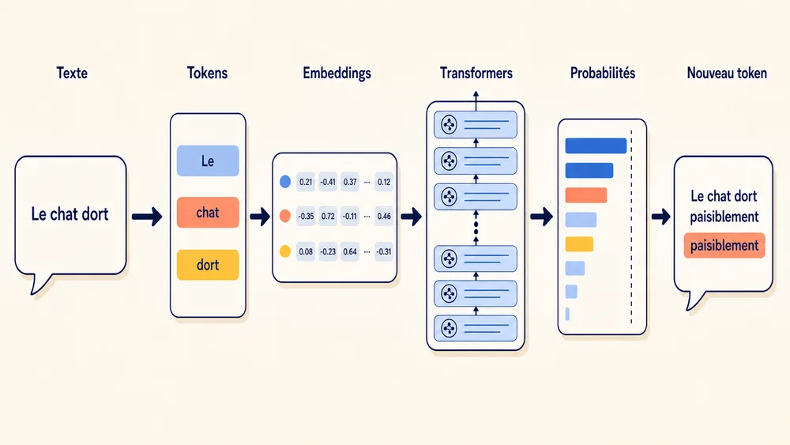
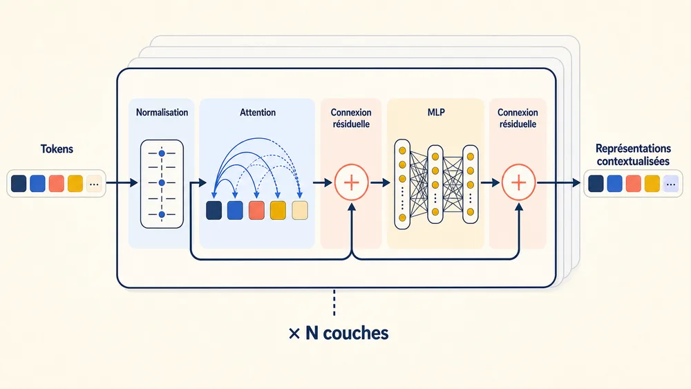
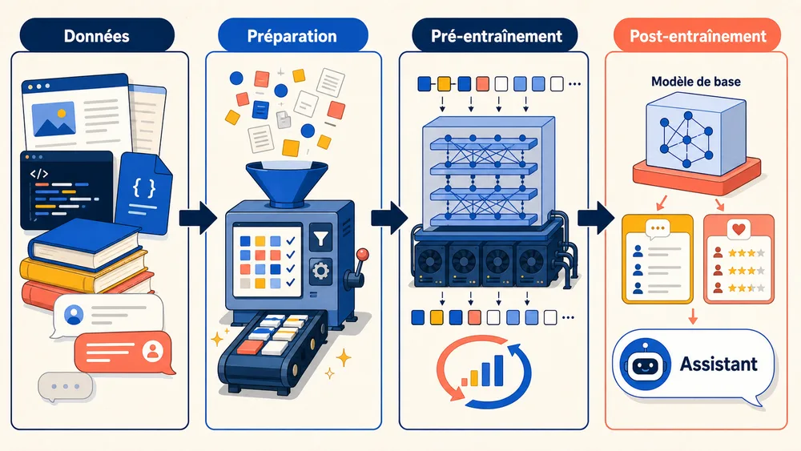
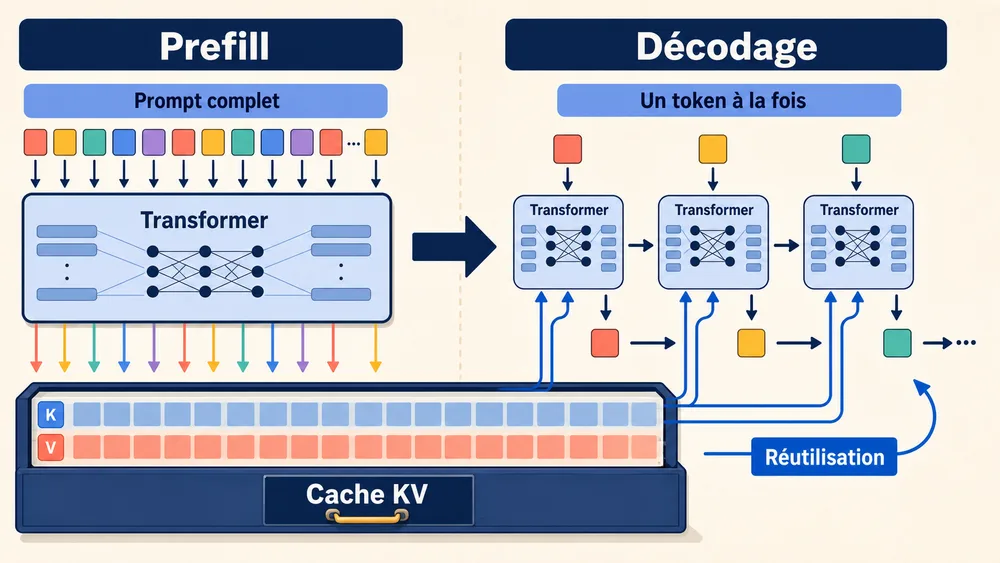
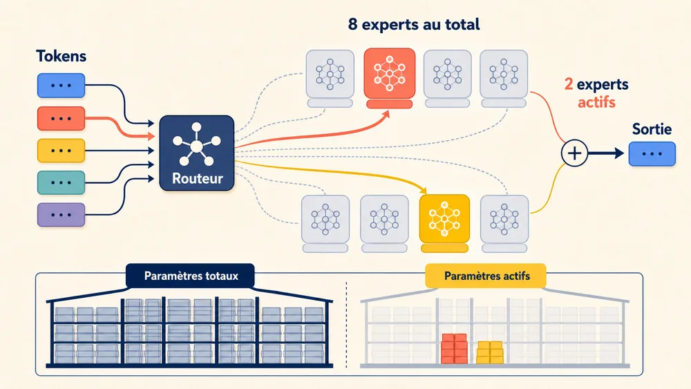

<!-- markdownlint-disable-file -->


Vous saisissez une question et, quelques instants plus tard, une réponse structurée apparaît. Cette fluidité donne l’impression que le modèle a compris la demande, réfléchi, puis rédigé son texte comme une personne.

Le fonctionnement réel est plus simple à décrire : le texte est découpé en petites unités, transformé en nombres, puis envoyé à travers une succession de couches de calcul. À la sortie, le modèle estime quel fragment de texte a le plus de chances de venir ensuite. Il en choisit un, l’ajoute à la séquence et recommence.

Un LLM génère donc une réponse **token après token**. Sa puissance ne vient pas d’une règle magique, mais de la quantité de données, de paramètres et de calcul mobilisée pour apprendre à faire ces prédictions.

> **En bref**

---

## Principe d’un LLM : Prédire la suite d’un texte



Dans cet article, nous parlons surtout des modèles **autoregressifs de type decoder-only**, utilisés par la plupart des assistants conversationnels modernes.

Lorsqu’un modèle reçoit le début de phrase suivant :

```plain text
Le ciel est
```

il attribue une probabilité à chaque suite possible :

```plain text
bleu      → 42 %
gris      → 18 %
souvent   →  6 %
très      →  4 %
...
```

Les valeurs sont fictives, mais le principe est exact. Le modèle calcule des scores, les transforme en probabilités, sélectionne un token, puis relance le calcul avec la séquence mise à jour.

L’architecture Transformer, introduite en 2017, a rendu ce traitement beaucoup plus efficace à grande échelle que les réseaux récurrents utilisés auparavant. Les modèles actuels l’ont fortement optimisée, mais ils reposent encore sur ses principes. ([Attention Is All You Need](https://arxiv.org/abs/1706.03762))

### Le modèle n’est qu’une partie de l’assistant

Un chatbot complet assemble souvent plusieurs composants :

```plain text
Question utilisateur
        ↓
Instructions système et historique
        ↓
Recherche documentaire ou appel d’outils
        ↓
Modèle de langage
        ↓
Validation et mise en forme
        ↓
Réponse
```

Le LLM correspond au réseau de neurones et à ses paramètres. La recherche web, le [RAG](https://fr.wikipedia.org/wiki/G%C3%A9n%C3%A9ration_%C3%A0_enrichissement_contextuel) (Retrieval Augmented Generation), les bases vectorielles, les règles métier ou la mémoire applicative sont généralement ajoutés autour de lui.

---

## 1. Les données : la matière première

Un LLM n’apprend pas directement en parcourant Internet pendant qu’il répond. Il est entraîné à l’avance sur un corpus composé de textes, de code, de documents, de conversations et, pour les modèles multimodaux, d’images ou d’audio.

Ces données doivent être préparées avant l’entraînement :

```plain text
Sources brutes
    ↓
Nettoyage et normalisation
    ↓
Filtrage de qualité
    ↓
Déduplication
    ↓
Répartition entre langues et domaines
    ↓
Tokenisation
```

Cette préparation influence directement les capacités du modèle. Une langue peu représentée sera moins bien maîtrisée. Un corpus contenant peu de code donnera de moins bons résultats en programmation. Des pages dupliquées ou des données de mauvaise qualité peuvent aussi déformer l’apprentissage.

Néanmoins, ce n’est pas les seules façons d’améliorer l’apprentissage d’un modèle. Par exemple, il a été démontré qu’ajouter une portion de code à l’entraînement d’un LLM améliore de manière significative ses capacités de raisonnement, même pour les tâches en dehors du code ! ([On Code-Induced Reasoning in LLMs](https://arxiv.org/html/2509.21499v2))

La taille du réseau ne suffit donc pas. Il faut trouver un équilibre entre le nombre de paramètres, la quantité de données et le budget de calcul. Un très grand modèle entraîné sur trop peu de tokens reste sous-entraîné. ([Training Compute-Optimal Large Language Models](https://arxiv.org/abs/2203.15556))

---

## 2. Le tokenizer : découper le texte

Un réseau de neurones ne manipule pas directement des mots. Il travaille avec des tableaux de nombres. Le **tokenizer** transforme donc le texte en une suite d’identifiants numériques.

La phrase suivante :

```plain text
Les transformeurs apprennent.
```

pourrait être découpée ainsi :

```plain text
["Les", " transform", "eurs", " apprennent", "."]
```

Puis chaque fragment reçoit un identifiant :

```plain text
[2714, 9831, 412, 25109, 13]
```

Ces identifiants désignent simplement des entrées dans le vocabulaire du modèle.

### Pourquoi utiliser des sous-mots ?

Un vocabulaire contenant tous les mots possibles serait trop grand et gérerait mal les noms propres, les fautes de frappe, le code ou les mots nouveaux. Les tokenizers utilisent donc souvent des **sous-mots** :

```plain text
"chat"                   → ["chat"]
"anticonstitutionnel"    → ["anti", "constitution", "nel"]
"Framework2026"          → ["Framework", "2026"]
```

Les fragments fréquents peuvent devenir des tokens uniques, tandis que les termes plus rares sont découpés en plusieurs unités. Ce découpage ressemble parfois à la structure linguistique des mots : dans « anticonstitutionnel », le préfixe « anti- » peut être isolé parce qu’il apparaît dans de nombreux autres termes. Ce n’est toutefois pas une règle grammaticale ou étymologique : des méthodes comme BPE ou SentencePiece apprennent leur vocabulaire à partir des régularités statistiques du corpus, et certains tokens ne portent aucun sens lorsqu’ils sont pris séparément. ([SentencePiece](https://arxiv.org/abs/1808.06226))

Le tokenizer a des conséquences concrètes. Il influence la longueur des séquences, le coût en tokens, la qualité multilingue et la capacité à traiter du code ou des nombres. Il ne peut pas être remplacé librement après l’entraînement, car chaque identifiant est lié à une représentation apprise par le modèle.

### Les conversations sont aussi du texte

Une discussion est généralement convertie en une suite de tokens spéciaux :

```plain text
<|system|>
Tu es un assistant technique.
<|user|>
Comment fonctionne l'attention ?
<|assistant|>
```

Le modèle apprend ainsi à distinguer les instructions système, les messages utilisateur et ses propres réponses.

---

## 3. Les embeddings : transformer les tokens en vecteurs

Chaque identifiant est ensuite associé à un [**embedding**](https://docs.pytorch.org/tutorials/beginner/nlp/word_embeddings_tutorial.html), c’est-à-dire un vecteur composé de centaines ou de milliers de nombres.

```plain text
token 9831 → [0.12, -0.84, 0.07, ..., 0.31]
```

Ce vecteur n’est pas une définition lisible du token. Il s’agit d’une représentation apprise, que les couches suivantes vont enrichir en fonction du contexte.

Le mot « avocat » commence avec la même représentation dans les deux phrases suivantes :

```plain text
L'avocat a plaidé devant le tribunal.
J'ai ajouté un avocat dans la salade.
```

Après plusieurs couches Transformer, sa représentation devient différente dans chaque phrase, parce que le modèle tient compte des mots qui l’entourent.

### Ajouter la notion de position

Le modèle doit aussi connaître l’ordre des tokens. Sans information de position, les phrases « le chien mord l’homme » et « l’homme mord le chien » contiendraient les mêmes éléments.

De nombreux LLM utilisent **RoPE**, qui injecte la position dans les représentations manipulées par l’attention. Le modèle peut ainsi distinguer les tokens proches des tokens éloignés et tenir compte de leur ordre. ([RoFormer](https://arxiv.org/abs/2104.09864))

---

## 4. Le Transformer : le cœur du modèle



Un LLM contient une pile de blocs Transformer. Chaque bloc exécute surtout deux opérations :

- **L’attention** fait circuler l’information entre les tokens.

- **Le réseau feed-forward**, ou MLP, transforme l’information présente à chaque position.

Des normalisations et des connexions résiduelles stabilisent le calcul et permettent de conserver les informations utiles d’une couche à la suivante.

### L’attention : trouver les informations pertinentes

Pour chaque token, le modèle construit trois représentations appelées **query**, **key** et **value**.

On peut les comprendre ainsi :

- la query décrit ce que le token recherche ;

- la key décrit ce qu’un autre token peut apporter ;

- la value contient l’information qu’il transmettra.

Le modèle compare les queries et les keys, puis attribue un poids aux values correspondantes. Un token peut ainsi récupérer une information apparue plusieurs mots plus tôt, comme le sujet d’une phrase, le nom auquel renvoie un pronom ou la variable utilisée dans une fonction.

Le **masque causal** empêche le modèle de consulter les tokens futurs. Lorsqu’il prédit le quatrième token, il peut regarder les trois premiers, mais pas ceux qui viennent après.

```plain text
Token 1 peut voir : 1
Token 2 peut voir : 1, 2
Token 3 peut voir : 1, 2, 3
Token 4 peut voir : 1, 2, 3, 4
```

L’attention utilise plusieurs têtes en parallèle. Elles peuvent apprendre des relations différentes, même si leurs rôles ne sont pas proprement séparés en catégories comme « grammaire » ou « mathématiques ».

### Le MLP : transformer l’information

Après l’attention, chaque token passe dans un petit réseau de neurones appelé **MLP** ou **feed-forward network**.

L’attention rassemble les informations utiles ; le MLP les transforme pour préparer la couche suivante. Dans de nombreuses architectures, ces réseaux contiennent une grande partie des paramètres du modèle.

Les LLM récents utilisent souvent des variantes comme **SwiGLU**, qui ajoutent un mécanisme de porte pour contrôler les caractéristiques transmises. ([GLU Variants Improve Transformer](https://arxiv.org/abs/2002.05202))

### Pourquoi empiler autant de couches ?

Une seule couche ne suffit pas à construire une représentation riche du texte. Les premières couches peuvent repérer des relations locales, tandis que les suivantes combinent ces informations pour représenter des structures plus abstraites.

Après des dizaines de blocs, la représentation du dernier token est projetée vers tout le vocabulaire. Le modèle obtient alors les scores des prochains tokens possibles et en sélectionne un selon la stratégie de génération choisie.

---

## 5. Le pré-entraînement : apprendre à prédire



Au début, les paramètres du réseau sont presque aléatoires. Le modèle ne maîtrise ni la langue, ni le code, ni les connaissances générales.

Pendant le pré-entraînement, une phrase est décalée pour créer les entrées et les cibles :

```plain text
Entrée : Le      chat   dort   sur   le
Cible  : chat    dort   sur    le    canapé
```

Le modèle prédit le token suivant à chaque position. Une fonction de perte mesure l’écart entre ses prédictions et les tokens réels.

Une étape d’entraînement suit alors ce cycle :

- les tokens traversent le réseau ;

- la fonction de perte mesure l’erreur ;

- la rétropropagation calcule la contribution de chaque paramètre ;

- l’optimiseur modifie légèrement les poids ;

- le processus recommence avec un nouveau lot de données.

Ce cycle est répété sur des milliards ou des milliers de milliards de tokens.

### Où se trouvent les connaissances ?

Les documents ne sont pas stockés tels quels dans une base interne. Les régularités apprises sont réparties entre les paramètres du réseau.

Une règle grammaticale, une association factuelle ou une structure de code peut dépendre de nombreuses couches à la fois. Le modèle ressemble davantage à une compression statistique de ses données d’entraînement qu’à une encyclopédie dans laquelle il chercherait une page précise.

### Pourquoi faut-il autant de GPU ?

Un grand modèle et les états nécessaires à son entraînement ne tiennent pas sur un seul accélérateur. Le calcul est donc réparti entre plusieurs GPU : certains traitent des lots de données différents, d’autres se partagent les matrices ou les couches.

Les poids et les calculs utilisent aussi des formats numériques plus compacts, comme BF16 ou FP8, afin de réduire la mémoire et d’accélérer les opérations. Cette optimisation demande toutefois de préserver une précision suffisante pour que l’entraînement reste stable.

---

## 6. Le post-entraînement : passer du modèle de base à l’assistant

À la fin du pré-entraînement, le modèle sait surtout compléter du texte. Il peut déjà répondre à certaines questions, mais il ne suit pas encore les instructions de manière fiable.

Le **post-entraînement** lui apprend à produire des réponses plus utiles et plus adaptées au dialogue.

### Le fine-tuning supervisé

Le modèle est entraîné sur des exemples préparés :

```plain text
Instruction : Résume ce texte en trois phrases.
Réponse attendue : ...
```

Il apprend les formats de conversation, les réponses structurées, les appels d’outils et certains comportements de sécurité.

### L’apprentissage par préférences

Plusieurs réponses peuvent être correctes, mais l’une peut être plus claire, mieux structurée ou plus prudente. Des humains ou d’autres modèles comparent alors des réponses, puis le système ajuste le LLM pour favoriser celles qui sont préférées.

Le RLHF s’appuie sur un modèle de récompense et de l’apprentissage par renforcement. Des méthodes comme DPO apprennent plus directement à préférer une bonne réponse à une réponse rejetée. ([InstructGPT](https://arxiv.org/abs/2203.02155), [DPO](https://arxiv.org/abs/2305.18290))

### Les modèles de raisonnement

Les modèles dits « raisonnants » utilisent souvent la même base Transformer. Leur post-entraînement les encourage à consacrer davantage de tokens aux problèmes difficiles, à tester plusieurs pistes et à vérifier certaines étapes.

Cette dépense supplémentaire de calcul peut améliorer les résultats en mathématiques, en code ou en planification. Elle ne garantit pas qu’une réponse soit vraie : un raisonnement long peut rester cohérent tout en partant d’une hypothèse incorrecte.

---

## 7. L’inférence : générer la réponse efficacement



Lorsqu’un utilisateur envoie un prompt, l’inférence se déroule en deux phases.

### Le prefill

Le modèle traite l’ensemble du prompt en parallèle et calcule les représentations nécessaires dans chaque couche. Cette phase influence surtout le délai avant le premier token.

### Le décodage

Le modèle génère ensuite les tokens un par un. Cette phase est séquentielle, car chaque nouveau token dépend de celui qui vient d’être produit.

### Le KV cache

Sans optimisation, le modèle recalculerait tout le contexte à chaque token. Le **KV cache** (pour Key Value cache) conserve les informations déjà calculées par l’attention.

Cette mémoire accélère fortement la génération, mais elle grossit avec la longueur du contexte, le nombre de couches et le nombre de conversations traitées en parallèle. Sur de longs contextes, le KV cache peut consommer plusieurs gigaoctets par requête.

---

## 8. Comment les LLMs récents sont optimisés

Les modèles modernes combinent plusieurs techniques. Chacune répond à un problème précis : réduire la mémoire, accélérer la génération, augmenter la capacité ou adapter le modèle à un usage.

### GQA et MLA : réduire le coût du KV cache

Dans l’attention multi-têtes classique, chaque tête conserve ses propres keys et values. Cela produit un cache volumineux.

La **Grouped-Query Attention**, ou GQA, permet à plusieurs têtes de query de partager les mêmes têtes key/value. Le modèle réduit ainsi la mémoire nécessaire tout en conservant une bonne qualité. ([GQA](https://arxiv.org/abs/2305.13245))

La **Multi-head Latent Attention**, utilisée notamment dans la famille DeepSeek, compresse davantage les informations stockées dans le cache. Le principe reste le même : limiter la mémoire et les transferts pendant la génération.

### FlashAttention : mieux utiliser la mémoire du GPU

L’attention complète compare de nombreux tokens entre eux et produit de grandes données intermédiaires. **FlashAttention** réorganise le calcul par blocs pour éviter des lectures et écritures inutiles dans la mémoire du GPU.

Le résultat mathématique ne change pas, mais l’exécution devient plus rapide et consomme moins de mémoire. ([FlashAttention](https://arxiv.org/abs/2205.14135))

### Mixture of Experts : activer seulement une partie du modèle

Dans un modèle dense, chaque token traverse le même MLP. Une architecture **Mixture of Experts**, ou MoE, remplace ce MLP par plusieurs experts.



Un routeur choisit quelques experts pour chaque token. Un modèle peut ainsi contenir des centaines de milliards de paramètres au total, tout en n’en activant qu’une petite partie à chaque passage.

Cette approche augmente la capacité sans multiplier le coût de calcul dans les mêmes proportions. Elle apporte cependant de nouvelles contraintes : tous les experts doivent être stockés, les tokens doivent circuler entre les GPU et le routeur doit éviter de surcharger toujours les mêmes experts.

Les experts ne correspondent pas forcément à des catégories claires comme « français », « Python » ou « mathématiques ». Leurs spécialisations sont apprises et restent souvent difficiles à interpréter. ([Mixtral of Experts](https://arxiv.org/abs/2401.04088), [DeepSeek-V3](https://arxiv.org/abs/2412.19437))

### Attention locale et contexte long

L’attention complète devient coûteuse lorsque le contexte s’allonge. Certains modèles utilisent donc une **attention locale**, dans laquelle un token ne consulte qu’une fenêtre récente. Des couches globales sont ajoutées à intervalles réguliers pour faire circuler l’information à plus longue distance.

Les modèles doivent également être entraînés ou adaptés pour exploiter les positions longues. Des techniques comme YaRN étendent les encodages RoPE, mais une fenêtre annoncée à 128 000 tokens ne garantit pas que le modèle retrouvera chaque détail avec la même fiabilité. ([YaRN](https://arxiv.org/abs/2309.00071))

### Prédiction multi-token et décodage spéculatif

Un modèle autoregressif classique prédit un token à la fois. Certaines architectures ajoutent des têtes capables de proposer plusieurs tokens futurs.

Le **décodage spéculatif** suit une idée proche : un petit modèle prépare rapidement plusieurs tokens, puis le grand modèle les vérifie en parallèle. Lorsque les propositions sont acceptées, plusieurs tokens sont générés en un seul passage du modèle principal. ([Fast Inference from Transformers via Speculative Decoding](https://arxiv.org/abs/2211.17192))

### Quantification : utiliser moins de bits

Les poids sont souvent stockés en 16 bits pendant l’entraînement ou le déploiement haut de gamme. La **quantification** les représente avec 8 ou 4 bits afin de réduire la mémoire et la bande passante.

Un modèle de 70 milliards de paramètres occupe environ 140 Go en 16 bits pour ses seuls poids bruts, contre environ 35 Go en 4 bits. Il faut encore ajouter le KV cache et les buffers du runtime, mais le gain reste important.

La quantification introduit une approximation, si bien que les méthodes modernes cherchent à préserver les poids les plus sensibles. Elle permet notamment d’exécuter des modèles sur du matériel plus accessible.

---

## 9. Adapter ou enrichir un modèle sans le réentraîner entièrement

Toutes les évolutions ne nécessitent pas un nouveau pré-entraînement.

### LoRA

**LoRA** ajoute de petites matrices entraînables à certaines couches, tandis que les poids principaux restent figés. L’adaptation utilise alors beaucoup moins de mémoire qu’un fine-tuning complet.

Cette méthode convient bien pour modifier le ton, le format de réponse ou certaines compétences métier. Elle est moins adaptée aux connaissances qui changent souvent. ([LoRA](https://arxiv.org/abs/2106.09685))

### RAG

Le **Retrieval-Augmented Generation** ajoute une recherche documentaire avant l’appel au modèle :

```plain text
Question
   ↓
Recherche de passages pertinents
   ↓
Ajout des passages au prompt
   ↓
Réponse du LLM
```

Le RAG convient aux informations privées, récentes ou fréquemment mises à jour. Il permet aussi de présenter les sources utilisées. Sa qualité dépend toutefois de la recherche : un mauvais document conduit souvent à une mauvaise réponse. ([Retrieval-Augmented Generation](https://arxiv.org/abs/2005.11401))

| Besoin | Technique adaptée |
| --- | --- |
| Donner une instruction ponctuelle | Prompt |
| Ajouter des faits privés ou récents | RAG |
| Modifier le style ou le comportement | SFT ou LoRA |
| Apprendre durablement un domaine | Fine-tuning ou entraînement continu |
| Augmenter les capacités fondamentales | Nouveau modèle ou nouvelle architecture |


> 💡 Si implémenter une solution à base de RAG vous intéresse, n’hésitez pas à lire [l'article de Florian Hirson](https://blog.hoppr.tech/blogs/2026-06-09-du-prototype-a-la-prod-ce-quon-ne-te-dit-pas-sur-la-construction-dune-solution-ia-solide) sur le sujet !

---

## 10. Les modèles multimodaux

Un modèle multimodal applique une logique similaire aux images, à l’audio ou à la vidéo.

Pour une image, un encodeur transforme les pixels en vecteurs :

```plain text
Image
  ↓
Découpage en régions
  ↓
Encodeur visuel
  ↓
Vecteurs visuels
  ↓
Modèle de langage
```

Le LLM ne voit donc pas directement les pixels. Il traite des représentations numériques compatibles avec les tokens de texte.

Certaines architectures connectent un encodeur visuel à un LLM existant. D’autres entraînent plus étroitement les modalités ensemble afin que le texte et l’image partagent le même espace de traitement.

---

## 11. Construire un LLM en cinq étapes

### 1. Définir le besoin

L’équipe fixe les langues, les domaines, les modalités, la longueur de contexte et les contraintes de déploiement. Un modèle destiné à un téléphone ne sera pas conçu comme un modèle réparti sur des centaines de GPU.

### 2. Préparer les données et le tokenizer

Les données sont collectées, nettoyées, filtrées et dédupliquées. Le tokenizer est entraîné pour représenter efficacement les langues et les contenus ciblés.

### 3. Choisir l’architecture et pré-entraîner

L’équipe choisit la taille du réseau, le nombre de couches, le type d’attention, la présence éventuelle d’experts et les formats numériques. Le modèle apprend ensuite à prédire le prochain token sur un grand corpus.

### 4. Effectuer le post-entraînement

Le modèle est adapté au dialogue, au suivi d’instructions, aux préférences, aux outils, à la sécurité et, selon les objectifs, au raisonnement prolongé.

### 5. Évaluer et déployer

La qualité des réponses ne suffit pas. Il faut aussi mesurer la latence, la mémoire, le débit, le coût, la robustesse et la sécurité. Le moteur d’inférence optimise ensuite le batching, le KV cache, la quantification et la répartition sur le matériel.

---

## Conclusion : la taille ne raconte plus toute l’histoire

Le fonctionnement de base d’un LLM reste simple à formuler : le texte devient une suite de tokens, ces tokens traversent des couches Transformer, puis le modèle prédit la suite la plus probable.

La complexité vient de l’échelle et des choix d’ingénierie. Les MoE sélectionnent les experts utiles, la GQA réduit le KV cache, FlashAttention optimise les accès mémoire, le décodage spéculatif accélère la génération et la quantification facilite le déploiement.

Le nombre total de paramètres ne suffit donc plus pour comparer deux modèles. Il faut aussi regarder les paramètres réellement activés, les données d’entraînement, le post-entraînement, la longueur de contexte exploitable et le moteur qui sert les réponses.

Un bon LLM n’est pas seulement un grand réseau : c’est un système qui dépense son calcul et sa mémoire là où ils améliorent réellement la réponse.