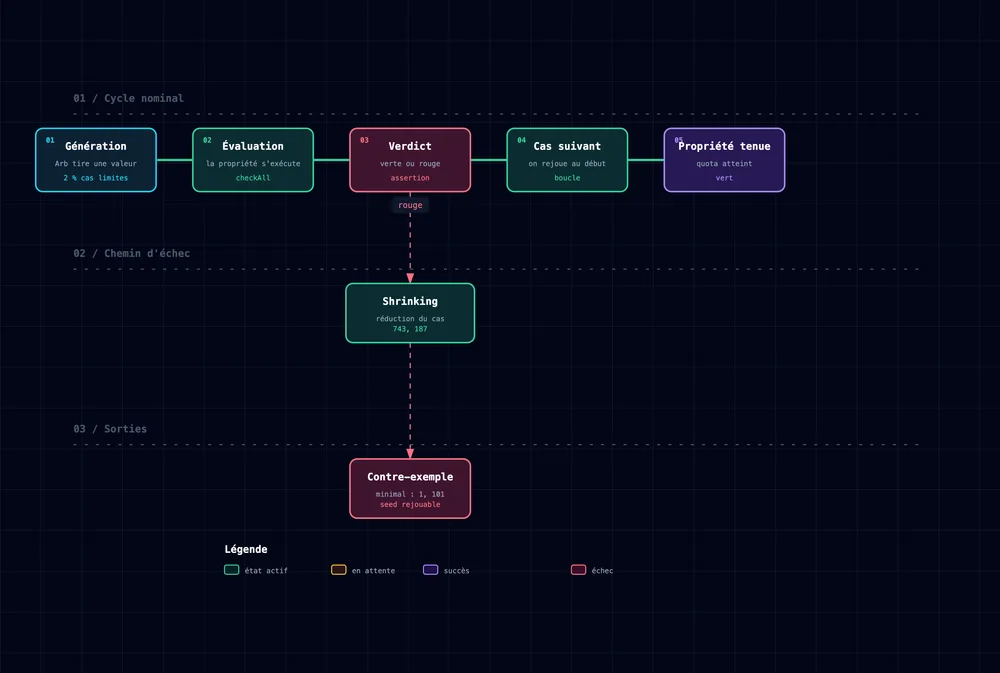

<!-- markdownlint-disable-file -->


Un test unitaire, tout le monde connait : on choisit une entrée, on vérifie la sortie. `[3, 1, 2]` trié doit rendre `[1, 2, 3]`. C'est efficace, mais on ne teste que les cas qu'on a imaginés. Le property based testing résout le problème par une autre approche. On décrit une règle qui doit tenir pour n'importe quelle entrée, et le framework génère des centaines de cas pour tenter de la casser.

J'en ai parlé vite dans [**Le vert ne suffit pas : 3 façons de douter de son code**](https://blog.hoppr.tech/blogs/2026-06-23-le-vert-ne-suffit-pas-3-facons-de-douter-de-son-code), au milieu d'un REX. C'était assez pour expliquer brièvement le concept, mais trop court pour montrer comment s'en servir. Cet article reprend là où ce REX s'arrête.

On commence par un rappel express, pour ceux qui n’ont jamais touché au property based testing. Ensuite, on passe à ce qui fait vraiment la différence : trouver la bonne propriété à tester.

## Le property based testing en deux minutes

Concrètement, à quoi ça ressemble ? Voici un exemple : renverser une liste deux fois doit la laisser intacte.

```kotlin
checkAll(Arb.list(Arb.int())) { list ->
    list.reversed().reversed() shouldBe list
}
```

Un mot sur [`Arb`](https://kotest.io/docs/proptest/property-test-generators.html#arbitrary), puisqu'il revient souvent. C'est le générateur, abréviation d'_arbitrary_. Il fournit un flux de valeurs d'un type donné : `Arb.int()` débite des entiers, `Arb.string()` des chaînes. Les générateurs se composent, donc `Arb.list(Arb.int())` fabrique des listes d'entiers à partir du générateur d'entiers.

Un `Arb` ne tire pas que du hasard. Il mélange des échantillons aléatoires avec des cas limites codés en dur, ceux qui font tomber les tests. Pour les entiers : 0, 1, -1, `Int.MIN_VALUE`, `Int.MAX_VALUE`. Pour les chaînes, la chaîne vide. Pour les listes, la liste vide ou la liste à un seul élément. Par défaut, environ 2 % des valeurs générées sont ces cas limites, le reste est aléatoire.

Kotest a un second type de générateur, [`Exhaustive`](https://kotest.io/docs/proptest/property-test-generators.html#exhaustive), qui parcourt tout un domaine fini plutôt que d'y piocher au hasard. Par exemple un enum ou un booléen. On y revient plus bas.

Sur l'exemple ci-dessus, [Kotest](https://kotest.io/) génère donc des centaines de listes, des vides comme des énormes, en glissant des valeurs aux limites. Il vérifie la règle sur chacune des valeurs. Si une seule échoue, il la montre.



Là où un test par l'exemple documente un cas précis, la propriété décrit une vérité générale sur tout l'espace d'entrée.

Le plus dur arrive après : trouver la propriété qui vaut le coup. Écrire le `checkAll` prend cinq minutes. Savoir quoi affirmer prend beaucoup plus de temps. C'est là que la plupart des tutos s'arrêtent, juste avant la partie intéressante.

---

## La vraie problématique : quelle propriété affirmer ?

Une propriété fausse se repère vite : elle échoue. Le piège, c'est la propriété **trop faible**. Elle passe au vert et rassure, alors qu'elle ne teste presque rien. C'est exactement le problème du coverage, transposé aux assertions.

Prenons un exemple, on veut tester une fonction de tri.

```kotlin
// Verte, mais creuse
checkAll(Arb.list(Arb.int())) { list ->
    maFonctionDeTri(list).size shouldBe list.size
}
```

Cette propriété vérifie que le tri ne perd pas d'élément. Sauf qu'elle serait tout aussi vérifiée par une implémentation qui renvoie la liste sans y toucher. La propriété ne parle jamais de l'ordre, donc elle ne le protège pas.

Scott Wlaschin a un nom pour ce genre d'implémentation, l'[_Enterprise Developer From Hell_](https://fsharpforfunandprofit.com/posts/property-based-testing/), le développeur qui écrit le code le plus bête possible passant quand même les tests. Le personnage donne un réflexe utile, devant chaque propriété se demander quelle implémentation absurde la validerait.

La version pertinente dit deux choses : le résultat est ordonné et c'est bien une permutation de l'entrée.

```kotlin
checkAll(Arb.list(Arb.int())) { list ->
    val result = maFonctionDeTri(list)
    result.zipWithNext { a, b -> a <= b }.all { it } shouldBe true
    result.sorted() shouldBe list.sorted() // même multiset que l'entrée
}
```

Ce saut demande de comprendre le problème, pas de connaître une méthode Kotest de plus. Heureusement il existe une poignée de patterns utiles pour cela. Une fois qu'on les a en tête, on ne fixe plus son code en se demandant quoi tester, on déroule.

---

## Six patterns pour trouver des propriétés

Voici une boîte à outils mentale: face à une fonction, on passe les six en revue et on garde celles qui correspondent le plus.

### 1. Aller-retour (round-trip)

Si une opération a un inverse, les enchaîner doit ramener au point de départ. Sérialiser puis désérialiser doit redonner l'objet d'origine. Pareil pour encoder puis décoder, ou sauvegarder puis relire.

C'est là que je brancherais un property test en premier dans ma stack actuelle, je pense à deux sujets en particulier.

Commençons par la sérialisation: je migre de Jackson 2 vers Jackson 3 en ce moment. La propriété qui sécurise toute la migration tient en trois lignes :

```kotlin
test("un round-trip JSON préserve l'objet") {
    checkAll(orderArb) { order ->
        val json = mapper.writeValueAsString(order)
        mapper.readValue<Order>(json) shouldBe order
    }
}
```

Une régression de config, un champ qui part à la sérialisation mais ne revient pas au parsing : le test échoue. Et il échoue sur des centaines de valeurs que je n'aurais jamais définis manuellement.


Vient ensuite le JSON Patch. J'écris des tests de conformité [RFC 6902](https://datatracker.ietf.org/doc/html/rfc6902). Cette specification est un terrain de jeu à round-trips. Voici la propriété :

```kotlin
test("appliquer diff(a, b) à a redonne b") {
    checkAll(jsonArb, jsonArb) { a, b ->
        val patch = JsonDiff.asJson(a, b)
        JsonPatch.apply(patch, a) shouldBe b
    }
}
```

Si `diff` et `apply` sont cohérents, ça tient pour n'importe quel couple de documents. Si un jour ça casse, le property based testing me sort le plus petit couple qui met en défaut ma conformité. Aucun test par l'exemple ne couvre ça avec cette densité.

### 2. Idempotence

Appliquer une opération une fois ou dix fois donne le même résultat. On le retrouve sur les normalisations et les déduplications, ou sur un simple tri.

```kotlin
checkAll(Arb.list(Arb.int())) { list ->
    list.sorted().sorted() shouldBe list.sorted()
}
```

Dès qu'on écrit une fonction `normalize`, `sanitize`, `dedupe` ou `canonicalize`, on se pose la question. Dans la plupart des cas, elle doit être idempotente. 

### 3. Invariants

Certaines choses ne changent jamais, quoi que fasse le code. Une permutation garde la même taille et les mêmes éléments. Une conversion de devise conserve le total, à l'arrondi près. Et l'identité d'un objet transformé ne doit pas changer.

C'est un pattern puissant sur du code métier, parce qu'il permet de tester une transformation **sans figer sa sortie exacte**. Prenons un cas réaliste : un moteur qui assouplit des critères de recherche quand une requête ne remonte pas assez de résultats.

```kotlin
data class SearchFilter(
    val sessionId: String,
    val keywords: List<String>,
    val startDate: LocalDate?,
    val endDate: LocalDate?,
    val location: Coordinates?,
    val maxPrice: BigDecimal?,
    val minRating: BigDecimal?,
)

enum class RelaxStrategy(val modifier: (SearchFilter) -> SearchFilter) {
    WIDEN_MAX_PRICE({ it.copy(maxPrice = it.maxPrice?.multiply(BigDecimal("1.25"))) }),
    LOWER_MIN_RATING({ it.copy(minRating = it.minRating?.multiply(BigDecimal("0.8"))) }),
    SHIFT_DATES_LATER({ f ->
        if (f.startDate != null && f.endDate != null) {
            f.copy(startDate = f.startDate.plusDays(14), endDate = f.endDate.plusDays(14))
        } else {
            f
        }
    }),
    DROP_LOCATION({ it.copy(location = null) }),
    ;

    fun shouldExecute(filter: SearchFilter): Boolean = modifier(filter) != filter
}
```

Chaque stratégie relâche une contrainte différente. Les tester une par une par l'exemple, c'est un test par stratégie qui rate les combinaisons. La propriété couvre toutes les stratégies sur tout l'espace d'entrée d'un coup, en n'affirmant que ce qui doit rester vrai :

```kotlin
test("relâcher un filtre préserve ses invariants") {
    checkAll(searchFilterArb, Arb.enum<RelaxStrategy>()) { filter, strategy ->
        val relaxed = strategy.modifier(filter)

        // l'identité de session ne bouge jamais
        relaxed.sessionId shouldBe filter.sessionId

        // les montants restent positifs
        relaxed.maxPrice?.signum()?.let { it shouldBeGreaterThanOrEqual 0 }
        relaxed.minRating?.signum()?.let { it shouldBeGreaterThanOrEqual 0 }

        // l'ordre des dates tient toujours
        if (relaxed.startDate != null && relaxed.endDate != null) {
            (relaxed.startDate!! <= relaxed.endDate!!) shouldBe true
        }

        // une stratégie censée s'exécuter doit changer au moins un champ
        if (strategy.shouldExecute(filter)) {
            relaxed shouldNotBe filter
        }
    }
}
```

Notons la différence de nature avec un test par l'exemple. Le test unitaire épingle une valeur exacte, celle où `WIDEN_MAX_PRICE` multiplie par 1,25. La propriété se contente d'affirmer que les invariants tiennent. Elle est donc plus souple, sans être moins utile. Les deux répondent à des questions différentes. On verra plus tard pourquoi les deux sont à garder.

### 4. Dur à calculer, facile à vérifier

Parfois il n'y a ni inverse, ni implémentation de référence. Dans ce cas là je me pose la question : est-ce que je sais reconnaître une bonne sortie quand j'en vois une ? Souvent oui, pour bien moins cher que de la calculer.

C'est déjà ce qu'on a fait plus haut sur le tri. Vérifier que chaque élément est plus petit que le suivant demande une boucle, alors qu'écrire un tri correct demande un algorithme.

Le cas où ce pattern devient utile, c'est quand la sortie est trop compliquée pour être figée. Prenons un traitement topologique, celui qui ordonne des dépendances hiérarchiques. Calculer l'ordre est le vrai travail. Vérifier qu'il tient se résume à deux assertions.

```kotlin
test("l'ordre produit respecte toutes les dépendances") {
    checkAll(dagArb) { graph ->
        val ordered = topologicalSort(graph)

        ordered shouldContainExactlyInAnyOrder graph.nodes
        graph.edges.forEach { (from, to) ->
            ordered.indexOf(from) shouldBeLessThan ordered.indexOf(to)
        }
    }
}
```

Notons la différence avec l'oracle de la section suivante. Là-bas j'ai besoin de l'ancienne implémentation pour comparer. Ici je n'ai besoin d'aucune des deux, donc la propriété survit au jour où l'ancienne version disparaît du dépôt.

Ce pattern est aussi le seul qui tienne quand la sortie n'est pas déterministe. Sur de la [génération de requêtes par LLM](https://blog.hoppr.tech/blogs/2026-06-09-du-prototype-a-la-prod-ce-quon-ne-te-dit-pas-sur-la-construction-dune-solution-ia-solide), deux appels avec la même entrée ne rendent pas le même texte. Impossible de figer une valeur ou de comparer à une référence. Par contre, vérifier que la requête parse et qu'elle ne contient aucune clause d'écriture reste trivial. Attention au coût cela dit, une propriété qui appelle un modèle à chaque itération se règle avec un `iterations` très bas.

### 5. Oracle

On a deux implémentations censées faire la même chose ? On les compare. L’implémentation lente et évidente sert de référence à celle rapide et complexe.

```kotlin
checkAll(Arb.list(Arb.int())) { list ->
    monTriMaison(list) shouldBe list.sorted() // sorted() est l'oracle
}
```

Ce pattern est super utile pour un refacto à iso-comportement. Quand j'ai retravaillé un traitement topologique niveau par niveau, la propriété qui m'aurait le plus rassuré, c'est "nouvelle implémentation égale ancienne, sur des milliers de graphes générés". L'ancienne version, même moche, fait un oracle parfait le temps de la bascule.

### 6. Propriétés algébriques

Prenons la commutativité ou l'associativité. Elles sont dures à prouver sur papier et triviales à vérifier sur des centaines de cas.

```kotlin
checkAll(Arb.int(), Arb.int()) { a, b ->
    max(a, b) shouldBe max(b, a) // commutatif
}
```

C'est utile dès qu'on écrit une opération de fusion, un `merge` de config par exemple. Si ce `merge(a, b)` doit être commutatif, une propriété le prouve mieux que trois exemples posés à la main.

Il existe une forme plus large de ce pattern. Au lieu de permuter les arguments d'une opération, on compare deux chemins qui doivent arriver au même endroit. Reprenons les stratégies de relaxation vues plus haut. Chacune touche un champ différent, donc les appliquer dans un ordre ou dans l'autre doit donner le même filtre.

```kotlin
test("l'ordre d'application des stratégies n'a pas d'effet") {
    checkAll(searchFilterArb, Arb.enum<RelaxStrategy>(), Arb.enum<RelaxStrategy>()) { filter, s1, s2 ->
        s2.modifier(s1.modifier(filter)) shouldBe s1.modifier(s2.modifier(filter))
    }
}
```

Cette propriété dit quelque chose de fort sur le moteur : il peut relâcher les contraintes dans n'importe quel ordre. Le jour où quelqu'un ajoute une stratégie qui touche un champ déjà modifié par une autre, le test tombe et pose la bonne question.

### Le tableau à garder sous le coude

| Le code ressemble à | Pattern à utiliser |
| --- | --- |
| encode / decode, save / load, serialize | Aller-retour |
| normalize, sanitize, dedupe, sort | Idempotence |
| une transformation métier | Invariants |
| un ordonnancement, une sortie non déterministe | Dur à calculer, facile à vérifier |
| un refacto, une version optimisée | Oracle |
| merge, combine, opération binaire | Propriétés algébriques |


> **Mon avis** : ces six patterns sont universels, peu importe la library de property based testing ou le framework. La capacité à regarder une fonction et voir "tiens, ça c'est un round-trip" reste la même, en Kotlin comme avec un autre langage. C'est ça qu'il faut maitriser, pas la syntaxe.

---

## Les générateurs : le property based testing ne vaut que ce que valent ses données

Une propriété parfaite sur un générateur médiocre ne teste rien. C'est la moitié du boulot, souvent la plus délicate.

Kotest fournit les briques de base : `Arb.int()`, `Arb.string()`, `Arb.localDate()`, `Arb.list(gen, range)`. On les compose avec `.map`, `.filter`, `.orNull` et surtout `Arb.bind`.

Pour un objet simple, `Arb.bind` suffit et se lit tout seul :

```kotlin
val coordinatesArb: Arb<Coordinates> = Arb.bind(
    Arb.double(-90.0, 90.0),
    Arb.double(-180.0, 180.0),
) { lat, lng -> Coordinates(lat, lng) }
```

Là où ça se corse, c'est quand les champs sont **corrélés**. Reprenons le `SearchFilter` qui contient deux pièges cachés. Les coordonnées n'ont de sens que si latitude et longitude existent ensemble. Et la date de fin doit toujours rester après la date de début. Si on génère deux `LocalDate` indépendantes, la moitié seront dans le désordre.

La tentation, c'est de générer large puis de filtrer :

```kotlin
// À éviter : jette la moitié des cas générés
val datesArb = Arb.bind(startArb, endArb) { s, e -> s to e }
    .filter { (s, e) -> s <= e }
```

C'est une mauvaise idée. Un `.filter` qui rejette trop, c'est des générations gâchées et, au bout du compte, un test qui échoue quand Kotest ne produit plus assez de cas valides. Voici une rêgle utile : ne jamais filtrer ce qu'on peut construire directement.

Ici, on génère une date de début et une durée positive. L'ordre devient vrai par construction, sans aucun rejet :

```kotlin
val orderedDatesArb: Arb<Pair<LocalDate, LocalDate>> = Arb.bind(
    Arb.localDate(LocalDate.of(2024, 1, 1), LocalDate.of(2024, 12, 31)),
    Arb.int(0..300),
) { start, span -> start to start.plusDays(span.toLong()) }
```

Même logique pour les coordonnées optionnelles : on construit l'objet complet, puis on le rend nullable d'un bloc avec `.orNull`, ce qui évite le cas "latitude sans longitude".

```kotlin
val locationArb: Arb<Coordinates?> = coordinatesArb.orNull(nullProbability = 0.3)
```

Un dernier point, déjà croisé dans le rappel : les `Arb` **injectent automatiquement les cas limites**. C'est ce qui les sépare d'un `Random` maison, qui ne tombera quasiment jamais sur `Int.MIN_VALUE` ou sur la chaîne vide tout seul. Or c'est précisément là où se cachent les bugs. On les couvre sans même y penser. La proportion de cas limites se règle par configuration si le défaut ne convient pas.

---

## Shrinking : pourquoi un échec de property based testing est exploitable

Voici ce qui sépare le property based testing d'un simple `Random` dans une boucle. Quand une propriété échoue, Kotest ne renvoie pas le monstre de 200 caractères qui a déclenché le bug. Il **réduit** le contre-exemple vers le plus petit cas qui échoue encore.

Prenons cette remise, avec un bug volontaire : aucune garde sur un pourcentage supérieur à 100.

```kotlin
fun applyDiscount(price: Int, percent: Int): Double =
    price - price * percent / 100.0

test("une remise ne rend jamais le prix négatif") {
    checkAll(Arb.int(0..1000), Arb.int(0..200)) { price, percent ->
        applyDiscount(price, percent) shouldBeGreaterThanOrEqual 0.0
    }
}
```

Le test échoue, mais regardons ce que Kotest renvoie :

```plain text
Property failed after 12 attempts

	Arg 0: 1 (shrunk from 743)
	Arg 1: 101 (shrunk from 187)

Repeat this test by using seed 8842176331705615667
```

Le tir initial était `743, 187` ce qui est illisible. Le shrinking l'a ramené à `1, 101` : le plus petit prix et le plus petit pourcentage qui casse. Le bug saute alors aux yeux, la frontière est à 100. On débogue le cas minimal plutôt qu'un tirage au hasard.

Et cette [seed ](https://kotest.io/docs/proptest/property-test-seeds.html)en bas n'est pas décorative. Elle rejoue exactement la même séquence de génération. Un échec de property based testing est donc parfaitement reproductible, contrairement à ce qu'on croit souvent. (Le shrinking de jqwik va plus loin sur les cas récursifs, mais j'en ai déjà parlé dans le [REX](https://blog.hoppr.tech/blogs/2026-06-23-le-vert-ne-suffit-pas-3-facons-de-douter-de-son-code), je ne refais pas le match ici.)

---

## En pratique avec Kotest : la mécanique qui compte

Quelques réflexes qui font gagner du temps une fois qu'on écrit du property based testing.

**`forAll`** **ou** **`checkAll`****.** `forAll` attend un booléen, `checkAll` attend des assertions (`shouldBe` et compagnie). En pratique, `checkAll` presque tout le temps : les assertions donnent de meilleurs messages d'erreur et on peut en enchaîner plusieurs.

```kotlin
// booléen, concis
forAll(Arb.int()) { it + 0 == it }

// assertions, plus lisible en cas d'échec
checkAll(Arb.int()) { n -> (n + 0) shouldBe n }
```

**Régler le nombre d'itérations et la seed** via `PropTestConfig`. Utile pour pousser une propriété critique ou figer une seed le temps d'investiguer.

```kotlin
checkAll(PropTestConfig(iterations = 10_000), myArb) { /* ... */ }
```

**`Arb`** **ou** **`Exhaustive`****.** `Arb` échantillonne un grand espace au hasard. `Exhaustive` teste **tous** les cas d'un petit domaine fini, un enum ou un booléen par exemple. Pour un enum de stratégies, l'exhaustif garantit qu'on passe sur chacune.

```kotlin
checkAll(Exhaustive.enum<RelaxStrategy>()) { strategy -> /* ... */ }
```

**Attention au coût en contexte Spring.** Une propriété qui démarre un contexte, tape sur une base ou un container (via [Testcontainers](https://testcontainers.com/) par exemple) pour chaque itération, c'est des milliers d'appels, des containers qui démarrent. Mieux vaut garder le property based testing sur le domaine pur, là où les fonctions ne démarrent pas l'appli. Pour l'intégration, l'exemple ciblé reste plus raisonnable.

---

## Le coût honnête et quand s'en passer

Le property based testing n'est pas gratuit. Prétendre le contraire rendrait cet article malhonnête.

C'est **plus dur à écrire que des TU simples**. Trouver la propriété demande de bien comprendre le domaine. C'est **plus lent** à l'exécution, potentiellement des centaines d'itérations par test. Et surtout, un **générateur incorrect donne une fausse confiance** : s'il ne produit jamais le cas qui fait mal, la propriété reste verte pour de mauvaises raisons.

Un piège assez vicieux est ailleurs. Par exemple, un oracle de test buggé qui fait passer une propriété à vide. J'ai vu du code de test qui comparait deux objets par réflexion avec un `try/catch` avalant silencieusement les erreurs d'accès. Résultat : les champs illisibles passaient pour identiques. La propriété validait alors des transformations qu'elle ne regardait même pas. C'est le mutant survivant de mon REX, mais appliqué au test lui-même. Un test qui ne peut pas échouer ne teste rien, property based testing ou pas.

Dernier point, très important : **le property based testing complète les tests par l'exemple, il ne s'y substitue pas.** La propriété du `SearchFilter` prouve les invariants sur tout l'espace d'entrée. Elle ne dira jamais que `WIDEN_MAX_PRICE` multiplie par 1,25 exactement. Pour ça, il faut l'exemple, précis, qui documente la règle métier et verrouille la régression connue. On combine :

- des **exemples** pour les valeurs exactes et les cas historiques qui ont déjà échoués,

- des **propriétés** là où le domaine porte une vérité générale.

Et la boucle se referme sur le reste de la série. Le property based testing rend un test plus dur à tromper dès l'écriture, ce que la discipline du _red_ en [TDD](https://blog.hoppr.tech/blogs/2026-06-30-tdd-jen-entends-beaucoup-parler-mais-cest-quoi-au-juste) fait déjà à la main. Le [mutation testing](https://blog.hoppr.tech/blogs/2026-06-23-le-vert-ne-suffit-pas-3-facons-de-douter-de-son-code) juge, lui, la qualité des tests après coup. Ce sont trois angles pour la même obsession : arrêter de faire confiance au vert sur parole.

---

## Le pattern d'abord, la lib ensuite

Le property based testing outille le jugement. On affirme une vérité générale et la machine cherche à la contredire sur des cas auxquels on n'aurait jamais pensé. Quand elle y arrive, le shrinking réduit l'échec au plus petit cas qui casse.

Ce qu'on retient de cet article tient dans ces six questions, pas dans une syntaxe. Devant une fonction, on se demande : y a-t-il un aller-retour, une idempotence, un invariant, une sortie facile à vérifier, un oracle, une propriété algébrique ? Elles valent en Kotest, en jqwik et dans la lib qui sortira dans cinq ans.

Par où commencer dans une vraie codebase ? Je vise d'abord deux endroits : les frontières de sérialisation et les refactos à iso-comportement. Ce sont ceux où une propriété rapporte le plus, pour l'effort le plus faible.

---

## Pour aller plus loin

**La série sur le blog**

- [Le vert ne suffit pas : 3 façons de douter de son code](https://blog.hoppr.tech/blogs/2026-06-23-le-vert-ne-suffit-pas-3-facons-de-douter-de-son-code), le point de départ de cet article

- [TDD : c'est quoi au juste ?](https://blog.hoppr.tech/blogs/2026-06-30-tdd-jen-entends-beaucoup-parler-mais-cest-quoi-au-juste), la discipline du _red/green_ qui inspire le property based testing

- [Du prototype à la prod : une solution IA solide](https://blog.hoppr.tech/blogs/2026-06-09-du-prototype-a-la-prod-ce-quon-ne-te-dit-pas-sur-la-construction-dune-solution-ia-solide), pour le fil "vérifier le code généré"

**Property based testing**

- [Kotest, property-based testing](https://kotest.io/docs/proptest/property-based-testing.html), la doc de référence

- [Choosing properties for property-based testing](https://fsharpforfunandprofit.com/posts/property-based-testing-2/), la source de ces patterns, par Scott Wlaschin. Il en liste sept, le septième porte sur les structures récursives

- [jqwik](https://jqwik.net/) côté JUnit 5, comparé à Kotest dans mon REX

