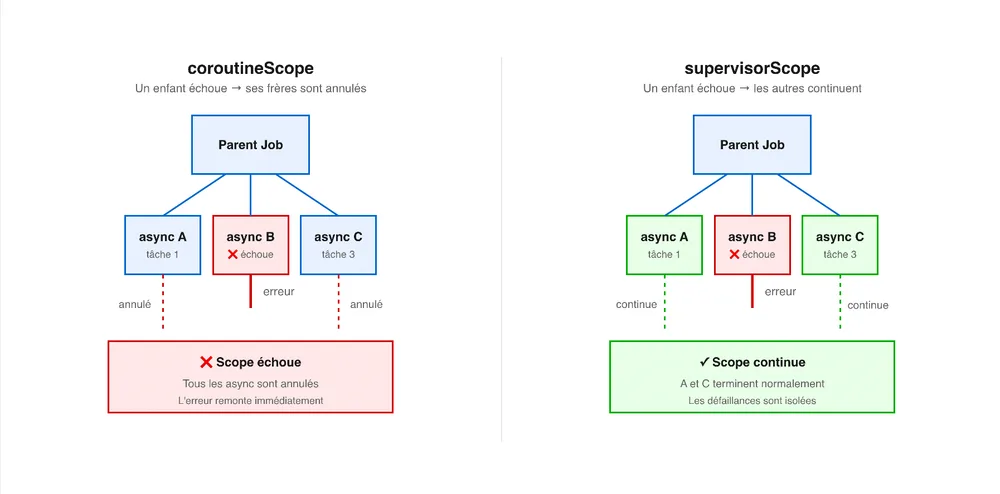

<!-- markdownlint-disable-file -->


_Deuxième épisode de la série. Dans le premier, on a posé le modèle : une coroutine n'est pas un thread. Ici on attaque le socle qui rend les coroutines sûres en production. Fil rouge toujours en place : la comparaison avec Java._

## Le vrai problème de mon batch

Retour sur le batch Spring Batch de [l'épisode 1](https://blog.hoppr.tech/blogs/2026-08-13-une-coroutine-nest-pas-un-thread-coroutines-15). Des `Future` lancés un peu partout, de l'état mutable partagé et des données d'un job précédent qui polluaient le suivant. J'avais conclu que le coupable n'était pas le nombre de threads, mais l'**absence de structure**.

Voici ce que cet épisode adresse: quand je lance un traitement concurrent, qui est responsable de son cycle de vie ? Qui l'attend ? Qui l'annule si une partie tombe en erreur ? Dans mon batch, la réponse était “personne”. Chaque `Future` vivait sa vie, et l'application n'avait aucun moyen de dire “arrête tout, on recommence proprement“.

La réponse de Kotlin à cette question, c'est la **structured concurrency**.

## D'où vient la structure : le scope

Une coroutine ne se lance pas dans le vide : elle se lance dans un **scope**, qui borne son cycle de vie. Tant que des coroutines tournent dans un scope, ce scope n'est pas terminé. Quand on annule le scope, toutes les coroutines de ce scope sont annulées.

La brique de base, c'est [`coroutineScope`](https://kotlinlang.org/api/kotlinx.coroutines/kotlinx-coroutines-core/kotlinx.coroutines/-coroutine-scope/). Elle crée un scope et ne rend la main que lorsque **toutes** les coroutines lancées à l'intérieur sont terminées :

```kotlin
suspend fun loadDashboard(): Dashboard = coroutineScope {
    val stats  = async { api.getStats() }    // lancé en parallèle
    val alerts = async { api.getAlerts() }   // lancé en parallèle
    Dashboard(stats.await(), alerts.await())
} // ne rend la main que quand les deux coroutines ont finis
```

C'est cette structure qu’apporte les coroutines: impossible que `loadDashboard` retourne pendant qu'une de ses coroutines tourne encore. Et si l'appelant annule `loadDashboard`, les deux appels réseau sont annulés avec. On ne peut pas fuiter une coroutine par accident, parce qu'il n'existe pas de “coroutine orpheline” dans ce modèle.

C'est exactement ce qui manquait à mon batch : un périmètre clair où “tout ce qui a été lancé ici est attendu ici”.

## Les jobs : un arbre qui s'effondre ou se négocie

Sous le capot, chaque coroutine est représentée par un `Job`. Les jobs forment un **arbre** : la coroutine qui en lance une autre en devient le parent (l'épisode 5 explique les détails d'implémentation des jobs). Selon le type de scope, l'erreur d'un enfant peut soit annuler tous ses frères, soit les laisser continuer.



**Le choix entre les deux se résume à une question simple : l'échec d'une sous-tâche doit-il condamner les autres ?**

En pratique :

- **`coroutineScope`** quand tout est critique. Une agrégation requiert profil + commandes + reco : si le profil échoue, inutile d'attendre les autres.

- **`supervisorScope`** quand on tolère les défaillances partielles. Un écran charge cinq widgets : l'échec d'un ne doit pas vider les autres.

## Launch vs async : attendre ou ignorer

Pour démarrer une coroutine dans un scope, deux builders principaux, selon qu'on attend un résultat ou non.

`launch` lance un traitement sans valeur de retour. Il rend un `Job`, qu'on peut annuler ou attendre, mais qui ne porte pas de résultat. C'est le fire-and-forget structuré.

```kotlin
val job: Job = scope.launch {
    sendMetrics()   // pas de résultat attendu
}
```

`async` lance un traitement qui **produit une valeur**. Il rend un `Deferred<T>`, une promesse dont on récupère le résultat avec `await()`.

```kotlin
val deferred: Deferred<Int> = scope.async { 
		computeScore() 
}
val score: Int = deferred.await()
```

Pour paralléliser plusieurs tâches : lancer plusieurs `async` ensemble, puis synchroniser les résultats avec `await`. C'est ce qu'on a vu dans `loadDashboard`. Deux appels réseau partent en même temps, et on attend les deux. Comparé au batch et à ses `List<Future>` collectées à la main, la différence tient dans le fait que ces `async` sont **liés au scope** : si l'un échoue, l'autre est annulé, et rien ne survit au bloc.

Reste `runBlocking`, mentionné dans l'épisode 1. Lui fait le pont inverse : il **bloque** le thread courant jusqu'à la fin des coroutines qu'il contient. Pratique pour un `main` ou un test, à éviter en plein code applicatif justement parce qu'il bloque un thread au lieu de le libérer.

## Choisir son dispatcher : CPU, IO, ou UI

Un scope dit _quand_ les coroutines vivent. Un **dispatcher** dit _sur quel thread_ elles s'exécutent. On le choisit en le passant au builder, ou via `withContext`.

```kotlin
launch(Dispatchers.Default) { sortLargeList() }      // calcul CPU
launch(Dispatchers.IO)      { file.readText() }       // I/O bloquant
withContext(Dispatchers.Main) { view.display(data) }  // thread UI
```

Trois dispatchers à connaître chacun taillé pour un usage différent :

- **`Dispatchers.Default`** pour le calcul intensif. Son pool de threads est borné au nombre de cœurs du processeur. Inutile d'avoir plus de threads que de cœurs quand on sature le CPU.

- **`Dispatchers.IO`** pour les entrées-sorties bloquantes (fichiers, appels bdd, appels réseau bloquants). Son pool est élastique et monte [jusqu'à 64 threads par défaut ou le nombre de cœurs si celui-ci est supérieur](https://kotlinlang.org/api/kotlinx.coroutines/kotlinx-coroutines-core/kotlinx.coroutines/-dispatchers/-i-o.html). Comme ces tâches passent leur temps à attendre, on peut en paralléliser beaucoup plus que de cœurs.

- **`Dispatchers.Main`** pour le thread d'UI (Android, app Desktop), là où on met à jour l'interface.

`Default` et `IO` sont dimensionnés différemment **parce que** leurs charges sont différentes. On reviendra sur leur fonctionnement interne (ils partagent en réalité le même pool) dans l'épisode 5.

## GlobalScope : pourquoi c'est dangereux (et quand ça va)

Il existe un scope global, `GlobalScope`, qui n'est lié à aucun cycle de vie. Une coroutine lancée dedans vit aussi longtemps qu'elle veut, sans que personne ne l'attende ni ne l'annule. C'est le retour direct au problème de mon batch. Ce n'est pas qu'un avis : `GlobalScope` est officiellement marqué [`@DelicateCoroutinesApi`](https://kotlinlang.org/api/kotlinx.coroutines/kotlinx-coroutines-core/kotlinx.coroutines/-global-scope/), une annotation qui force un opt-in explicite pour l'utiliser, précisément pour éviter qu'on s'en serve par réflexe.

```kotlin
// À éviter : la coroutine survit à l'écran, personne ne l'attend ni ne l'annule
fun onScreenOpen() {
    GlobalScope.launch {
        val data = repo.load()   // continue même après la fermeture de l'écran
        render(data)             // peut planter sur une vue déjà détruite
    }
}
```

La version structurée relie la coroutine à un scope dont on maîtrise la fin :

```kotlin
class Screen(private val scope: CoroutineScope) {

    fun onOpen() = scope.launch {
        val data = repo.load()
        render(data)
    }

    fun onClose() = scope.cancel()   // annule tout ce qui est encore en vol
}
```

Les frameworks fournissent d'ailleurs des scopes déjà câblés sur un cycle de vie : `viewModelScope` et `lifecycleScope` sur Android, le scope d'une requête côté serveur. 

### `GlobalScope` a-t-il quand même un usage ?

Oui un seul et il est bien spécifique. La [documentation officielle](https://kotlinlang.org/api/kotlinx.coroutines/kotlinx-coroutines-core/kotlinx.coroutines/-global-scope/) le réserve aux processus de fond de haut niveau qui doivent rester actifs toute la durée de vie de l'application. Typiquement une coroutine globale qui tourne du démarrage à l'arrêt, comme un logger de statistiques en tâche de fond :

```kotlin
@OptIn(DelicateCoroutinesApi::class)
val statsReporter = GlobalScope.launch(
    CoroutineExceptionHandler { _, e -> logFatalError("stats logging: $e") }
) {
    while (true) {
        delay(1.seconds)
        logStatistics()
    }
}
```

Deux précautions même dans ce cas :

- `GlobalScope` ne fournit aucun `CoroutineExceptionHandler` : sans en configurer un soi-même, une exception non gérée peut faire crasher l'application.

- Beaucoup préfèrent créer un `CoroutineScope` applicatif explicite plutôt que `GlobalScope`, pour garder la main sur l'annulation. `GlobalScope` reste le dernier recours, pas l'outil par défaut.

## Côté Java : le même besoin, en cours de stabilisation

Dans l'épisode 1, on a vu le style Java historique : un `ExecutorService`, une `List<Future>`, un `join` à la main, un `shutdown` à ne pas oublier. Rien ne relie les tâches entre elles. C'est le monde d'avant la structured concurrency, et c'était celui de mon batch.

Java a bien identifié le problème et propose une réponse très proche dans l'esprit : `StructuredTaskScope`. On ouvre un scope, on `fork` des sous-tâches, on `join`, et le scope garantit qu'aucune sous-tâche ne survit au bloc.

```java
// Java 25 (preview) : StructuredTaskScope, l'équivalent en cours de stabilisation
try (var scope = StructuredTaskScope.open()) {
    var stats  = scope.fork(() -> api.getStats());
    var alerts = scope.fork(() -> api.getAlerts());
    scope.join();
    return new Dashboard(stats.get(), alerts.get());
}
```

La ressemblance avec `coroutineScope` est forte : les deux écosystèmes convergent vers le même modèle. Mais pas au même rythme. Comme vu dans l'épisode 1, cette API est [encore en preview dans Java 25](https://openjdk.org/jeps/505), la dernière LTS, et continue d'évoluer vers les [JDK 26](https://openjdk.org/jeps/525) et [27](https://openjdk.org/jeps/533). tandis que Kotlin a stabilisé `coroutineScope`, `Job` et les scopes depuis 2018.


Si mon batch avait été écrit en Kotlin avec un `coroutineScope`, le bug des “fantômes en mémoire” aurait été bien plus difficile à écrire. Le modèle refuse par construction les coroutines orphelines.

## En un coup d'œil

| Besoin | Outil Kotlin |
| --- | --- |
| Lancer des coroutines et toutes les attendre | coroutineScope { } |
| Isoler l'échec d'un enfant | supervisorScope { }  /  SupervisorJob |
| Lancer sans résultat (fire-and-forget) | launch  →  Job |
| Lancer et récupérer un résultat | async  →  Deferred  →  await() |
| Calcul CPU | Dispatchers.Default |
| I/O bloquant | Dispatchers.IO |
| Thread UI | Dispatchers.Main |
| Lancer du bloquant (main, test) | runBlocking |


## À retenir

- Une coroutine se lance toujours dans un **scope**, qui borne sa vie. Pas de coroutine orpheline.

- `coroutineScope` attend tous ses enfants ; l'échec d'un enfant annule ses frères. `supervisorScope` isole les échecs.

- `launch` pour un effet, `async` + `await` pour un résultat. `runBlocking` seulement aux frontières.

- Choisir le dispatcher selon la charge : `Default` (CPU), `IO` (entrées-sorties), `Main` (UI).

- `GlobalScope` casse la structure (API `@DelicateCoroutinesApi`) : à réserver aux rares tâches qui doivent vivre toute la durée de l'application, jamais par défaut.

Dans l'épisode 3, on regarde ce qui se passe quand ça tourne mal : l'**annulation coopérative** et la **gestion d'exceptions**, y compris le piège classique du `try/catch` qui avale une annulation.

---

## Sources

- Kotlin, _Coroutines basics_ (structured concurrency, scope) : [https://kotlinlang.org/docs/coroutines-basics.html](https://kotlinlang.org/docs/coroutines-basics.html)

- Kotlin, _Composing suspending functions_ (`async` / `await`) : [https://kotlinlang.org/docs/composing-suspending-functions.html](https://kotlinlang.org/docs/composing-suspending-functions.html)

- Kotlin, _Coroutine context and dispatchers_ : [https://kotlinlang.org/docs/coroutine-context-and-dispatchers.html](https://kotlinlang.org/docs/coroutine-context-and-dispatchers.html)

- Kotlin, _Coroutine exceptions handling_ (`coroutineScope` vs `supervisorScope`) : [https://kotlinlang.org/docs/exception-handling.html](https://kotlinlang.org/docs/exception-handling.html)

- Kotlin API, _Dispatchers.IO_ (limite de 64 threads) : [https://kotlinlang.org/api/kotlinx.coroutines/kotlinx-coroutines-core/kotlinx.coroutines/-dispatchers/-i-o.html](https://kotlinlang.org/api/kotlinx.coroutines/kotlinx-coroutines-core/kotlinx.coroutines/-dispatchers/-i-o.html)

- Kotlin API, _GlobalScope_ (`@DelicateCoroutinesApi`, cas d'usage légitime) : [https://kotlinlang.org/api/kotlinx.coroutines/kotlinx-coroutines-core/kotlinx.coroutines/-global-scope/](https://kotlinlang.org/api/kotlinx.coroutines/kotlinx-coroutines-core/kotlinx.coroutines/-global-scope/)

- OpenJDK, _JEP 505: Structured Concurrency (Fifth Preview)_ (Java 25) : [https://openjdk.org/jeps/505](https://openjdk.org/jeps/505)

- OpenJDK, _JEP 525 / JEP 533_ (re-previews vers JDK 26 et 27) : [https://openjdk.org/jeps/525](https://openjdk.org/jeps/525) · [https://openjdk.org/jeps/533](https://openjdk.org/jeps/533)