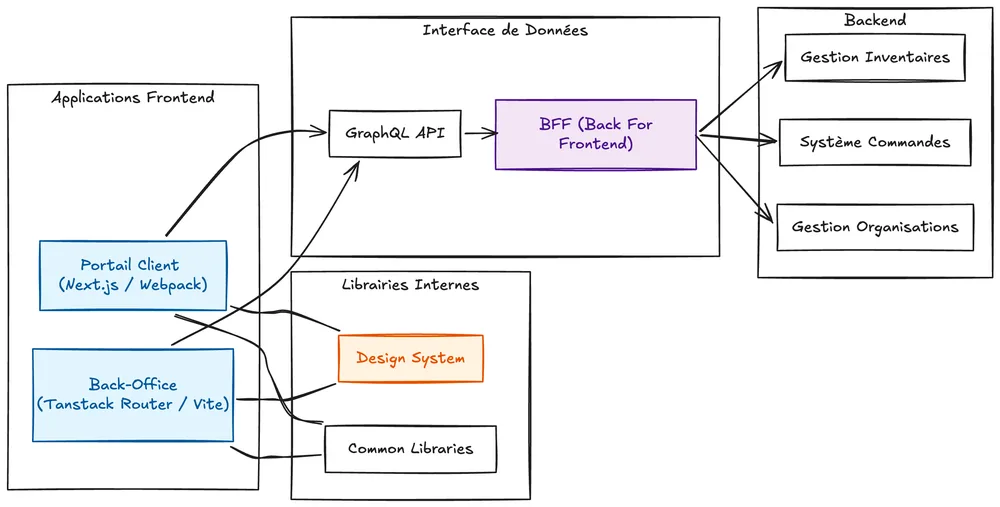
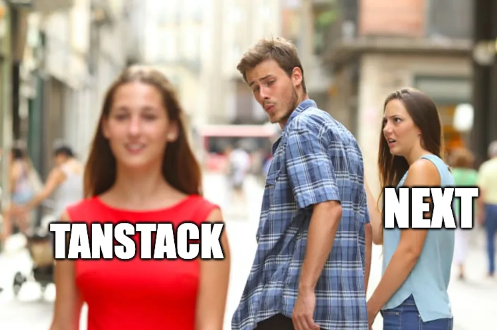
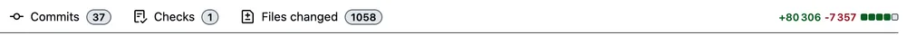

<!-- markdownlint-disable-file -->


**Disclaimer:** le but de cet article n’est pas de comparer les usages quotidiens de [Next.js](https://nextjs.org/) et de [Tanstack Router](https://tanstack.com/router/latest). Il retrace plutôt la migration de l’un vers l’autre, réalisée avec l’aide de l’IA, et présente la stratégie adoptée pour mener un chantier de cette ampleur tout en conservant une application fonctionnelle de bout en bout à chaque étape de la migration.

## Etat de l’art

Le produit permet la gestion d’inventaires et la commande d’articles. Il se compose de 2 applications. La première est le portail qu’utilisent les clients pour passer des commandes, modifier leurs restrictions, leurs organisations et gérer leurs produits. La deuxième, quant à elle, est un back-office à destination du support et des équipes internes.

Voici la structure haut niveau de leurs relations :



## Motivations

En tant que consultant, à mon arrivée, j'ai rédigé un rapport d'étonnement. J'ai été surpris, tant lors de sa rédaction que lors de ma découverte des deux projets, par le choix de Next comme framework de développement pour le produit principal. Cette surprise était principalement due au fait que très peu de fonctionnalités du framework étaient utilisées.

J’ai également remarqué que Next était un réel _painpoint_ pour l’équipe:

- l’app était lente à répondre

- le dev mode prenait un temps particulièrement long à compiler les pages (on parle de 3 à 20 secondes suivant les machines et les pages du produit)

- à faire le module replacement

- à builder

J’ai alors questionné l’équipe sur les motivations qui auraient pu justifier le choix de cette techno. Après tout, l’app n’utilise pas la partie serveur offerte par Next. Elle n’a pas besoin de Server Side Rendering ([SSR](https://developer.mozilla.org/en-US/docs/Glossary/SSR)) car l’intégralité de son contenu est derrière une page de login. De plus, il n’y a pas d’app router après 2 ans d’existence, aucune optimisation comme du preloading. La cerise sur le gâteau ? Nous avons un serveur node qui tourne et qui consomme entre 350 à 400Mb de RAM… On a donc une application qui ~~devrait être~~ gagnerait à être une SPA.

La réponse à cette question « pourquoi Next.js ? » est assez simple : comme beaucoup de projets, la raison est historique. Les besoins au début du projet n’étaient pas encore bien définis. Voilà pourquoi il fut choisi; car il offrait un éventail plus large de possibilités dans l’éventualité où un serveur backend, voire même du SSR, auraient été nécessaires.

De l’autre coté, le backoffice lui est une application tout ce qu’il y a de plus classique, une bonne vielle SPA (Single Page Application) utilisant Tanstack Router sous [Vite](https://vite.dev/guide/). 

On se retrouve donc avec d’un côté l’application principale qui a une Developer Experience (DX) abominable et de l’autre une application qui, elle, a une très bonne DX et un mental model beaucoup plus simple (tout se passe sur le client). Avec tant de problématiques posées, pourquoi ne pas migrer Next vers Tanstack Router en mode SPA ? 



Après tout, l’équipe connaît déjà la stack puisque c’est la même que celle du backoffice. _Malgré tout mon amour pour_ [_Tanstack Start_](https://tanstack.com/start/latest)_, la techno n’aurait pas fait sens ici non plus._

Quoi qu’il en soit, on a dû composer avec Next pendant encore plusieurs mois _(pour ne pas dire plus d’un an)_ et le traîner comme un boulet. Et oui, migrer une telle application vers un autre framework aurait pris un temps considérable en plus de bloquer la bonne delivery de l’équipe – chose inenvisageable. Si l’envie ne manquait pas, le temps, lui, en revanche, ne le permettait pas. Entre temps, nous avons tout de même pu passer sur [Turbopack](https://nextjs.org/docs/app/api-reference/turbopack) pour remplacer [Webpack](https://webpack.js.org/), ce qui donna un petit coup de boost, mais ce n’était toujours pas bien folichon.

C’est alors qu’une idée a commencé à germer en moi. En 2026, à l’ère de l’IA et des agents : pourquoi ne pas les utiliser pour réaliser cette migration ? 

## Comment approcher la migration ?

C’est **la** grande question. Alors, _comment qu’on fait ?_

Pour commencer, au vu de l’ampleur de la migration, il faut découper cela en différentes phases.

Les différentes approches que j’avais en visu avant de commencer :

- Dire à l’agent : « Migre cette application de Next vers Tanstack Router, make no mistakes »

- Dire à l’agent de tout migrer d’un coup, en donnant un but auquel l’agent doit se tenir afin de valider la migration

- Utiliser les agents de planning que proposent beaucoup de harness nativement (comme codex, claude, whatever, avec leurs `/plan`) et le suivre

- Définir un plan soi même afin que le LLM ne suppose rien.

- Co-construire le plan avec l’IA

Pour ma part, c’est sur cette dernière option que je suis parti. J’aurais beaucoup aimé pouvoir opter pour la première mais nous n’y sommes pas encore. Toutefois, avant cela, il y a une étape que je considère comme importante afin de garantir un plan cohérent et atteindre l’objectif visé : m'assurer que les choix liés à cette migration technique sont les bons.

## La phase de recherche

Il est essentiel de connaître son itinéraire pour parvenir à destination et ainsi éviter une sortie de route. Cette ceinture de sécurité fut pour moi cette phase de recherche.


L’objectif était de cartographier les différences entre Next.js et TanStack Router, mais également d’identifier en amont les choix auxquels la migration allait nous confronter : architecture, routing, rendu, internationalisation, environnement d’exécution ou encore déploiement.

La phase de recherche fut évidemment réalisée avec la participation de mon ami l’IA.

_D’ailleurs, petite aparté, j’utilise quoi comme IA? Et bien, pour ma part, j’apprécie particulièrement les modèles d’OpenAI, que je trouve excellents. J’ai réalisé l’intégralité de cette migration avec Codex, de la recherche jusqu’à l’implémentation, en passant par la construction du plan. Donc Codex pour mon harness et GPT-5.5 comme LLM (le frontier model au moment où j’ai réalisé ce travail)._

Cette exploration a donné naissance à un vaste fichier Markdown. Plus qu’un document suivant une structure rigide, il fonctionne comme une cartographie technique de la migration :

> **audit de l’existant → différences entre frameworks → décisions et trade-offs → risques → trajectoire de migration**

Il rassemble notamment un inventaire chiffré des usages de Next.js, leurs équivalents dans TanStack Router, les principaux points bloquants — i18n, variables d’environnement, route API et déploiement — ainsi qu’un ordre de migration et des critères de validation.

Ce document ne constitue pas encore le plan définitif, il en est le socle. L’objectif est de fournir à l’agent un [contexte](https://blog.hoppr.tech/blogs/2026-08-19-prompt-tokens-mcp-harness-le-lexique-ia-a-connaitre-en-2026#le-context) aussi complet et structuré que possible avant de co-construire ce plan, afin de limiter ses suppositions et d’éviter qu’il ne s’engage dans des directions hasardeuses.

## Définition du plan de migration

Maintenant que la trajectoire est plus clair, nous savons dans quelle direction nous orienter. Quel chemin devons-nous emprunter ?

C’est là que l’on rentre dans le cœur de la migration. Il est important de noter que l’exécution du plan s’est déroulée en tâche de fond. Je ne suis pas resté derrière ma machine à observer les agents travailler. Au contraire, j’ai accompli d’autres tâches de mon quotidien de développeur.

Comme mentionné précédemment, cette migration sera conséquente. Changer de framework n'est pas aussi anodin que d’ajouter une petite fonctionnalité : la quantité de contexte à manipuler est d’un tout autre ordre. Je savais dès le départ que j’allais **rapidement atteindre la taille maximale de ma** [**Context Window**](https://blog.hoppr.tech/blogs/2026-08-19-prompt-tokens-mcp-harness-le-lexique-ia-a-connaitre-en-2026#la-context-window), et que plusieurs phases de [compaction](https://blog.hoppr.tech/blogs/2026-08-19-prompt-tokens-mcp-harness-le-lexique-ia-a-connaitre-en-2026#la-compaction) seraient inévitables au cours du processus.

Concrètement, les pré-requis et contraintes sont les suivants:

- Pouvoir interrompre/reprendre à tout moment l’exécution

- Être capable de démarrer l’app entre chaque phase et qu’elle soit fonctionnelle

- Qu’il y ait une gestion des compactions de manière à ce que les agents ne perdent qu’un minimum de contexte et, qu’ils conservent les informations importantes en permanence.

Avec ces contraintes exposées à mon agent tout en lui expliquant notre tâche (créer un plan pour la migration), j’ai initié une boucle d’interactive prompting en lui liant le markdown de recherche.

_C’est quoi l’interactive prompting ? C’est simplement un terme qui défini une pratique où ce n’est non pas nous qui questionnons l’IA mais elle qui nous interroge. C’est très utile pour tout un tas de besoins; notamment affiner la demande._

De cette boucle est sorti un plan solide de migration où les agents ne seraient pas amenés à supposer quoi que ce soit.

## Le plan

Voici un aperçu haut niveau du plan, on y retrouve le titre de chaque phase ainsi qu’un résumé du but de chacune :

```markdown
## Phase 1 — Mise en place du socle Vite et TanStack Router

Cette phase installe Vite et TanStack Router, crée le point d’entrée de la SPA,
configure le routeur et adapte les scripts de développement, de build,
de prévisualisation et d’analyse. Mise en place des modules de compatibilité.

## Phase 2 — Extraction des providers globaux

Cette phase déplace les providers, styles, polices et initialisations globales
de l’ancien fichier `_app` vers un composant `AppProviders` indépendant de Next.js et branché autour du routeur.

## Phase 3 — Migration de l’internationalisation

Cette phase remplace `next-i18next` par `react-i18next`, charge les traductions
côté client, détecte la langue depuis les cookies ou le navigateur et supprime
les mécanismes de traduction liés au rendu serveur.

## Phase 4 — Migration des routes publiques et d’authentification

Cette phase recrée avec TanStack Router les routes publiques, les écrans de
connexion et de déconnexion, le callback d’authentification, les pages d’erreur,
la maintenance et le fallback 404.

## Phase 5 — Migration des routes privées

Cette phase migre progressivement l’ensemble des routes métier privées vers
TanStack Router.

## Phase 6 — Migration des variables d’environnement, scripts et assets

Cette phase remplace les mécanismes `next-runtime-env`, `next/head`,
`next/script` et `next/dynamic` par des solutions compatibles avec Vite,
tout en assurant le chargement des variables d’environnement et des assets
statiques.

## Phase 7 — Adaptation de Docker et de l’infrastructure statique

Cette phase adapte les images Docker pour servir le dossier généré par Vite
avec un serveur statique, un fallback SPA, des variables d’environnement
injectées au runtime et une stratégie de cache adaptée aux différents fichiers.

## Phase 8 — Suppression complète de Next.js

Cette phase élimine les dépendances, fichiers de configuration, imports,
adaptateurs, mocks, types et structures héritées de Next.js, puis convertit
définitivement les routes et composants vers les primitives natives de
TanStack Router.

## Phase 9 — Finalisation de la migration

Cette phase regroupe les dernières vérifications techniques et fonctionnelles
nécessaires pour confirmer que l’application peut fonctionner entièrement avec
Vite et TanStack Router sans dépendre de Next.js.
```

Si l’on zoom sur une phase, voici la structure quelles suivent toutes :

```markdown
## Phase X - Titre de la phase

- [x] Tâche terminée.
- [x] Autre tâche terminée.
- [ ] Tâche restante.

Validation:

- Vérification effectuée.
- Commande exécutée.
- Résultat obtenu.
```

On y retrouve les tâches à réaliser pour la bonne complétion de chaque phase. Le plan trace en plus des étapes nécessaires au succès de la phase et si, oui ou non, cette étape a été réalisée.

Vous l’avez remarqué, j’ai également mis en place quelque chose que je n’ai pas encore mentionné: **les validations**. C’est un élément central au bon déroulement de ce plan. **Pourquoi ?** Avec la sauvegarde de la progression, c’est la meilleur réponse à la problématique de gestion du contexte – que j’ai pu trouver – afin d’éviter la perte d’informations lors d’une compaction ou d’un changement de chat.

Si l’on effectue un dernier zoom sur la structure des lignes de validation dans ce plan :

```markdown
Validation:

- [Action ou contrôle] exécuté le [date].
- [Commande exacte].
- [Résultat obtenu].
- [Avertissement, exception ou point restant].
```

 Combiné aux étapes réalisées, cela permet une sauvegarde presque totale des éléments essentiels à la continuité. Le reste, l’agent est capable de le récupérer lui-même dans le code.

Avec tout cela, on répond à toutes les contraintes que j’avais. Enfin, _sur le papier ?_ C’est ce qu’on va voir.

## Le déroulé du plan

Pour commencer, quelques métriques intéressantes pour mesurer ce que la migration représente:

- Nombre de [chats](https://blog.hoppr.tech/blogs/2026-08-19-prompt-tokens-mcp-harness-le-lexique-ia-a-connaitre-en-2026#un-chat) requis pour l’exécution du plan : **11 chats au total**
  - **2** chats utilisateur
  - **9** [subagents](https://blog.hoppr.tech/blogs/2026-08-19-prompt-tokens-mcp-harness-le-lexique-ia-a-connaitre-en-2026#les-subagents)
- Temps d’exécution : un peu plus de **30h d’exécution cumulée**
- Quantité de tokens consommés lors de la migration : **244 104 236** [**tokens**](https://blog.hoppr.tech/blogs/2026-08-19-prompt-tokens-mcp-harness-le-lexique-ia-a-connaitre-en-2026#les-tokens)
  - tokens en entrée: **243 253 465**
  - tokens en cache: **225 942 400**
  - tokens en sortie: **850 771**, dont **199 281 tokens de raisonnement**, soit un **output réel à environ 651 490 tokens**
- Quantité de compactions : **23**
  - premier chat principal : **12 compactions**
  - second chat principal : **5 compactions**
  - 6 subagents : **1 compaction chacun**
  - 3 subagents : **0 compaction**

Alors comment mon [harness](https://blog.hoppr.tech/blogs/2026-08-19-prompt-tokens-mcp-harness-le-lexique-ia-a-connaitre-en-2026#le-harness) a-t-il géré la chose ?

Et bien, on peut voir qu’il s’en est plutôt très bien sorti. **650 000 tokens** signifie qu’il y a eu une importante génération de code. En considérant qu’une ligne de TypeScript représente entre 8 à 18 tokens, si l’on prend une moyenne en coupant la poire en deux, on peut estimer un output de **70 000 lignes** de TypeScript pour la migration. Vous verrez plus tard, que cette estimation est plutôt précise, à quelques milliers près.

En pratique, comment cela s’est-il passé de mon coté ?

J'accordais une grande attention aux réalisations de mon agent lors des premières tâches. Je voulais m’assurer qu’il suive bien le plan de progression tout en réalisant ses missions.
Jusqu’à la phase 4, je démarrais l’application afin de m’assurer de son bon fonctionnement avant d’en démarrer une nouvelle. Comme cela me prenait du temps, j’ai rapidement délégué les vérifications à mon agent. Une fois que la confiance fut “établie”, je lui ai demandé d’utiliser les [tools](https://blog.hoppr.tech/blogs/2026-08-19-prompt-tokens-mcp-harness-le-lexique-ia-a-connaitre-en-2026#les-tools) tels que `computer-use` et `browser`, qui permettent à mon [agent](https://blog.hoppr.tech/blogs/2026-08-19-prompt-tokens-mcp-harness-le-lexique-ia-a-connaitre-en-2026#les-agents) d’utiliser mon navigateur ou ma machine, afin de réaliser les vérifications nécessaires. Je lui ai également demandé, via Playwright, de m’enregistrer des vidéos démontrant la bonne migration de ce que la phase couvrait. Les vidéos, ainsi que la couverture de tests, me garantissent l’absence de régression.


N’en déplaise à ceux qui clament haut et fort ne plus le faire, j’ai pour ma part, revu une bonne partie du code produit à chaque phase.

J’ai suivi ce rythme jusqu’à réalisation complète de la migration durant laquelle j'ai fait une dernière passe.

_Pour les curieux, pourquoi_ _**2 chats**_ _? A quel moment j’ai décidé d’en faire un nouveau ?_

Une fois l’ensemble des routes de l’application migrées, lorsque j’ai entamé l’étape suivante _(qui concernait la migration des variables d’environnement, des scripts, etc…)_ je me suis rendu compte que l’IA commençait à faire des erreurs à des endroits inappropriés, modifiait des éléments sans rapport avec la tâche et agissait de manière totalement incohérentes par rapport aux instructions données.
Hallucinations ou dérive de contexte, je ne sais pas, mais après **12 compactions**, rien d’étonnant. J’ai donc réinitialisé mon git sur mon dernier commit _(faites beaucoup de commits, vous vous remercierez en cas de problèmes)_ et simplement repris mon plan dans un nouveau chat avec un contexte tout frais.

## Résultat

Alors, ça donne quoi une fois terminé ?

Je dois avouer avoir été plutôt agréablement surpris du déroulement de cette migration. Je m’attendais à devoir faire plusieurs essais autres que la stratégie décrite dans cet article et à en essayer de nombreuses autres avant d’obtenir ce que je souhaitais… pourtant, tout s’est déroulé sans accros dès la première itération. Très certainement par chance ? Ou alors j’ai vraiment trouvé du premier coup la bonne manière de faire pour mon besoin. 

Du coup, l’application fonctionne parfaitement sous TanStack Router, aucun warning (à l’exception d’un chunk un peu trop gros lors du build), aucune erreur, rien dans les devtools et… c’est rapide, le HMR n’a rien à voir avec celui de Next, on est sous la seconde pour que le serveur démarre ! C’est plus simple, un seul serveur web qui s’occupe de servir les statiques, plus de serveur Node inutile qui consomme plus de 300 Mb de RAM ! Toutes les problématiques exposées au début sont bien résolues.

A la question : _“Si tu devais le refaire, que ferais tu différemment ?”_
Je pense que si c’était à refaire je pourrais essayer différentes stratégies afin d’éventuellement réduire la consommation de tokens qui est assez impressionnante en valeur absolue : 200 millions, cela parait énorme; quoi que peut-être normal pour la taille de la PR ? Et oui, c’est vrai ça, on n’en a pas parlé de la PR, la voici :



**37 commits** déjà rebased pour que ce soit présentable à la review. Bon, oui, en pratique, personne au monde ne va reviewer plus de **1 000 fichiers** pour près de **80 000 additions**.
C’est ce qu’on pourrait appeler “une belle PR”.

À première vue, plus de 240 millions de tokens consommés peuvent sembler totalement démesurés. Il faut cependant relativiser ce chiffre : près de 93 % des tokens d’entrée ont bénéficié du cache. Autrement dit, ce volume ne correspond pas à 240 millions de tokens d’informations différentes lues par les agents, mais en grande partie à du contexte identique réinjecté au fil des appels.

Dans une boucle agentique, ce contexte répété peut aussi bien concerner l’historique de la conversation, les instructions, les définitions des tools, du code déjà lu ou encore les résultats de précédents appels. Cela ne signifie donc pas nécessairement que les mêmes parties de l’application ont été relues en permanence, mais plutôt qu’une grande partie du contexte envoyé au modèle était identique à des préfixes déjà traités.

Il reste tout de même environ 17 millions de tokens d’entrée non cachés. Pour plus de 30 heures d’exécution, une migration touchant plus de 1 000 fichiers et produisant près de 80 000 additions, le chiffre reste conséquent, mais me paraît beaucoup moins aberrant une fois remis dans ce contexte.

Je suppose qu’en donnant à chaque agent un périmètre plus restreint, il aurait peut-être été possible de réduire la quantité de contexte nécessaire à chaque appel, et donc la consommation totale de tokens. Cela reste cependant difficile à affirmer. D’une part, je n’ai pu réellement paralléliser avec des subagents qu’à partir de la phase 5, les étapes précédentes devant être effectuées de manière synchrone. D’autre part, multiplier les agents peut également créer davantage de duplication, chacun ayant besoin des instructions, du plan et d’une partie du contexte pour travailler correctement.

Il serait donc intéressant de comparer différentes stratégies d’isolation du contexte pour voir si elles permettent réellement de réduire cette consommation.

Pour le coté coûts, je suis sur un abonnement Codex Pro, je ne paie donc pas les tokens. En revanche, je trouve cela toujours interessant d’estimer le cout de ce sujet en faisant la conversion au prix du tokens en mode api. 

Voici une projection des coûts:

| Scénario | Coût estimé | Écart |
| --- | --- | --- |
| Avec cache hit | 225,05 $ US | — |
| Sans cache hit | 1 241,79 $ US | +1 016,74 $ US |
| Économie grâce au cache | — | ≈ 81,9 % |


_Il faut aussi savoir qu’OpenAI applique une majoration sur la consommation si la Context Window dépasse 272 000 tokens d’entrées. Ayant défini mon seuil légèrement en deçà de cette limite, je ne pense pas que j’aurais été impacté par celle-ci._

Si on remet en perspective, un peu plus de 200 $ auxquels on peut éventuellement y ajouter mon coût en tant qu’externe pour mener à bien la migration, je ne trouve pas ça cher payé car la migration aurait été totalement inenvisageable sans IA.

Pour conclure, je suis très satisfait de la méthodologie que j’ai pu imaginer pour la réalisation de cette migration ainsi que du résultat. Je pense qu’elle peut tout à fait s’utiliser pour tout un tas d’autres migrations. A vous d’essayer !

