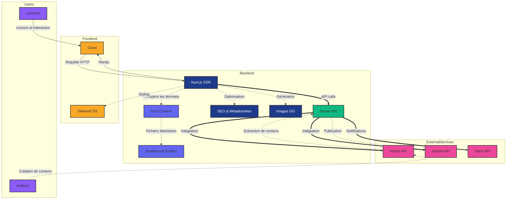

# Architecture du Blog HoppR

Le blog HoppR est construit sur une architecture moderne et modulaire, utilisant Nuxt.js comme framework principal. Voici une description détaillée des composants clés :

## Diagramme d'architecture

## Composants principaux

1. **Frontend (Nuxt.js SSR)**
   - Utilise Nuxt.js pour le rendu côté serveur (SSR)
   - Gère le routage et le rendu des pages
   - Intègre TailwindCSS pour le styling

2. **Gestion de contenu (Nuxt Content)**
   - Utilise Nuxt Content pour gérer les articles de blog en Markdown
   - Permet une recherche et un filtrage efficaces du contenu
   - Chemin vers les articles : `/content/blogs`

3. **API Server**
   - Gère les interactions avec les APIs externes (Notion, GitHub, Slack)
   - Traite les requêtes pour la publication et la mise à jour des articles
   - Contenu dans le dossier : `/server`

4. **Intégration Notion**
   - Extrait le contenu des articles depuis Notion
   - Convertit le contenu Notion en Markdown
   - Code dans le dossier : `/server/services/notion`

5. **Intégration GitHub**
   - Publie les articles sur le repository GitHub
   - Gère les pull requests et les branches pour chaque publication
   - Code dans le dossier : `/server/services/github`

6. **Génération d'images OG**
   - Crée des images OG dynamiques pour chaque article
   - Améliore le partage sur les réseaux sociaux
   - Chemin : `/pages`

7. **Gestion des auteurs**
   - Système pour ajouter et gérer les auteurs des articles
   - Intégration des informations des auteurs dans les articles
   - Les auteurs sont gérés depuis Notion

8. **SEO et métadonnées**
   - Configuration avancée des métadonnées pour le SEO
   - Génération de sitemap automatique

9. **Intégration Slack**
   - Envoie des notifications Slack pour les nouveaux messages du blog
   - Chemin vers le code : `/components/blog/ContactCTA.vue`

Cette architecture modulaire permet une grande flexibilité et une maintenance facile du blog HoppR.
