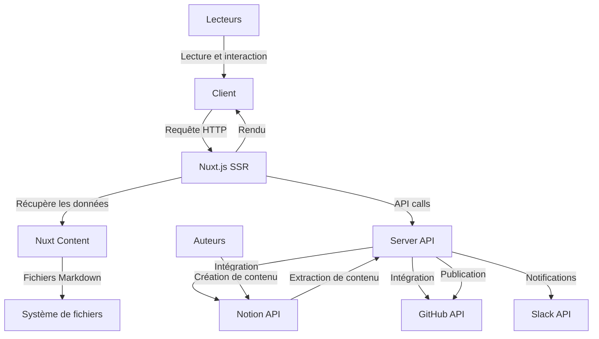

# Architecture du Blog HoppR



Le blog HoppR est construit sur une architecture moderne et modulaire, utilisant Nuxt.js comme framework principal. Voici une description détaillée des composants clés :

1. **Frontend (Nuxt.js SSR)**

   - Utilise Nuxt.js pour le rendu côté serveur (SSR)
   - Gère le routage et le rendu des pages
   - Intègre TailwindCSS pour le styling

2. **Gestion de contenu (Nuxt Content)**

   - Utilise Nuxt Content pour gérer les articles de blog en Markdown
   - Permet une recherche et un filtrage efficaces du contenu
   - Chemin vers les articles : `/content/blogs`

L'option `published: true` dans les fichiers Markdown est utilisée pour indiquer si un article de blog est prêt à être publié et visible sur le site. Si cette option est définie sur `true`, l'article sera accessible aux visiteurs du site. Dans le cas contraire, si elle est définie sur `false` ou omise, l'article ne sera pas affiché publiquement.

Cette option est utile pour contrôler la visibilité des articles, permettant aux auteurs de préparer des contenus à l'avance sans les rendre immédiatement accessibles au public.

Pour plus de détails sur la création de contenu avec Nuxt Content, consultez la documentation officielle de [Nuxt Content v2](https://content.nuxtjs.org/).

3. **API Server**

- Gère les interactions avec les APIs externes (Notion, GitHub, Slack)
- Traite les requêtes pour la publication et la mise à jour des articles
- Contenu dans le dossier : `/server`

4. **Intégration Notion**

- Extrait le contenu des articles depuis Notion
- Convertit le contenu Notion en Markdown
- Code dans le dossier : `/server/services/notion`

5. **Intégration GitHub**

- Publie les articles sur le repository GitHub
- Gère les pull requests et les branches pour chaque publication
- Code dans le dossier : `/server/services/github`

6. **Génération d'images OG**

- Crée des images OG dynamiques pour chaque article
- Améliore le partage sur les réseaux sociaux
- Chemin : `/pages`

```typescript
defineOgImageComponent('About', {
  headline: 'Bienvenue 👋',
  title: 'Blog Hoppr Tech',
  description: 'Partage, veille et ressources de la communauté sur les thématiques du Software Craftsmanship, du Cloud, de l\'architecture et de la Tech en générale.',
  imageTop: '/images/og-post.png',
  imageBottom: '/images/og-home.png',
})
```

7. **Gestion des auteurs**

- Système pour ajouter et gérer les auteurs des articles
- Intégration des informations des auteurs dans les articles
- Les auteurs sont gérés depuis Notion

8. **SEO et métadonnées**

- Configuration avancée des métadonnées pour le SEO
- Génération de sitemap automatique

9. **Intégration Slack**

- Envoie des notifications Slack pour les nouveaux messages du blog
- Chemin vers le code : `/components/blog/ContactCTA.vue`
